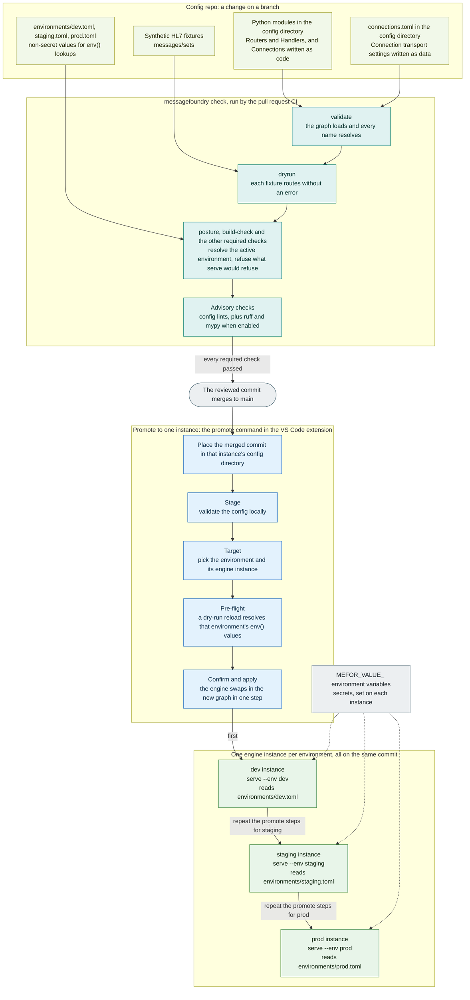

# CI in an adopter's config repo — how it ensures interface quality

> **Audience:** an organization deploying MessageFoundry (an "adopter" / "HC" in
> [ADR 0017](adr/0017-consumer-deployment-model.md)). This explains what Continuous Integration
> looks like *in your own repo* and exactly which interface-quality guarantees it does — and does
> not — give you.

## TL;DR

- CI runs against **your config repo**, not the engine. The engine is a read-only, version-pinned
  wheel; your Connections/Routers/Handlers/fixtures are the thing under test.
- `messagefoundry init` scaffolds a ready-made workflow at `.github/workflows/check.yml` with three
  jobs: **`verify-engine`** (supply-chain provenance of the pinned engine), **`check`** (the
  config-quality gate, `messagefoundry check`), and **`audit-pin`** (reds your CI when the pinned
  engine or its dependencies have a known published vulnerability).
- The gate's teeth are **`validate`** (wiring resolves) + **`dryrun`** (synthetic messages route
  through the *real* engine routing core without erroring) + **`posture`** (no fail-closed env
  foot-gun). `ruff`/`mypy` are advisory.
- It catches **structural and routing** defects identically to live routing. It does **not** by
  itself prove **output correctness** (semantic parity with a downstream system) — that's on you,
  via the fixtures you build and separate reconciliation tooling.

---

## How a config change moves from dev to staging to prod

This diagram answers one question: how would a change to Connections, Routers and Handlers reach
production safely? A deploying site would keep one config repo and run one engine instance per
environment. The same reviewed commit goes to every instance. What differs per instance stays out
of the graph: the environment's values, the instance's own `messagefoundry.toml`, and its secrets.



**Legend.** Each group's title says what its boxes are. The rounded box is an event. A dotted arrow
is a value that never enters the repo. The check group shows at least the checks that matter to
promotion. `run_checks` in [`checks.py`](../messagefoundry/checks.py) holds the full set, and says
which ones block.

What each stage would do for a site:

1. **Author.** Routers and Handlers are Python. A Connection is Python too, or a `connections.toml`
   entry. Either form reads a per-environment value by key: `env("key")` in Python,
   `{ env = "key" }` in TOML. So one graph serves every environment.
2. **Gate.** The pull request runs `messagefoundry check`. Sections 2 and 3 below describe the
   workflow and the main checks.
3. **Merge.** The site would protect `main`, so only a commit that passed the gate lands there.
4. **Place the commit.** The promote command does not copy files to a remote engine. A remote
   instance reloads from its own `--config` directory, so the site first places the merged commit
   there. Skip this, and the engine reloads the config it already had. For an engine on the same
   machine, the command sends the workspace's config path instead.
5. **Promote.** The VS Code extension's promote command then asks that engine to reload. Its
   command id is `messagefoundry.promote`. Type "Promote" in the Command Palette to find it. The
   pre-flight is a dry run: the engine resolves its own environment's values and swaps nothing. A
   value the target lacks fails here, before anything goes live. The gate resolves only the one
   environment its own settings name, so the pre-flight is where each target's values are checked.
6. **Apply.** The reload route needs the `config:deploy` permission and a recent step-up sign-in
   ([SECURITY.md](SECURITY.md#step-up-re-verification-on-sensitive-operations-wp-l3-16-asvs-753)).
   The engine audits every reload and every dry run. Where the site turns on dual control for
   reloads, the engine holds the swap until a second user approves.

The engine's built-in environment names are `dev`, `staging` and `prod`. `messagefoundry init`
writes `environments/dev.toml` and `environments/prod.toml`. A site that runs a staging instance
would add `environments/staging.toml` with the same keys. With several named targets
set, the promote command asks which one to use. With none set, it uses the one engine URL in its
settings.

---

## 1. The setup: CI is scoped to *your* repo

Under [ADR 0017](adr/0017-consumer-deployment-model.md), an adopter does not fork or edit the
engine. The three-tier ownership model is:

| Tier | Owner | What | Where |
| --- | --- | --- | --- |
| **Engine** | MEFOR maintainers | the `messagefoundry` package — read-only, never edited | a pinned wheel in a venv |
| **Config repo** | your analysts | `config/` (Connection/Router/Handler `.py`), `codesets/`, `environments/<env>.toml`, fixtures | one org-owned, separately-versioned repo |
| **Per-instance settings** | your ops | `messagefoundry.toml` + `MEFOR_*` env + secrets | per deployed instance, **never** in the config repo |

`messagefoundry init` ([scaffold.py](../messagefoundry/scaffold.py)) lays this repo down, **including
the CI workflow** at `.github/workflows/check.yml`. So CI is yours, scoped to your config, and the
scaffolded workflow runs on **every pull request and every push to `main`**.

The exact same gate is shared by three call sites, so a green CI means a green desk:

- the **IDE** (VS Code extension) runs it against the open workspace folder,
- the optional **pre-commit hook** ("Set Up Version Control & Checks" flow) runs it locally,
- **CI** runs it on the PR.

---

## 2. The scaffolded workflow has three jobs

See [`.github/workflows/check.yml`](../messagefoundry/scaffold.py) (templated in
[scaffold.py](../messagefoundry/scaffold.py)).

### Job 1 — `verify-engine`: supply-chain integrity of the interface dependency

Before installing anything, the job `pip download`s the pinned engine wheel and runs
`gh attestation verify` against MessageFoundry's **SLSA build provenance**.

> Pinning a version proves *which bytes* you get; this proves *who built them*. A registry/mirror
> substitution of the engine wheel **fails the build** instead of shipping silently.

- **Fail-closed by default.** A failed or cancelled `verify-engine` fails the whole gate.
- **Escape hatch:** if your package index strips attestations (some private mirrors do), set the
  repository variable `MEFOR_VERIFY_ENGINE=off` (Settings → Secrets and variables → Actions →
  Variables). The `check` job still runs.

### Job 2 — `check`: the config-quality gate

Installs the pinned engine, then runs:

```bash
messagefoundry check --config config --messages messages/sets --no-lint
```

`--no-lint` is used because `ruff`/`mypy` aren't in the pinned `requirements.txt`; add them and drop
the flag to lint your config too.

### Job 3 — `audit-pin`: "your pin is now vulnerable" tripwire

Runs `pip-audit -r requirements.txt` against the pinned engine and its resolved dependency closure. So a
vulnerability **disclosed against the version you're pinned to** — after you adopted it — turns *your*
CI red automatically. Your remediation clock starts without anyone reading an advisory email.

> `verify-engine` proves *who built* the wheel you pin; `audit-pin` proves *that pin hasn't since gone
> vulnerable*. Together they cover both halves of the supply-chain question on every PR.

- **Remediate** by bumping the engine pin in `requirements.txt` to a release that fixed it (the engine's
  own fast-response ships fixes promptly — see its `SECURITY.md` dependency-CVE SLA).
- **Accept a triaged advisory** with `pip-audit --ignore-vuln <ID>` (record why, per your own change
  control) — e.g. a CVE in a path your config never wires.

---

## 3. What `messagefoundry check` actually verifies

From [checks.py](../messagefoundry/checks.py). The gate fails **iff a required check ran and
failed** — advisory checks and skips never block.

| Check | Required? | What it proves | Fails when |
| --- | --- | --- | --- |
| **`validate`** | ✅ blocking | every config module imports; **every `inbound → router` reference resolves**; the directory **declares at least one connection** | a router/handler named but not defined, an unresolvable reference, an import error, or a directory that declares no inbound and no outbound at all — pass `--allow-empty-config` when that is deliberate |
| **`dryrun`** | ✅ blocking *(when fixtures exist)* | each synthetic `*.hl7` fixture **routes through its inbound's Router/Handler(s) without erroring** | a transform throws, or the message lands in `ERROR` disposition |
| **`posture`** | ✅ blocking *(best-effort)* | the active environment's security posture is resolvable | a **custom** env name with no explicit `[ai].data_class`/`[ai].production` — which would make `serve` fail-closed at runtime |
| **`ruff`** | advisory | config style/lint | only when installed; never blocks |
| **`mypy`** | advisory | config types | only when installed; never blocks |

### Why `dryrun` is the interface gate that matters

`dryrun` runs each fixture through the engine's **shared routing core**
(`route_message`, [dryrun.py](../messagefoundry/pipeline/dryrun.py)) — the *same* function the live
`RegistryRunner` runs in production — but with **no store, no connectors, no network, no ACK**.

> Because the dry-run core **is** the live routing core, "green in CI" means "routes identically in
> production." There is no separate test-mode routing path to drift from reality.

**Per-feed fixture mapping (#11):** a fixture placed under `messages/sets/<inbound_name>/` is
dry-run **only** against that feed; a fixture not under such a subdir is cross-producted against
**every** inbound. This lets you assert "this message belongs to this feed and only this feed."

---

## 4. How this maps to "interface quality"

What CI **does** guarantee on every PR:

- **Structural correctness** — the wiring graph is internally consistent (every named binding
  resolves); the config imports and loads.
- **Runtime-safety on representative traffic** — your Routers/Handlers don't throw, and don't
  error-out a representative set of messages, using the production routing logic.
- **Deploy-safety** — the env/posture foot-gun that would make `serve` refuse to start is caught at
  commit time, not at 2 a.m. on the Prod box.
- **Supply-chain integrity** — the engine binary you build against is provenance-verified before
  install.

---

## 5. The honest limits — state these to any adopting org

1. **`dryrun` only runs if fixtures exist.** With no `*.hl7` under the messages dir, the dryrun is
   **silently skipped** and the gate passes on `validate` alone
   ([checks.py](../messagefoundry/checks.py) `_check_dryrun`; see also
   [EARLY-ADOPTER-GUIDE.md §8](EARLY-ADOPTER-GUIDE.md)). Building and maintaining a synthetic corpus
   (`messagefoundry generate`) is **your** job — it's the difference between "config compiles" and
   "config behaves." *(An explicitly-given messages path that doesn't exist **fails** the gate
   rather than skipping — that guards against a typo'd/renamed fixtures dir.)*

2. **`dryrun` checks for *absence of error*, not output correctness.** It fails on an exception or an
   `ERROR` disposition — it does **not** assert that the transformed output matches a downstream
   system's expected bytes. A transform that produces valid-but-wrong HL7 **passes**. Output-parity
   validation (golden in/out pairs) is a separate discipline:
   - the `harness/` test harness (disposition coverage; can inject delivery faults),
   - migration/cutover **reconciliation** (sent-vs-delivered, golden-pair comparison),
   - and a sustained **zero-loss reconciliation** window once live.

3. **Keep fixtures and CI logs PHI-free.** `generate`/`dryrun` can emit full message bodies — the
   corpus must be **synthetic**, and you must never redirect their output into a committed file or a
   CI log.

---

## 6. Recommended adopter practice

- **Build a synthetic corpus first:** `messagefoundry generate --type ADT --count 50 --out messages/sets`.
- **Pin fixtures per feed** under `messages/sets/<inbound_name>/` so each feed is asserted in
  isolation.
- **Treat the gate as a merge requirement** (branch protection on `main`): no config merges unless
  `validate` **and** `dryrun` are green.
- **Add `ruff`/`mypy` to your repo** and drop `--no-lint` if your analysts want config linting/types
  in the gate.
- **Don't rely on CI alone for output parity** — pair it with the test harness and a reconciliation
  window before and after cutover.
- **Leave `verify-engine` on.** Only set `MEFOR_VERIFY_ENGINE=off` if your index genuinely strips
  attestations, and document why.

---

## See also

- SECURING-HANDLER-CONFIG-IN-CI.md — the handler-security controls (`--strict-handler-security`, the Semgrep taint leg, and Handler-dep `pip-audit`) that harden the `check` + `audit-pin` jobs above (ADR 0144)
- [ADR 0017 — Consumer deployment model](adr/0017-consumer-deployment-model.md)
- [EARLY-ADOPTER-GUIDE.md](EARLY-ADOPTER-GUIDE.md) (§8 validation toolchain, §9 capacity testing)
- [INSTALL-GUIDE.md](INSTALL-GUIDE.md) (manual verify-before-install recipe)
- Engine source: [`messagefoundry/checks.py`](../messagefoundry/checks.py),
  [`messagefoundry/scaffold.py`](../messagefoundry/scaffold.py),
  [`messagefoundry/pipeline/dryrun.py`](../messagefoundry/pipeline/dryrun.py)
