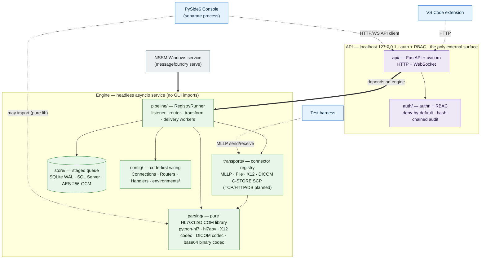
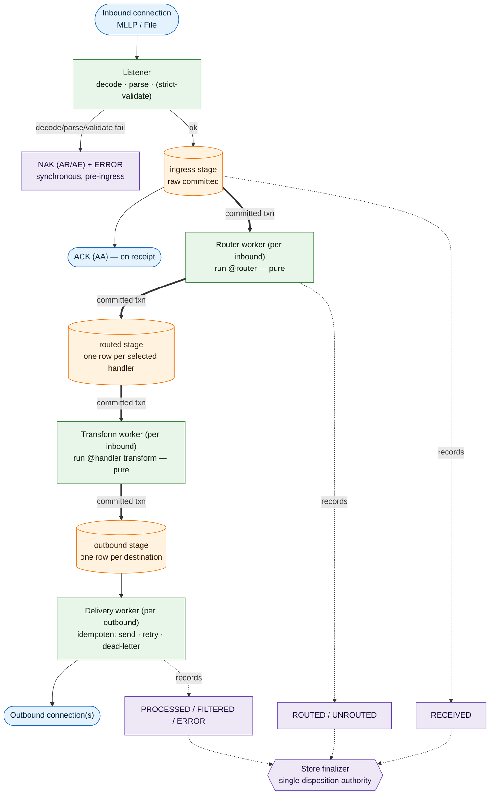
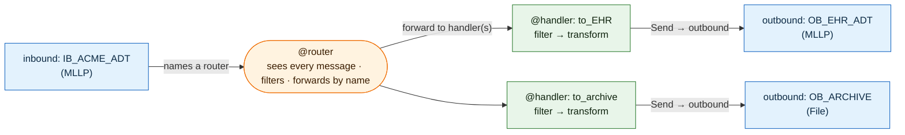

# Architecture

## Architectural standard: modular, contract-bounded components

MessageFoundry is built as a **modular, loosely-coupled architecture with contract-defined
boundaries (information hiding)** — so components can be built in parallel, by separate people or
AI agents, without conflicts. This is the governing standard; the topology, store, and module map
below are all instances of it.

**Modular design (component-based architecture).** The system is decomposed into independent
components: the headless **engine**, the **code-first config** authored against it
(Connections/Routers/Handlers + per-environment values), the **console**, the **IDE extension**, the
**test harness**, and the **CLI tools** (`generate` / `check` / `dryrun`, beyond `serve`) — with the
NSSM **Windows service** and **CI** as the operational wrapping. Within the engine itself: `config` /
`parsing` / `store` / `transports` / `pipeline` / `auth` / `api`. Modularity bounds how much of the
system any one change — or any one AI context window — has to hold, and deconflicts concurrent builds.

**Information hiding (Parnas).** The foundational principle is information hiding / encapsulation,
from David Parnas's 1972 paper *"On the Criteria To Be Used in Decomposing Systems into Modules."*
Its thesis is exactly our goal: decompose a system so each module hides a design decision behind an
interface, **specifically so separate people can work on modules in parallel and a change inside
one doesn't force changes in others.** That is the canonical citation for "split it up so teams
don't conflict."

**Separation of concerns — high cohesion + loose coupling.**
- **High cohesion** — everything related to one concern lives inside one component (the engine's
  message processing; the console's UI). A change stays local.
- **Loose coupling** — components depend on each other as little as possible, and only through
  stable seams. Low coupling means a change in component A has a small **blast radius**, so two
  people (or agents) editing A and B rarely touch the same code.
- **Why it works:** parallel-work conflicts scale with **shared surface area**. Loose coupling
  minimizes that surface; high cohesion keeps each change confined to one module.

**Contract-first / interface-driven design.** Loose coupling only holds if the seams are explicit.
We agree on the interface *first*, then each side builds behind it independently — the contract is
the synchronization point; everything behind it is private and parallelizable. In this repo:
- the **HTTP/WebSocket API** ([`api/app.py`](../messagefoundry/api/app.py)) is the contract between
  the engine and its clients (console, IDE);
- the **connector registry** ([`transports/base.py`](../messagefoundry/transports/base.py)) is the
  contract for pluggable transports;
- the **one-way dependency rule** (`pipeline` / `transports` / `parsing` / `store` / `config` never
  import `api` / `console`) keeps the seams from leaking.

**Organizational dimension.**
- **Conway's Law** — systems tend to mirror the communication structure of the teams that build
  them. The **Inverse Conway Maneuver** is the flip side: we draw module boundaries deliberately to
  match how we want teams (or AI agents) to split work — see the parallel git worktrees in
  [WORKTREES.md](WORKTREES.md).
- **Module / boundary ownership** — each component has one owner at a time (the DDD equivalent is a
  **bounded context**). Concurrent sessions keep their changes within their own module/branch.

## Topology: engine-as-library + localhost API

The engine is an importable Python package (`messagefoundry`). Clients — primarily the
PySide6 console — drive it over a localhost HTTP + WebSocket API (FastAPI/uvicorn).
The same API serves three deployments without code changes:

- **Embedded** — another Python program owns the engine in-process via `create_app(engine)`
  (the async test client; embedding). The **console is never this** — it's always a separate
  process that reaches the engine only over the HTTP API, never by importing it.
- **Local daemon** — engine runs as a Windows service / Linux daemon; the console attaches over
  the API. See [SERVICE.md](SERVICE.md) for the Windows service setup (NSSM).
- **Remote** — same API over the network (Phase 2+, with auth/TLS).

We deliberately did **not** start with two separate processes + hand-rolled IPC. The
logical boundary (library API) comes first; physical split is a deployment choice.

The same topology as a rendered diagram — clients are separate processes that reach the
engine only through the API, and the engine packages never import `api`/`console`:



## The message store *is* the queue

The single most important reliability decision. We use a transactional **staged queue** on SQLite
(WAL mode) — one generic `queue` table with a `stage` discriminator (`ingress` | `routed` |
`outbound`). This is **Step B** of the staged pipeline (ADR 0001 — [docs/adr/0001-staged-pipeline-architecture.md](adr/0001-staged-pipeline-architecture.md)),
the full router/transform split:

```
inbound msg ─▶ decode / parse / (strict-validate)   [synchronous — still NAK on failure]
                    │
                    ▼ persist raw to the INGRESS stage  ─▶ commit ─▶ ACK source   [ACK-on-receipt]
                    │   (ingress + routed lanes key on channel_id; outbound on destination_name)
                    ▼ router worker (per inbound): run Router
              produce one ROUTED row per selected handler + complete the ingress row   (one txn)
                    │
                    ▼ transform worker (per inbound): run that handler's transform
              produce an OUTBOUND row per destination + complete the routed row   (one txn)
                    │
                    ▼ per-destination delivery worker
              deliver ─▶ mark done | mark failed+reschedule (retry policy)
```

The **ACK is sent on receipt** — once the raw message is durably committed to the ingress stage,
*before* routing/transform/delivery — so a slow or hung router/transform/outbound can no longer stall
intake (the bottleneck this removes). Each stage **handoff** is a single committed transaction
(claim → produce-next-stage rows → complete-this-stage), so a message is never lost or partially
handed off; a crash before commit rolls the stage back and it re-runs (each handoff is idempotent
against the re-run — the consumed row is gone), and `reset_stale_inflight` recovers in-flight rows of
**every** stage on startup. This gives **at-least-once delivery**, **retries**, and **replay** without
a separate broker. Because at-least-once now leans on a re-run re-deriving identical output, **routers
and transforms must be pure**; **outbound connections must be idempotent**. Correlation IDs are
persisted for de-duplication. Each destination drains independently — a slow/failed one never blocks
siblings, and a slow transform never blocks routing.

**Disposition flows with the message, decided by the store finalizer** (count-and-log): `RECEIVED` at
ingress → `ROUTED` / `UNROUTED` after the router → `PROCESSED` (all delivered) / `FILTERED` (every
handler ran, delivered nothing) / `ERROR` (dead-lettered at any stage) once nothing is still in
flight. The finalizer is the **single authority** — it never finalizes while any earlier-stage row is
pending, so a delivered handler can't mark a message done while a sibling handler's routed row still
awaits transform. The ACK means *receipt-and-persistence*, not a final disposition: a routing/
transform failure is post-ACK, so it is logged + dead-lettered (operators rely on the disposition +
AlertSink), not NAK'd.

The router/transform split was taken after Step A's measured write amplification (now ~3 durable
transactions/message for a single-handler message; +1 per extra handler) — recorded in
[docs/benchmarks/step-b-write-amplification.md](benchmarks/step-b-write-amplification.md). An optional
per-inbound `ack_after=delivered` (defer the ACK until delivery succeeds) is planned but not built —
the pipeline is ACK-on-receipt only.

The same staged flow as a rendered diagram:



## Concurrency

asyncio core. One listener + a **router worker** + a **transform worker** per **inbound connection**;
one delivery worker per **outbound connection**. Listeners (MLLP/TCP), pollers (file/DB), the router/
transform workers, and retry timers are all asyncio tasks supervised by the `RegistryRunner` so a
crash in one is isolated (a crashed worker is respawned; the router/transform workers drain their
inbound's already-ACKed messages even while the source is stopped). Each worker class has its own wake
event, so a producer wakes only its downstream consumer (no cross-class lost wakeups).

That isolation now extends to **startup wiring** (ADR 0031): a single connection that fails to
build/bind at start (unresolvable `env()`/cert, an egress refusal, a port in use, a cleartext-exposure
refusal) is recorded `failed` + logged + alerted, and the engine **starts the rest of the graph and
serves the API** instead of aborting. A failed outbound still gets its delivery worker, so rows routed
to it are **retried, never dropped**, and a reload/restart that builds it self-heals the lane; a failed
inbound just isn't listening. Reload itself stays fail-fast (it `build_check`s the whole new registry
before quiescing a healthy graph) — only startup degrades.

## Parsing: tolerant-first, strict-on-demand

- **`python-hl7`** parses tolerantly and powers field *peek* for routing. Hot path.
- **`hl7apy`** does version-aware + profile validation, opt-in per inbound connection
  (`validation.strict`). Slower; kept off the routing hot path.

Real-world HL7 v2 is frequently non-conformant. Strict-by-default would drop messages
that must still route, so tolerance is the default and strictness is an opt-in.

## Configuration: connections + code-first routing

The target model is a **graph wired by name, authored as Python** — no enclosing "channel"
object:

- a **Connection** is a named inbound or outbound endpoint (MLLP, file, …);
- an inbound Connection names a **Router** — a Python script that sees every received message,
  decides which **Handler(s)** to forward to, and may filter;
- a **Handler** is a Python script that filters → transforms → sends to outbound Connection(s).

Config is version-controlled, diff-able Python; the database stores runtime state and messages
**only**, never configuration (the opposite of Mirth burying channel XML in the DB).

Connections/Routers/Handlers are authored against the `messagefoundry` surface
(`inbound`/`outbound`/`@router`/`@handler`/`Send`/`MLLP`/`File`/`Message`); a directory of such
modules loads via `load_config` into a `Registry` that the engine's `RegistryRunner` runs.

The configuration graph wired by name (no enclosing "channel" object) as a rendered diagram:



## PHI / security

Messages contain PHI. Access control and the *data* protections are tracked separately — see
[SECURITY.md](SECURITY.md) (identity, RBAC, action audit) and [PHI.md](PHI.md) (data-at-rest,
transport, logging, retention, de-identification), which is the authoritative built-vs-planned map.
The per-interface trust boundaries and STRIDE threats are in
[security/THREAT-MODEL.md](security/THREAT-MODEL.md) (PW.1–2 / ASVS V15).

**Built today:** authentication + RBAC (PHI views gated by `messages:view_raw` /
`messages:view_summary`), a user-attributed append-only **audit log** (hash-chained) of who
viewed/searched/replayed messages, and **encryption-at-rest** for message bodies — AES-256-GCM through
the store cipher when a key is set, with owner-only DB/WAL file permissions and required volume
encryption covering the rest.

**Roadmap (not yet enforced — see [PHI.md](PHI.md)):** structlog **log redaction**, **MLLPS / TLS**
for transport, and **retention/purge** enforcement.

## Module map

| Package / module | Responsibility |
|---|---|
| `messagefoundry.config` | Connector models (`models.py`) + code-first wiring registry/loader (`wiring.py`) + service settings (`settings.py`) |
| `messagefoundry.parsing` | Tolerant peek (python-hl7) + strict validate (hl7apy); parse tree (`tree.py`) and the `Message` transform model (`message.py`); pure non-HL7 codecs — X12 EDI (`x12/`), DICOM headers/SR over pydicom (`dicom/`, ADR 0025), and the base64 binary-carriage codec (`binary.py`, ADR 0028) |
| `messagefoundry.store` | Durable message store / **staged queue** (one `queue` table, `stage` = ingress\|outbound), SQLite WAL; every receipt logged with a disposition that flows with the message. `Store` protocol + `open_store` factory in `base.py`; production SQL Server backend in `sqlserver.py` |
| `messagefoundry.transports` | Inbound & outbound connections (MLLP, file, X12 raw-TCP, DICOM C-STORE SCP inbound over pynetdicom — ADR 0025, …), resolved through a registry (`base.py`) — never special-cased in `pipeline/` |
| `messagefoundry.anon` | Deterministic, secret-per-dataset pseudonymization / de-identification (fail-closed; ADR 0030) — exposed to the tee (`anonymize-captures`) and the test harness |
| `messagefoundry.pipeline` | Per-message routing/handling (`RegistryRunner` in `wiring_runner.py`) + per-inbound-connection supervision (`engine.py`); offline `dryrun.py` |
| `messagefoundry.api` | Localhost FastAPI surface for the console (`app.py` + response `models.py`) — the engine's only external interface |
| `messagefoundry.auth` | Authn + RBAC core (no FastAPI): permissions/roles, `Identity`, password hashing, opaque session tokens, LDAP/Kerberos (`service.py`) — enforced by `api` |
| `messagefoundry.generators` | Conformant synthetic HL7 generators (ADT, ORM, ORU, …) behind `messagefoundry generate` |
| `messagefoundry.console` | PySide6 admin app — a separate process, HTTP client to the API only |
| `__main__.py`, `checks.py` | CLI entrypoint (`serve` / `generate` / `check`) + the `check` commit/CI gate |

Dependency direction is one-way: `pipeline` / `transports` / `parsing` / `store` / `config`
never import `api` or `console`. The API depends on the engine; the console depends on the API.

**Beyond the engine packages** (separate components, not `messagefoundry.*`): the **code-first config**
an operator authors (their `--config` modules + [`environments/`](../environments/) value overrides),
the **IDE extension** ([`ide/`](../ide/)), the **test harness** ([`harness/`](../harness/)), the
sample config + message corpus ([`samples/`](../samples/)), the **Windows service** scripts
([`scripts/service/`](../scripts/service/)),
and **CI / supply-chain** ([`.github/workflows/`](../.github/workflows/)).

## Dependencies

Declared in [`pyproject.toml`](../pyproject.toml) (the source of truth) as `>=` minimums; the pinned,
hashed resolution lives in the committed **`uv.lock`** / **`requirements.lock`** (DEP-1, see
[SECURITY.md](SECURITY.md#dependency-lockfile-dep-1)). Requires **Python 3.11+**.

**Runtime**

- `hl7` (python-hl7) — fast, tolerant parsing for the routing hot path
- `hl7apy` — version-aware validation + profiles (opt-in strict path)
- `pydantic` — config / connector models and validation
- `aiosqlite` — async SQLite for the message store / queue
- `fastapi` + `uvicorn[standard]` — localhost engine API
- `argon2-cffi` — argon2id password hashing
- `cryptography` — AES-256-GCM at-rest encryption for the store
- `ldap3` + `pyspnego` — Active Directory / LDAP auth and Windows SSO (Kerberos)

**Optional extras**

- `console` → `PySide6` (LGPL — chosen so the OSS console is distributable; not PyQt)
- `sqlserver` → `aioodbc` (production SQL Server store; also needs the OS-level Microsoft ODBC
  Driver 18 for SQL Server, which is not pip-installable; lazy-imported so SQLite-only installs skip it)
- `dicom` → `pydicom` + `pynetdicom` (DICOM codec — headers/SR only, no numpy — and the C-STORE SCP
  inbound connector; ADR 0025; lazy-imported so non-DICOM installs skip it)
- `dev` → `pytest`, `pytest-asyncio`, `httpx` (ASGI test client for the API), `ruff`, `mypy`

**Build / tooling** — `hatchling` (build backend), Ruff (format + lint, no Black), mypy (strict),
pytest.
