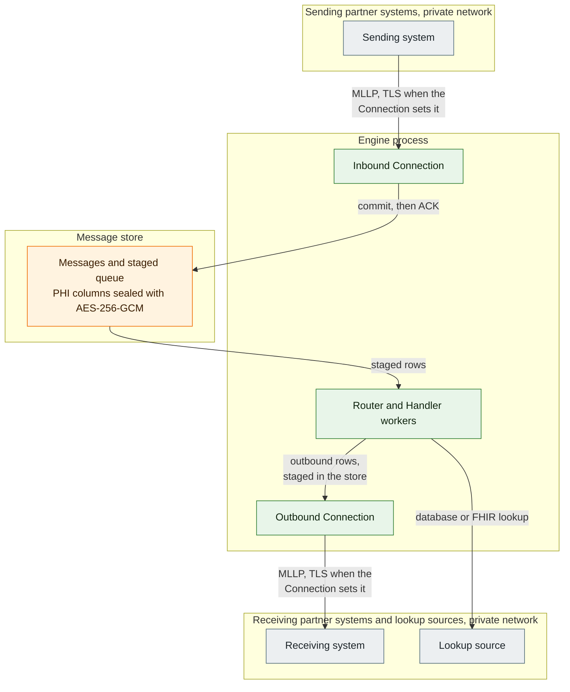
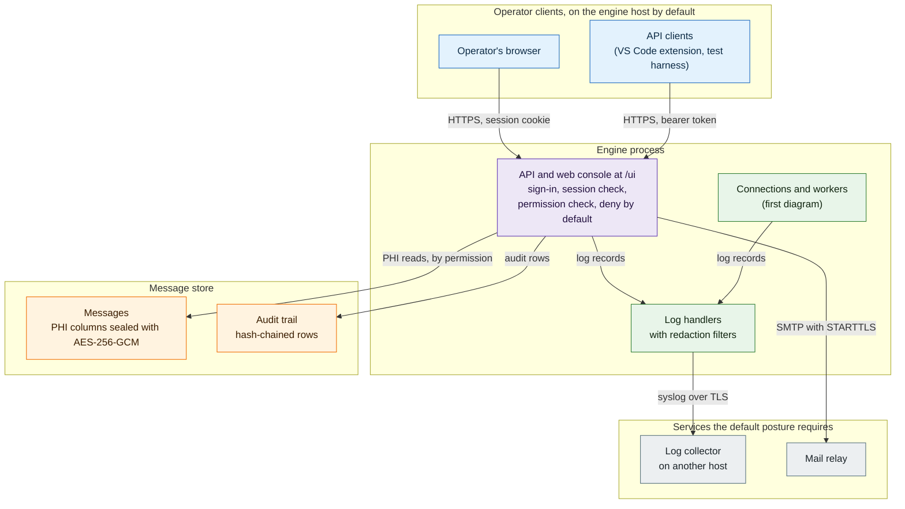
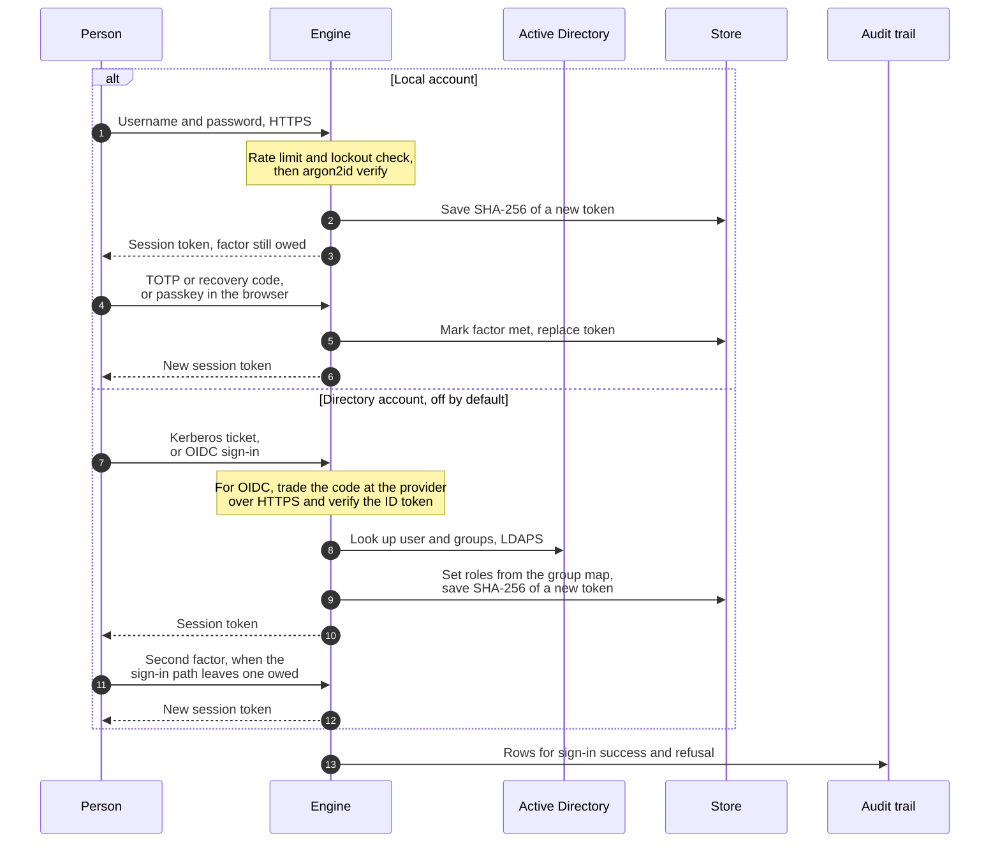
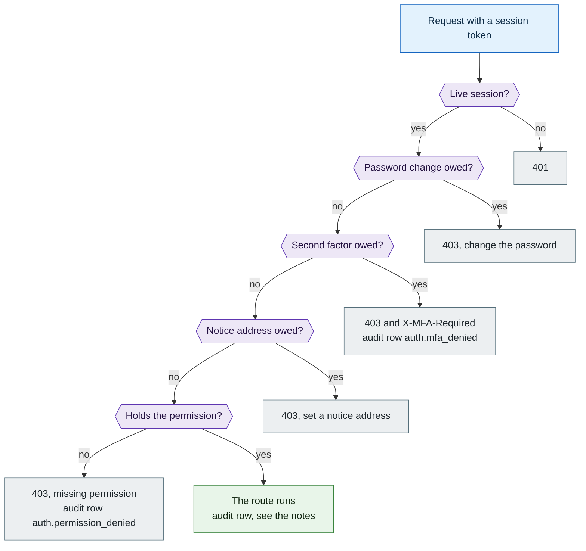

# Users & Security (Authentication + RBAC)

MessageFoundry authenticates every operator and authorizes every action with **role-based access
control (RBAC)**. It supports **local users** and **Active Directory** (sign-in by Windows SSO or
OIDC; the directory-password sign-in is retired), maps **AD security groups to roles**, and attributes every action to a unique user in the audit
trail. The design meets or exceeds Mirth Connect and Corepoint on the points that matter for a
healthcare interface engine — notably: RBAC is built in (not a paid add-on), password policy ships
with secure defaults, and AD-group→role mapping is automatic.

> Carries PHI. This doc covers **identity, access control, and the audit of operator actions**.
> The protection of the *data* itself — at-rest storage/encryption, transport, logging/redaction,
> retention, and de-identification — lives in [PHI.md](PHI.md). MEFOR is deployed **inside the
> organization's private network, never internet-facing**; the trust boundary + the management/data/
> inbound three-plane posture are in [PHI.md §1](PHI.md) and [DEPLOYMENT.md](DEPLOYMENT.md).

---

## Trust boundaries and PHI data flow

These two diagrams answer one question: where does PHI enter, rest and leave, and which control
sits on each boundary. Each outer box is a trust zone, and each arrow names what crosses the
boundary. The table under the diagrams gives the protocol and the control for each hop. The
diagrams show the default posture, `[security].enforcement = "enforce"`, on the MLLP path, which
is the HL7 v2 default. They are a summary. The sections below and [PHI.md](PHI.md) are the source
of record.

The first diagram follows a message.



The second diagram follows an operator, the audit trail and the log.



| Hop or resting place | Protocol | Control |
|---|---|---|
| Sending system to inbound Connection | MLLP | TLS when the Connection sets `tls=true`. By default the engine refuses a listener that would take messages off the loopback address without TLS. |
| Engine to message store | A local SQLite file, or a SQL Server or PostgreSQL connection | The listener commits the raw message before it sends the ACK. A server database connection uses TLS and verifies the server certificate by default. Each later stage hands off through the store. |
| At rest in the message store | Not a hop | A store key seals the PHI columns with AES-256-GCM, and each sealed value is bound to its own table, column and row. By default `serve` refuses to start without a store key. [PHI.md section 2](PHI.md#2-where-phi-lives--data-at-rest-inventory) lists each at-rest location. |
| Outbound Connection to receiving system | MLLP | TLS when the Connection sets `tls=true`. By default the engine refuses an outbound MLLP hop that would leave the host in cleartext. The destination must be on an egress allow-list. |
| Handler to lookup source | A database connection for `db_lookup`, HTTPS for `fhir_lookup` | The server must be on `[egress].allowed_db` or `[egress].allowed_http`. By default the engine refuses a `fhir_lookup` over cleartext HTTP to another host. |
| Browser or API client to the API | HTTPS, TLS 1.2 or later | The API binds 127.0.0.1 by default. The engine serves TLS with the operator's certificate, or with a self-signed pair it creates on first run. The console session cookie is HttpOnly, SameSite=Strict and Secure. An API client sends a bearer session token. |
| API to audit trail | Rows in the message store | Each row's hash covers the row before it, so an edited or reordered row fails verification. Sign-ins and permission refusals write rows, and opening a message writes a row that names the acting user. See [Audit](#audit-1). |
| Engine log to log collector | Syslog over TLS | The engine verifies the collector's certificate. Records from the API, the Connections and the workers pass the same handlers. A filter on each handler redacts HL7-shaped text and scrubs credentials before a record is written or forwarded. |
| Engine to mail relay | SMTP with STARTTLS | The engine verifies the server certificate by default. The default posture requires the relay for account-security notices. It also carries at least operator alert email. Neither holds message bodies. |

Four more facts:

- Egress is closed by default. Under the default posture `serve` refuses to start until the
  operator says where the engine may send. That means at least one `[egress]` destination list
  the startup gate counts, or `[security].block_unlisted_outbound = true`.
  [CONFIGURATION.md `[egress]`](CONFIGURATION.md#egress) says which lists count. That setting is on
  unless it is written false, for every entry point and not only `serve` (vault BACKLOG #2605). A
  transport whose list is empty refuses every destination of its type.
- Full message bodies belong in the message store, not in the general log. Treat the log files and
  the off-box copy as sensitive all the same.
  [PHI.md section 7](PHI.md#7-logging--phi-redaction) covers redaction and the logging rules.
- Under the default posture `serve` requires a log collector on another host, reached over
  verified TLS. It also requires a mail relay for account-security notices.
- Two topologies change the API row. One is a bind opened beyond the engine host. The other is a
  declared reverse proxy that terminates TLS in front of the engine.
  [Enforcement model](#enforcement-model) states the rules for both.

---

## Enforcement model

Authentication is **required** for the running service. The engine `serve` command always attaches an
auth layer, and no setting turns it off (vault BACKLOG #2719). Of the **115** engine route objects, **96 demand a
specific permission** and 19 do not — 3 are deliberately unauthenticated (`GET /auth/providers`, an
unbounded capability advertisement that carries no account state and charges **no** limiter;
`POST /auth/login` and `POST /auth/negotiate`, bounded by the per-IP **and** global login sliding
window instead), 2 answer a tokenless
client through `optional_identity` (`GET /health`, `GET /ai/policy`), and 14 are authenticated
self-service routes that require no permission. One route (`GET /service/identity`) accepts **no bearer
token at all** — it authenticates by verified mTLS client certificate only. Every route is enumerated,
with its gate, in [Route → permission map](#route--permission-map-engine-api) below; nothing is left
implicit.

Both app factories are **fail-closed**. With no enabled `AuthService` attached, `create_app(engine)`
and `create_managed_app(...)` deny every protected route (503) unless the caller explicitly opts out
with `allow_no_auth=True`, the escape hatch for embedders and tests. Neither factory reaches
that mode by omission, and `serve` never passes the opt-in. `serve` refuses to start with
authentication off on every bind, loopback included (vault BACKLOG #2719). It used to allow a loopback
bind with no declared terminator to run with sign-in off. That mode was removed: every request in it
ran as one shared system identity, so the audit trail named no person, and it could not repair an
account, because with no auth service the account and audit routes answer 503. A config that still
sets `[security].require_sign_in` is refused at load. Even with auth enabled, a
non-loopback bind requires an **operator certificate**: in-process (`[api].tls_cert_file`, WP-13a) or
TLS terminated at a trusted upstream proxy (`tls_terminated_upstream` + `trusted_proxies`, WP-15). With
neither, `serve` refuses: the only certificate left is the engine's self-signed placeholder (ADR 0172), which no trust
store vouches for. `serve --allow-insecure-bind`, or its config twin `[security].require_encryption_for_remote = false`, accepts it only under `[security].enforcement = warn` (ADR 0092). So there is no way to be accidentally served with silent,
unauthenticated full access — or to silently void the loopback assumption by changing
`[security].local_access_only` / `listen_address` (SYS-1).

**Sign-in is checked before the request body is read (vault BACKLOG #2739).** FastAPI reads and
decodes a declared request body before it runs a route's dependencies, and the `require*()` gate
is a dependency. Left alone, a gated JSON route that declares a body would answer a caller with no
session from the body parser. The answer would be **422** for JSON that does not parse, or **400**
for bytes that cannot be read. The engine's route class, `AuthenticatedBeforeBodyRoute`
(`messagefoundry/api/security.py`), stops that. On a gated route that declares a body, it runs
the gate's authentication step before FastAPI reads the body. The guards that sit ahead of the
gate run first, in the order FastAPI would run them. So a caller with no identity gets the gate's
own refusal whatever the body holds. The response does not say whether the body parsed, or whether
the route takes a body.

- `create_app` sets the class on the app's router. Each route registered on the app gets the
  check with nothing to remember, and no list of routes is kept.
- Some route shapes are not covered. The class docstring is the one list. It names at least a
  route added through `include_router`, a gate nested inside another dependency, and an unmarked
  dependency ahead of a gate. The engine adds no route through `include_router`, and every gated
  engine HTTP route keeps its gate at the top level. The third shape is present. Every route carries
  `refuse_undeclared_route`, described below, which never refuses a route that has a gate. Some
  routes carry others, such as `_no_store_reply` in `messagefoundry/api/auth_routes.py`. An
  embedder who adds routes in one of those ways must check them.
- The gate itself does not change. After the body is read it runs in full, as before: sign-in
  again, then the password and factor checks, the permission check and its audit rows, pacing and
  step-up. So a signed-in caller that the gate then refuses still gets the parser's answer first
  for a body that does not parse.
- Nothing is handed from the early check to the gate. A session that ends while the body is
  arriving is refused by the gate. The price is one more identity lookup for a signed-in
  request to a route with a body. That lookup reads the session, its user and the user's roles.
  It writes nothing, so it does not move the session's idle clock.
- A route with no gate that is declared public is not touched. `POST /auth/login` has to parse a
  body from a caller with no session. A route with no gate and no declaration is refused before
  its body is read, as described below. A gated route that declares no body is not touched either, because FastAPI already
  runs its gate first. That includes the web console's `/ui` routes, which read their forms
  inside the handler.

`tests/test_auth_before_body.py` tests the mechanism. `tests/test_preauth_malformed_body.py` pins
what an unauthenticated caller gets on every operation that takes a body.

**A route that does not declare how it is authorized is refused (vault BACKLOG #2604).**
`create_app` adds one app-level dependency, `refuse_undeclared_route`
(`messagefoundry/api/security.py`). It applies to every FastAPI route registered on the app, web
console routes included, and runs first among each route's dependencies. On a gated route that takes a
body, the early sign-in check above still answers before it. A route passes in one of two ways:

- It has a top-level gate dependency. Every `require*()` factory, and each of the web console's
  `require_ui*()` factories, marks its gate with `mark_route_gate`. The check reads that mark,
  never a function's name.
- Its endpoint carries a declaration with a reason. `public_route` marks a route that no gate
  dependency guards by design, such as sign-in. Some web console routes of this kind still read a
  pending session inside the handler, such as `/ui/mfa`. `authorizes_in_body` marks a WebSocket
  that authorizes the caller inside its own body, and `/ws/stats` is the engine route that uses it.
  On an HTTP route with no gate, that mark does not count, so the route is refused.

Any other route answers **403** `this route declares no authorization`, and a WebSocket is refused
before it is accepted. Such a route is a defect in the code that registered it. The engine counts
every refusal in memory and writes an ERROR line at most once a minute for each route. Each line
names the route's path template, never the request, and says how many refusals came since the
previous line. Refusals after a burst's last line stay in that count. They reach the log only with
a later refusal of the same route, a minute or more after the last line. No API reads the count,
and a restart loses it. On a body-taking route built by the app's route class, the
refusal comes before the body is read. The check asks only that a route declared a gate. It does not check that
the gate is correct.

- A route whose gate is nested inside another dependency, or added only by `include_router`, is
  refused. That is the safe side.
- At least two kinds of route sit outside the check, because they carry no dependencies. One is a
  route inside a mounted application; `/ui/static` is the only mount. The other is a plain
  Starlette route; the interactive docs and the schema that `expose_docs` turns on are the only ones.

The route walk in `scripts/security/route_gates.py` reads the same mark. `tests/test_route_deny_default.py`
checks that every shipped route declares itself and still answers an anonymous caller as before.

**The proxy-to-engine hop is yours to secure, and `serve` makes you say so (BACKLOG #1179).** With
`tls_terminated_upstream`, the proxy terminates TLS and the engine mints no certificate
([ADR 0172](adr/0172-the-engine-always-serves-tls-minting-a-self-signed-certificate-on-first-run.md)
decision 3). Unless you also supply `[api].tls_cert_file`, the hop from the proxy to the engine is
**plaintext by design**, and the engine does nothing to protect it. Keeping it private is the
deploying site's job: a same-host loopback hop, an isolated network segment, or a host firewall. So
`serve` refuses to start that topology (exit 2) until `[api].plaintext_upstream_hop_acknowledged =
true` is set. It refuses in **every** mode, under `enforce` or `warn`, on a loopback bind or not. The
setting records that the operator took the hop on; it secures nothing by itself. It is a listed
loosening, and [SECURITY-LOOSENING.md](SECURITY-LOOSENING.md) says how each start reports it. With an operator
`tls_cert_file` the engine serves that hop over TLS, so nothing needs acknowledging and the setting is
not required. The proxy must then speak https to the engine and trust that certificate, or every
request through it fails. Setting the acknowledgement without `tls_terminated_upstream` is refused at
load. `messagefoundry check` runs the same test as a required check, `upstream-hop-ack`, against the
`messagefoundry.toml` it finds, so the commit/CI gate catches the refusal before `serve` does. It
reads that file only: a terminator set through `MEFOR_API_*` environment variables alone reaches
`serve` and not the check.

**A trusted proxy must be declared, or the engine must hold your certificate (BACKLOG #2055).** The
pairing runs both ways. A non-empty `[api].trusted_proxies` without `tls_terminated_upstream` is
refused at load, unless you set `[api].tls_cert_file`. uvicorn takes the request scheme from a
trusted peer's `X-Forwarded-Proto`. On the generated placeholder, a proxy that forwarded `http`
would have made the web console issue its session cookie without `Secure` (ASVS 3.3.1 and 3.3.3).
Either key sets `exposure_protected`, which forces `Secure` whatever the proxy forwards. A proxy
that re-encrypts to the engine keeps working with your own `tls_cert_file`.

### Provisioning the first administrator (ASVS 6.3.2)

**The engine creates no account on its own.** A new store has no users, so nobody can sign in until
an operator creates the first Administrator at the host:

```
messagefoundry provision-admin --username <name> --email <address>
```

Run it before the first `serve`, or after a start that was refused. Point it at the store and the
service config the service uses; a provision into any other store succeeds and leaves the service's
store empty. There is no default account: `--username` is required and has no default value. That
is the "not present" arm of ASVS 6.3.2
([ADR 0183](adr/0183-provision-the-first-administrator-offline-no-default-account-at-first-run.md)
Amendment A, BACKLOG #1136). No start writes a password file. Engines before that change wrote a
one-time password to `bootstrap-admin.txt` beside the store; if a development checkout still holds
one, delete it.

**What a start does with no enabled Administrator.** At the shipped posture, once the earlier start
checks pass (at least the store key, the low-disk floor and the `[alerts]` checks), the ADR 0167
notice-deliverability gate refuses the start, and the refusal names `provision-admin` and the store
it opened. Under `[security].enforcement = "warn"`, or with the notice requirement waived in writing
(`[alerts].security_notifications_required = false`), the engine starts and routes HL7, logs one
WARNING naming `provision-admin`, and nobody can sign in until it runs. Switching security notices
off alone does not reach this point under `enforce`: the earlier notice-channel check refuses first.
There is no start that needs no account: `serve` always requires sign-in. A start
refused because no enabled Administrator has a notification address names `messagefoundry
admin-set-notify-email` instead, which fills a missing address from the host.

**Set the service's store key in the shell you run it from.** `provision-admin` opens the store and
writes its first audit row, so it needs `MEFOR_STORE_ENCRYPTION_KEY` (or `[store].encryption_key_file`)
in its own environment. The key in the service's NSSM environment is not visible to your shell. Use
that same key; do not generate a new one. With no key the command refuses, under the same condition
that makes `serve` refuse to start (BACKLOG #1905), because an audit chain that starts keyless stays
keyless, and a store that holds a key reports such a chain as broken. A store already in that state
is also reported as
[`audit_chain_unkeyed`](SECURITY-LOOSENING.md#audit_chain_unkeyed--the-store-has-a-key-but-its-audit-chain-is-keyless).

Four properties are load-bearing rather than incidental:

- **The gate is host access**, the same one `messagefoundry admin-unlock` ships on
  ([ADR 0171](adr/0171-offline-administrator-unlock-a-host-gated-cli-recovery-path-for-a-sole-administrator-lockout.md)):
  the service config, the store path and, on an encrypted store, the key material. Nothing is
  reachable over the network.
- **The password is read from a terminal.** There is deliberately no `--password` and no
  `--password-file`: either would put a standing Administrator credential in argv or on disk, so
  unattended provisioning is refused rather than given a hatch.
- **It refuses when an enabled Administrator already exists** — not merely when the table is empty,
  because a directory sign-in can fill the table without producing an administrator.
- **The password is the operator's own from creation**, read at the terminal and screened by the
  active password policy, so the account is not flagged `must_change_password` and is an ordinary
  administrator from birth.

**The first Administrator enrols an authenticator app at the terminal** ([ADR
0197](adr/0197-cap-repeated-lock-cycles-on-one-account-without-making-malicious-lockout-cheaper.md)
Amendment A, N-A). After the password, the command generates a TOTP key in memory and shows it, as a
key and an `otpauth://` URI. You add it to the app and type the code the app shows. The codes use
SHA-256, so add the account by its URI, which names the algorithm; an app that takes only the key
must be set to SHA-256. The command
checks that code before it writes anything, so a wrong code writes nothing; after five wrong codes it
stops. It then writes the account, the password, the TOTP key and recovery codes, and the role last.
It prints the recovery codes once. The account starts with a way past a sign-in lock: the combined
sign-in, password and code in one request.

- The key and the codes go to the terminal only. They are never in `--json` output, argv, a file or
  a log. Save the codes, then clear the terminal's scrollback. The key is shown before anything is
  written, so a run that fails later shows it too. The IDE's Start flow clears and closes its
  terminal after every run, once you press Enter.
- `--no-totp` skips the enrolment. It is refused while `[security].require_mfa` is on, because the
  requirement always covers an Administrator.

Re-running with the same username completes a provision an earlier run left half-written. The same
repair takes over any enabled local account with that name that holds no roles, such as one an
administrator created with none. The command says it completed an existing roleless account. It
sets the new password, grants Administrator, and moves the notification address when `--email` is
given. So the account's earlier holder is told: a `first_administrator_takeover` notice goes to the
notification address the account held **before** the repair (BACKLOG #2019).

- The command builds the notifier from the same `[auth]`, `[alerts]` and `[secrets]` settings
  `serve` uses. It sends nothing when the account had no address, or when no channel can be built.
  The SMTP password comes from this shell, so set it here as you set the store key. Without it the
  relay refuses the send, and the command shows a WARNING.
- With `email_use_tls` or `email_tls_verify` false, no notice is sent unless
  `[security].allow_unverified_alert_smtp_tls` is true, and then the command warns. This is
  stricter than `serve`, which refuses that hop only on a PHI instance under `enforce`.
- The `auth.first_administrator_provisioned` audit row gains `holder_notice`: `dispatched`,
  `no_prior_address`, `no_channel`, or null for a fresh create. It is written after the notice, so
  `dispatched` means the notifier took it. It does not mean the mail was delivered. The row also
  gains `notify_email_moved`. The `notified` field keeps its old meaning: an address was given with
  `--email`.
- **An account that already holds a notification address needs `--email`** (BACKLOG #2288).
  Without it the command refuses before the password prompt and writes nothing. Kept silently,
  that address would receive every later notice for the new Administrator. A first run given
  `--email` that stopped after creating the account left that address there, so run the same
  command again, with `--email`. You may give the address the account already holds.

The repair first ends every session on the account and removes its TOTP key, its recovery codes
and its passkeys, then enrols the new Administrator's own, and ends the sessions again once the role
is written (ADR 0197 Amendment A). The second pass catches a sign-in made with the earlier password
while the repair ran. Before that change
it did neither. A session the earlier holder kept then became an Administrator session when the role
was written, because every request re-reads the account's roles.

#### Keep a local Administrator

**Create a local Administrator before you need one.** `provision-admin` refuses while any enabled
Administrator exists, and a directory or federated account counts. So if every Administrator signs
in through Active Directory or an identity provider, and that service goes down, no host command
gets you back in. `admin-unlock` clears a local lockout only (vault BACKLOG #2711).

- Keep at least one enabled local Administrator with a password, held by someone who can reach the
  host during an outage.
- At start, the engine checks for this. When every enabled Administrator needs an outside service,
  it logs a WARNING naming them and writes one `auth.no_local_administrator` audit row. It never
  refuses the start.
- Turning sign-in off is not a way back in. `serve` refuses to start without it (vault BACKLOG
  #2719). The old loopback mode could not repair an account anyway: with no auth service, creating
  an account, unbinding one and reading the audit log all answered 503.

### Admin password reset (WP-L3-12, ASVS 6.4.6)

An administrator (`users:manage`) recovers a locked-out or compromised **local** account with
`POST /users/{user_id}/reset-password`. The engine generates a **CSPRNG one-time password through the
active policy**, sets it with `must_change_password`, and **revokes the user's sessions**; the temp is
returned **once** in the response for the admin to convey out-of-band, and the affected user is also
emailed a reset notice (the same security-event channel as [Security-event notifications](#security-event-notifications-wp-l3-05-asvs-635--637)).
The administrator therefore never sets a *lasting* password the user keeps (ASVS 6.4.6) — the one-time
credential must be rotated on first login (where `[security].require_mfa` covers the account,
after the holder has TOTP; see below). AD users are refused (they authenticate against the
directory); resetting your own account is refused (use self-service change-password). The action is
audited (`auth.password_reset`).

**Account creation issues a generated credential the same way** (ADR 0197 Amendment A). `POST /users`
takes no password; a request that sends one is refused (422). The engine generates the new account's
credential, returns it once as `temp_password`, and flags it `must_change_password`. The web console's
create form has no password field and shows the credential once.

**If no credential can be generated, nothing changes.** A site context-word list
(`[auth].password_extra_context_words`) broad enough that no generated credential clears the policy
makes account creation and both resets answer 503. Each generates the credential before it writes
anything, so the account, its factors and its sessions are untouched, and the single-use step-up
grant the route spent is given back. The engine tries the generator once at start and logs an ERROR
if it fails, and `messagefoundry verify` reports the same as `auth.credential_generation`. Neither
refuses to start.

**The factor reset issues one too.** `POST /users/{user_id}/reset-mfa` on a local account writes a
generated credential **first**, then clears the TOTP key, the recovery codes and every passkey and
revokes the sessions, then writes the same credential again. It returns the credential once, and
the holder gets a password-reset notice with its deadline. The first write means a crash between the
writes leaves a generated credential with factors, never a chosen password without them. The second
means a holder's password change that lands between the writes cannot leave a chosen password with no
factor either. A directory account
has no engine password and gets none.

**While a generated credential stands, wrong passwords arm no sign-in lock.** Each is still counted
and audited. The credential has 192 bits, so a lock on it bounds no guessing; it would only let
anyone who knows the username shut the holder out before they sign in once. The second-step lock
arms as before.

**Where `[security].require_mfa` covers a local account, the holder enrols an authenticator app
before choosing a password.** Changing the password ends every session, so rotating first would pass through a chosen
password with no factor and no session, which anyone who knows the username can lock. So
`POST /me/password` refuses with the fixed detail `enrol an authenticator app first` (403), and
the console's password page redirects to the enrolment page, until TOTP is on, whether or not the account is flagged
`must_change_password`. The session may reach `POST /me/reauth` and the TOTP enrolment meanwhile. In
this release only TOTP opens that gate; a passkey is not yet a way past the lock, so a passkey cannot
be the first factor, and TOTP cannot be removed while the requirement covers the account. The
password write carries the TOTP check itself, so a factor reset racing it makes it refuse. With the
requirement off the order is as before: rotate, then enrol if you choose.

The reset can refuse, with a 503 whose detail names `password_extra_context_words`. It does so when
no generated password clears the policy after repeated tries. That means the site's context words
refuse nearly every random string, and so nearly every passphrase too. The account keeps its
password. Remove the site's short or common terms, or replace them with longer ones. Then restart
the engine and retry, because it reads `[auth]` only at start and a `/config/reload` does not.

**Anti-automation (ASVS 2.4.2).** A per-actor human-timing *pacing floor* on sensitive authenticated
writes is **built** (BACKLOG #193). **Two** JSON-API gate families charge it, drawing **one bucket per
actor** (`allow_admin_write`, keyed on the acting user). On the JSON API its only caller is
`_enforce_admin_write_pacing` in `api/security.py`; the console charges it from `require_ui`, as the
paragraph after this list describes:

- **`require_step_up`** — the sensitive surface that also needs a fresh credential re-proof: purge,
  dead-letter and message replay/resend/edit-resend, `POST /config/reload`, **every** `users:manage`
  write — the `PATCH /users/{user_id}` exemption is gone, because BACKLOG #1148 made the action-bound
  `require_step_up_action` charge the same floor — the `/roles/custom` writes, the
  `/uploads` writes, `POST /search/presets`, and since vault BACKLOG #2581
  `POST /dr/activate|release`.
- **`require_paced`** — state-changing routes that warrant pacing but **not** a step-up re-proof:
  connection start/stop/restart/flag/test/test-credential, `POST /statistics/reset`, the four
  `/alerts/{id}/*` writes, approvals approve/reject,
  `POST /status/integrity-check`, and since BACKLOG #287 `PATCH /logging/level`,
  `DELETE /search/presets/{preset_id}` and `POST /alerts/test-email`.

Both charge **non-GET requests only**, so the step-up **GET**s are exempt from *that* limiter by design
— they are reads, not writes — but they are not unpaced: the **four** that select PHI in bulk
(`/messages/search`, `/messages/export`, `/search/layered`, `/uploads/{file_id}/messages`) charge the
per-actor **PHI-read** budget. `/search/layered` charges it at its own route; the other three charge
it INSIDE the shared implementation that each GET and its needle-bearing POST both call (BACKLOG
#1184), so a route pair is paced identically without either half having to remember to charge. The
budget charged is
(`allow_phi_read`, ASVS 2.4.1) at admission, so bulk egress cannot outrun the same bucket that bounds
`/messages`. Over the write floor the request is refused with `429 Too Many Requests` +
`Retry-After: 1`; over the PHI-read budget with `429` + `Retry-After: 10`. On the JSON API both are
logged at WARNING with the actor and path; the console's refusals are not, as the next paragraph
says. The floor (`[auth].admin_write_rate_limit_per_actor` over
`admin_write_rate_limit_window_seconds`) defaults to **12 writes per 15 s**, and that default is
**provisional**. It is a human-timing floor taken from published research, not from a timed session on
this console (BACKLOG #287; owner ruling of 2026-09-23). The derivation and its sources are the
comment on the setting in `config/settings.py`. In short, the keystroke-level model prices a point and
a click at about 1.3 s, and the default allows one write every 1.25 s. The margin is thin and is a
judgment: a person who clicks a button already under the pointer can be faster. The worst-case
`403 → POST /me/reauth → retry` burst costs two writes and fits inside the budget.

**A minimum gap sits beside the count (BACKLOG #2301).** A count alone admits all twelve writes back
to back. `[auth].admin_write_min_interval_seconds` refuses a write that lands less than **0.15 s**
after the same actor's last admitted write, with the same `429` as the count. That default is
**provisional** too, from the same research. The fastest console write the model allows, with the
decision made and the hand in place, is one click (0.2 s) or Tab then Enter (0.16 s). The default
sits just under the faster. The gap runs from the last write the limiter admitted. A write the
limiter refused does not count, but one it admitted counts even if a later check refused it, such as
a `403` for a stale step-up. `0` turns the gap off, and a gap as long as the window is refused at
load. The derivation is the comment on the setting.

**A double click can meet the gap.** The console has no guard against a second submit. If an
operator double-clicks a write button, the first request is served and the second gets `429`, and
the browser shows the second answer. The action still happened once. Reload the page to see it.

**This refuses scripted bulk administration.** An `apiclient` or IDE loop that makes more than twelve
admin writes in 15 s, or two within 0.15 s, gets `429`. Such a loop has to pace itself. Otherwise the site raises the budget
or turns the floor off, and both are loosenings. The budget counts every non-GET request, so a POST
that only reads, such as `POST /messages/search`, spends it too.

**The `/ui` write path is paced, and charges the floor itself.** The console's write routes call the
JSON handler *functions* directly, so the JSON route's pacing `Depends` never runs — `require_ui`
therefore charges `allow_admin_write` in its own right rather than inheriting it, exactly as it
already re-applies the per-actor **PHI-read** budget via `require_ui(..., phi=True)`. Provenance is
asserted before the charge, so a cross-site write is refused without spending the victim's budget.
An MFA-pending session on an account that has a factor is refused before the charge too, on
`POST /ui/account/password` and the `require_ui_reauth_only_action` routes. They run that refusal
inside `require_ui` (`pending_refusal`, BACKLOG #1973). Without that, a caller holding only
the password could be refused in a loop and still throttle the real user's writes. **At least one
route is not covered:** `POST /ui/account/webauthn/verify`, on `require_ui_reauth_only`, still
charges the floor before its own checks refuse such a session.

**The console's refusal differs from the JSON floor's.** Over the write floor, `require_ui` answers
`429` + `Retry-After: 10`, not `1`. It writes no WARNING line naming the actor, for the write floor
or for the PHI-read budget it charges under `phi=True`; the JSON gates log both.

The floor reaches every non-GET `/ui` route gated by `require_ui`; **eight are not so gated** (six
with federation off). Six charge their own auth-surface budget instead: `POST /ui/login` and
`POST /ui/oidc/start` the sign-in window, and `POST /ui/mfa`, `POST /ui/reauth`,
`POST /ui/reauth/webauthn` and `POST /ui/reauth/oidc` the per-actor ceremony budget. The remaining two, `POST /ui/logout` and
`POST /ui/csp-report`, charge nothing (BACKLOG #287).

Pacing complements — does not replace — the RBAC gate, the step-up re-verification, the sign-in
sliding window and the per-actor credential-ceremony limiter (`auth/ratelimit.py`), the per-account
lockout, the argon2 concurrency cap, the 1 MiB body cap, the per-actor PHI-read throttle, and the
pre-auth `[security].allowed_client_networks` gate — the full set is inventoried under
[Brute-force & abuse protection](#brute-force--abuse-protection). In-process only (per API process,
so N engine shards multiply every budget by N): an off-loopback deployment must additionally front the
API with a proxy/WAF limiter. Disable with `[auth].admin_write_rate_limit_enabled = false`.

**A second 2.4.2 control is a time floor, not a rate.** A held dual-control request cannot be approved
until it is `[approvals].min_dwell_seconds` old (default 2 s). It is described, with where its default
comes from, under [Dual-control approval for high-value
actions](#dual-control-approval-for-high-value-actions-wp-l3-04-asvs-235).

**Two second steps have a time floor too, and both ship on (BACKLOG #2301).** Each refuses a second
step that follows the first faster than a person can:

| Pair | Floor | Default | Refused with |
|---|---|---|---|
| Sign-in, then a TOTP or recovery code, or a passkey, on the MFA-pending session | `[auth].mfa_verify_min_elapsed_seconds`, from the session's mint | 1 s | the leg's ordinary failure, `401 invalid code` on `POST /auth/mfa-verify`; audited `auth.mfa_failed` or `auth.webauthn_failed` with `reason=too_early` |
| A federated start, then its callback: the step-up always, the sign-in only when `auth_time` falls inside the flow | `[auth].oidc_callback_min_elapsed_seconds`, from the flow's start on the flow cache's clock | 1 s | `federated sign-in failed`, audited `auth.login_failed`, or the generic step-up refusal, audited `auth.reauth`; both with `reason=too_early` |

Neither refusal says anything about timing, so a caller cannot tell it from a wrong code or a failed
IdP proof. The MFA floor charges no lockout and spends no code or passkey challenge, so the person
simply submits again. It applies only while the session still owes its factor; a step-up code on a
satisfied session is not floored. The federated step-up is refused before its code is redeemed.

**Why a sign-in callback is floored only sometimes.** An IdP that still holds a live single sign-on
session answers the engine's redirect with no human step at all. A floor there would refuse that
sign-in on every retry. So the sign-in is floored only when the verified `auth_time` is at or after
the flow's start, which means the person signed in at the IdP inside this flow. An IdP clock that
runs ahead can make an older sign-on look fresh. The refusal then clears once the skew has passed,
and it never lets a flow through early. An IdP clock that runs behind can do the reverse, and then
that sign-in is not floored.

**Where the defaults come from.** Both are **provisional**, taken from published human-timing
research under the owner's ruling of 2026-09-23, not from a timed session on this console. The
keystroke-level model (Card, Moran and Newell, 1980, the source above) prices a new prompt the person
has not seen at M = 1.35 s and one keystroke at K = 0.08 s. A second step is at least a new prompt and
one submit, M + K = 1.43 s, even when a password manager fills the code. The defaults sit about 30%
below that, at 1 s, because M is an average and some people are faster. The comment on
`mfa_verify_min_elapsed_seconds` in `config/settings.py` carries the derivation.

**What these floors do not do.** At least these gaps remain:

- A script that waits out a floor is not refused. Each floor sets a lower bound on one pair's
  timing. It does not detect automation.
- A combined sign-in, with the password and the code in one request, has no second step, so it has
  nothing to floor. A script holding both goes straight through.
- The two enrollment legs, `POST /me/mfa/confirm` and a passkey registration, can also satisfy a
  pending session. They bind a new factor and are not floored.
- An IdP that re-authenticates with no human step, such as integrated Windows sign-in, answers a
  step-up faster than the floor on every try. The step-up is then refused each time. At such a site,
  set `oidc_callback_min_elapsed_seconds` to `0`.
- The MFA floor compares two wall-clock readings, as the approval dwell does. A clock step backward
  refuses a good code until the clocks agree again. A step forward lets a code through early.
- The response hides the reason, but the audit row names it. The account holder's own security
  events feed shows the `too_early` row.

**Authorization-decision audit (ASVS 16.3.2).** **Every** authorization grant on the engine's own
gates is audited (`auth.permission_granted`), the twin of the existing `auth.permission_denied` (BACKLOG
#195a). PHI-view grants are the one standing exclusion, because the PHI-access audit path already
records those accesses (no double-audit). The web console's gates write no grant row, and that includes
`authorize_ui_ws`, which every same-origin browser `/ws/stats` handshake passes through. BACKLOG #1197
tracks that gap.

That is the shipped default as of BACKLOG #1277 (2026-09-02). Until then the grant audit was **scoped**
to the sensitive / state-changing / config / user-mgmt permission set (`_GRANT_AUDIT_PERMISSIONS` in
`api/security.py`) on non-GET requests only, on the ground that console polling and the `/ws/stats` feed
would flood the hash-chained audit log. **The console never traverses `require()`** — it is
server-rendered in-process and gates on its own cookie-world check — and on `/ws/stats` the header
gate `authorize_ws` fires once per *handshake*. Setting `[security].audit_all_authorization_decisions = false` restores the scoped
behaviour and is reported as a loosening; the volume it trades away is one row per authenticated request
per `require()`-gated route, on the JSON API.

**Delegated identity & admin device posture (#193 sibling; ASVS 13.2.1 / 13.3.2 / 8.4.2 — the delegation
boundary).** Three controls whose enforcement is largely the deploying organization's to provide.
MessageFoundry states the boundary and adds one opt-in precondition check (#203):

- **Managed identity over static credentials.** The store can authenticate with a managed / delegated
  identity — SQL Server `[store].auth = integrated` (gMSA / Windows Integrated) or `entra` (Microsoft
  Entra ID) — instead of a static username + password. Set `[store].require_managed_identity = true` to
  make it a **checked precondition**: `serve` **refuses to start** if the store still uses a static SQL
  login, or a Postgres store (which has no managed-identity mode). Off by default. **The refuse/warn
  split is `[security].enforcement`, not the deployment tier** — `enforce` is the shipped default on
  `dev` and `staging` as much as on `prod`, so a staging box that turns this on and leaves `auth = "sql"`
  is refused, not warned; it downgrades to a warning only under `enforcement = warn`. See
  [`docs/CONFIGURATION.md`](CONFIGURATION.md), which is the source of record for that split.
  AD (`ad_bind_password`) and SMTP
  (`email_password`) have no managed-identity mode yet — supply those secrets via the environment
  (`MEFOR_*`) or a `[secrets]` reference under a least-privilege service account. Keep them out of the config file: the engine
  still accepts a value there, but logs a WARNING at load naming the key.
- **The precondition covers the STORE hop and nothing else** (ASVS 13.2.1, BACKLOG #1182).
  `managed_identity_precondition` is a `StoreSettings` method, so the `[store]` service settings are all
  it can read — the four graph-declared database hops (`Database`, `DatabasePoll`, `DatabaseLookup`,
  `DatabaseRef`) are outside its reach by construction, and each defaults to a static SQL login. Setting
  the flag therefore says nothing about them. `messagefoundry check`'s advisory `static-credentials`
  line names them, together with every other backend hop on a static credential or none. See
  [`docs/CONNECTIONS.md`](CONNECTIONS.md) §*Static credentials on every backend hop*.
- **The opt-in static-credential refusal covers the backend hops the engine dials** (ASVS 13.2.1,
  BACKLOG #1182). `[security].require_nonstatic_credentials` ships **off** (owner decision
  2026-09-23). Turned on, `serve` refuses to start while any hop that presents an unchanging
  credential or none lacks an entry in `[security].static_credential_accepted`, which takes a reason
  per hop. Each honoured opt-out is logged at start by hop name, never by secret, and is named by
  `security_loosenings()`. The refuse/warn split is `[security].enforcement`. What it counts as a
  hop, and what it leaves out (listeners, plugin connector types, and a generic-ODBC credential
  hidden in a driver keyword), is stated in `messagefoundry/config/static_credentials.py`.
  **Several hops have no compliant credential kind in the product today.** The table in
  [`docs/CONNECTIONS.md`](CONNECTIONS.md#static-credentials-on-every-backend-hop) is the one list
  of them, and each listed hop's `compliant_kind` flag is the source of record. With the refusal on,
  each of those can run only under an opt-out. A site that turned the refusal on would, on first
  deployment, record an opt-out for every such hop it uses. That list would then be the site's own
  record of its static credentials; it would not make those hops compliant. See
  [`docs/CONFIGURATION.md`](CONFIGURATION.md) for the two settings.
- **Least-privilege secret access** is the operator's precondition: secrets live in the environment, the
  engine's service account is granted only what it needs (the least-privilege account + ACLs are the
  Windows-service install's job), and at-rest custody is the DPAPI / KeyProvider chain. The precondition
  flag above surfaces the *store* slice of this at start time; the rest is asserted, not engine-checked.
- **Admin device posture** (managed / compliant admin endpoints) stays **100 % deployment-delegated**:
  enforce it at the reverse proxy (mTLS client certificates) plus MDM in front of an off-loopback `/ui`,
  not inside the engine — the engine has no device-attestation channel and does not attempt one.

### Each backend hop's least privilege; the engine probes the store, Vault and LDAP

`messagefoundry check-privileges` probes three hops and prints two (BACKLOG #305, ASVS 13.2.2). Each
probe looks for grants beyond the documented set. None confirms the documented grants are present,
except that a Vault token missing a capability the engine calls is noted.

- **The store principal.** The engine reads its roles and permissions at every start, and the
  command runs the same read on demand.
- **Each Vault token.** The command reads the token's own policies, TTL and renewability
  (`auth/token/lookup-self`), then its capabilities (`sys/capabilities-self`) on each path the engine
  calls and on administrative paths it never calls. The token, its id and its accessor are
  never printed. It reads only the token in `MEFOR_STORE_VAULT_TOKEN` or `MEFOR_SECRETS_VAULT_TOKEN`,
  and sends it only to the Vault in `MEFOR_STORE_VAULT_ADDR` or `MEFOR_SECRETS_VAULT_ADDR`.
- **The AD bind account.** The command binds as the service account and asks the directory who it
  is (the RFC 4532 "Who am I?" operation). It then reads that account's own `tokenGroups`, which AD
  computes over every nested and primary group, and flags an administrative group. Who am I proves
  identity, not rights: delegated directory ACLs are not read, so the hop always says **rights not
  read**.

SMTP and the IdP stay **not probed**: an SMTP relay reports nothing about an account's rights, and
the engine has no read of the client registration at the IdP. They print the identity the engine
presents and the grant it needs.

The table names at least these hops. The engine dials others it does not list here, such as the AI
broker, the syslog forwarder and the alert webhook; `messagefoundry check` names at least the
backend hops that present a static credential or none (the *Delegated identity* paragraph above).

| Hop | Identity the engine presents | Least privilege it needs | Checked by the engine |
|---|---|---|---|
| Store, SQL Server | the `[store]` login: the service account under `auth = "integrated"`, else `[store].username` | `db_datareader` + `db_datawriter`, plus `db_ddladmin` only under `schema_management = "auto"`; `UPDATE` and `DELETE` denied on `audit_log`; no server role | **Yes**, at every start and by `check-privileges`; an over-grant refuses start under `enforce` |
| Store, PostgreSQL | `[store].username` | a `LOGIN` role with no attributes: `CONNECT`, `USAGE` on the store schema and row grants, only `INSERT` and `SELECT` on `audit_log`; it owns that schema only under `auto` | **Yes**, at every start and by `check-privileges`; an over-grant refuses start under `enforce` |
| Store, SQLite | the service account | only that account may read and write the `.db` file and its `-wal`/`-shm` sidecars | No: reported **not applicable**; the filesystem ACL governs it |
| Vault, store key provider | the token in `MEFOR_STORE_VAULT_TOKEN` | `read` on `transit/keys/<KEK>` and `update` on `transit/decrypt/<KEK>`; plus `read` on `auth/token/lookup-self` and `update` on `sys/capabilities-self` for `check-privileges` | **Yes**, by `check-privileges` (hop `vault.store`); reported only, never gates a start |
| Vault, Transit cipher | the token in `MEFOR_STORE_VAULT_TOKEN` | `read` on the data and audit keys under `transit/keys/`; `update` on `transit/encrypt/` and `transit/decrypt/` for the data key and `transit/hmac/` for the audit key; plus `read` on `auth/token/lookup-self` and `update` on `sys/capabilities-self` for `check-privileges` | **Yes**, by `check-privileges` (hop `vault.store`); reported only, never gates a start |
| Vault, connector secrets | the token in `MEFOR_SECRETS_VAULT_TOKEN` | `read` on the KV v2 data path of each `*_secret` reference, and nothing else; plus `read` on `auth/token/lookup-self` and `update` on `sys/capabilities-self` for `check-privileges` | **Yes**, by `check-privileges` (hop `vault.secrets`); reported only, never gates a start |
| LDAP (AD) | `[auth].ad_bind_dn` | read and search on the user and group search bases; no write and no administrative group | **Partly**, by `check-privileges`: identity and administrative groups; delegated ACLs not read; never gates a start |
| SMTP (alerts) | `[alerts].email_username`, or no AUTH account | send as `[alerts].email_from` only | No: printed, not probed |
| IdP (OIDC) | `[auth].oidc_client_id` at `[auth].oidc_issuer` | a confidential client allowed the configured `oidc_scopes` only; no directory or admin API permission | No: printed, not probed |
| Outbound connections | each connection's own credential (`Database`, `Rest`, `FHIR`, `Ftp`, `Email` and the rest) | what that feed's partner grants for that feed alone | No: `check-privileges` does not read the connection graph; `messagefoundry check` lists their static credentials |

The Vault rows name at least the calls the code makes today. A policy that grants them and nothing
more is the least grant for that consumer. The Transit cipher skips the separate audit-key read when
one key does both jobs. The two `check-privileges` paths are in Vault's `default` policy. A token
made with `-no-default-policy` needs them granted, or its hop reads as not observed. Neither path
lets a token change anything.

A Vault token is **over-granted** when any of these holds:

- it carries the `root` policy;
- a path the engine calls grants more than that call needs;
- an administrative path it is asked about grants anything but `deny`;
- the store and the connector-secret hops hold the same token. Then each hop is judged against the
  union of both grants, so each holds the other's paths beyond its own least grant.

The administrative paths it is asked about are at least these:

- two policy writes under a placeholder name, `sys/policies/acl/` and the older `sys/policy/`;
- the same two writes for each policy the token carries, which catches a policy that may rewrite
  itself;
- two identity-group paths that can attach a policy, `identity/group` and `identity/group/name/`;
- a secrets mount (`sys/mounts/`), an auth method (`sys/auth/`) and `auth/token/create`;
- for each Transit key the engine uses, its `config` (which can make the key exportable), `rotate`,
  `export` and `backup` paths.

Grants on other paths the engine does not call are not read, so a clean token still needs its policy
read by hand.

The AD bind account is **over-granted** when it is in an administrative group the check knows.
These are at least:

- **By fixed SID**, read from `tokenGroups`: Domain Admins, Domain Controllers, Read-only Domain
  Controllers, Cloneable Domain Controllers, Schema Admins, Enterprise Admins, Enterprise Read-only
  Domain Controllers, Group Policy Creator Owners, Key Admins and Enterprise Key Admins in its
  domain; Administrators, Account Operators, Server Operators, Print Operators and Backup Operators
  in BUILTIN; and Enterprise Domain Controllers. A SID does not change with the language, so a
  localised group name does not hide one.
- **By name only**: DnsAdmins. It has no fixed SID; the DNS role gives it an ordinary one when it is
  installed. So it is found only in the direct `memberOf`, and a nested DnsAdmins membership is not
  seen. When `tokenGroups` was read, a direct `memberOf` name counts only for DnsAdmins: an
  ordinary group that is merely named Administrators is not the BUILTIN one.

A clean LDAP hop means none of these groups, not no powerful group: a group outside the list, such
as one an Exchange install creates with rights on the domain, is not flagged.

The `primaryGroupID` counts on every read, because a RID cannot be faked by a group name. When
`tokenGroups` cannot be read, the probe falls back to the direct `memberOf` for every group, which
misses a nested group, and reports the hop as not observed unless it finds one. A policy name that
is not plain printable ASCII is reported too, because it cannot be told apart from `root` by
reading it. A bind that succeeds but whose Who am I names no identity is also not observed, never
clean. When the base read of `[auth].ad_bind_dn` returns no entry, the hop names the directory's
result code: `invalidDNSyntax` means the bind identity is a UPN or `DOMAIN\user` rather than a
distinguished name, and the group read needs a DN.

These probes add read-only calls the engine does not otherwise make: the token self-lookup, the
capabilities read, Who am I and one read of the bind account's own entry. Each goes through the
client the engine builds for that hop, with its TLS, trust anchor and cleartext refusal. Run the
command with the service's environment, so the Vault tokens and the AD bind password are the
engine's own:

- **A Vault hop whose `MEFOR_*_VAULT_TOKEN` or `MEFOR_*_VAULT_ADDR` is unset is not observed.**
  The engine itself would fall back to `VAULT_TOKEN`, `~/.vault-token` or `VAULT_ADDR` there. The
  check does not. In an operator's shell those values are the operator's own. Judging that token
  as the engine's would report on the wrong token. Sending the engine's token to that address
  would hand it to a different Vault. A Vault-held AD bind password is read under the same rule.
- **Each run binds to AD as the service account.** A wrong or stale bind password is a failed bind,
  and each one counts toward the domain's account lockout threshold. Repeated runs with the wrong
  password can lock the account the running engine uses. Check the password before you run the
  command again.

`check-privileges` exits 0 when every probe that ran was clean, 3 on an over-grant, 4 when a probe
could not read its principal, and 1 when the settings do not load. Clean means no grant beyond the
documented set. A hop marked not probed never changes the exit code. Its last line, `serve:`, says
what `serve` would do with the store observation. **Only the store finding gates a start**; a Vault
or LDAP over-grant is reported, and the `serve:` line says it does not gate a start. The runbook step
that runs it for the gMSA is [`DEPLOY-SERVER-DB.md`](DEPLOY-SERVER-DB.md) §1.1 step 6.

**What `serve` does with the store finding ([ADR 0199](adr/0199-an-over-granted-store-login-refuses-start-under-enforce-with-an-audited-opt-out.md), owner ruling 2026-09-27).** Under
the shipped `[security].enforcement = enforce`, an over-granted store login **refuses to start**. The
audited opt-out is `[security].allow_over_granted_store_principal = true`: it logs an `AUDIT:` line,
marks the `store_privilege_preflight` audit row `over_grant_accepted`, and is named on
`GET /security/posture`. A probe that could not read the login only warns.
`[store].require_least_privilege = true` refuses on that too, and outranks the opt-out. Under
`enforcement = warn` every arm only warns. The key is the dial alone: since ADR 0186 every instance
is a PHI instance. SQLite has no login, so nothing here applies to it.

### Data-layer hops refuse cleartext on their defaults (ASVS 12.3.1 census)

CORRECTED 2026-10-01: this heading read *"... on their defaults, except the Vault hops"*. Engine
PR 1880 (vault BACKLOG #2317) gave the three Vault hops a scheme gate, so the exception is gone. The
three Vault rows below say what changed.

This census was read at engine commit `bca583f2a7` on 2026-09-30, under vault BACKLOG #2354. Three
rows then changed in the same work, and each says so: the CLI row, the `DatabaseRef` row and, later,
the AD row. CORRECTED: this read "Two rows" before the AD clamp landed. At
`bca583f2a7` both opened their hop with no posture, so `MEFOR_ALLOW_INSECURE_TLS` was unclamped
there, and `messagefoundry check` never built a `DatabaseRef` DSN. The table names at least the sites that open a database,
directory, secrets-store or log-collector connection.
A hop missing from it is not thereby gated. A 2026-08-22 re-scoping counted 14 such sites in 11
modules but never recorded the list, so this table does not try to match that count.

"Under `enforce`" is the shipped `[security].enforcement`. "Shipped default" asks whether the hop
crosses in the clear with every setting at its default once the feature is turned on. A cleartext
crossing that needs an operator relaxation is a recorded delta, not the default (owner ruling R5 of
2026-09-24).

| Hop | Module and symbol | Transport | Gate | Under `enforce` | Cleartext on the shipped default |
|---|---|---|---|---|---|
| Store, SQL Server | `store/sqlserver.py` `connection_string`, which every pool, probe and sync connect calls | ODBC Driver 18, `Encrypt=yes`, verification on | weakened-TLS refusal through `weakened_tls_escape_permitted` | refuses `encrypt=false` or `trust_server_certificate=true`; `MEFOR_ALLOW_INSECURE_TLS` is inert because `serve` passes the posture | No |
| Store, PostgreSQL | `store/postgres.py` `_build_ssl`, `_per_connection_ssl_connect` | asyncpg with an engine-built verifying `SSLContext` | the same weakened-TLS refusal, plus `RevocationHopGuard` | refuses as above; also refuses an off-loopback hop with no revocation check unless `[store].ssl_crl_file` loads | No |
| Store, opened by a CLI command | `__main__.py` `_admin_unlock`, `_admin_set_notify_email`, `_audit_verify`, `_audit_anchor`, `_rotate_key`, `_backup`; `support/bundle.py`; `verify/checks.py`; `verify/smoke.py` | the two store drivers above | the same refusal; these call `open_store` with no posture, and no posture fails closed | refuses whatever the dial says. CORRECTED: at `bca583f2a7` this row read *"the escape is **not** clamped"*; that was true then, and the shared predicate now refuses the escape when no posture is known | No |
| Cluster coordination | `pipeline/cluster.py` `DbCoordinator`, `pipeline/cluster_sqlserver.py` `SqlServerCoordinator` | the store's own pool; opens no connection of its own | inherits the store rows above | as the store | No |
| `DATABASE` connector, SQL Server preset | `transports/database.py` `_build_dsn`, from `DatabaseDestination` and `DatabaseSource` | ODBC | weakened-TLS refusal through `_weakened_tls_permitted`, and `_assert_send_hop` at the byte crossing | refuses; a per-connection `tls_hop_attested` allows, audited | No |
| `DATABASE` connector, generic dialect | `transports/database.py` `generic_cleartext_hop_guard` | ODBC, TLS set by the operator's driver keywords | `InsecureHopGuard`, the shared `insecure_hop_disposition` gradient (engine PR 761) | refuses an off-loopback hop whose `odbc_params` set no TLS keyword or a no-TLS value; `cleartext_accepted` warns | No; the default (no TLS keyword) is refused |
| `db_lookup` | `transports/database.py` `DatabaseLookupExecutor` | ODBC, SQL Server preset, `ApplicationIntent=ReadOnly` | `_build_dsn`, posture stamped by `RegistryRunner._build_lookup_executor` | refuses | No |
| `DatabaseRef` reference sync | `pipeline/reference_sync.py` `database_source_dsn`, from `_load_database_source` and from `build_check` | ODBC, SQL Server preset | `_build_dsn`, with the engine's posture at sync time | refuses at `messagefoundry check`, dry-run, reload and every sync. `serve` start does not stop: its first sync fails and the set stays unloaded. CORRECTED: at `bca583f2a7` a sync read no posture and the escape was unclamped | No |
| Vault KV secrets | `config/secretprovider_vault.py` `_build_client` | hvac over the scheme the address names | a scheme gate, `transports/strict_requests.py` `_refuse_a_cleartext_vault_hop`, through the shared `insecure_hop_disposition`; run by `mount_strict_reply_adapter` at build and again before each send | refuses an `http://` address unless it is loopback and reached with no proxy. The hop holds no posture and has no escape, so it refuses the same way under `warn`. CORRECTED: at `bca583f2a7` this row read *"none on the scheme"* and *"an `http://` address is used as given"*; engine PR 1880 (vault BACKLOG #2317) added the gate | Off by default; once on, only a loopback `http://` address with no proxy crosses unencrypted |
| Vault store key provider | `store/keyprovider_vault.py` `_build_client` | as above | as above | as above | as above |
| Vault Transit cipher | `store/crypto_transit.py`, which builds its client through `store/keyprovider_vault.py` `_build_client` | as above | as above | as above | as above |
| AD (LDAP) binds | `auth/ldap.py` `LdapAuthenticator` | LDAPS through `NarrowedTls`; plain LDAP for an `ldap://` address | verify-off refusal through `weakened_tls_escape_permitted`; an `ldap://` address is refused at settings load unless `[auth].ad_allow_insecure_ldap = true` and `[security].enforcement = warn` (`ServiceSettings`), and again at authenticator build | verify-off refuses. A plain `ldap://` bind refuses under `enforce`, where the opt-in is inert. Under `warn` it is honoured with a WARNING line and a `security_loosenings()` entry, and writes no audit row, like the other settings-scoped loosenings. CORRECTED: at `c31f0c37f9` this cell read *"`ad_allow_insecure_ldap = true` is honoured with no posture check, no audit line and no `security_loosenings()` entry"*; that was true then (vault BACKLOG #2354) | Off by default; `ldap://` needs the opt-in and `warn` |
| Off-box log and audit forwarder (the audit tee in `store/audit_tee.py` writes through it) | `logging_setup.py` `_build_syslog_handler`; decided by `config/settings.py` `forward_hop_disposition` in `serve` | UDP, TCP or TLS syslog | the shared `insecure_hop_disposition` gradient | refuses a non-loopback UDP, TCP or verify-off collector unless `forward_hop_attested` | Off by default; the `udp` default is refused off loopback |

**How the negatives were checked.** Each "no gate" or "not clamped" cell came from a search paired
with a control that finds a gated site. Line counts, same files: `insecure_hop_disposition` is in 0
lines of each Vault module and in 3 of `config/settings.py`. CORRECTED 2026-10-01, re-measured at
`698a51bafa`: that zero still holds and no longer means no gate. The Vault provider modules reach
the gate through `mount_strict_reply_adapter` (2 lines in each), and `transports/strict_requests.py`
holds `insecure_hop_disposition` in 3 lines, the same count as the `config/settings.py` control. At `c31f0c37f9`, `ad_allow_insecure_ldap`
was in 0 lines under `messagefoundry/auth/` and in 4 of `config/settings.py`; the clamp that closed
that row added lines to both. At `bca583f2a7`, `active_hop_posture`
was in 0 lines of `pipeline/reference_sync.py` and in 15 of `pipeline/wiring_runner.py`. The cluster modules hold 0
lines matching the extended pattern `create_pool|connect\(`, where `store/sqlserver.py` holds 10.

**The shared cause is closed (vault BACKLOG #2354).** `weakened_tls_escape_permitted` and
`_weakened_tls_permitted` now fail closed when no posture is known. CORRECTED: this paragraph read
that both *"fall back to the unclamped escape when no posture is set"*, so each new caller outside
the construction gate had to remember to pass one. Now a caller that forgets is refused, and one that
needs the escape on a `warn` instance passes that posture.

**`ad_allow_insecure_ldap` is clamped (vault BACKLOG #2354).** Under `enforce` it is inert, as
`MEFOR_ALLOW_INSECURE_TLS` is. CORRECTED: the list below named it as still open, waiting on
engine PR 1877.

**Still open after this census.** At least these:

- CORRECTED 2026-10-01: this list named the three Vault hops' missing scheme gate, vault BACKLOG
  #2317. Engine PR 1880 closed it; see the Vault rows above.
- The CLI commands in the third row refuse a weakened store even at `enforcement = warn`, because
  they pass no posture. At least `provision-admin`, `store provision-schema` and `check-privileges`
  pass one and keep the escape at `warn`. A site that needs the others on a dev store gives it a
  verifying certificate, or the command is changed to pass its posture.
- The generic `DATABASE` dialect cannot tell an encrypted-but-unverified driver value from a verified
  one. `generic_odbc_no_tls_params` records that residual.

Backups and the support bundle write to a path. If that path is a network share, the operating
system makes the connection, and the engine opens no socket of its own for it.

---

## Roles & permissions

### Authorization design (ASVS 8.1.1)

Every request is authorized by the same chain. Each link can refuse on its own; a request reaches a
route handler only when all of them pass.

1. **Pre-routing client-network deny** — `ClientNetworkMiddleware` (registered last, so Starlette makes
   it the *outermost* user middleware) refuses a request whose client address falls outside
   `[security].allowed_client_networks` with **403** (`X-MessageFoundry-Denied: client-network`) or a
   pre-accept WebSocket close `1008`, before routing, dependencies, the body cap and auth. `GET /health`
   is the sole exempt path. Empty list (the default) = no restriction. See
   [Contextual and environmental security inputs](#contextual-and-environmental-security-inputs-asvs-813--814).
2. **Authentication plane selection** — one of three. An opaque **bearer session token** in the
   `Authorization` header serves the JSON API and native WebSocket clients. A verified **mTLS client
   certificate** serves only `GET /service/identity`. The web console's `SameSite=Strict` **session
   cookie** serves the `/ui` routes and a same-origin browser's `/ws/stats` handshake. The JSON API's
   `require*()` gates never read the cookie. `/ws/stats` accepts two planes, cookie first and
   header token second; the WebSocket note under the gate table below has the order.
3. **The `require*()` deny-by-default ladder.** Its first two rungs, the 503 and the 401, answer
   before the request body is read; [Enforcement model](#enforcement-model) says how. The ladder
   runs in this order: **503** `authentication is not configured`
   when no enabled `AuthService` is attached and `allow_no_auth` was not set (the fail-closed embedding
   guard, SYS-1) → **401** when the bearer token resolves to no identity → **403** `password change
   required` when the identity is flagged `must_change_password` and the path is not must-change
   exempt (`_MUST_CHANGE_EXEMPT_PATHS`; at least `/auth/logout`, `/auth/me`, `/auth/mfa-verify` and
   `/me/password`). While `[security].require_mfa` covers the local account and it has no TOTP, the
   `_ENROL_FIRST_ROUTES` pass too, so it can enrol TOTP before it rotates, and the refusal's detail
   ends `; enrol an authenticator app first` (ADR 0197 Amendment A) → **403** + `X-MFA-Required`
   plus an `auth.mfa_denied` audit row when the session's second factor is pending and the route is not
   MFA-exempt (on `/me/password`, only when an account other than a directory account holds a
   factor, BACKLOG #1954; see the "MFA state" row below) → **403** `notification address required`
   + `X-Notify-Email-Required` when the account has no `notify_email`, a security-notice channel is
   wired, and the route is not in `_NOTIFY_EMAIL_EXEMPT_ROUTES` (the way out, `POST /me/notify-email`,
   plus the escapes of the two gates above; BACKLOG #1139) → **403** `missing permission: <value>`
   plus an `auth.permission_denied` audit row for the first unheld permission. On success it writes one
   `auth.permission_granted` row — **every satisfied route, GETs included**, since
   `[security].audit_all_authorization_decisions` defaults **on** (BACKLOG #1277). PHI-view grants are
   the standing exclusion: the PHI-access path records those. Turning the switch off narrows it to the
   sensitive permission set on non-GET requests only. ADR 0118 relocated the knob, and the old
   `[diagnostics].audit_all_authz` TOML spelling is **refused at load**.
4. **A second axis: per-channel scope** — `users.channel_scope` narrows operational routes to a set of
   connections, and it **denies by default**: a new non-administrator is granted no channel until
   somebody grants one (BACKLOG #1152; the full rule is *Per-channel scoping (DLQ-SCOPE)* below).
   Out-of-scope *message* access returns **404** (existence-hiding); connection control and inbound
   injection return **403**. Denials are audited `auth.channel_denied`.

The table below has **seven** rows. `require` is the ladder itself; five wrappers extend it
(`require_paced`, `require_phi_read`, `require_step_up`, `require_step_up_action`, and the shared
`require_reauth_only`/`require_reauth_only_action` row); `require_service_cert` deliberately
**bypasses** it — a separate, cert-only identity plane where none of `require`'s session concerns
apply. What each **adds** over plain `require()`:

| Gate wrapper | Routes | What it adds over `require()` |
|---|---|---|
| `require` | 41 | nothing — the ladder itself |
| `require_paced` | 17 | per-actor anti-automation pacing on **non-GET** requests (`allow_admin_write`), 429 + `Retry-After: 1` |
| `require_phi_read` | 8 | the ADR 0092 PHI-read hop refusal (`enforce_phi_read_hop`) **before** any identity work, then the per-actor PHI-read budget, 429 + `Retry-After: 10` |
| `require_step_up` | 32 | the same non-GET pacing, then the **MFA gate** (403 + `X-MFA-Required: 1`), the **new-client-IP** signal, and the credential-recency window (403 + `X-Step-Up-Required: 1`) |
| `require_step_up_action` | 6 | the same non-GET pacing (BACKLOG #1148), the **MFA gate**, then a **single-use, action-bound** step-up grant, minted on this plane only by `POST /me/reauth` (403 + `X-Step-Up-Action: <action>`; the password leg of `POST /ui/reauth` and the IdP leg mint it for a cookie session). Promoting a route here no longer drops the pacing floor |
| `require_reauth_only_action` | 4 | password step-up **without** the MFA gate — deadlock avoidance on the MFA-enrollment lanes, and on session terminate (ASVS 7.5.2), where the grant is action-bound so a login-seeded window does not unlock it. `require_reauth_only` still exists and still backs the `/ui` twin, but BACKLOG #1149 moved the last JSON route off it, so it no longer appears in this walk |
| `require_service_cert` | 1 | cert-only authentication (a bearer token gets 401), and a **PHI fence** that raises at *app construction* if asked to gate `messages:view_summary` / `messages:view_raw` |

`optional_identity` (2 routes) never raises, so a tokenless client is answered.

The one WebSocket route, `/ws/stats`, runs up to two gates in turn, all **before** `accept()`:

1. **`authorize_ui_ws`, when the web console is mounted.** It takes only a browser handshake whose
   `Origin` matches ours. With `[security].web_console_public_address` set, scheme, host and port must
   all match, ignoring case. Unset, it compares host and port with the `Host` header and ignores the
   scheme, except on a loopback bind with `[api].trusted_proxies` set, where no `Origin` matches and
   this step yields no identity (BACKLOG #2217). It then reads the session cookie and checks the must-change lockout, the second factor, the
   notification address and the permission.
2. **`authorize_ws`, when step 1 yields no identity or the console is not mounted.** It checks any
   `Origin` against `[api].ws_allowed_origins`, whose default `[]` refuses every browser. Then it
   reads the bearer token from the `Authorization` header only, and runs the same four checks. With
   authentication off (the `allow_no_auth` embedding case), it skips the token and admits any
   handshake whose `Origin` it accepted.

A native client sends no `Origin`, so it always takes step 2. A browser whose `Origin` matches takes
step 1. If its cookie yields no identity, it falls to step 2. Under the default `[]`, step 2 refuses
its `Origin`, as it refuses a cross-origin browser's. Listing that `Origin` does not help while
authentication is on, because a browser cannot set the `Authorization` header on a WebSocket.

The two gates audit differently. Under the default audit setting, `authorize_ws` writes one
`auth.permission_granted` row per authorized handshake, before the route's connection-cap check.
`authorize_ui_ws` writes no grant row. Its denial rows carry the client address, as those of
`authorize_ws` do, read through the same `client_ip()` (ADR 0150, BACKLOG #1644).

### Permission catalogue (29)

The catalogue is `Permission` in [`auth/permissions.py`](../messagefoundry/auth/permissions.py); the
enum value **is** the wire/storage string. "Routes" counts engine route objects gated on that permission
under `create_app()` (they sum to 99, not 96, because BOTH `/messages/export` routes and
`/messages/{id}/outbound` require two).

| Constant | Permission | PHI | Routes | Gates |
|---|---|---|:--:|---|
| `MONITORING_READ` | `monitoring:read` | | 19 | the whole read/dashboard surface + `GET /service/identity` (mTLS) + `WS /ws/stats` |
| `MONITORING_DIAGNOSE` | `monitoring:diagnose` | | 9 | `POST /statistics/reset`, the `/alerts` active+write routes, `GET`/`PATCH /logging/level`, `POST /status/integrity-check` |
| `MESSAGES_READ` | `messages:read` | | 9 | `/messages`, `/dead-letters`, `/messages/search` (GET **and** the needle-bearing POST), `/messages/{id}/responses`, `/search/*` |
| `MESSAGES_VIEW_SUMMARY` | `messages:view_summary` | **PHI** | 1 | `GET /messages/{id}/outbound`, beside `messages:view_raw` (ASVS 14.2.6, vault BACKLOG #1187); otherwise enforced **per property** by the field authorizer over 6 response models (see [Field-level authorization](#field-level-property-authorization-wp-9)), and it is the second switch for the captured-reply `body` |
| `MESSAGES_VIEW_RAW` | `messages:view_raw` | **PHI** | 6 | the whole message body: `GET /messages/{id}/raw` (BACKLOG #2345), `/attachments/{id}`, `/outbound` (with `messages:view_summary`), `/messages/export`; the single-message open `GET /messages/{id}`, which carries no body; also, with `messages:view_summary`, the per-property switch for the captured-reply `body` |
| `MESSAGES_REPLAY` | `messages:replay` | | 2 | `POST /dead-letters/replay`, `POST /messages/{id}/replay` |
| `MESSAGES_RESEND` | `messages:resend` | | 1 | `POST /messages/{id}/resend` — resend a stored body to an **alternate** outbound (ADR 0090) |
| `MESSAGES_EDIT` | `messages:edit` | **PHI** | 1 | `POST /messages/{id}/edit-resend`. The edited body **is** PHI, so it **implies** `messages:view_raw` **for the built-in roles** — every built-in role granting it also grants view_raw. **Minting** does not enforce that implication and deliberately still does not: `messages:edit` is not in `CUSTOM_ROLE_FORBIDDEN_PERMISSIONS`, so a custom role holding it alone stays mintable. The **console editor** enforces it at the gate instead (BACKLOG #324) — `GET /ui/messages/{id}/edit` and `POST /ui/messages/{id}/edit-resend` require `messages:view_raw` **as well**, and fail closed on either, because the editor displays the body it edits |
| `MESSAGES_EXPORT` | `messages:export` | **PHI** | 2 | `GET`/`POST /messages/export` — the **largest PHI egress surface**; a capability distinct from `view_raw` (bulk ≠ opening one message), and the route requires **both** plus step-up |
| `MESSAGES_PURGE` | `messages:purge` | | 1 | `POST /connections/{name}/purge` |
| `CONNECTIONS_CONTROL` | `connections:control` | | 3 | `POST /connections/{name}/start`, `/stop`, `/restart` |
| `CONNECTIONS_TEST` | `connections:test` | | 2 | `POST /connections/{name}/test`, `/test-credential` |
| `DR_OPERATE` | `dr:operate` | | 2 | `POST /dr/activate`, `/dr/release` (ADR 0048). Never assignable to a custom role |
| `CLUSTER_CONTROL` | `cluster:control` | | 1 | `POST /cluster/stepdown` (ADR 0056) — a planned active-passive failover: the leader releases its lease and a standby promotes. A dedicated capability, not a reuse of `monitoring:read` (a read) or `connections:control` (one connection). Never assignable to a custom role |
| `CONFIG_DEPLOY` | `config:deploy` | | 2 | `POST /config/reload` **and** `POST /connections/{name}/flag` |
| `CONFIG_VALIDATE` | `config:validate` | | 0 | no endpoint yet (see the note below) |
| `CODE_EDIT` | `code:edit` | | 0 | no endpoint yet |
| `AI_ASSIST` | `ai:assist` | | 1 | `POST /ai/chat`; also *reported* (not enforced) as `assist_permitted` on the unauthenticated `GET /ai/policy` |
| `SERVICE_CONFIGURE` | `service:configure` | | 1 | `POST /alerts/test-email` — a live outbound SMTP dial through the configured `[alerts]` mail transport (BACKLOG #118); service/settings administration, not the diagnostic ack/resolve tier |
| `USERS_READ` | `users:read` | | 4 | `GET /roles`, `/roles/custom`, `/users`, `/users/{id}/permissions` |
| `USERS_MANAGE` | `users:manage` | | 19 | every user/role/AD-map write **and** the three reads `GET /users/{id}/channel-scope`, `/ad-group-map`, `/ad-group-scope-map`. Never assignable to a custom role |
| `AUDIT_READ` | `audit:read` | | 1 | `GET /audit` |
| `AUDIT_EXPORT` | `audit:export` | | 1 | `GET /audit/export` — the filtered audit-report CSV (BACKLOG #170); distinct from `audit:read` |
| `LOGS_VIEW` | `logs:view` | **PHI** | 1 | `GET /logs/tail` — the best-effort-redacted application-log tail (residual single-token PHI is possible), so it rides `require_phi_read` and writes a `logs_view` audit row |
| `FILES_UPLOAD` | `files:upload` | **PHI** | 1 | `POST /uploads` — writes real HL7 PHI at rest |
| `FILES_BROWSE` | `files:browse` | **PHI** | 4 | `GET /uploads` (metadata), `GET /uploads/{id}/messages` (bulk decrypt+split), `POST /uploads/{id}/resend` |
| `FILES_DELETE` | `files:delete` | | 1 | `DELETE /uploads/{id}` — destructive, audited cleanup |
| `FILES_ACCESS_ANY` | `files:access_any` | **PHI** | 0 | no route — an **object-level** override (ASVS 8.2.2), enforced in the uploaded-files handler bodies rather than at a gate (the console calls those handlers directly over the seam, so a gate would not cover it). Uploaded files are **owner-only**: without this, `files:browse`/`files:delete` reach only what the caller uploaded; with it, every uploader's. It is not a capability of its own — the holder still needs `files:browse` / `files:delete` for the route. Never assignable to a custom role |
| `APPROVALS_APPROVE` | `approvals:approve` | | 4 | `GET /approvals`, `POST /approvals/{id}/approve`, `/reject`, `/resolve` (dual control, ASVS 2.3.5). The console's Approvals page, `/ui/approvals`, reaches the first three (BACKLOG #1982). Never assignable to a custom role |

`config:validate` and `code:edit` have **no API endpoint yet**; they are defined so
the Deployment/Coding roles are complete and those endpoints can be gated the moment they land, without
a roles migration. They are still in `_GRANT_AUDIT_PERMISSIONS`, so a future route inherits grant
auditing for free.

### Built-in roles

Six fixed built-in roles (`Role` + `BUILTIN_ROLE_PERMISSIONS`). Holding multiple roles grants the
**union**; `Identity.has()` is a flat frozenset membership test, so there is no wildcard and no
inheritance — where a permission came from is invisible downstream.

| Role | Count | Permissions |
|---|:--:|---|
| **Administrator** | 29 | **every permission** — literally `frozenset(Permission)`, so a newly added permission is granted to it automatically |
| **Operator** | 16 | `monitoring:read`, `monitoring:diagnose`, `messages:read`, `messages:view_summary`, `messages:view_raw`, `messages:replay`, `messages:resend`, `messages:edit`, `messages:export`, `messages:purge`, `connections:control`, `connections:test`, `logs:view`, `files:upload`, `files:browse`, `files:delete` |
| **Deployment** | 4 | `monitoring:read`, `config:deploy`, `config:validate`, `connections:test` |
| **Coding** | 4 | `monitoring:read`, `code:edit`, `config:validate`, `ai:assist` |
| **Viewer** | 2 | `monitoring:read`, `messages:read` |
| **Auditor** | 3 | `monitoring:read`, `audit:read`, `audit:export` |

An Operator therefore reaches **five PHI-marked capabilities beyond viewing one message** — counted
straight off the catalogue's PHI column, minus the two that *are* viewing one message
(`messages:view_summary`, `messages:view_raw`): edit-and-resubmit (`messages:edit`, whose console
editor renders the full raw body at `GET /ui/messages/{id}/edit` — a route that requires
`messages:view_raw` alongside it, so the grant does not reach the body on its own), bulk raw export
(`messages:export`), the redacted log tail (`logs:view`), and the two PHI-touching uploaded-file
capabilities (`files:upload`, `files:browse`). `files:delete` is **not** in that count: it destroys
PHI, it does not emit it, and the catalogue leaves its PHI column empty. A Viewer holds no PHI-field
permission at all, so every gated property comes back `null` for them.

### Custom roles (ADR 0045)

The custom-role builder **is built** and is an *additive overlay* on the six built-ins, not a
replacement:

- A custom role is a named **subset of the existing 29-permission catalogue** — it can never define a
  new permission kind.
- Its id must carry the `custom:` prefix (`CUSTOM_ROLE_ID_PREFIX`), so it can never collide with a
  built-in role value or be mis-routed to the built-in resolver.
- It may **never** grant `users:manage`, `approvals:approve`, `dr:operate`, `cluster:control` or
  `files:access_any`
  (`CUSTOM_ROLE_FORBIDDEN_PERMISSIONS`) — the escalation primitives stay admin-only.
- It may not hold `messages:view_raw` **without** `messages:view_summary` (`CustomRoleError` on
  create and edit; a stored row of that shape decodes with `view_raw` dropped).
  *Added 2026-10-01, ASVS 14.2.6, vault BACKLOG #1187.* This is a minting rule, unlike the
  `messages:edit` implies `messages:view_raw` convention the catalogue describes, and the two
  differ for a reason. A role holding `edit` without `view_raw` is narrower than intended, and it
  fails closed: the console editor refuses it, and nothing is disclosed. A role holding `view_raw`
  without `view_summary` is not a coherent role: it may read the whole message body while being
  denied the patient summary drawn from that body, and owner ruling R18 makes a one-message read
  the reveal act only for a `view_summary` holder. Refusing it at minting closes every body route
  at once (`/raw`, attachments, `/ui/messages/{id}/body`, a one-id `/messages/export`), and the
  route gates on `/outbound` and the `/responses` body stay as a second line. No deployment exists,
  so no stored role is broken by the change.
- An empty set or an unknown permission string is rejected on write (`CustomRoleError`); a
  malformed/hand-edited persisted `roles.permissions` row decodes **defensively to the empty set**, and
  a forbidden value that somehow reached storage is dropped.
- A caller's effective permission set is the flat union of built-in-role permissions and custom-role
  `extra_permissions`, computed once per request in `Identity.build`.

Managed at `GET /roles/custom` (`users:read`) and `POST` / `PUT` / `DELETE /roles/custom[/{role_id}]`
(`users:manage` + step-up).

> **AI coding assistance is RBAC-gated and centrally policy-governed.** `ai:assist` (held by
> **Coding** and **Administrator**) controls whether an identity may use the IDE AI assistant; the
> assistant is additionally bounded by an environment-clamped, central **policy** (`mode` from
> OFF→PHI-safe, `data_scope`, `environment`) read via `GET /ai/policy` — see [AI.md](AI.md). That
> endpoint is intentionally **unauthenticated** (the install policy is non-sensitive operational
> config that a central *off* must be able to enforce on a tokenless client); the identity-dependent
> bit rides in its `assist_permitted` field, and policy reads are **not** audited in the MVP.
> Per-*use* egress auditing arrives with the future engine broker.

### Route → permission map (engine API)

**Counting basis.** `create_app()` with no arguments builds **115 route objects** — 73 declared in
[`api/app.py`](../messagefoundry/api/app.py) (72 HTTP + 1 WebSocket) and 42 declared in
[`api/auth_routes.py`](../messagefoundry/api/auth_routes.py). No other module in `api/` declares routes
and there is no `include_router` anywhere. `create_app(expose_docs=True)` yields 119 (`/openapi.json`,
`/docs`, `/docs/oauth2-redirect`, `/redoc`; off by default) and `create_app(serve_ui=True)` yields 236
(115 + the 120 console routes + the `/ui/static` mount). Of the 115: **96 are permission-gated**, 19 are
not. Every one is listed below — none is collapsed away.

#### Functions requiring no authorization

These are the routes the requirement equally demands be defined. Each endpoint carries a
`public_route` declaration with its reason; without one the engine would refuse it, as
[Enforcement model](#enforcement-model) says.

| Method | Path | Why | Compensating control |
|---|---|---|---|
| `GET` | `/auth/providers` | which sign-in pathways this install offers, needed to render the login page | login sliding window is **not** charged here |
| `POST` | `/auth/login` | the sign-in ceremony itself | per-IP **and** global login sliding window |
| `POST` | `/auth/negotiate` | Kerberos/SPNEGO sign-in | per-IP **and** global login sliding window |
| `GET` | `/health` | liveness must be answerable tokenless; the **only** path exempt from the pre-routing client-network gate | build version disclosed only to an authenticated caller (`optional_identity`) |
| `GET` | `/ai/policy` | a central `off` must be enforceable on a tokenless client | `assist_permitted` is `None` for an unauthenticated caller (`optional_identity`) |

#### Authentication & self-service — authenticated, no permission required

All 14 use `require()` / `require_reauth_only*` / `require_step_up_action` with an **empty** permission
tuple: they act only on the caller's own account.

| Method | Path | Gate | Extra constraints |
|---|---|---|---|
| `POST` | `/auth/logout` | `require` | exempt from the `must_change_password` confinement |
| `GET` | `/auth/me` | `require` | exempt from the `must_change_password` confinement |
| `POST` | `/me/password` | `require` | per-**actor** credential-ceremony limiter; refused (400) for an AD identity; exempt from the confinement; MFA-exempt only for an account with **no** factor: a pending session on an account that has one gets 403 + `X-MFA-Required` (BACKLOG #1954). A local account `[security].require_mfa` covers that has no TOTP gets 403 `enrol an authenticator app first`, before its current password is read (ADR 0197 Amendment A) |
| `POST` | `/me/notify-email` | `require` | fills a **missing** notification address only (409 when one is set, 400 when blank); the way out of the address confinement, and **not** MFA-exempt, so a session owing its factor gets 403 + `X-MFA-Required` (BACKLOG #1139) |
| `POST` | `/me/reauth` | `require` | per-**actor** credential-ceremony limiter; mints the action-bound grant when `purpose=` is given; refuses an `oidc` session with 403 naming `/ui/reauth`, before any verify and charging nothing to the lockout (that session steps up at the IdP) |
| `POST` | `/auth/mfa-verify` | `require` | draws the **sign-in** window (per-IP + global); feeds the per-account lockout; exempt from the confinement, so a must-change account that has a factor can prove it before it rotates (BACKLOG #1954) |
| `GET` | `/me/mfa` | `require` | |
| `POST` | `/me/mfa/enroll` | `require_reauth_only_action` (action `mfa_enroll`) | password-only step-up — the MFA gate is skipped so a required-but-unenrolled user cannot deadlock |
| `POST` | `/me/mfa/confirm` | `require_reauth_only_action` (action `mfa_confirm`) | per-actor ceremony limiter; password-only step-up |
| `DELETE` | `/me/mfa` | `require_step_up_action` (action `mfa_disable`) | step-up bound to the disable action (current factor + a fresh password). **Refuses (400) whenever `[security].require_mfa` covers your local account and TOTP is on, passkeys or not**, because in this release TOTP is the only factor with a way past the sign-in lock; an administrator's factor reset is the recovery (`AuthService.disable_mfa`, ADR 0197 Amendment A). A directory account is refused only when TOTP is its last second factor and the requirement's scope covers it (BACKLOG #1022), and a local account the requirement does not cover is not refused. The passkey removal path refuses only that last-factor case (ADR 0068 decision 5), so the two routes no longer refuse on the same condition |
| `GET` | `/me/sessions` | `require` | |
| `GET` | `/me/security-events` | `require` | |
| `DELETE` | `/me/sessions/{session_id}` | `require_reauth_only_action` (action `session_terminate`) | password-only step-up, bound to the action (ASVS 7.5.2): a login-seeded window does not unlock a terminate |
| `DELETE` | `/me/sessions` | `require_reauth_only_action` (action `session_terminate`) | password-only step-up, bound to the action (ASVS 7.5.2) |

#### Users, roles & directory maps

| Method | Path | Permission | Gate |
|---|---|---|---|
| `GET` | `/roles` | `users:read` | `require` |
| `GET` | `/roles/custom` | `users:read` | `require` |
| `POST` | `/roles/custom` | `users:manage` | `require_step_up` |
| `PUT` | `/roles/custom/{role_id}` | `users:manage` | `require_step_up` |
| `DELETE` | `/roles/custom/{role_id}` | `users:manage` | `require_step_up` |
| `GET` | `/users` | `users:read` | `require` |
| `GET` | `/users/{user_id}/permissions` | `users:read` | `require` — the effective-permission inspector |
| `POST` | `/users` | `users:manage` | `require_step_up` |
| `POST` | `/users/directory` | `users:manage` | `require_step_up`. Creates a directory (AD) account's mirror row by name, without a sign-in (BACKLOG #2021). The row's `objectGUID`, display name and `mail` come from a service-account directory lookup, never from the request: the body carries `username` and an optional `notify_email`, and an unknown key is refused 422. The row is never born without a notification address: the directory's `mail` is it when BACKLOG #2014's rule adopts it, and `notify_email` is then refused; otherwise `notify_email` is required and checked as `POST /users` checks `email` (400). 404 when the directory has no enabled account by that name, 400 when it returns no readable `objectGUID`, 409 when a row already holds the name or id, 503 when the directory cannot be reached. No roles: they come from the AD-group map at sign-in |
| `PATCH` | `/users/{user_id}` | `users:manage` | `require_step_up_action` (action `admin_user_update`) |
| `DELETE` | `/users/{user_id}` | `users:manage` | `require_step_up` |
| `DELETE` | `/users/{user_id}/sessions` | `users:manage` | `require_step_up` |
| `PUT` | `/users/{user_id}/roles` | `users:manage` | `require_step_up` |
| `POST` | `/users/{user_id}/reset-password` | `users:manage` | `require_step_up_action` (action `admin_reset_password`) |
| `PUT` | `/users/{user_id}/federated-identity` | `users:manage` | `require_step_up_action` (action `admin_federated_identity`). Binds the account to an IdP `sub` under the configured `[auth].oidc_issuer`, or rebinds it; either one revokes every live session of the account, in the same transaction as the write (vault BACKLOG #2609). **The only path that creates a federated binding** (ADR 0184, BACKLOG #1143): a federated login never binds, and an unbound one is refused. Directory (AD) accounts only, and only one that carries its immutable directory id (`users.directory_object_id`, the `objectGUID`): 400 `directory_object_id_missing` otherwise, audited as `auth.federated_bind_refused` (BACKLOG #1143 slice C); 409 when another account holds the identity, and 409 `federated_binding_changed` when the account no longer holds the body's required `expected_issuer`/`expected_subject`, the pair the caller saw (BACKLOG #2026). A rebind is still a clear then a separate set: if another bind lands between them the rebind is refused 409 without that code, and its clear has already removed the old binding, audited as `auth.federated_subject_unbound`. **A bound account is refused Windows SSO from then on**, whether or not `oidc_enabled` is on (vault BACKLOG #2609; [Federated sign-in](#federated-sign-in-oidc-browser-only--adr-0142) has the limits) |
| `DELETE` | `/users/{user_id}/federated-identity` | `users:manage` | `require_step_up_action` (action `admin_federated_identity`). Removes the binding and revokes the account's sessions (BACKLOG #1474's service method); its next federated login is refused until it is bound again. The body's required `expected_issuer`/`expected_subject` is the pair the caller saw: a stored pair that differs is refused 409 `federated_binding_changed` with nothing changed, compared under the clear's row lock (BACKLOG #2026) |
| `POST` | `/users/{user_id}/reset-mfa` | `users:manage` | `require_step_up_action` (action `admin_reset_mfa`); **refuses (400) when `user_id` is the caller's own** — use the self-service MFA settings instead. Targeting yourself here was a third route to zero factors that skipped the last-factor refusal both self-service paths make (BACKLOG #1022). Cross-user reset is untouched: it is the always-available recovery for a locked-out passkey user (ADR 0068 §2) |
| `GET` | `/users/{user_id}/channel-scope` | `users:manage` | `require` (a read on the `users:manage` tier, not `users:read`) |
| `PUT` | `/users/{user_id}/channel-scope` | `users:manage` | `require_step_up` |
| `GET` | `/ad-group-map` | `users:manage` | `require` |
| `PUT` | `/ad-group-map` | `users:manage` | `require_step_up` |
| `GET` | `/ad-group-scope-map` | `users:manage` | `require` |
| `PUT` | `/ad-group-scope-map` | `users:manage` | `require_step_up` |

#### Audit

| Method | Path | Permission | Gate |
|---|---|---|---|
| `GET` | `/audit` | `audit:read` | `require` |
| `GET` | `/audit/export` | `audit:export` | `require` — filtered CSV report (BACKLOG #170) |

#### Monitoring, status & diagnostics

| Method | Path | Permission | Gate |
|---|---|---|---|
| `GET` | `/security/posture` | `monitoring:read` | `require` |
| `GET` | `/channels` | `monitoring:read` | `require` |
| `GET` | `/connections` | `monitoring:read` | `require` — `error` gated on `messages:view_summary` and masked; the `reveal=<connection name>` act also needs `messages:view_summary` (BACKLOG #2443) |
| `GET` | `/connections/{name}/metadata` | `monitoring:read` | `require` — per-channel for inbound; a shared outbound is barred to scoped users; credentials scrubbed unconditionally; `error` gated on `messages:view_summary` and masked; the `reveal=true` act also needs `messages:view_summary` (BACKLOG #2443) |
| `GET` | `/events` | `monitoring:read` | `require` |
| `GET` | `/connections/{name}/events` | `monitoring:read` | `require` |
| `GET` | `/stats` | `monitoring:read` | `require` |
| `GET` | `/metrics` | `monitoring:read` | `require` |
| `GET` | `/metrics/history` | `monitoring:read` | `require` |
| `GET` | `/graph/edges` | `monitoring:read` | `require` |
| `GET` | `/alerts/rules` | `monitoring:read` | `require` |
| `GET` | `/config/provenance` | `monitoring:read` | `require` |
| `GET` | `/status` | `monitoring:read` | `require` |
| `GET` | `/cluster/status` | `monitoring:read` | `require` |
| `GET` | `/cluster/nodes` | `monitoring:read` | `require` |
| `GET` | `/dr/status` | `monitoring:read` | `require` |
| `GET` | `/service/status` | `monitoring:read` | `require` |
| `GET` | `/logging/level` | `monitoring:diagnose` | `require` |
| `PATCH` | `/logging/level` | `monitoring:diagnose` | `require_paced` (BACKLOG #287) |
| `POST` | `/statistics/reset` | `monitoring:diagnose` | `require_paced` |
| `POST` | `/status/integrity-check` | `monitoring:diagnose` | `require_paced` |
| `GET` | `/alerts/active` | `monitoring:diagnose` | `require` |
| `POST` | `/alerts/{alert_id}/ack` | `monitoring:diagnose` | `require_paced` |
| `POST` | `/alerts/{alert_id}/resolve` | `monitoring:diagnose` | `require_paced` |
| `POST` | `/alerts/{alert_id}/suspend` | `monitoring:diagnose` | `require_paced` |
| `POST` | `/alerts/{alert_id}/resume` | `monitoring:diagnose` | `require_paced` |
| `POST` | `/alerts/test-email` | `service:configure` | `require_paced` (BACKLOG #287) — operator test-send through the configured `[alerts]` email transport (BACKLOG #118); fires a live outbound SMTP dial, so it is admin-gated rather than `monitoring:diagnose`; sends a synthetic PHI-free event and returns no addresses; audited `alert_test_email` |
| `WS` | `/ws/stats` | `monitoring:read` | `authorize_ui_ws` first, when the web console is mounted: a same-origin browser, by session cookie. If that yields no identity, `authorize_ws`: `Origin` validated against `[api].ws_allowed_origins`, then the Authorization header only, no `?token=` fallback. Both run **before** `accept()`; the WebSocket note under the gate table has the detail |
| `GET` | `/service/identity` | `monitoring:read` | `require_service_cert` — **mTLS client certificate only**; PHI-fenced at app construction; writes a `service_cert_auth` audit row |

#### Connections, approvals, DR & config

| Method | Path | Permission | Gate |
|---|---|---|---|
| `POST` | `/connections/{name}/start` | `connections:control` | `require_paced` |
| `POST` | `/connections/{name}/stop` | `connections:control` | `require_paced` |
| `POST` | `/connections/{name}/restart` | `connections:control` | `require_paced` |
| `POST` | `/connections/{name}/test` | `connections:test` | `require_paced` — reachability probe; honors `[egress]`, sends no real data, audited |
| `POST` | `/connections/{name}/test-credential` | `connections:test` | `require_paced` |
| `POST` | `/connections/{name}/flag` | `config:deploy` | `require_paced` |
| `POST` | `/connections/{name}/purge` | `messages:purge` | `require_step_up` — may return **202 + `approval_id`** under dual control |
| `POST` | `/config/reload` | `config:deploy` | `require_step_up` — the target dir must resolve within an allowed root (see below) |
| `GET` | `/approvals` | `approvals:approve` | `require` |
| `POST` | `/approvals/{approval_id}/approve` | `approvals:approve` | `require_paced` — the requester can never approve their own request |
| `POST` | `/approvals/{approval_id}/reject` | `approvals:approve` | `require_paced` |
| `POST` | `/approvals/{approval_id}/resolve` | `approvals:approve` | `require_step_up` — records an `interrupted` release as `effects_applied` or `effects_not_applied`; never re-runs it, and the requester can never resolve their own request (BACKLOG #1562) |
| `POST` | `/cluster/stepdown` | `cluster:control` | `require_step_up` |
| `POST` | `/dr/activate` | `dr:operate` | `require_step_up` |
| `POST` | `/dr/release` | `dr:operate` | `require_step_up` |

#### Messages (PHI)

| Method | Path | Permission | Gate | Extra constraints |
|---|---|---|---|---|
| `GET` | `/messages` | `messages:read` | `require_phi_read` | per-property redaction; `messages:view_summary` unlocks `summary`/`error`/`metadata`; per-channel scope |
| `GET` | `/messages/search` | `messages:read` | `require_step_up` | explicit `enforce_phi_read_hop` + `enforce_phi_read_pacing` (a bulk-selecting GET) |
| `GET` | `/messages/export` | `messages:export` **+** `messages:view_raw` | `require_step_up` | one of the two-permission routes **on the JSON plane** (the console plane has its own — see the [`/ui` route map](#the-ui-console-plane-serve_uitrue)); explicit PHI-read hop + pacing; streams NDJSON, bypassing the response models |
| `POST` | `/messages/search` | `messages:read` | `require_step_up` | the needle-bearing sibling of the GET above (BACKLOG #1184): `content`/`field_value` travel in the BODY so they never reach a URL, access log or browser history. Same gate, same shared implementation, so the PHI-read hop and budget are charged identically |
| `POST` | `/messages/export` | `messages:export` **+** `messages:view_raw` | `require_step_up` | the needle-bearing sibling of the export GET (BACKLOG #1184); same two permissions, same fail-closed-on-either behaviour, same pre-stream audit — only the criteria's carrier differs |
| `GET` | `/messages/{message_id}` | `messages:view_raw` | `require_phi_read` | per-property redaction of the wrapper **and** each nested `OutboxInfo`/`EventInfo`; returns **no body** (BACKLOG #2345); `summary` and `metadata` come back display-masked unless the request passes `reveal_summary=true`, and the `message_view` audit row lists the properties returned complete in `revealed` (BACKLOG #2346); the error text (`error`, each `outbox[].last_error`, each `events[].detail`) comes back as a fixed `****` mask unless the request passes `reveal_errors=true`, a separate act, recorded in `revealed` as `error`, `outbox.last_error` and `events.detail` (BACKLOG #2436) |
| `GET` | `/messages/{message_id}/raw` | `messages:view_raw` | `require_phi_read` | the raw body, as its own act: writes a `message_body_view` audit row carrying a `surface`. An HTTP caller declares `harness`, `apiclient` or `api` (the default); the engine records `console` itself for the web console's in-process call, and the query parameter does not accept it (BACKLOG #2345) |
| `GET` | `/messages/{message_id}/attachments/{attachment_id}` | `messages:view_raw` | `require_phi_read` | raw attachment bytes |
| `GET` | `/messages/{message_id}/responses` | `messages:read` | `require_phi_read` | the reply **body** additionally needs `messages:view_raw` **and** `messages:view_summary`, enforced inline at the route; without either, `body` is null |
| `GET` | `/messages/{message_id}/outbound` | `messages:view_raw` + `messages:view_summary` | `require_phi_read` | the transformed outbound payload; one of the two-permission routes on the JSON plane, and it fails closed on either: a caller missing one gets 403 and an `auth.permission_denied` row. Owner ruling R18 makes this request the reveal act only for a `messages:view_summary` holder. Minting now refuses a custom role holding `messages:view_raw` alone, so this gate is the second line (ASVS 14.2.6, vault BACKLOG #1187) |
| `POST` | `/messages/{message_id}/replay` | `messages:replay` | `require_step_up` | per-channel scope |
| `POST` | `/messages/{message_id}/resend` | `messages:resend` | `require_step_up` | per-channel access to **both** the origin's and the alternate outbound's channel |
| `POST` | `/messages/{message_id}/edit-resend` | `messages:edit` | `require_step_up` | implies `messages:view_raw`; the DIRECT `to` power-path additionally requires per-channel access to the alternate outbound's channel |
| `GET` | `/dead-letters` | `messages:read` | `require_phi_read` | per-property redaction; per-channel scope |
| `POST` | `/dead-letters/replay` | `messages:replay` | `require_step_up` | may return **202 + `approval_id`** under dual control |

#### Search presets & layered search (PHI)

| Method | Path | Permission | Gate | Extra constraints |
|---|---|---|---|---|
| `GET` | `/search/presets` | `messages:read` | `require` | **owner-scoped**: a caller sees only their OWN presets. Enforced on the identity's `user_id`, not on any client-supplied field, so the permission grants the FUNCTION and the row's owner grants the DATA (ASVS 8.1.1) |
| `POST` | `/search/presets` | `messages:read` | `require_step_up` | **owner-scoped**: a caller sees only their OWN presets. Enforced on the identity's `user_id`, not on any client-supplied field, so the permission grants the FUNCTION and the row's owner grants the DATA (ASVS 8.1.1) |
| `DELETE` | `/search/presets/{preset_id}` | `messages:read` | `require_paced` | paced since BACKLOG #287; **owner-scoped**: a caller sees only their OWN presets. Enforced on the identity's `user_id`, not on any client-supplied field, so the permission grants the FUNCTION and the row's owner grants the DATA (ASVS 8.1.1). A preset id belonging to another user is a miss, not a 403 -- ownership is part of the lookup |
| `GET` | `/search/layered` | `messages:read` | `require_step_up` | explicit `enforce_phi_read_hop` + `enforce_phi_read_pacing` |

#### Uploaded files (PHI at rest)

| Method | Path | Permission | Gate | Extra constraints |
|---|---|---|---|---|
| `POST` | `/uploads` | `files:upload` | `require_step_up` | stdlib multipart parse (no `python-multipart`) |
| `GET` | `/uploads` | `files:browse` | `require` | metadata only — no body, no summary; **owner-scoped** (ASVS 8.2.2) — the caller sees only the files they uploaded unless they hold `files:access_any`; **paged** `limit`/`offset` (50, 1..500 / 0..), the window applied AFTER the owner filter so a page's length can never encode another operator's file count |
| `GET` | `/uploads/{file_id}/messages` | `files:browse` | `require_step_up` | explicit `enforce_phi_read_hop` + `enforce_phi_read_pacing` (bulk decrypt + split); **owner-only** — another operator's file answers **404**, before the decrypt |
| `POST` | `/uploads/{file_id}/messages/search` | `files:browse` | `require_step_up` | the needle-bearing sibling of the browse GET (BACKLOG #1184); same owner-only 404 before the decrypt, same bulk PHI-read pacing |
| `POST` | `/uploads/{file_id}/resend` | `files:browse` | `require_step_up` | per-channel `can_access_channel` check on the target inbound (403) **and** an owner check on the source file (404) |
| `DELETE` | `/uploads/{file_id}` | `files:delete` | `require_step_up` | destructive, audited; **owner-only** — another operator's file answers **404** and is never unlinked |

> **Object-level authorization for uploaded files (ASVS 8.2.2).** An uploaded file belongs to the
> **account** that uploaded it — `UploadedFileMeta.uploader_id`, which is `Identity.user_id` (an
> immutable `uuid4` hex), and *not* the username. A username is unique among live accounts but it is
> reusable: deleting a user frees the name and recreating it mints a different `user_id`, so a
> name-keyed rule would hand the recycled account the departed operator's files.
> `UploadedFileMeta.uploader` is retained as the **display/audit label** only. The per-uploader quota
> (ASVS 5.2.4) bills the same `uploader_id`, so ownership and the budget can never disagree about who
> a file belongs to.
>
> **Bound, and stated because the bound is the load-bearing part.** This closes local accounts and any
> AD account that goes through a MessageFoundry `delete_user`. It used **not** to close a
> `sAMAccountName` recycled in the directory *without* one: `_upsert_ad_user` resolved by username and
> minted a new `user_id` only when no mirror row survived, so on the default AD path the surviving row
> was adopted and **its `user_id` re-bound to the new principal**. BACKLOG #1471 closed that: an AD
> login now resolves its row by the directory's immutable identifier — the normalised `objectGUID`,
> stored in `users.directory_object_id` — as a federated login is identified by `(issuer, sub)`, and a
> principal whose identifier disagrees with the row holding its username is refused rather than handed
> that row. A recycled name gets a new account with a new `user_id`.
>
> **A directory that returns no immutable identifier signs nobody in (BACKLOG #2027).** It used to
> resolve by username, which left the recycle open on that path. A Windows SSO sign-in whose
> principal carries no `objectGUID` is now refused as `directory_object_id_missing`, and so are an
> AD step-up re-bind and `verify_mfa`'s directory check on a row with none; no such refusal counts
> toward the lockout. The re-bind binds the entry its search finds by the row's `objectGUID`, never
> by the name. Every lookup keyed on a row's `objectGUID` also treats an entry whose own
> `objectGUID` is absent, unreadable or another object's as no match, before it reads the entry's
> account state. The re-bind never binds the typed password as such an entry; like any unfound
> account, it still makes the timing-equalizing bind. The federated re-resolve, the IdP step-up,
> `verify_mfa`'s check and the reconciler read it as absent, so none of them takes another
> account's entry as this row's. The engine warns once per distinct cause -- the attribute absent,
> present in a shape it cannot read, or another object's -- so a site on that path learns why its
> sign-ins fail. **At least one reader
> still asks about an id-less row by its name:** the session reconciler, on a row with no federated
> binding. A directory that reissued the name answers for its new holder there. `verify_mfa` asked
> such a row by name too, until the rest of BACKLOG #2027 refused it.
>
> **Owner-only** is the whole rule: list, browse, resend and delete reach the caller's own files.
> `files:access_any` is the explicit cross-operator override, granted to **Administrator** only (it is
> the whole catalogue), never to Operator, and never mintable onto a custom role
> (`CUSTOM_ROLE_FORBIDDEN_PERMISSIONS`). The channel axis is deliberately **not** used here, and one
> of the two reasons originally given has since expired. The surviving reason decides it on its own:
> an uploaded file carries no channel, so a channel-scoped rule has nothing to match on and would
> deny every scoped operator their own file. The expired reason was that `Identity.allowed_channels`
> defaulted to `null` (= every channel), so such a rule would have protected nobody on a default
> install — BACKLOG #1152 flipped that default to deny, which changes nothing about the owner-only
> decision but does retire half of its stated justification. A denied by-id request answers **404** with the same body as a
> malformed or absent id; what makes the by-id routes non-enumerable is that a `file_id` is 128 bits
> of `secrets.token_hex(16)` and the listing no longer hands out another operator's — the denial is
> still distinguishable by timing and by its audit row. That denial is audited as `upload.denied` with
> the acting username, the acting `user_id`, the `file_id` and the operation — never the filename, the
> owner or any content. The id is there because the username is the value this rule exists to distrust:
> recycle a name and the actor column can no longer say which principal was refused, but the id can. The
> checks live in the **handler bodies**, not in the route gates, because the console invokes those
> same handlers over the seam and never runs their `Depends`. A sidecar with no `uploader_id` (a
> hand-placed one; `save()` refuses to write one) matches nobody and is reachable **only** by an
> override holder — fail closed. The age-based retention sweep stays owner-blind by design: it
> deletes by age, for every uploader.

#### Logs & AI

| Method | Path | Permission | Gate | Extra constraints |
|---|---|---|---|---|
| `GET` | `/logs/tail` | `logs:view` | `require_phi_read` | best-effort-redacted; writes a `logs_view` audit row |
| `POST` | `/ai/chat` | `ai:assist` | `require` | **not** paced; bounded by the central AI policy |

**PHI-egress route set.** Of the 115 route objects a default `create_app()` serves, **at least twenty-one**
can put PHI on the wire: the thirteen message/search rows above marked PHI (`/messages`, `/messages/{id}`,
`/messages/{id}/raw`, `/responses`, `/outbound`, `/attachments/{id}`, `/messages/search`, `/messages/export`,
`/search/layered`, the three `/search/presets` rows, `/dead-letters`), plus
`GET /uploads/{file_id}/messages`, `POST /uploads/{file_id}/resend` and `GET /logs/tail`, plus five
monitoring reads whose free-text field can carry a fragment the scrubber missed: `GET /events`,
`GET /connections/{name}/events`, `GET /alerts/active`, `GET /connections` and
`GET /connections/{name}/metadata` (BACKLOG #2443). Twelve of the first sixteen carry an explicit
PHI-read hop refusal + per-actor budget; the other four (`/search/presets` × 3 and
`POST /uploads/{id}/resend`) return no body content of their own. The five monitoring reads return
that field masked, and take the hop refusal and the budget only on their audited `reveal` act,
the one request that returns it whole.
*Corrected 2026-10-01:* this read **sixteen** and named none of the five, although PR 1856 had
already given the first three a `reveal` act.

**With the console served** (`serve_ui=True` — the deployed posture for a console-served instance) **at least thirteen more** emit PHI. **CAUTION: this is deliberately not a closed enumeration**, per CLAUDE.md §11: a fixed count is a liability that the next PHI-emitting route silently falsifies, and this one already was — it read "nine more" and omitted `POST /ui/messages/{id}/edit-resend`, whose `_reject` arm re-renders both the pristine body (from `core.get_message_body`, BACKLOG #2345) and the operator's edited `raw_value`. **The authority is the code, not this list:** a `/ui` route emits PHI if it renders a message body, and the ones that charge the per-actor read budget are those passing `phi=True` to `require_ui` / `require_ui_step_up` (`messagefoundry_webconsole/_auth.py`) **or** that reach `enforce_phi_read_pacing` some other way — a reused engine handler that paces in its own body (`search_messages` / `layered_search` / `browse_uploaded_file`), or a console route that charges it inline on a short-circuit render (BACKLOG #1025). Known today:
`GET /ui/messages`, `/ui/messages/{id}`, `/ui/messages/{id}/summary`, `/ui/messages/{id}/body`,
`/ui/messages/{id}/errors`, `/ui/messages/{id}/parse-tree`,
`/ui/messages/{id}/attachments/{id}`, `/ui/messages/{id}/edit`, `POST /ui/messages/{id}/edit-resend`,
`GET /ui/messages/search`, `/ui/messages/search/layered`, `/ui/dead-letters` and
`/ui/uploaded-logs/file/{file_id}` — all four charge the per-actor read budget (BACKLOG #1025): the reused engine handlers behind search, layered and uploaded-browse pace it in their own body, and #1025 additionally charges the two search routes' short-circuit renders (bare-form / no-preset) **inline**, since those return before the handler runs — the uploaded-browse route needs no extra charge (its handler paces every call and it has no short-circuit, so any second charge would double-count). Note
`GET /ui/messages/{message_id}/edit`: it renders the full message detail, so it requires
`messages:view_raw` **as well as** `messages:edit` and fails closed on either (BACKLOG #324). The
catalogue's "implies `messages:view_raw`" for `messages:edit` remains a **built-in-role convention,
not a minting rule** — `messages:edit` is not in `CUSTOM_ROLE_FORBIDDEN_PERMISSIONS`, so a custom role
holding it alone is still mintable; on a deploying instance that role would be refused the editor
rather than shown a body its permission set does not authorize.

#### The `/ui` console plane (`serve_ui=True`)

When the console is served, the `/ui` plane adds **123 routes + one `/ui/static` mount** (federation off,
the default — the three `/ui/oidc/*` routes, `GET`/`POST /ui/oidc/start` and `GET /ui/oidc/callback`,
and the IdP step-up start `POST /ui/reauth/oidc` are registered only when `[auth].oidc_enabled`). They are
functions too, and they gate on the **same 29-permission catalogue** through parallel wrappers —
`require_ui`, `require_ui_step_up`, `require_ui_reauth_only`, `require_ui_step_up_action`,
`require_ui_reauth_only_action` — but authenticate by the `SameSite=Strict` **session cookie**
rather than a bearer token, and refuse cross-site state changes on `Sec-Fetch-Site`/`Origin`.
**Route → permission map (`/ui` plane).** 110 of the 120 carry a gate; the 10 that do not are the
sign-in and re-auth entry points, listed after the table. Where the console is served it is the
*sole* operator UI, so ~20 of these have no JSON counterpart from which their authorization could be
inferred — `POST /ui/connections/bulk-control`, `POST /ui/connections/purge-bulk`, the
`/ui/statistics/reset-*` pair, the three `/ui/dead-letters/*/replay` variants,
`GET /ui/messages/{message_id}/parse-tree`, `GET /ui/messages/{message_id}/edit`,
`GET /ui/uploaded-logs/file/{file_id}` and the three `/ui/account/webauthn/*` routes among them.

| Method | Path | Permission | Gate |
|---|---|---|---|
| `GET` | `/ui` | `monitoring:read` | `require_ui` |
| `GET` | `/ui/account` | *(authenticated session only)* | `require_ui` |
| `GET` | `/ui/account/mfa/confirm` | *(authenticated session only)* | `require_ui_reauth_only` |
| `POST` | `/ui/account/mfa/disable` | *(authenticated session only)* | `require_ui_step_up_action` |
| `POST` | `/ui/account/mfa/enroll` | *(authenticated session only)* | `require_ui_reauth_only_action` |
| `POST` | `/ui/account/mfa/verify` | *(authenticated session only)* | `require_ui_reauth_only_action` |
| `GET` | `/ui/account/notify-address` | *(authenticated session only)* | `require_ui` |
| `POST` | `/ui/account/notify-address` | *(authenticated session only)* | `require_ui` |
| `GET` | `/ui/account/password` | *(authenticated session only)* | `require_ui` |
| `POST` | `/ui/account/password` | *(authenticated session only)* | `require_ui` |
| `GET` | `/ui/account/sessions` | *(authenticated session only)* | `require_ui` |
| `POST` | `/ui/account/sessions/revoke-others` | *(authenticated session only)* | `require_ui_reauth_only_action` |
| `POST` | `/ui/account/sessions/{session_id}/revoke` | *(authenticated session only)* | `require_ui_reauth_only_action` |
| `POST` | `/ui/account/webauthn/enroll` | *(authenticated session only)* | `require_ui_reauth_only_action` |
| `POST` | `/ui/account/webauthn/verify` | *(authenticated session only)* | `require_ui_reauth_only` |
| `POST` | `/ui/account/webauthn/{credential_id_hash}/delete` | *(authenticated session only)* | `require_ui_step_up_action` |
| `GET` | `/ui/ad-groups` | `users:manage` | `require_ui_step_up` |
| `POST` | `/ui/ad-groups/map` | `users:manage` | `require_ui_step_up` |
| `POST` | `/ui/ad-groups/scope-map` | `users:manage` | `require_ui_step_up` |
| `GET` | `/ui/alerts` | `monitoring:read`**+**`monitoring:diagnose` | `require_ui` |
| `GET` | `/ui/alerts/{alert_id}/reason` | `monitoring:read`**+**`monitoring:diagnose`**+**`messages:view_summary` | `require_ui` |
| `POST` | `/ui/alerts/{alert_id}/ack` | `monitoring:diagnose` | `require_ui` |
| `POST` | `/ui/alerts/{alert_id}/resolve` | `monitoring:diagnose` | `require_ui` |
| `POST` | `/ui/alerts/{alert_id}/resume` | `monitoring:diagnose` | `require_ui` |
| `POST` | `/ui/alerts/{alert_id}/suspend` | `monitoring:diagnose` | `require_ui` |
| `GET` | `/ui/approvals` | `approvals:approve` | `require_ui` |
| `POST` | `/ui/approvals/{approval_id}/approve` | `approvals:approve` | `require_ui` — paces the write like `require_paced`; the requester can never approve their own request |
| `POST` | `/ui/approvals/{approval_id}/reject` | `approvals:approve` | `require_ui` |
| `GET` | `/ui/audit` | `audit:read` | `require_ui` |
| `GET` | `/ui/cluster` | `monitoring:read` | `require_ui` |
| `POST` | `/ui/cluster/force-stepdown` | `cluster:control` | `require_ui_step_up` |
| `GET` | `/ui/cluster/force-stepdown-confirm` | `cluster:control`**+**`monitoring:read` | `require_ui_step_up` |
| `GET` | `/ui/cluster/live` | `monitoring:read` | `require_ui` |
| `POST` | `/ui/cluster/stepdown` | `cluster:control` | `require_ui_step_up` |
| `GET` | `/ui/cluster/stepdown-confirm` | `cluster:control`**+**`monitoring:read` | `require_ui_step_up` |
| `GET` | `/ui/config` | `monitoring:read` | `require_ui` |
| `POST` | `/ui/config/reload` | `config:deploy` | `require_ui_step_up` |
| `GET` | `/ui/connection/{name}` | `monitoring:read` | `require_ui` |
| `GET` | `/ui/connection/{name}/events/{event_id}/reason` | `monitoring:read`**+**`messages:view_summary` | `require_ui` |
| `GET` | `/ui/connections` | `monitoring:read` | `require_ui` |
| `POST` | `/ui/connections/bulk-control` | `connections:control` | `require_ui` |
| `POST` | `/ui/connections/purge-bulk` | `messages:purge` | `require_ui_step_up` |
| `GET` | `/ui/connections/purge-confirm` | `messages:purge` | `require_ui_step_up` |
| `POST` | `/ui/connections/{name}/flag` | `config:deploy` | `require_ui` |
| `POST` | `/ui/connections/{name}/purge/{scope}` | `messages:purge` | `require_ui_step_up` |
| `POST` | `/ui/connections/{name}/restart` | `connections:control` | `require_ui` |
| `POST` | `/ui/connections/{name}/start` | `connections:control` | `require_ui` |
| `POST` | `/ui/connections/{name}/stop` | `connections:control` | `require_ui` |
| `GET` | `/ui/dead-letters` | `messages:read` | `require_ui` |
| `POST` | `/ui/dead-letters/replay-all` | `messages:replay` | `require_ui_step_up` |
| `POST` | `/ui/dead-letters/{channel_id}/replay` | `messages:replay` | `require_ui_step_up` |
| `POST` | `/ui/dead-letters/{channel_id}/{destination_name}/replay` | `messages:replay` | `require_ui_step_up` |
| `POST` | `/ui/dr/activate` | `dr:operate` | `require_ui_step_up` |
| `POST` | `/ui/dr/release` | `dr:operate` | `require_ui_step_up` |
| `GET` | `/ui/events` | `monitoring:read` | `require_ui` |
| `GET` | `/ui/events/{event_id}/reason` | `monitoring:read`**+**`messages:view_summary` | `require_ui` |
| `GET` | `/ui/messages` | `messages:read` | `require_ui` |
| `GET` | `/ui/messages/search` | `messages:read` | `require_ui_step_up` |
| `GET` | `/ui/messages/search/layered` | `messages:read` | `require_ui_step_up` |
| `POST` | `/ui/messages/search/run` | `messages:read` | `require_ui_step_up` |
| `POST` | `/ui/messages/search/presets` | `messages:read` | `require_ui_step_up` |
| `POST` | `/ui/messages/search/presets/{preset_id}/delete` | `messages:read` | `require_ui` |
| `GET` | `/ui/messages/{message_id}` | `messages:view_raw` | `require_ui` |
| `GET` | `/ui/messages/{message_id}/attachments/{attachment_id}` | `messages:view_raw` | `require_ui` |
| `GET` | `/ui/messages/{message_id}/body` | `messages:view_raw` | `require_ui` |
| `GET` | `/ui/messages/{message_id}/edit` | `messages:edit`**+**`messages:view_raw` | `require_ui_step_up` |
| `GET` | `/ui/messages/{message_id}/errors` | `messages:view_raw` | `require_ui` |
| `POST` | `/ui/messages/{message_id}/edit-resend` | `messages:edit`**+**`messages:view_raw` | `require_ui_step_up` |
| `GET` | `/ui/messages/{message_id}/parse-tree` | `messages:view_raw` | `require_ui` |
| `GET` | `/ui/messages/{message_id}/resend-confirm` | `messages:resend` | `require_ui` |
| `POST` | `/ui/messages/{message_id}/replay` | `messages:replay` | `require_ui_step_up` |
| `POST` | `/ui/messages/{message_id}/resend` | `messages:resend` | `require_ui_step_up` |
| `GET` | `/ui/messages/{message_id}/summary` | `messages:view_raw` | `require_ui` |
| `GET` | `/ui/monitoring` | `monitoring:read` | `require_ui` |
| `GET` | `/ui/monitoring/live` | `monitoring:read` | `require_ui` |
| `GET` | `/ui/nav-status` | `monitoring:read` | `require_ui` |
| `GET` | `/ui/roles` | `users:read` | `require_ui` |
| `GET` | `/ui/session-status` | *(none — authenticated, no permission)* | `require_ui` |
| `POST` | `/ui/roles/custom` | `users:manage` | `require_ui_step_up` |
| `POST` | `/ui/roles/custom/{role_id}/delete` | `users:manage` | `require_ui_step_up` |
| `POST` | `/ui/roles/custom/{role_id}/update` | `users:manage` | `require_ui_step_up` |
| `GET` | `/ui/roles/new` | `users:manage` | `require_ui_step_up` |
| `GET` | `/ui/roles/{role_id}/edit` | `users:manage` | `require_ui_step_up` |
| `GET` | `/ui/security-events` | *(authenticated session only)* | `require_ui` |
| `POST` | `/ui/statistics/reset` | `monitoring:diagnose` | `require_ui` |
| `POST` | `/ui/statistics/reset-many` | `monitoring:diagnose` | `require_ui` |
| `POST` | `/ui/statistics/reset-one` | `monitoring:diagnose` | `require_ui` |
| `GET` | `/ui/status` | `monitoring:read` | `require_ui` |
| `POST` | `/ui/status/integrity-check` | `monitoring:diagnose` | `require_ui` |
| `GET` | `/ui/uploaded-logs` | `files:browse` | `require_ui` |
| `GET` | `/ui/uploaded-logs/file/{file_id}` | `files:browse` | `require_ui_step_up` |
| `POST` | `/ui/uploaded-logs/file/{file_id}/filter` | `files:browse` | `require_ui_step_up` |
| `POST` | `/ui/uploaded-logs/file/{file_id}/delete` | `files:delete` | `require_ui_step_up` |
| `GET` | `/ui/uploaded-logs/file/{file_id}/delete-confirm` | `files:delete` | `require_ui` |
| `POST` | `/ui/uploaded-logs/file/{file_id}/resend` | `files:browse` | `require_ui_step_up` |
| `GET` | `/ui/uploaded-logs/file/{file_id}/resend-confirm` | `files:browse` | `require_ui_step_up` |
| `POST` | `/ui/uploaded-logs/upload` | `files:upload` | `require_ui_step_up` |
| `GET` | `/ui/uploaded-logs/upload-form` | `files:upload` | `require_ui_step_up` |
| `GET` | `/ui/users` | `users:read` | `require_ui` |
| `POST` | `/ui/users` | `users:manage` | `require_ui_step_up` |
| `GET` | `/ui/users/new` | `users:manage` | `require_ui_step_up` |
| `GET` | `/ui/users/{user_id}` | `users:manage` | `require_ui_step_up` |
| `POST` | `/ui/users/{user_id}/channel-scope` | `users:manage` | `require_ui_step_up` |
| `POST` | `/ui/users/{user_id}/delete` | `users:manage` | `require_ui_step_up` |
| `GET` | `/ui/users/{user_id}/federated-identity` | `users:manage` | `require_ui_step_up` |
| `POST` | `/ui/users/{user_id}/federated-identity/link` | `users:manage` | `require_ui_step_up_action` (action `admin_federated_identity`) |
| `POST` | `/ui/users/{user_id}/federated-identity/unlink` | `users:manage` | `require_ui_step_up_action` (action `admin_federated_identity`) |
| `GET` | `/ui/users/{user_id}/federated-identity/unlink-confirm` | `users:manage` | `require_ui_step_up` |
| `POST` | `/ui/users/{user_id}/reset-mfa` | `users:manage` | `require_ui_step_up_action` (action `admin_reset_mfa`) |
| `POST` | `/ui/users/{user_id}/reset-password` | `users:manage` | `require_ui_step_up_action` (action `admin_reset_password`) |
| `POST` | `/ui/users/{user_id}/revoke-sessions` | `users:manage` | `require_ui_step_up` |
| `POST` | `/ui/users/{user_id}/roles` | `users:manage` | `require_ui_step_up` |
| `POST` | `/ui/users/{user_id}/update` | `users:manage` | `require_ui_step_up_action` (action `admin_user_update`) |

**The two-permission `/ui` routes**, each failing closed on either permission:

- `GET /ui/alerts` requires **both** `monitoring:read` and `monitoring:diagnose` — the page renders
  the active-alert census next to the diagnose-only controls.
- `GET /ui/messages/{message_id}/edit` and `POST /ui/messages/{message_id}/edit-resend` require
  **both** `messages:edit` and `messages:view_raw` (BACKLOG #324) — the editor *displays* the body it
  edits (the textarea, plus the pristine `data-original` copy behind Revert), and the POST's rejection
  arm re-renders that pristine copy. Reading the body is part of what the editor exercises, not an
  adjacent capability, so the read permission is required outright rather than implied.
- `GET /ui/cluster/stepdown-confirm` and `GET /ui/cluster/force-stepdown-confirm` require **both**
  `cluster:control` and `monitoring:read` (BACKLOG #1495). Each confirm page re-reads cluster
  membership through the `monitoring:read` handlers before it offers the stepdown, so that read is
  authorized outright rather than implied by the one role that holds `cluster:control`.
- `GET /ui/events/{event_id}/reason` and `GET /ui/connection/{name}/events/{event_id}/reason`
  require **both** `monitoring:read` and `messages:view_summary`, and
  `GET /ui/alerts/{alert_id}/reason` requires all **three** of `monitoring:read`,
  `monitoring:diagnose` and `messages:view_summary` (BACKLOG #2443). Each re-renders its page with
  ONE event's or alert's reason unmasked. The monitoring permission renders the page, and
  `messages:view_summary` unlocks the reason. Each also passes `phi=True`, so it charges the
  per-actor PHI-read budget and takes the serve-hop refusal. It fails closed on any one of them.

Rows showing *(authenticated session only)* carry no permission: they are the caller's **own**
account surface (`/ui/account*`, `/ui/security-events`), authorized by session ownership rather than
by an RBAC grant — the same basis as the JSON `/me/*` routes.

**Unauthenticated `/ui` routes (10).** `GET`/`POST /ui/login`, `POST /ui/logout`, `GET /ui/sso`,
`POST /ui/csp-report`, `GET`/`POST /ui/reauth`, `POST /ui/reauth/webauthn` and `GET`/`POST /ui/mfa`
(plus `GET`/`POST /ui/oidc/start`, `GET /ui/oidc/callback` and the IdP step-up start
`POST /ui/reauth/oidc` when federation is enabled). The three `/ui/reauth*` routes, four with
federation on, authenticate the session cookie **manually** rather than through `require_ui`,
because a gate that demanded a fresh step-up to *perform* a step-up would deadlock. The two
`/ui/mfa` routes (ASVS 6.3.3) are the same shape for the same reason: `require_ui` 303s every
MFA-pending session **to** `/ui/mfa`, so gating that page would redirect it to itself. Both
re-implement the gate's checks by hand, in the gate's order (`must_change` before the second
factor), with one exception: a must-change session that still owes a factor it has enrolled stays on
`/ui/mfa`, because the password page refuses it until then (BACKLOG #1954). `POST /ui/reauth/webauthn`
makes the same exception, since for a passkey-only account it is the only way to prove that factor.
`GET`/`POST /ui/reauth` make a second one: a must-change session whose account must enrol TOTP
first passes, so it can re-prove its password to reach the enrolment (ADR 0197 Amendment A).
`/ui/mfa` passes such a session too. With no factor to prove, its GET sends it to the enrolment
page (a session whose passkey is already proven gets there through `/ui`). Its POST charges one
per-actor ceremony attempt and refuses any code with a 400, because the account holds no TOTP to
check it against.
None of them is reachable without a live session cookie — "unauthenticated" here means
"carries no `Depends` gate", not "open".

The `/ui/static` **mount** is the eleventh unauthenticated served path, and it is not a route at all:
`StaticFiles` serves it with **no gate whatsoever** — no session, no permission, not even the 503
fail-closed arm that `GET /ui` returns when no `AuthService` is attached. It carries only the console's
own versioned CSS/JS — no PHI, no account state, no engine data — and it is still subject to the
pre-routing client-network deny. It is the only mount the app registers; a second one carrying anything
else would need its own authorization rule stated here.

**Behavioural differences from the JSON plane**, stated rather than assumed away:

1. `require_ui_step_up` answers a stale session with a **303 to `/ui/reauth`** instead of a 403 the
   browser cannot act on.
2. **The `/ui` write path charges the per-actor admin-write floor in `require_ui` itself**, because
   the console calls the JSON handlers in-process and their pacing `Depends` never runs (see *The
   `/ui` write path is paced* under [Anti-automation](#admin-password-reset-wp-l3-12-asvs-646)).
   It draws the same bucket, but its 429 carries `Retry-After: 10` where the JSON floor sends `1`.
3. **The uploaded-logs resend-confirm GET is no longer weaker than its JSON equivalent (BACKLOG
   #1822).** `GET /ui/uploaded-logs/file/{file_id}/resend-confirm` is `require_ui_step_up`, like the
   permission-equivalent JSON browse route. The one weaker uploaded-logs GET left is
   `GET /ui/uploaded-logs`, under item 5, and the set of record is `_UI_WEAKER_THAN_JSON_EQUIVALENT`,
   not this prose.

   **It was plain `require_ui` on a claim that turned out to be false.** BACKLOG #1227 held that the
   page *could not* be gated because it is the re-auth continuation, so a gate there would bounce the
   operator back to `/ui/reauth` indefinitely. It does not bounce: `/ui/reauth` refreshes the window
   before it redirects back, so the gated page renders. `GET /ui/uploaded-logs/upload-form` already
   showed this, and the stepdown and purge confirm pages are gated continuations of the same kind.
   The one real difference from the upload form is that this page's selection (`index`, `to`) rides
   the query. A gate's default continuation is the bare path, which would come back as a 422 with the
   selection gone, so the page maps its re-auth to its own full URL, as the resend POST behind it
   does. `test_resend_confirm_is_step_up_gated_and_reauth_returns_to_it_once` drives that sequence.

   The same false claim sat on `GET /ui/messages/{message_id}/resend-confirm`, which stays plain
   `require_ui` for a different reason. No JSON route with the same method and permission carries a
   step-up, and the page reads nothing: it echoes the operator's own query. The POST behind it is the
   step-up-gated act.

   **Both uploaded-logs WRITE divergences are closed**, and are recorded here because the reasoning
   that kept one of them open is worth not re-deriving. `POST /ui/uploaded-logs/file/{file_id}/resend`
   became `require_ui_step_up` in BACKLOG #1227, reached through a body-less confirm step carrying its
   two parameters in the query. `POST /ui/uploaded-logs/upload` became `require_ui_step_up` in BACKLOG
   #1739, matching `POST /uploads`, so a PHI-at-rest write is no longer gated on `files:upload` alone
   on this plane; its re-auth continuation is the unlock form at `GET /ui/uploaded-logs/upload-form`,
   and the multipart body is **lost** across that redirect so the operator re-picks the file — the
   same behaviour `POST /ui/users` has with a typed password. **That body loss was the stated reason
   the route carried no step-up, and it was never a reason:** it is the designed behaviour of the
   unlock primitive, and the claim beside it — that browsing PHI is the gated surface — did not cover
   an upload, which *writes* PHI at rest. The form sits on its own path because an unlock action may
   not name a path that also serves `POST`; a GET-redirect into a state-changing POST is an open-POST
   gadget.
4. **The ADR 0092 PHI-read hop refusal applies on the `/ui` browse routes, and it refuses LATER than
   its JSON twin (BACKLOG #1738).** `require_ui` calls `enforce_phi_read_hop` on its `phi=True` arm,
   so every console gate that sets `phi=True` takes it: `require_ui(..., phi=True)` directly, and
   `require_ui_step_up(..., phi=True)` by forwarding. That is `GET /ui/messages`,
   `/ui/messages/{message_id}`, `/ui/messages/{message_id}/summary`,
   `/ui/messages/{message_id}/body`, `/ui/messages/{message_id}/errors`,
   `/ui/messages/{message_id}/parse-tree`,
   `/ui/messages/{message_id}/attachments/{attachment_id}`, `/ui/dead-letters`, the three reason
   reveals (`/ui/events/{event_id}/reason`, `/ui/connection/{name}/events/{event_id}/reason`,
   `/ui/alerts/{alert_id}/reason`, BACKLOG #2443) and the edit pair
   (`GET /ui/messages/{message_id}/edit`, `POST /ui/messages/{message_id}/edit-resend`) — at least
   those; the set is whichever console gates pass `phi=True`, not a fixed list. Before this, those
   routes charged the per-actor budget and nothing else, so a production-PHI instance on an unproven
   serve hop would have refused a JSON PHI read and served the same body through `/ui` on first
   deployment.
   **The ORDER differs from the JSON plane on purpose.** `require_phi_read` refuses **before** any
   identity work; `require_ui` refuses **after** it, below the session check and the permission loop.
   A browser with no session has to get its 303 to the login page, and refusing first would answer an
   unauthenticated `GET /ui/messages` with a 403 naming the instance's serve-hop posture. The JSON
   plane has no such disclosure to trade away — it answers 401 either way — so it takes the cheaper
   check first. Inside the `phi` arm the refusal runs **before** the budget, so a read this instance
   will not serve never spends the actor's quota.
   Where a console route reaches a JSON handler that calls `enforce_phi_read_hop(request)` inline
   (search, export, uploads-browse, layered), that refusal carries over as it always did.
   **It is charged in the GATE, so it refuses `GET /ui/messages?defer=1` too** — the pre-filled
   form-only landing, which returns above `core.list_messages` and emits no body. That is fail-closed
   and deliberate: an instance that will not serve a body has nothing to offer that form. The
   content-search routes' own bare-form renders are NOT refused, because they pass no gate-level
   `phi=` (BACKLOG #1025) and short-circuit above the handler that would refuse. Neither render puts
   PHI on the wire, so the asymmetry costs no confidentiality; it is recorded here because a reader
   comparing the two surfaces will otherwise find it and read it as drift.
5. **Five further console routes are weaker than a permission-equivalent JSON route**, each for a
   stated reason: `GET /ui/uploaded-logs` is plain `require_ui` — it mirrors `GET /uploads` (also
   plain `require`), a metadata-only listing, not the step-up'd `GET /uploads/{file_id}/messages`;
   `POST /ui/connections/{name}/flag` mirrors `POST /connections/{name}/flag` (`require_paced` — a
   deploy-flag toggle, not `POST /config/reload`'s step-up'd deploy); and
   `POST /ui/messages/search/presets/{preset_id}/delete` mirrors
   `DELETE /search/presets/{preset_id}` (`require_paced`, a floor `require_ui` charges too), deleting
   a saved query, not PHI. It is flagged because `POST /search/presets`, same method and
   permission, carries `require_step_up`. The other two are
   `POST /ui/approvals/{approval_id}/approve` and `POST /ui/approvals/{approval_id}/reject`
   (BACKLOG #1982), which mirror `POST /approvals/{approval_id}/approve` and `/reject`
   (`require_paced`, a floor `require_ui` charges too). They are flagged because
   `POST /approvals/{approval_id}/resolve`, same method and permission, carries `require_step_up`.
   The console does not offer the resolve, so that step-up has no console route to be missing from.

Differences 4 and 5 are derived and pinned: a `/ui` route that is weaker than **any** JSON route holding
the same permission set on the same method reds CI until it is listed here.

> **Per-channel scoping (DLQ-SCOPE), and it DENIES BY DEFAULT (BACKLOG #1152, ASVS 8.2.2).**
> Operational permissions are confined to a set of connections per user via `users.channel_scope`
> (`PUT /users/{id}/channel-scope`). A new non-administrator is granted **no channel** — `create_user`
> writes no scope, and an absent scope denies — so `messages:read/view_raw/replay`, dead-letter
> list/replay and `connections:control` reach nothing until somebody grants a channel. Out-of-scope
> message access returns 404 to avoid leaking existence; connection control returns 403; denials are
> audited `auth.channel_denied`. All-channels survives as a grant somebody typed: the `*` token in the
> scope list (`{"channels": ["*"]}`). Sending `{"channels": null}` **clears** the scope and therefore
> denies — it is not the wide value it was before #1152.
>
> **Administrators are always all-channels**, by role, which is what keeps the first operator of a
> fresh install from locking themselves out of their own console. A non-administrator with an empty
> scope sees an empty console, and the landing page says so in a sentence rather than leaving it to
> read as broken RBAC; that is deliberately a page banner and not a start-time refusal, which would
> make a fresh single-operator install unbootable for the same condition. A channel-scoped user
> **cannot purge** a shared outbound (purge spans every inbound feeding it). **AD users** inherit
> their scope from the `ad_group_scope_map` (`GET/PUT /ad-group-scope-map`; channel `*` = all): on
> login the group-derived scope is persisted — a wildcard row persists the explicit `["*"]` grant —
> and stale sessions revoked. When no mapped group matches, the AD login sync withdraws the stored
> scope to NULL, which denies, and revokes the user's other sessions (BACKLOG #1927). It keeps a
> scope an administrator set, and a scope that already denies. A matching group still overwrites
> any scope, an administrator's included, and that scope then counts as the directory's. A scope
> with no recorded writer counts as the directory's too. So on a database older than #1927, an
> administrator's scope on an AD account would be withdrawn at that user's next unmatched login.
>
> **Saving over a directory scope needs explicit intent (BACKLOG #2098).** Any administrator write
> marks the scope manual, and the login sync never withdraws a manual scope. So when the stored
> source is `ad`, `PUT /users/{id}/channel-scope` answers **409** unless the body carries
> `"expected_source": "ad"`. When `expected_source` is sent, it must match the stored source
> (`ad` or `manual`), or the write answers 409. The write is a compare-and-set on the source it
> read, on all three store backends, so an AD sign-in that changes the source before the write
> lands also gets a 409 rather than being silently overwritten. The compare is on the source only:
> a write that sent `expected_source: "ad"` replaces a directory scope a sign-in rewrote meanwhile,
> which is the takeover it asked for. A client that omits the field on a
> scope the directory does not own is unaffected. The 409 detail names the conflict, never the
> scope. The web console sends `expected_source` when the administrator ticks "Make this scope
> manual", and shows a race as a refused save with the edits kept.
>
> **The monitoring plane is narrowed too, and this used to say the opposite.** For a channel-scoped
> caller `GET /channels`, `GET /connections`, `GET /events`, `GET /graph/edges` and `GET /alerts/active`
> return only their own inbound connections, and every **shared outbound** is suppressed outright
> rather than relabelled — its dashboard row, its graph node and its live status all disappear, because
> an outbound spans channels and its state can reflect another channel's downstream.
> `GET /connections/{name}/events` and `GET /connections/{name}/metadata` answer 403 outside the scope.
> What stays global is the **aggregate queue counters**, which carry no connection identity to narrow:
> `GET /stats`, `GET /metrics/history`, and the `outbox_by_status` field of the `/ws/stats` frame —
> whose sibling `connections_html` field **is** scoped, so a single frame carries both rules.
> `GET /metrics` is the exception in the other direction: the Prometheus exposition is keyed by
> connection and destination and is **not** narrowed, so on a first deployment any `monitoring:read`
> holder would read every connection's series regardless of scope (tracked as BACKLOG #1152).
> This paragraph is derived, not asserted: `tests/test_monitoring_scope_doc_drift.py` executes each
> route above against a scoped caller with an all-channels caller as the control, and reds if the
> prose and the app disagree.

> **The per-name connection routes do not tell a scoped caller which names exist (BACKLOG #2551).**
> This covers at least `GET /connections/{name}/metadata` and `POST /connections/{name}/test`,
> `/test-credential`, `/start`, `/stop` and `/restart`. Each checks the scope before it looks the
> name up. A scoped caller reaches only an inbound in its own scope. Every other name gets one 403,
> one body and one `auth.channel_denied` row: an inbound outside its scope, any outbound, and a
> name that exists nowhere. That holds even when the caller's scope lists the outbound or the
> unknown name, since a scope is not checked against the registry (BACKLOG #2640). Only an
> unscoped caller gets 404 for an unknown name. So a denial row can name a channel inside the
> actor's own scope, for example one a reload removed. Read such a row as a miss, not a probe.
> With the engine not started there is no graph and no name exists. Every route still checks the
> scope first, so a name outside it gets the 403. A name inside it gets 503 from the first three
> routes and 404 from the control routes, with no denial row. Names still show elsewhere. At
> least the Prometheus exposition above and `GET /alerts/rules` list them, and
> `POST /connections/{name}/flag` has no per-channel check.
> `tests/test_channel_rbac.py` pins the six routes, not that list.

> **`/config/reload` executes Python** from the target directory in-process, so it is constrained
> beyond the `config:deploy` permission: the directory must resolve **within** an allowed root —
> the server's startup `--config` dir or an entry in `[api].config_reload_roots` — otherwise it is
> rejected (403). The engine reads the path as text first: one that is not under a root as written
> is refused before any filesystem call on it. A path that passes is then resolved and compared
> again, which catches a link inside a root that points out of it; that second refusal comes after
> the resolve (vault BACKLOG #2581). An omitted `config_dir` reloads the startup dir. Every reload (and every denial)
> is audited with the acting user; error responses are generic so a holder can't probe the
> filesystem via reload errors. Lock down the config/staging directories' ACLs accordingly
> (see [SERVICE.md](SERVICE.md#security-hardening-recommended)).

### Dual-control approval for high-value actions (WP-L3-04, ASVS 2.3.5)

High-value operations can require a **second approver** before they execute — a maker-checker control.
It is **opt-in and deny-by-default** (`[approvals]`, off unless `enabled`): a single-operator
deployment is never blocked, and existing behavior is unchanged until you turn it on.

When enabled for an operation, invoking it does **not** execute inline. The request (operation + its
parameters + the requester) is **persisted** and the endpoint returns **202** with an `approval_id`; the
action is held until a **distinct** user holding `approvals:approve` releases it via
`POST /approvals/{id}/approve`. The requester can **never approve their own request** (enforced
server-side, not a client confirmation). On release the captured operation is **re-executed** and
**both identities** are written to the hash-chained audit log (`approval.requested` by the maker,
`approval.approved` by the checker); `POST /approvals/{id}/reject` declines it (`approval.rejected`), and
a request older than `[approvals].expiry_hours` can no longer be approved. Approvers see the open queue
at `GET /approvals`, or on the console's **Approvals** page (`/ui/approvals`, BACKLOG #1982), which
offers Approve and Reject on each pending request and lists `interrupted` releases read-only.

**The audit log must accept a release before the operation runs.** Before it claims a request, the
gate writes an `approval.release_attempted` row against the approver, naming the requester. If the
audit log refuses that write, the approve returns **503**, nothing runs, and the request stays
pending. `approval.approved` is written after the operation, with its result. If only that later
audit write fails, the error is logged and the release still succeeds, because the operation has
already run. At least a release that loses a race with another approve or a reject, or is
cancelled before its claim lands, leaves an `approval.release_attempted` row with no outcome row
after it; the request's status says what won.

The 503 means the release row is absent, not merely unconfirmed. When a COMMIT fails, no later
write can commit the row. SQLite's writer guard rolls it back. SQL Server's audit appends roll it
back explicitly, and discard the connection if that rollback fails too. Postgres ends the
transaction itself, and its pool rolls a connection back before lending it again. There are at
least two exceptions, where the row may have committed after all:

- a COMMIT whose reply is lost on the network to Postgres or SQL Server;
- a SQL Server COMMIT that hits the per-statement `[store].command_timeout`, which the driver
  reports as an error while the server may still finish the commit.

A config reload applies the same rule to its own `config_reload` row, inline or released. The graph
has already swapped when that row is written. So a failed write is logged at ERROR, and the reload
still answers success. It reports `degraded: true` with `audit` among its `failures`. A released
reload carries that into its `approval.approved` row.

**A release records what happened to it (BACKLOG #1562).** The gate claims the request as
`executing` before it runs the operation, so two approvers cannot both release it. It then settles
the row to one of three outcomes, each with its own audit row after the `approval.release_attempted`
row:

| Status | Meaning | Audit row (against the approver) |
|---|---|---|
| `approved` | The operation ran and returned | `approval.approved` |
| `failed` | The operation raised, or the release was cancelled before it started. It did not complete | `approval.failed` |
| `interrupted` | The release was cancelled while the operation ran, for example by the request timeout. It may have done none, some or all of its work | `approval.interrupted` |
| `resolved_applied` | An operator checked an `interrupted` release and recorded that its effects were applied | `approval.resolve_attempted`, then `approval.resolved` (against the resolver) |
| `resolved_not_applied` | An operator checked an `interrupted` release and recorded that its effects were not applied | `approval.resolve_attempted`, then `approval.resolved` (against the resolver) |

Nothing retries an `interrupted` request. Re-running an operation that may already have run would be
worse than a stuck row, so an operator has to check the operation's own effects. `GET /approvals`
lists `interrupted` rows after the pending ones, each with its `status`, the approver who released it,
and when it was cut off. Once the operator has checked, `POST /approvals/{id}/resolve` with
`{"outcome": "effects_applied"}` or `{"outcome": "effects_not_applied"}` records the finding and moves
the row to the matching `resolved_*` status (owner ruling 2026-09-26). The resolve:

- needs `approvals:approve` **and a fresh step-up** (`require_step_up`), which approve and reject do
  not ask for;
- refuses the original requester with **403**, keyed on the user id like the self-approval refusal. The
  approver who released the request may resolve it;
- **never runs the operation again**, whichever outcome is chosen. If the effects are missing, request
  the operation afresh, through dual control;
- answers **409** for a row that is not `interrupted`, including one another operator resolved first;
- writes `approval.resolve_attempted` against the resolver **before** the row moves, naming the
  requester, the releasing approver, the outcome, the new status and the cut-off time. If the audit
  log refuses it, the resolve answers **503** and the row stays `interrupted`. After the move it writes
  `approval.resolved` with the same detail; if only that later row fails, the error is logged and the
  resolve still succeeds, because the attempt row already records it. The row keeps the releasing
  approver. One case the audit rows cannot settle alone: two resolvers race with the same outcome and
  the winner's `approval.resolved` is lost. The logged error, which names the approval id, then says
  who won.

`GET /approvals` lists at most 100 `interrupted` rows, oldest request first, so the requests that
have waited longest are never the ones cut off.

A process that dies mid-operation leaves its row at
`executing`. The engine does not yet reconcile those rows at startup: engine shards and cluster nodes
share one store, and each would see the others' live releases as leftovers. If the operation ran but
the move from `executing` to `approved` fails, the error is logged and the release still succeeds,
because the operation has already run and an error would invite a new request that runs it twice.
The row may stay at `executing`, and the gate still tries to write the `approval.approved` audit
row.

**A request must also be old enough before it can be approved (ASVS 2.4.2).** The expiry is a
ceiling. `[approvals].min_dwell_seconds` is the floor, default **2 s**. An approve that arrives sooner
gets **409** and writes an `approval.too_early` audit row against the approver, with the request's age
and the floor. The 409 carries `Retry-After` with the remaining wait in whole seconds, and the engine
raises an `approval_too_early` alert keyed `approval:<id>`, carrying the operation key and a fixed
reason (BACKLOG #287). An age below zero is a clock behind, not a fast approver, and raises no alert. The request stays **pending**, and nothing retries it: the approver approves again. The
check is inside the approval gate itself, so every release path meets it. Setting the floor to `0`
removes it. When requests expire, a floor as long as the expiry window is refused at startup, because
no request could ever be approved.

**Where the default comes from.** It is **provisional**, and it comes from published human-timing
research, not from a timed session. The keystroke-level model (Card, Moran and Newell, "The
keystroke-level model for user performance time with interactive systems", *Communications of the ACM*
23(7), 1980, pp. 396-410) gives these operator times:

| Operator | What the person does | Time |
|---|---|---|
| M | prepare mentally: see the request and decide | 1.35 s |
| P | point at a target | 1.10 s |
| K | press a key or button (the fastest typist the model lists) | 0.08 s |

To release a request a person must at least see it and decide (M), pick out that one request (P), and
submit (K). That is about **2.53 s**, even with the request on screen the instant it exists. The
console's Approvals page has an Approve button beside each request, and that is exactly this path: see
it, point at the button, click. From an HTTP tool, `POST /approvals/{id}/approve`, the person must carry
the request's 32-character id into the command. Pointing at it costs P, and typing
it costs 32 K, about 2.56 s, so the bound holds either way. The default sits about 20% below 2.53 s,
because M and P are averages and some people are faster. The margin is a judgment, not a measurement:
nothing here shows that no person is ever faster than 2.0 s. The aim is that no genuine reviewer is
refused.

**What the floor does not do.** It refuses a release faster than the published figure above allows
for, and the alert makes that refusal visible. It does not otherwise detect automation.
`GET /approvals` publishes each request's `requested_at`, and the 409 names the wait, so a script that
waits out the floor is not refused and raises no alert. The floor also compares two wall-clock readings. A
clock that jumps forward between request and approve lets a release through early, by the size of
the jump. That happens on one host after a clock step or a VM resume. It also happens across hosts
that share a store, when the approver's clock runs ahead. A clock that runs behind refuses for
longer, and the 409 states the real wait.

**The requester is re-checked at release (ASVS 8.3.2).** A request can wait hours for its second
approver, and the requester's authority can be withdrawn in that time. So the release reads it again.
It refuses with **409** if the requester's account is gone or disabled, or no longer holds the
operation's permission (`messages:replay`, `messages:purge` or `config:deploy`). It also refuses if the
requester has left the channel scope the operation needs. The refusal writes an
`approval.stale_requester` audit row against the approver, with a reason slug, and raises the
`approval_stale_requester` alert. The request stays **pending**, so an approver can reject it. If the
requester's authority comes back inside the expiry window, the request can still be released.

The check reads the **engine's copy** of the account: its user row, stored roles and channel scope. A
local disable, delete, role change or scope change is seen at once. **A directory (AD) change is seen
only after it reaches that copy.** The reconciler below revokes an absent principal's sessions but
does not disable its row. It re-diffs roles only for principals that hold a live session. It never
writes channel scope, so a scope the directory narrowed reaches that copy only at the requester's next
login. So an AD requester who was disabled, deleted, demoted or narrowed in the directory after making
a request can still pass this check. Probing the directory at release is not built.

**One Administrator is enough to defeat dual control (BACKLOG #315).** The control cannot prove
that two people concurred, and nothing in the engine can. Only an Administrator holds
`approvals:approve`, and every Administrator also holds `users:manage`. So an Administrator can create
a second Administrator account and choose its password. An Administrator can also take over an
existing one: `POST /users/{id}/reset-password` returns the temporary password to the caller, and
`POST /users/{id}/reset-mfa` removes the target's second factors. Either way, that one person can then
request an action and approve it. Creating accounts and changing roles cannot be placed under
approval, because `[approvals].operations` has no user-management key. The server does refuse
self-approval by user id. A second account is a second user id, so that refusal does not stop this.

An auditor would be wrong to read `approval.approved` as proof that two people agreed. Treat it as
proof that two accounts did.

What the engine does instead is make the cheap routes loud. It refuses none of them:

| Signal | When | Where it goes |
|---|---|---|
| `approval.approver_provenance` audit row and `approval_approver_provenance` alert | A release goes ahead and the approver's account was created, had its password changed, or enrolled TOTP **after** the request was made | Audit row against the approver, with their `client` address (ADR 0150). Alert keyed `approval:<id>`, carrying the changed facts only |
| `administrator_granted` alert | `POST /users` creates an account with the Administrator role, `PUT /users/{id}/roles` adds it, or `PUT /ad-group-map` newly maps a group to it | Alert keyed `user:<username>` or `ad-group:<group>`, naming the granting administrator |
| `client` on the `user.created` audit row | An account created through `POST /users` or `POST /users/directory` (BACKLOG #2021) | The creating administrator's address, like the approval rows |
| `account_created` notice | An account created through `POST /users` or `POST /users/directory`, neither of which creates one without a notification address (BACKLOG #2018, #2021) | The new account's own notification address |

**These signals miss at least five routes.** Each ends in one person holding two approver accounts
with no page.

- **Takeover before the request.** An existing Administrator's password and second factor are reset
  before the request is filed. All three timestamps predate the request, so the release is not
  flagged. No role changed, so `administrator_granted` does not fire either. Only the audit rows for
  the resets record it.
- **Mint before the request.** A new Administrator created before the request is not flagged at
  release. Its `administrator_granted` alert fired when it was created.
- **Promotion after the request.** Promotion changes none of the three timestamps, so the release is
  not flagged. Its `administrator_granted` alert is the only page.
- **Re-enabling a disabled Administrator, or binding a directory Administrator's federated
  identity.** Neither changes a timestamp or grants a role, so neither pages. Creating a directory
  Administrator's row with `POST /users/directory` (BACKLOG #2021) pages nothing either: the row
  holds no role until the group map gives it one at sign-in. Created after a request, it is still
  flagged at that release, like any new account, and its notification address gets the
  `account_created` notice.
- **A directory grant.** An account that gets Administrator because the *directory* added it to a
  group already mapped to Administrator raises no `administrator_granted` alert. The API's
  user-administration routes raise that alert, and a directory change does not pass through them.
  The engine does see the grant, in one of the two places below. Neither names the role in an
  alert, and the route can end with no alert at all. An account with no live session raises none.
  Nor does one that signs in again before the next reconciler pass. So watch membership of the
  mapped group in the directory itself.
  **CORRECTED 2026-10-01:** this read "raises no alert. The engine never sees that grant."
  - **At the account's next sign-in.** The engine writes an `auth.ad_roles_resynced` audit row
    with the old and new roles. It also sends a best-effort roles-changed notice to that
    account's own notification address, when the account has one and security notices are set
    up. It raises no alert.
  - **Sooner, when the account holds a live session.** A pass of the
    [directory reconciler](#directory-session-reconciliation--propagating-an-ad-disable-adr-0079-mechanism-2)
    that completes stores the new roles and revokes the session. It writes
    `auth.ad_session_revoked` with the new roles, sends the same notice, and raises
    `ad_session_revoked` with reason `roles_changed`. The next sign-in then writes no
    `auth.ad_roles_resynced` row. That section lists when a pass revokes or alerts nothing.
    No pass runs at `[auth].ad_session_recheck_seconds = 0`. A pass probes at most
    `ad_session_recheck_max_users` accounts (200 by default), least recently probed first. When more
    directory accounts than that hold live sessions, an account can wait several passes.

The check also flags some releases that changed nothing. A login that rehashes a password after an
argon2 parameter change restamps `password_changed_at`, so each approver's first release after such a
change is flagged. The comparison uses two clocks, the requester's and the store writer's, so the
skew described under the dwell floor shifts it too.

The provenance check flags rather than refuses on purpose. A refusal would stop only the careless
route, and it would also refuse an honest directory approver whose engine row is created at first
sign-in.

The gated set is configurable (`[approvals].operations`); the first cut covers the two highest-PHI-impact
flows — **bulk dead-letter replay** and **connection purge**. (The web console's "are you
sure?" confirm prompts are **client-side only** and bypassable via the raw API — they are *not* a second approver
and do not satisfy this control.)

### Step-up re-verification on sensitive operations (WP-L3-16, ASVS 7.5.3)

A highly sensitive operation requires the caller's session to have **re-proved its credential recently** —
not merely to hold a valid token. The `require_step_up` dependency refuses with **403** (header
`X-Step-Up-Required: 1`) unless the session re-verified within `[auth].step_up_max_age_seconds` (default
**300s**). For a local sign-in that owes no second factor, the **initial
login usually counts as the first verification** (the sudo-timestamp model): the session's `reauth_at`
is stamped at login. The exception is a sign-in from an address the account's known-address
record has not seen in the last 90 days, by an account that has a baseline. Signing in from an
address does not record it. A sign-in must finish every factor and challenge it owes, or a step-up
must pass from that address. The *First-seen sign-in address* rows of Table A list the events that
write the record. A sign-in from such an address is minted with no window, which is the whole of the
first-seen address challenge (BACKLOG #288). The signal fails open, and the session is seeded, on an
account's first sign-in, with no client address, or when the account's known-address record
cannot be read (the *First-seen sign-in address* rows of Table A). A **combined** sign-in (password and
TOTP code in one request, ADR 0197) is seeded from any address, because it proved the code in the same
request. A local sign-in that still owes a factor is minted with no window, and so is **every
directory sign-in**: Windows SSO by either route (`GET /ui/sso` and `POST /auth/negotiate`) and the
OIDC callback (see the Authentication ambience row). `POST /auth/negotiate` stamped the window at
login until BACKLOG #1144 step 5; the engine now decides this for every directory leg, and no caller
can pass a different answer.
**A session minted with no window can still get one before its first sensitive action.** The
step-up stamps it, and so does a TOTP or recovery code proved at the MFA gate (`POST /ui/mfa` or
`POST /auth/mfa-verify`), because `verify_mfa` calls `mark_session_reauthed` whatever the pathway. So
a Windows SSO or OIDC session whose holder answers the MFA gate with a code passes the window check
for `step_up_max_age_seconds` with no further challenge. An action-bound route still asks while
`[auth].require_action_step_up` is on (the default), because its single-use grant comes only from the
step-up itself (see the Action-bound step-up grant row). A Windows SSO or OIDC session's first
window-gated action does force a step-up when it met the gate another way: minted MFA-verified (OIDC
with `oidc_require_mfa_claim` on, the default), owing no factor, or proving a passkey. That holds until
its holder submits a code to the MFA gate, which an account holding a TOTP can do at any time the
second-step lock is not live and, for a directory account, the directory confirms it (below). A passkey assertion
(`POST /ui/reauth/webauthn`) marks the factor only and stamps no window (ADR 0068 decision 1), so a
passkey-only session still owes the password leg of `/ui/reauth`, or the IdP leg if it is an `oidc`
session.
`reauth_at` is refreshed by **`POST /me/reauth`** and the console's `POST /ui/reauth`, and for an
`oidc` session by the **IdP step-up leg** (`POST /ui/reauth/oidc`, then the IdP's return to
`GET /ui/oidc/callback`, which runs `complete_oidc_step_up`). So a session only needs to re-verify
once its window lapses. **A TOTP or recovery code refreshes it too, at any time the second-step lock is not live**
(a directory account also needs the directory to confirm it, next paragraph):
neither `POST /auth/mfa-verify` nor `POST /ui/mfa` asks whether the session already met its factor, so
an account holding a TOTP can renew its window with a code alone, with no password, directory
re-bind or IdP round trip. That renews the window only; it mints no action-bound grant.

**On a directory account, the directory must confirm the account before the code is checked (BACKLOG
#2023).** Before `verify_mfa` renews a directory account's window, it asks the directory about that
one account. It uses the lookup and the key the reconciliation pass uses, off the event loop. Only a
present, enabled account goes on to the code check, where it meets the same lock and lockout feed as
any account. An account under the second-step lock (ADR 0197) is refused as locked before the lookup. The engine refuses an account the directory
reports disabled, cannot find, or cannot read `userAccountControl` for. An unreachable directory
refuses every directory account. A row with no directory object id is refused without a lookup,
whether or not it holds a federated binding, because its only other key is its name, which a
directory can reissue (ADR 0184 AC-5, BACKLOG #2027). A refusal
checks no code, spends no TOTP step or recovery code, charges nothing to the lockout, and revokes
nothing. It is audited as `auth.mfa_failed` with `reason=directory_unconfirmed` and the lookup's
outcome. `POST /auth/mfa-verify` answers **403** saying the directory could not confirm the account,
and `/ui/mfa` and `/ui/reauth` say the same. A local account is never looked up.

**The password re-bind says the same when the directory could not judge the password (BACKLOG
#2027).** That covers at least a row with no directory object id, no enabled entry for the row's
id (an entry that is not provably the row's own counts as none), an unreachable directory, and no
directory configured. None of these checks the password or counts toward the lockout.
`POST /me/reauth` answers **403** saying the directory could not confirm the account, rather than
`re-verification failed`, and the `/ui/reauth` password leg says it rather than "Incorrect
password." A password the directory refused still reads as wrong. The words name no directory
internals. The `auth.reauth` audit row carries the cause as `reason`: at least
`directory_object_id_missing`, `not_in_directory` (no enabled entry for the row's id, disabled
included), `directory_unavailable` or `not_configured`.

Without this, an account disabled in the directory would keep renewing its window with a code
until the reconciliation pass revoked its sessions. The engine row's `disabled` flag is only as
fresh as that pass, which runs every `[auth].ad_session_recheck_seconds` (300 s by default) and
revokes after `[auth].ad_session_recheck_strikes` refusals in a row (2 by default). An id-less row
with no binding used to be looked up by name here, as the reconciler still looks it up. Since the
rest of BACKLOG #2027 this check refuses it, as the Windows SSO sign-in and the password step-up do.

**This check fails closed, which is the opposite of the reconciler, and the cost is availability.**
The reconciler revokes, so it fails open on an unreachable directory and waits for repeated answers
before it acts. This check grants a window, so it follows the other directory step-up legs: the
password re-bind and the IdP step-up leg already refuse when the directory cannot be asked. On a
first deployment, a directory outage would stop every directory account from proving a TOTP or
recovery code. A session that still owes its factor could not clear it with a code, and one that met
it could not renew its window. The same outage blocks the password re-bind and the IdP step-up leg, so a
directory operator would have no way to open a window until the directory returned. A passkey still marks the factor,
but it opens no window, and the passkey leg does not ask the directory. Local accounts are not
refused, so a local administrator keeps step-up through the outage. Each attempt costs one directory
lookup: a service bind and a search, plus a group search. The route's rate limiter paces it while
`[auth].login_rate_limit_enabled` is on; with it off, nothing does. A directory that accepts connections but never answers
holds a worker thread per lookup until its timeouts expire, and local password checks share that
thread pool, so they could slow during such an outage.

**Whether a session steps up at the IdP depends on how the session was minted, not on the account.**
Each session records its mechanism (`sessions.auth_mechanism`, ADR 0184 item (iv)). An `oidc` session
steps up at the IdP. Any other session re-proves a password, and the account's provider picks which:

| Session minted by | Its step-up re-proof | Where |
|---|---|---|
| a local sign-in (`password`) | the **local** password (argon2) | `POST /me/reauth`, `POST /ui/reauth` |
| Kerberos (`kerberos`) | a **live Active Directory re-bind** as the user | `POST /me/reauth`, `POST /ui/reauth` |
| OIDC (`oidc`) | a fresh sign-in **at the IdP** (`max_age=0`, `prompt=login`); **never** a password | console only: `POST /ui/reauth/oidc`, then `GET /ui/oidc/callback` |

A session row written before the column existed reads NULL and takes the password or re-bind leg for
its account's provider. `POST /me/reauth` refuses an `oidc` session before any verify, with a 403
naming `/ui/reauth`, audited `reason=idp_step_up_required`. The JSON plane has no federated step-up
([Federated sign-in](#federated-sign-in-oidc-browser-only--adr-0142) has the whole leg). Both
password routes are rate-limited like the password change, and every verify, and every refusal of
an `oidc` session by `reauth()`, is audited (`auth.reauth`). A wrong password or a rejected re-bind **counts toward the engine's per-account
lockout**, on the **sign-in** counter, except while the sign-in lock is live, when it is charged to the session
only. A directory that cannot be reached, or that finds no such principal, counts nothing. Each session may fail `lockout_threshold` re-proofs before it is
revoked. Neither account lock refuses this password re-proof, so a live session that has
already met its second factor keeps step-up during a lock (BACKLOG #1138; see the
[protection set](#the-documented-protection-set-asvs-611)). The IdP leg checks no engine credential,
so a refused IdP step-up feeds neither the lockout nor the session's re-proof cap. Like the password
re-proofs, it is not refused by either account lock. Its start leg
draws the same per-actor ceremony budget, and the callback draws the sign-in window, so a flood
that fills that window also refuses the IdP step-up (see the limiter split in the
[protection set](#the-documented-protection-set-asvs-611)).

**Gated operations — 38 route objects** (32 `require_step_up` + 6 action-bound `require_step_up_action`).
The complete set, as enumerated in the [route map](#route--permission-map-engine-api) above:

- **User / role administration** — `POST /users`, `POST /users/directory` (BACKLOG #2021),
  `DELETE /users/{id}`, `DELETE /users/{id}/sessions`, `PUT /users/{id}/roles`,
  `PUT /users/{id}/channel-scope`, `PUT /ad-group-map`,
  `PUT /ad-group-scope-map`, the three `/roles/custom` writes, and five action-bound routes:
  `PATCH /users/{id}` (`admin_user_update`), `POST /users/{id}/reset-password`
  (`admin_reset_password`), `POST /users/{id}/reset-mfa` (`admin_reset_mfa`), and
  `PUT` / `DELETE /users/{id}/federated-identity` (`admin_federated_identity`, BACKLOG #1143).
- **Self-service** — `DELETE /me/mfa` (action-bound `mfa_disable`).
- **Message / config operations** — `POST /dead-letters/replay`, `POST /messages/{id}/replay`,
  `POST /messages/{id}/resend`, `POST /messages/{id}/edit-resend`, `POST /connections/{name}/purge`,
  `POST /config/reload`, `POST /search/presets`.
- **Uploaded files** — `POST /uploads`, `POST /uploads/{id}/resend`, `DELETE /uploads/{id}`.
- **Cluster control** -- `POST /cluster/stepdown` (BACKLOG #1494).
- **Disaster recovery** -- `POST /dr/activate` and `POST /dr/release` (vault BACKLOG #2581). A promotion
  runs the operator's takeover hook and binds the priority listeners; a release runs the release
  hook and unbinds every inbound. Each asks for the same fresh proof as the planned failover above.
- **Dual control** -- `POST /approvals/{id}/resolve` (BACKLOG #1562). Approve and reject are not
  step-up gated; this one is, because it closes an approval record on the resolver's word alone.
- **Bulk-PHI reads** — `GET /messages/search`, `GET /messages/export`, `GET /search/layered`,
  `GET /uploads/{file_id}/messages`, and the body-carrying twins `POST /messages/search`,
  `POST /messages/export` and `POST /uploads/{file_id}/messages/search` (BACKLOG #1184). These are **reads** and are step-up-gated deliberately, because
  they select PHI in bulk; the per-actor write pacing does not apply to them (it is non-GET only), so
  each charges the per-actor **PHI-read** budget explicitly instead.

Ordinary reads — listing users, the AD maps, the audit log, a single message — are **not** step-up
gated. Four routes take the *password-only* variant (`require_reauth_only[_action]`), deliberately
**without** the MFA gate so a required-but-unenrolled user cannot deadlock: `POST /me/mfa/enroll`,
`POST /me/mfa/confirm`, `DELETE /me/sessions/{session_id}`, `DELETE /me/sessions`. The skip serves
an account with no factor only: a pending session on an account that has one gets `403` +
`X-MFA-Required` on all four (BACKLOG #1951; see the "Binding a NEW second factor, or ending
sessions" row).

This re-proves a credential of the session's account (secondary verification): the local password,
the directory password by a live re-bind, or for an `oidc` session a fresh IdP sign-in. With **WP-14 native TOTP MFA** built, the step-up
gate **also** requires the session's second factor: an MFA-required caller is refused with `403` +
`X-MFA-Required` until `POST /auth/mfa-verify` succeeds (TOTP or a single-use recovery code), so these
routes need both a fresh step-up window **and** the MFA factor. The window is not always a password:
a code proved at the MFA gate stamps it too (see above). The step-up window composes with the
dual-control approval above: the requester re-verifies, and a second account releases the action.
That second account need not belong to a second person; see BACKLOG #315 under dual-control approval.

### Multi-factor authentication (TOTP, WP-14)

Local accounts can enroll a native **RFC 6238 TOTP** second factor (ASVS 6.3.3): `POST /me/mfa/enroll`
returns a setup key + `otpauth://` URI for an authenticator app, `POST /me/mfa/confirm` activates it and
returns the **single-use recovery codes** (shown once), and `POST /auth/mfa-verify` satisfies a session's
second factor with a TOTP code or a recovery code. `DELETE /me/mfa` disables it, except on a local
account `[security].require_mfa` covers, which keeps TOTP because in this release it is the only
way past the sign-in lock (ADR 0197 Amendment A). Such an account's first factor must be TOTP, too.
An administrator clears a
lost authenticator via `POST /users/{id}/reset-mfa` (which also revokes the user's sessions). With
`[security].require_mfa` on — **the default since BACKLOG #187 (secure-by-default, including the
loopback bind)** — **every account** must satisfy MFA under the default scope,
`every_local_account` (a value now wider than its name, BACKLOG #1144). Setting the scope to
`administrators` frees only a **local** account without the Administrator role from the access
gate. The Administrator role stays in scope under either value (`AuthService._mfa_required_for`),
and a directory session that proved no factor stays MFA-pending under both
(`AuthService._unverified_session_owes_factor`). A directory account without the Administrator
role does leave scope for the `required` flag of `GET /me/mfa` and for the last-factor removal
guard, so it may remove its only factor, and its next session that proves none is pending again.
An account that has enrolled a factor owes it under either value while the factor stays enrolled;
an OIDC sign-in meets it at mint while `[auth].oidc_require_mfa_claim` is on, the default. The
requirement is an **access gate, not
only a step-up gate** — the gate returns `403` + `X-MFA-Required: 1` on **every** authorized route
until verified (console twin: a 303 to `/ui/mfa`), with the account and factor-enrolment routes
exempt so an un-enrolled user is not stranded. A required-but-unenrolled
admin is never locked out — the enroll/confirm routes sit behind an action-bound **re-proof** step-up,
not the MFA gate, so a new administrator enrolls then satisfies it. The re-proof is the password or
directory re-bind, or the IdP leg for an `oidc` session in the console (see
[Step-up re-verification](#step-up-re-verification-on-sensitive-operations-wp-l3-16-asvs-753)). The documented org opt-out is
`[security].require_mfa = false` (the retired `[auth].require_mfa` spelling is refused at load).
**While `require_mfa` is on, a directory session that proved no factor owes one under either scope
value** (BACKLOG #1144). That is every Kerberos session, and an OIDC session minted while
`[auth].oidc_require_mfa_claim` is off. With the claim required, the default, the engine refuses a
token that carries no configured `amr`/`acr`, and one that carries it mints the session with its
factor met. A directory user enrols and satisfies an engine factor on the same routes a local user
does.
The TOTP secret is stored **encrypted at rest** (the store cipher) and recovery codes are
**argon2id-hashed**; verification uses the server clock and a constant-time compare over a **configurable
clock-skew window** (`[auth].totp_skew_steps`, **default `0` = the current 30 s step only** — strictest
replay window, ASVS 6.5.5; set `1`/`2` to restore RFC-6238 ±1 network-delay tolerance, the forward step
clamped to the current step to avoid a self-inflicted lockout). **WARNING: single-use (ASVS 6.5.1) holds
only at the default `0`.** At `totp_skew_steps >= 1` the clamp records a tolerated *future* code against the
current step, leaving that code's own step unspent — so the **same code verifies a second time** once the
clock reaches it. That is the cost of the opt-out, and it is why the default is `0`. TOTP is a
shared-secret factor — L3 *prefers*
phishing-resistant factors: **WebAuthn passkeys are the built WP-14b sibling** (next section), and TOTP
stays fully supported alongside them (a non-browser client — e.g. the test harness, or CLI/API
automation — has no `navigator.credentials`, so TOTP remains its usable second factor).

### WebAuthn passkeys (WP-14b, ADR 0068)

Local and directory accounts (BACKLOG #1144) can also enroll **WebAuthn/FIDO2 passkeys** as a phishing-resistant second factor at the
**two console places a second factor is asked for**, the MFA access gate (`/ui/mfa`) and the step-up (`/ui/reauth`)
— browser ceremonies on the `/ui` web console (requires the optional
**`[webauthn]` extra**; a non-browser client has no `navigator.credentials`, so keep TOTP enrolled for
step-up outside the browser). With a passkey the browser step-up stays **two-credential**: the passkey assertion satisfies the
session's **MFA leg only**, and the mandatory credential leg still stamps step-up freshness and
re-anchors the session's client IP (WP-L3-13): the password leg of `POST /ui/reauth`, or for an
`oidc` session the IdP leg, which shows no password field. So a passkey never silently relaxes the
sign-in re-proof. A TOTP or recovery code differs: it stamps the window itself (see
[Step-up re-verification](#step-up-re-verification-on-sensitive-operations-wp-l3-16-asvs-753)). Enrollment (`POST /ui/account/webauthn/enroll`) sits behind the **re-proof-only
step-up**, with no MFA gate: the password or directory re-bind, or the IdP leg for an `oidc`
session (WP-14: a stolen pre-MFA cookie can never bind an attacker's passkey). **A passkey is not a
first factor on a covered local account:** while `[security].require_mfa` covers a local account
with no TOTP, registration is refused with `enrol an authenticator app first`, because in this
release a passkey is not a way past the sign-in lock (ADR 0197 Amendment A). A directory account may
enrol a passkey first. Removal sits behind the
full step-up, and removing the **last remaining second factor while MFA is required is refused**
("enroll another factor first"). `POST /users/{id}/reset-mfa` clears passkeys alongside TOTP — the
always-available recovery, because passkeys mint **no recovery codes by design** (codes are phishable
knowledge secrets that would undercut the phishing-resistant tier). A covered local account that has TOTP
keeps it beside its passkeys, since it cannot remove it, so TOTP is its fallback. On any other
account, enroll a second passkey or keep TOTP.

Mechanics: ceremony challenges are **first-party 64-byte CSPRNG values**, single-use, 120 s TTL, staged
in a bounded process-local cache (multi-node LBs need session affinity — the failure message says so).
That cache is bounded on **two** dimensions, asymmetrically and deliberately: **16 pending ceremonies
per user**, which evicts that *same* principal's oldest so one user can never deny another's ceremonies,
and a **4096 engine-wide** safety bound that *refuses* with a cause-naming `ChallengeCacheFullError`
(the message points at `admin_reset_mfa` as the recovery path). Both are counted as control 8 of the
[6.1.1 protection set](#the-documented-protection-set-asvs-611). Continuing the mechanics:
COSE **public keys are stored plaintext by design** (verification material, not secrets — deliberately
outside the store cipher, documented in the crypto inventory); the authenticator **sign counter is
updated via a strict compare-and-set** — a regression or a concurrent same-counter assertion is treated
as a **clone signal** (rejected + audited `auth.webauthn_clone_suspected`; a permanent counter of 0 is
normal for synced passkeys). Assertion failures are audited but deliberately do **not** feed the
account lockout (signatures aren't guessable secrets). While `[auth].login_rate_limit_enabled` is on, abuse is bounded instead by the **per-actor
credential-ceremony limiter** — the sole route that finishes an assertion, `POST /ui/reauth/webauthn`,
charges `allow_reauth_attempt`, not the sign-in window — plus cookie-holder-only reachability. With it
off, only the pending-ceremony bound and cookie-holder-only reachability remain. The RP
identity (`rp_id`/origin) uses **`[security].web_console_public_address`**, stored internally as
`settings.api.public_origin`, when set; on a plain loopback deployment it derives from the request URL,
and behind a **declared or trusted reverse proxy it fails closed** until `web_console_public_address`
is configured (anchoring the RP to a proxy-forwardable Host header would defeat the origin binding
that makes WebAuthn phishing-resistant). The engine knows a proxy is there only from config: a
declared terminator (`tls_terminated_upstream`) or a set `[api].trusted_proxies`. The second covers a
loopback bind with an operator `tls_cert_file` and a re-encrypting proxy, which declares no
terminator (BACKLOG #2116). A proxy named in neither cannot be detected in-engine, so on a loopback
bind the engine treats its forwarded Host as the browser's own. So behind any proxy, set `web_console_public_address`
before anyone enrolls a passkey. Credentials are pinned to their mint-time `rp_id` — **changing
`web_console_public_address`'s host renders enrolled passkeys visibly
"unusable (origin changed)"** (re-enroll after an origin migration).

### Off-loopback browser console (L5b, ADR 0068 §8)

> The `/ui` browser console is now served by the separately-versioned **`messagefoundry-webconsole`**
> package (Option B, [ADR 0065](adr/0065-web-ops-dashboard.md)), which the engine **mounts same-origin,
> in-process** — it was previously the in-engine `messagefoundry/api/webui/` tree. The **same-origin
> security model is unchanged by that move**: the whole security core (the console's
> `SameSite=Strict` session cookie, the `Origin`/`Sec-Fetch-Site` CSRF check on every `/ui` POST, the
> step-up + `reauth_next` unlock flow, the CSWSH `Origin` check on the `/ws/stats` handshake,
> and the WebAuthn
> ceremonies below) moved **verbatim** and reads `request(.websocket).app.state`, registering onto the
> same app object. See [WEBCONSOLE-PACKAGE.md](WEBCONSOLE-PACKAGE.md).

The console is **on by default** (`[security].serve_web_console`, [ADR 0143](adr/0143-web-console-on-by-default-disableable-with-loopback-secure-context-browser-hardening.md))
for **local loopback** binds — the local-operator convenience. Off-box it stays **opt-in**: a *default-on*
(not explicitly requested) console on an **exposed** instance (a non-loopback host, a declared
TLS-terminating proxy, a set `[api].trusted_proxies`, or a set `web_console_public_address`) **auto-degrades to JSON-only** with a
warning rather than tripping the exposure ladder, so a previously-working exposed JSON serve is never
turned into a start failure. An **explicit** `serve_web_console = true` off-box is left on and still runs
the full ladder (unchanged).

Exposing `/ui` off-box is a supported, **gated** posture. Beyond the existing TLS-or-refuse exposure
gate (refused even under `--allow-insecure-bind`), `serve` runs the **L5b exposure ladder** for an
explicitly-enabled console: with a **declared reverse proxy** (`tls_terminated_upstream`), `serve`
**refuses to start without `[security].web_console_public_address`** (behind a proxy the Host header
is client-forwardable — the exact origin anchors the same-origin CSRF check and the WebAuthn rp_id);
an `http://` `web_console_public_address` is refused under any declared TLS posture; a set
`web_console_public_address` on an *undeclared* posture warns loudly (HSTS stays off the
self-signed placeholder; the cookie still carries `Secure`, BACKLOG #2163); and an exposed console emits the ASVS 8.4.2 pointer to
`OFF-LOOPBACK-DEPLOYMENT.md` (managed-admin-host runbook +
reverse-proxy-mTLS reference configs) plus an advisory when `[auth].admin_new_ip_step_up` has been
turned off on a PHI instance (it defaults **on** since BACKLOG #288, and turning it off is a named
loosening; it remains advisory + step-up-forcing only, never an authorization input). At runtime, **`exposure_protected` forces the session cookie's
`Secure` flag and HSTS regardless of the per-request scheme** — the scheme is computed once at
login, and a proxy that omits `X-Forwarded-Proto` would otherwise poison the whole session — and a
one-shot tripwire warns if a `/ui` request ever arrives `scheme=http` while a terminator is
declared (proxy not sending `X-Forwarded-Proto`, or its peer IP not matched by `trusted_proxies`).
Settings validation refuses `trusted_proxies` without either posture (BACKLOG #2055), so no
forwarded scheme can reach the cookie decision while `exposure_protected` is false.

**Browser AD login (L5b).** The browser AD **password** sign-in is **retired** (BACKLOG #1137).
`/ui/login` has no provider selector. Its only form is local username and password, and Windows SSO
and OIDC appear as links when available (`kerberos_available`, `oidc_available`). A POST that still carries `provider=ad` is charged to the
sign-in window first. Once past that window, it reaches the **same** `auth.login` seam as the JSON
surface, and the engine refuses it and audits the attempt, so the engine is the single place that
refuses. Directory
accounts sign in by **Windows SSO** (`GET /ui/sso`) or **OIDC** (`/ui/oidc/start`), and each such
sign-in mints one session, so the AD role-resync and revocation side effect fires once at login,
never per navigation. The directory bind **as the user** survives only as the step-up re-bind at
`POST /ui/reauth` and `POST /me/reauth`, where it re-proves a session **Kerberos** minted, or a session
row written before `sessions.auth_mechanism` existed. An OIDC session never reaches it: it steps up at the IdP instead (`POST /ui/reauth/oidc`; see
[Federated sign-in](#federated-sign-in-oidc-browser-only--adr-0142)). A directory account's second
factor follows the rule in [Multi-factor authentication](#multi-factor-authentication-totp-wp-14).
It shares the local account's rule, with at least two differences. First, while `[security].require_mfa` is
on, a directory session that proved no factor at sign-in owes an engine factor under either
`require_mfa_scope` value. That includes at least every Kerberos session and an OIDC session minted
while `[auth].oidc_require_mfa_claim` is off. Second, an OIDC sign-in meets its factor at mint on the
identity provider's `amr` or `acr` claim, while `[auth].oidc_require_mfa_claim` is on, the default
(BACKLOG #1144).

`require_mfa` defaults **on** (BACKLOG #187 — secure-by-default, including the loopback bind; the
documented org opt-out is `[security].require_mfa = false` — the `[auth]` spelling of this key is
**rejected at load** and `serve` exits 2 naming the replacement). The exposure gate now guards the **explicit
opt-out**: when the instance is **exposed** (an off-loopback bind, or a declared TLS-terminating
proxy, `[api].tls_terminated_upstream`) with `require_mfa` *turned off*, `serve` makes the
posture explicit at startup — it **refuses to start** under `[security].enforcement = enforce`, the
default in every environment, and **warns** otherwise or where
`[security].allow_single_factor_admin_when_exposed` is set, mirroring the keyless-store and
open-egress startup gates. So an exposed PHI deployment can't silently run the Administrator interface
single-factor. **`require_mfa` now binds an AD-only deployment's *directory* users too** (BACKLOG
#1144): directory identities used to be exempt under either `require_mfa_scope` value, their factor
delegated to the directory, and they are not any more — a Kerberos session mints MFA-pending and its
holder enrols an engine factor to get past the gate. An earlier revision of this sentence said it
"gates only **local** Administrator accounts"; that was wrong.
Under the shipped `[security] require_mfa_scope = "every_local_account"` it covers **every** account
— the value's name is narrower than its behaviour — every local administrator, any service account, and every
directory principal. A non-interactive bearer-token account becomes MFA-pending and cannot enrol
unattended. **That is a decision a deploying site must make before first start**, and two settings
answer it, each with a limit. Setting the scope to `administrators` frees only a **local** account
that does not hold the Administrator role. The Administrator role stays in scope under either value
(`AuthService._mfa_required_for`), and a directory session that proved no factor stays MFA-pending
under both (`AuthService._unverified_session_owes_factor`). Setting `[security].require_mfa = false`
frees any account that has not enrolled a factor, whatever its role, at the cost of the exposure
gate named earlier in this paragraph: on an exposed instance `serve` refuses to start under
`enforce` unless `allow_single_factor_admin_when_exposed` is set. An account that has enrolled a
factor owes it while it keeps one, under either setting, and an OIDC sign-in meets it while
`[auth].oidc_require_mfa_claim` is on, the default. With `require_mfa` off, or for an account
`require_mfa_scope` leaves out (under `administrators`, any account without the Administrator role,
directory ones included), the holder may remove its last factor. Under `administrators` with
`require_mfa` on, a directory account that does so is still not single-factor: its next Kerberos session stays MFA-pending until it enrols again. Making the account an AD principal is **no
longer** an escape. Nor is the mTLS service-identity plane: a certificate identity is admitted on one route only,
`GET /service/identity`, so it cannot carry a working service account (the mTLS row of the pathway
table below). An operator who opts out at exposure re-enables `[security].require_mfa = true`, or
keeps the instance unexposed: a loopback bind with no declared TLS-terminating proxy.
[CONFIGURATION.md](CONFIGURATION.md) `[security].require_mfa_scope` is the authority on both
remedies and on why neither AD nor mTLS is a third.

### Administrative-interface defense-in-depth (WP-L3-13, ASVS 8.4.2)

The administrative interface is defended by **multiple independent layers**, not network-location trust
alone:

1. **Source-network allow-list** — `[security].allowed_client_networks` (default `[]` = no
   restriction). When set, a request whose client address falls outside every listed CIDR/host is
   refused **403** (`X-MessageFoundry-Denied: client-network`) — or WebSocket close `1008` — in the
   **outermost** ASGI middleware, before routing, dependencies, the body cap and every auth check, and
   covering `/ui`, the `/ui/static` mount and `/ws/stats`. **Loopback is always allowed**,
   unconditionally, so restricting the console can never lock the box out of its own console.
   `GET /health` is the sole exempt path, and it echoes `observed_client` when the allow-list is in use
   — the one self-service diagnostic a locked-out operator has. Once this list is in use, every
   `[api].trusted_proxies` entry must be a **single host** (bare address, `/32` or `/128`) or the
   config is **refused at load**: any host inside a trusted range could forge its own
   `X-Forwarded-For` and reduce the allow-list to decoration. **Honest limit:** behind an
   **undeclared** proxy or NAT every request in the world resolves to the intermediary and this
   control is **inert**. It does not close that case and must never be documented as if it does — a
   one-shot monoculture tripwire (≥50 observations, all the same loopback address, no proxy declared)
   only *detects* it, surfacing as `client_address_monoculture` on `GET /security/posture`.
2. **Network-location / exposed-gate** — the API binds `127.0.0.1` by default, and a non-loopback
   bind must pass the exposure gate stated once under [Enforcement model](#enforcement-model) (ADR 0002 §0). One layer,
   not the sole factor.
3. **Deny-by-default per-route RBAC** — every admin route asserts an explicit permission over an opaque
   Bearer token; a denial is audited (`require()`, ASVS 8.2.x).
4. **Step-up re-verification** within a short window on every sensitive admin route (`require_step_up`,
   above; ASVS 7.5.3).
5. **A genuine second authentication factor** at that step-up boundary — native TOTP MFA (WP-14) or a
   passkey, so an MFA-enrolled/required admin must have met a second factor, not only re-entered the
   same password. The step-up gate refuses a session that has not. A TOTP or recovery code also renews
   the window on its own (see [Step-up re-verification](#step-up-re-verification-on-sensitive-operations-wp-l3-16-asvs-753)).
6. **A contextual-risk signal** — while `[auth].admin_new_ip_step_up` is on (the default), a sensitive admin action
   arriving from a **client IP the session has not verified from** emits an `auth.admin_action_new_ip`
   audit event + an out-of-band notice and **forces a fresh step-up**; a successful `POST /me/reauth`
   (or `POST /auth/mfa-verify`) from that address re-anchors the session and clears the signal.
   `POST /me/reauth` refuses an `oidc` session. Such a session can re-anchor through the IdP step-up.
   The operator's browser starts it at `POST /ui/reauth/oidc`. When the browser's return to
   `GET /ui/oidc/callback` succeeds, that request's address becomes the anchor. The
   audit event + notice fire **once per (session, new address)** between re-verifications, in
   each engine process. A re-verification starts the count over, so an address flagged before it
   is reported again. Between re-verifications one session reports at most **eight** addresses
   (`_NEW_IP_PER_SESSION_MAX` in `auth/service.py`), plus one row carrying `cap_reached` for the
   first address past that, because the check runs on every sensitive request. So a replayed
   token, retrying from one address or alternating between several, is force-stepped-up each time
   but cannot inflate the audit log / notifications (BACKLOG #2159). It is
   **advisory + step-up-forcing only** — it never changes an RBAC allow/deny and never blocks the
   non-admin request path. **On by default** since BACKLOG #288, and a no-op on a single-host
   loopback bind (loopback addresses `127.0.0.1` and `::1` are treated as the same host, so a
   dual-stack box never spuriously fires). An IPv4-mapped form such as `::ffff:10.0.0.5` compares
   as its IPv4 address, as the sign-in signal's does. The two signals share that folding and no
   baseline. This one compares a request with the address its session was last anchored at; the
   sign-in signal compares a sign-in with the account's known-address record. A passkey proved
   at the MFA gate or in a step-up adds its address to the record. A factor enrolment adds it when
   the address is already known or the account has no baseline yet. Neither moves the anchor. A
   passkey never re-anchors (ADR 0068 decision 1), and an enrolment proves a new authenticator, not
   a credential already held. So an address can be known to the sign-in signal and still new to
   this one, which then asks for a step-up there. Turning it off is a named loosening
   ([SECURITY-LOOSENING.md](SECURITY-LOOSENING.md)).

**Continuous identity verification** underpins all of the above: every HTTP request re-resolves the user
and roles from server-side state. It does not reach every path.
[A revoked privilege reaches the next request](#a-revoked-privilege-reaches-the-next-request-with-exceptions-asvs-832) names where it stops.

**Device security-posture assessment is deployment-delegated**, not built in-process: an attested/managed
admin host and an **mTLS client certificate terminated at the reverse proxy** (WP-15) are the posture
control, consistent with the on-prem, loopback-first deployment model — Python's stdlib `ssl` performs no in-process
device attestation. This is the documented residual for 8.4.2's device-posture clause.

### Field-level (property) authorization (WP-9)

Beyond gating whole *endpoints*, the API gates individual **PHI-bearing properties** within a response,
so a caller can see an object without seeing its patient-identifying fields. The policy is declared in
one place — [`api/field_authz.py`](../messagefoundry/api/field_authz.py) — and enforced by a single
`redact_unauthorized()` helper applied to every returned row, rather than re-implemented inline per
endpoint (where a new endpoint or field could silently leak PHI — the BOPLA risk, ASVS 8.1.2 / 8.2.3).

**The default for a mapped model denies.** Each of the ten response models below is a `PhiGatedModel`
([`api/phi_gate.py`](../messagefoundry/api/phi_gate.py)) that withholds every gated property from JSON
until an authorization decision is recorded on the instance; `redact_unauthorized()` is what records
one, releasing exactly the properties the caller's permissions unlock. A route that never calls it
therefore returns `null` — a functional defect its author sees — rather than the whole model in the
clear. The gate is on JSON serialization, which is every path by which one of these models reaches a
client; a python-mode `model_dump()` stays ungated by design, because the engine composes
`MessageDetail` from a `MessageSummary` dump before any authorization decision exists.

**Read rules — one row per (response object, property).** This table is 1:1 with `PHI_FIELDS`: fifteen
entries over ten response models. Keying on the *object* (not just the property name) is what makes it
mechanically comparable to the map — a CI guard asserts set equality in **both** directions, so the
table can neither omit a row nor invent one.

| Response object | Property | Carries | Unlocked by |
|---|---|---|---|
| `MessageSummary` | `summary` | patient identifiers (MRN / name; order / accession for ORM/ORU) | `messages:view_summary` |
| `MessageSummary` | `error` | handler exception text that can quote field values | `messages:view_summary` |
| `MessageSummary` | `metadata` | the operator/handler-attached user bag (ADR 0081), an EF-3 cipher-encrypted PHI-classified column | `messages:view_summary` |
| `MessageDetail` | `summary` | as above | `messages:view_summary` |
| `MessageDetail` | `error` | as above | `messages:view_summary` |
| `MessageDetail` | `metadata` | as above | `messages:view_summary` |
| `DeadLetterRow` | `summary` | as above | `messages:view_summary` |
| `DeadLetterRow` | `last_error` | disposition/exception text | `messages:view_summary` |
| `OutboxInfo` | `last_error` | disposition/exception text | `messages:view_summary` |
| `EventInfo` | `detail` | per-event disposition text | `messages:view_summary` |
| `CapturedResponseInfo` | `detail` | captured-reply disposition text | `messages:view_summary` |
| `ConnectionEventInfo` | `reason` | scrubbed transport error text, the same `safe_exc` text as `last_error` on a `connection_lost` event | `messages:view_summary` |
| `AlertInstanceInfo` | `reason` | scrubbed alert detail, the same text on a `connection_error` alert | `messages:view_summary` |
| `ConnectionRow` | `error` | why a connection failed to start or was DR-parked; the start failure is `safe_exc` text | `messages:view_summary` |
| `ConnectionMetadata` | `error` | as above, for the one connection the route names | `messages:view_summary` |

`DeadLetterRow` has no `metadata` field, so its absence from the map is correct, not an omission.

**Default and resource attributes.** These are the rules ASVS 8.1.2 asks to be stated outright:

- **An object with no row is returned in full.** `gated_properties()` returns `{}` for an unmapped
  model, `redact_unauthorized()` then returns the object un-copied, and `count_exposed()` contributes
  0 — so an unmapped model is both un-redacted **and invisible to the exposure census**. This
  fail-open default is the single most load-bearing rule in the model, which is why the CI guard below
  detects a new response model rather than only re-checking mapped ones.
- **Matching is on the exact runtime type** (`type(model)`), with **no MRO walk**. That is why
  `MessageDetail` is listed separately even though it subclasses `MessageSummary`: without its own
  rows, its inherited PHI would be returned un-gated.
- **Withholding is whole-value nulling** (`model_copy(update={prop: None})`) — never partial or
  character-level masking.
- `count_exposed()` must be called **after** redaction, so the census reflects what was actually
  returned.

**Whole-body / route-level gates (deliberately not per-property).** These five surfaces are governed by
a coarse route gate instead, and their permission requirements differ:

| Surface | What it returns | Required | Enforced by |
|---|---|---|---|
| `GET /messages/{id}/raw` → `MessageBody.raw` | the full stored body (BACKLOG #2345; the open `GET /messages/{id}` no longer carries it) | `messages:view_raw` | the route's `require_phi_read` gate |
| `GET /messages/{id}/attachments/{id}` | raw attachment bytes | `messages:view_raw` | the route's `require_phi_read` gate |
| `GET /messages/{id}/outbound` → payload | the transformed outbound payload | `messages:view_raw` **+** `messages:view_summary` | the route's `require_phi_read` gate |
| `CapturedResponseInfo.body` | the captured reply body | `messages:view_raw` **+** `messages:view_summary` | an **inline** per-property check at `GET /messages/{id}/responses`, *not* via `PHI_FIELDS` |
| `GET /messages/export` | bulk NDJSON bodies | `messages:export` **+** `messages:view_raw` | `require_step_up` — a second, dedicated bulk capability |

`GET /messages/export` bypasses the response models entirely (a hand-built NDJSON stream), so it never
calls `redact_unauthorized`. It is safe because its line emits only
`id`/`channel_id`/`received_at`/`message_type`/`control_id`/`status`/`raw` — **no map-gated property may
ever be added to that line** without a `PHI_FIELDS`-equivalent gate.

**Where redaction actually runs.** At least eleven read surfaces construct a mapped model, and all of
these redact:
`GET /dead-letters`, `GET /messages`, `GET /messages/search`, `GET /messages/{id}` (the wrapper **and**
each nested `OutboxInfo` / `EventInfo` individually, because the redactor keys on the exact type),
`GET /messages/{id}/responses` (#120), `GET /search/layered`, and the three monitoring reads
`GET /events`, `GET /connections/{name}/events` and `GET /alerts/active`, the connections
dashboard `GET /connections`, and `GET /connections/{name}/metadata` (all BACKLOG #2443). Its `/ws/stats` push redacts the same rows. The four
alert-mutation replies (`ack`, `resolve`, `suspend`, `resume`) redact their `AlertInstanceInfo` too.

**Audit.** Four of those additionally feed the **coalesced per-actor/hour PHI-summary exposure
census** (`/dead-letters`, `/messages`, `/messages/search`, `/messages/{id}`), so a scripted bulk read
cannot harvest the patient census unaudited. The rest do **not** call the coalescer — they write
their own dedicated audit rows instead (`response.read` for `GET /messages/{id}/responses`,
`preset.layered_search` for `GET /search/layered`, a `connection_event_reveal` or `alert_reveal`
row for each per-item reveal on the three monitoring reads, and a `connection_error_reveal` row for
each per-connection reveal on `GET /connections` and `GET /connections/{name}/metadata`; those
five write nothing on a masked load). The four census surfaces are audited **only when a
gated property is actually returned** — `count_exposed()` is computed *post*-redaction and the
coalescer is called under `if exposed:` — so a fully-redacted list read by a caller without
`messages:view_summary` (a Viewer paging `GET /messages` or `GET /dead-letters`) writes **no audit row
at all**. That is accepted: those reads carry no PHI, and auditing them would let an unprivileged
caller amplify into unbounded `audit_log` growth. `GET /messages/{id}` and `GET /messages/search` write
unconditional dedicated rows (`message_view`, `message_search`) regardless, and so does the body fetch
`GET /messages/{id}/raw` (`message_body_view`, whose detail names the `surface` that asked), as do the other two
(`response.read`, `preset.layered_search`).

**Roles and visibility.** `messages:view_raw` is **not** a superset of `messages:view_summary` —
`Identity.has()` is a flat membership check. The built-in roles happen to grant them nested
(Administrator and Operator hold both; Viewer holds neither, so a Viewer sees the **nine** rows it can
reach — `MessageSummary` × 3, `DeadLetterRow` × 2, `CapturedResponseInfo.detail`,
`ConnectionEventInfo.reason`, `ConnectionRow.error`, `ConnectionMetadata.error` — as `null`, and is
refused `GET /messages/{id}` outright, since that route gates on `messages:view_raw`, which a Viewer
does not hold. The other five rows (`MessageDetail` × 3, `OutboxInfo.last_error`, `EventInfo.detail`)
are reached only by a role holding `view_raw`. A custom role granted `view_raw` **without**
`view_summary` was the reason those rows sit on the `view_summary` tier; minting refuses that role
since vault BACKLOG #1187 (see [Custom roles](#custom-roles-adr-0045)), and the tier stays as a
second line. The fifteenth row,
`AlertInstanceInfo.reason`, is reached only by a role holding `monitoring:diagnose`: of the built-in
roles only Operator and Administrator hold it, and both also hold `view_summary`, so the row is
withheld only from a custom role granted `monitoring:diagnose` without `view_summary`. Deployment,
Coding and Auditor hold neither `view_raw` nor `view_summary`, and reach the `ConnectionEventInfo.reason`,
`ConnectionRow.error` and `ConnectionMetadata.error` rows through `monitoring:read`) — but that is a
**role-policy** convention, not a permission-model guarantee. Since vault BACKLOG #1187 minting
refuses a custom role holding `view_raw` without `view_summary`, and decoding drops `view_raw` from
a stored one, so the split is no longer reachable through a role. The disposition fields still sit
on the `view_summary` tier, so an identity of that shape could not reach exception text even if
both of those lines were bypassed; `tests/test_field_authz_enforcement_sites.py` pins that.

**Not part of this control.** Connection-credential scrubbing (`redacted_settings()` on
`GET /connections/{name}/metadata`) is applied **unconditionally, identically for every role including
Administrator** — a universal secret-scrub, not an authorization tier. `GET /uploads/{file_id}/messages`
returns `index`/`message_type`/`control_id`/`size` only, never a body or a summary, so it is correctly
outside the map.

`ConnectionEventInfo.reason` (`GET /events`, `GET /connections/{name}/events`) and
`AlertInstanceInfo.reason` (`GET /alerts/active`) are free text that [PHI.md](PHI.md) §2 classifies as
***possibly*** PHI-bearing. **Since BACKLOG #2443 both are in the per-property map**, on the
`messages:view_summary` tier, because their routes gate only on a monitoring permission.
`monitoring:read` (the event routes) is held by every built-in role, and the Viewer, Deployment, Coding
and Auditor roles hold it with no PHI permission. `monitoring:diagnose` (the alert route) is held only
by the built-in Operator and Administrator, which both hold `messages:view_summary` too; a custom role
may hold `monitoring:diagnose` without it, and that role is the one the alert gate masks. A holder gets each reason as a fixed `****` until a per-item `reveal=<id>` act, which
needs `messages:view_summary`, charges the PHI-read budget, and is audited. They are also still
defended by `safe_exc()` at the emit site plus `safe_text(reason)[:200]` at the store, then
cipher-encrypted (PHI.md §2/§7); the scrubber is not de-identification, which is why the gate exists.
Every other field of the two models stays readable under the route's monitoring permission, and CI
asserts each is on a reviewed non-PHI list.

`ConnectionRow.error` (`GET /connections`) joined the map on the same tier, for the same reason
(BACKLOG #2443, step 4). It says why a connection failed to start or why the DR run-profile parked
it, and the start failure is `safe_exc()` text. A holder of `messages:view_summary` gets `****`
until the `reveal=<connection name>` act, which lifts the error on every row of that name. A name
can be both an inbound and an outbound, so that act can lift two rows. It needs
`messages:view_summary`, charges the PHI-read budget, and writes a `connection_error_reveal` audit
row. A channel-scoped caller that names a connection outside its scope gets 403 and an
`auth.channel_denied` row, as on `GET /connections/{name}/events`, before any PHI-read budget is
spent. The `status` word and the `errored` count stay readable, so an operator can still tell that a
connection failed.

`ConnectionMetadata.error` (`GET /connections/{name}/metadata`) is the same string for the one
connection the path names, gated and masked the same way. Its reveal is `reveal=true`, a flag,
because the path already names the item, as `reveal_errors` does on `GET /messages/{id}`. The scope
check runs first, then the reveal is admitted, charged and audited as `connection_error_reveal`.
Its ungated `fault` field (`failed` or `filtered`) still tells a role without
`messages:view_summary` that the connection is down, as `status` does on the dashboard.
*Corrected 2026-10-01 (BACKLOG #2443 step 4):* this paragraph called that field a known gap. It
said any `monitoring:read` holder got the text whole. The cause was the gate's one shared field
serializer, which typed every field named `metadata` as a string. This model's `metadata` is a
dict. Each model now gets a serializer over its own gated properties only
([`api/phi_gate.py`](../messagefoundry/api/phi_gate.py)). So the dict is untouched and the gap is
closed. The published schema of every other gated model is unchanged.

**Caveat, for embedders only.** An app built in code with `allow_no_auth=True` resolves every route to
the built-in system identity, which holds every role and therefore every permission, so the
per-property gate withholds nothing there. `serve` never builds that app (vault BACKLOG #2719).

**Assurance — what CI actually asserts.** Three guards, deliberately covering the three distinct ways
this gate can be forgotten (the previous claim here was overstated: the old pinning tests iterate the
*map*, so a new model and a new field on a mapped model both passed them silently):

- **The policy is documented** — `tests/test_security_doc_drift.py` asserts the fifteen-row table above
  equals `PHI_FIELDS` exactly, in **both** directions, permission literal included, plus a
  planted-omission self-test so a reformatted table cannot make the parser silently no-op.
- **The policy is complete** — the same module asserts every response model reachable on a
  message-family route is either mapped or on an explicit, reviewed no-PHI allow-list, and that every
  field of a mapped model is either gated or on a reviewed non-PHI list. So a **new PHI-bearing model**
  *and* a **new PHI field on an already-mapped model** both red CI.
- **The policy is applied** — `tests/test_field_authz_enforcement_sites.py` hits the redaction
  surfaces over HTTP as a caller lacking `messages:view_summary` (a Viewer, plus a `custom:` role
  holding `view_raw` **without** `view_summary` for the detail route, and one holding
  `monitoring:diagnose` without it for the alert list). That `view_raw` role is one minting now
  refuses (see [Custom roles](#custom-roles-adr-0045)), so this test lifts the pairing rule alone
  to reach the route tier, as `tests/_role_pairing.py` describes. The test asserts every gated
  property comes back `null`. A companion assertion checks that an administrator sees all
  fifteen, matched **per model, not per property name**, so the negative cannot pass vacuously.
  That distinction is load-bearing: keyed on names, `last_error` looked covered by
  `DeadLetterRow.last_error` on
  `/dead-letters` while `OutboxInfo.last_error` had **zero** coverage, because the only message whose
  outbox row carries a non-null `last_error` is the dead-lettered one and its detail route was not in
  the surface list. It is now, and the coverage assertion is keyed on `(model, property)` pairs.
- **The default is fail-closed** — `tests/test_field_authz_fail_closed.py` mounts a PHI-returning
  route that *omits* the `redact_unauthorized` call and asserts the response carries `null` for every
  gated property, each assertion paired with a released positive control. It also pins `PHI_FIELDS`
  against each model's own `phi_gated_properties` in both directions. Class creation refuses a
  gated name outside the reviewed vocabulary, a name that is not a field, a gated field that is
  not `str | None`, and a subclass that ungates a parent's property. It also reads back the
  serializers pydantic collected and refuses a gated name none of them covers. *Corrected
  2026-10-01 (BACKLOG #2443 step 4):* this said class creation refuses a gated name the ONE
  shared serializer does not cover; that serializer is now per model. The enumeration of call sites above keeps the
  *shipped* surfaces honest; this is what makes the route nobody has written yet safe.

**Write side (engine → store).** Exception/disposition text is also scrubbed *before* it is stored: a
Router/Handler is user code that can `raise ValueError(f"...{raw}")`, so every value written to
`messages.error` / `queue.last_error` / `message_events.detail` (and a connector's captured-reply
`detail`) goes through the `safe_exc` / `safe_text` chokepoint
([`redaction.py`](../messagefoundry/redaction.py)) at the wiring runner, the connectors, **and** the store
write methods — so an HL7-shaped fragment can't land in those columns. HL7-shaped content (segment dumps,
≥2-delimiter field runs) is cut while the exception **type** / field **name** is kept; the residual control
for free-text PHI a script invents (e.g. a bare `"DOE^JANE"`) remains the read-side gate above + the "never
put PHI in an exception" convention. These columns are also **encrypted at rest on every backend** —
SQLite, Postgres, **and SQL Server** (H4 brought SQL Server to parity; `docs/PHI.md` §3) — as
defense-in-depth around the scrub.

**Write side — N/A by design.** The API exposes **no client-writable PHI properties**: every mutation is
a coarse, separately permission-gated action (`messages:replay` / `messages:resend` / `messages:edit` /
`messages:purge` / `config:deploy` / `connections:control`), not a per-field write. `messages:edit`
(`POST /messages/{id}/edit-resend`) **does** accept a client-supplied body — but it is submitted
**whole** and re-ingressed as a new correlated message, the original staying byte-identical, so it is a
coarse, step-up-gated action *on a message*, not a per-property write *on a stored object*. So there is
no per-property *write* authorization surface today. **Trigger to revisit:** the first endpoint that lets a client write a PHI property (e.g. an
edit/annotation API) — at which point add a writable-property→permission whitelist to `field_authz`
alongside the read map.

### Contextual and environmental security inputs (ASVS 8.1.3 / 8.1.4)

The two sections above define *what* a caller may reach (route → permission) and *which properties*
they see. This one defines the **environmental and contextual attributes** that additionally shape an
access decision — every one consumed at this release, on the control plane **and** the data plane.

**Scope frame.** There are **two independent source-address allow-lists** with the same syntax and the
same matcher, but deliberately different carve-outs. `[security].allowed_client_networks` restricts the
**operator surface** (JSON API + `/ui` + `/ws/stats`) and **never** restricts an ingest listener;
loopback is always allowed there. The per-connection `source_ip_allowlist` restricts **one ingest
listener** and deliberately does **not** inherit the loopback carve-out — an allow-list naming a partner
must not also admit anything running on the local box. **NOTE:** that one is an **`inbound(...)` keyword** (or
the top-level key in a `connections.toml` `[[inbound]]` table); there is **no**
`[inbound].source_ip_allowlist` service setting. `[inbound]` carries only `bind_host`, `ack_after`,
`stream_inflight_budget_bytes` and `max_staged_depth`, and an unrecognized key in a known section is **refused at load** — so
that spelling in `messagefoundry.toml` **fails the start** (`serve` exit 2), naming the section and the
key. It used to be accepted and silently discarded, which left the listener ungated with nothing
reporting a problem; that is the failure mode the refusal exists to remove.

**Action vocabulary (closed set).** Every row below **opens its Action cell** with exactly one of:
**ALLOW** (pass through), **DENY** (403 / 401 / 400 / 409 / refused connection / DIMSE status /
`serve` exit 2), **CONFINE** (identity kept, but the reachable surface is narrowed to one set of
routes), **CHALLENGE** (force a fresh step-up), **THROTTLE** (429), **LOG** (record only, no decision
change). Where one attribute produced two different outcomes, the row is **split** so the mapping stays
one-to-one — that is why the bind/exposure posture occupies two rows and the AD reconciliation four.

**Knob cells are floors.** Table A's **Knob** column names the settings that shape each decision.
Read every cell as *at least these*: the code is the authority, and a knob missing from a cell is a
gap in this document rather than proof the knob does not exist. The floor runs one way. Every
setting a cell does name must really be read by that decision, so a stale entry is a defect and not
slack.

#### Table A — control plane (operator API + web console)

| Attribute | Source of the value | Predicate / threshold | Action | Default | Knob |
|---|---|---|---|---|---|
| Client source network | ASGI `scope["client"][0]` (uvicorn's `ProxyHeadersMiddleware` is the single `X-Forwarded-For` trust point) | outside every listed CIDR/host; loopback always allowed; unresolvable address → fail closed | **DENY** 403 (`X-MessageFoundry-Denied: client-network`) / WS close `1008`, pre-routing; rate-limited WARNING; counted on `GET /security/posture`. `GET /health` is the sole exempt path and echoes `observed_client` when the allow-list is in use, so a locked-out operator can self-diagnose the address the engine actually sees | `[]` = no restriction | `[security].allowed_client_networks` |
| Client-address monoculture | the set of distinct observed client addresses | allow-list in use **and** no trusted proxy declared **and** ≥ 50 observations **and** all resolved to the same loopback address | **LOG** — one-shot WARNING + `client_address_monoculture` on `GET /security/posture` | n/a | (derived; no knob) |
| Login attempt rate, per client IP **and** globally | `request.client.host` (or the literal `"unknown"`) | > 10 attempts per IP (`login_rate_limit_per_ip`), or > 60 across all clients (`login_rate_limit_global`), in a rolling 60 s window (`login_rate_limit_window_seconds`); a refused attempt is not itself counted | **THROTTLE** — 429 `too many attempts` with **no** `Retry-After` on the three JSON routes; 429 + `Retry-After: 30` on `POST /ui/login`; a **303** redirect to `/ui/login?e=rate_limited` (no 429, no `Retry-After`) on `GET /ui/sso`, `POST /ui/oidc/start` and `GET /ui/oidc/callback`, and on `GET /ui/oidc/start` only when its interstitial is skipped (see the [Route → limiter map](#route--limiter-map)). WARNING-logged, deliberately **not** audited | on, 10 / 60 / 60 s | `[auth].login_rate_limit_enabled` |
| Credential-ceremony rate, per **actor** | `identity.user_id` (**not** an IP) | > `login_rate_limit_per_ip` (10) ceremonies per actor per 60 s; **no** global dimension (`glob=0`, deliberately) | **THROTTLE** 429, logged | on with the row above | *gated by the same* `[auth].login_rate_limit_enabled` |
| Consecutive credential failures on one account | the account's two failure counters (ADR 0197): the **sign-in** counter and the **second-step** counter | ≥ 5 consecutive failures on one counter locks for 15 minutes, with one exception: while the credential in force is engine-generated (set by an administrator's account creation, `POST /users`, and by both resets), sign-in failures are counted and audited but arm no sign-in lock (`lockout_arms`, ADR 0197 Amendment A); a lapsed window restarts the counter; the second-step lock on a local account, and the sign-in lock on a local account with TOTP enrolled, double per cycle up to 24 hours | **DENY** before any verify on the password and second-factor legs, plus an audit row whose name is leg-specific — on the password path the uniform `auth.login_failed` (`bad_credentials`) row every refused sign-in writes and then `auth.login_locked`, which only `users:manage` reads ([Audit](#audit)), `auth.mfa_failed` / `auth.webauthn_failed` with `reason=locked` on the TOTP/recovery and assertion legs (the sign-in password path still runs a dummy argon2 verify to keep timing flat). The second-step lock refuses every one of those legs. The sign-in lock has **two** exceptions: it does **not** refuse a combined sign-in (password and TOTP code in one request) on a local account with TOTP enrolled, and it refuses **no** second-factor leg. The Kerberos and OIDC sign-ins also refuse a row under either lock, but only **after** the ticket or token has verified, audited `auth.login_failed` with `reason=locked` (`_directory_login_refusal`, BACKLOG #1638); neither leg feeds the counter. The password legs of the post-session re-proofs, `POST /me/reauth` and `POST /me/password` and their console twins `POST /ui/reauth` and `POST /ui/account/password`, **feed** the sign-in counter but are **not** refused by either lock; the IdP step-up of an `oidc` session checks no engine credential and feeds neither counter; each **session** may fail `lockout_threshold` re-proofs (5 by default), and the failure that reaches it revokes that session, audited as `auth.reauth` with `session_revoked=true` or `auth.password_change_failed` with `reason=session_revoked` | 5 / 15 min | `[auth].lockout_threshold`, `lockout_minutes`, `lockout_max_minutes` |
| New client IP during a session | this request's address vs `session.client` | knob on **and** a session exists, is unrevoked, has an anchor, and the two are not the same host (as [Administrative-interface defense-in-depth](#administrative-interface-defense-in-depth-wp-l3-13-asvs-842) defines it) | **CHALLENGE** — force a fresh step-up; a first sighting also writes `auth.admin_action_new_ip` + an out-of-band notice, debounced and capped per session as that section states; repeats WARNING-log only. **Never** an RBAC deny | **on**; `false` is a named loosening | `[auth].admin_new_ip_step_up` |
| First-seen sign-in address — sign-in owes no second factor (local leg) | the sign-in's client address vs the account's known-address record (the `known_login_addresses` table, vault BACKLOG #2145): one row per host from which the account finished a sign-in or passed a step-up, keyed on the account id and deleted with the account. These events write a row: a local sign-in that owed no factor, from a known address or with no baseline yet; a directory sign-in that owes nothing more, whatever the verdict except a failed read, so a first-seen address and an account's first sign-in both write (no directory session is seeded, so there is no challenge to skip); a combined sign-in; a second factor proved (a TOTP or recovery code, or a passkey), whether it finishes a sign-in or is the passkey half of a step-up; a factor enrolment confirmed, TOTP or passkey, first or later, from a known address or by an account with no baseline yet (not from a first-seen address, because a holder of the password alone may enrol an authenticator, ADR 0197 Amendment A; this only delays such a holder until a code from that authenticator is proved, and the enrolment sends its own notice); and a step-up, by password or at the IdP, by an account that owes no second factor. That test is asked of the account, not of this session. Under `require_mfa` every directory account owes a factor, so no directory step-up by password or at the IdP writes, even one that re-proved the MFA claim. At the sign-in itself a failed record read writes nothing, on either leg. A combined sign-in is the exception, because it proved its code from that address. A factor proved afterwards still writes. Nothing is written for a request with no client address. A host compares as one key: an IPv4-mapped form is its IPv4 address, and every loopback form is one host. Only a row seen within the lookback (`_LOGIN_ADDRESS_LOOKBACK_SECONDS` in `auth/service.py`, 90 days) counts as a match, and each write prunes the account's older rows. The no-baseline test reads rows of any age, so an account whose only row came from an enrolment and has aged out is still judged, not failed open. Read through the record's primary key at session mint on the local, Kerberos and OIDC legs, after the first credential verified | no known address seen within the lookback is the same host **and** the account has a baseline: it has finished a sign-in before, or holds a row of any age. With neither, no client address, or a failed read, the signal fails open and writes `auth.login_address_unevaluated` with `reason` `no_baseline`, `unknown_address` or `read_failed` | **CHALLENGE** — `auth.login_new_ip` + an out-of-band `login_new_ip` notice (at most one per account and address per 15 minutes; the audit row is written every time), and the session is minted **without** step-up freshness (`seed_reauth=False`), except a combined sign-in (password and TOTP code in one request, ADR 0197), which proved the second factor in the same request and is seeded as `verify_mfa` seeds it. **Never** refuses the login. The challenged sign-in does not make its address known, so a second sign-in from it is challenged again; a step-up from that address passes the challenge and records it (vault BACKLOG #2145) | on | (no knob) |
| First-seen sign-in address — sign-in owes a second factor, or any directory sign-in | as the row above | as the row above | **LOG** — the same audit row and notice. A directory sign-in that owes nothing more also records the address, so the next one from it is not reported again; nothing else changes. **Under the shipped `require_mfa` a Kerberos sign-in always owes a factor**, and so does an OIDC one while `oidc_require_mfa_claim` is off. Such a sign-in records nothing; the factor leg that finishes it records the address instead: a TOTP or recovery code, a passkey, or a factor enrolment, under the conditions in the row above. So on this leg, as on the local one, every sign-in is unjudged (`no_baseline`) until one finishes, and a sign-in abandoned at the factor prompt records nothing. Under the same default no directory step-up records an address (see the row above). Such a session is born without step-up freshness anyway. A later proof stamps the window, for example a TOTP or recovery code, or a step-up (a passkey alone does not). A Kerberos or password session steps up with the account password; an `oidc` session steps up at the IdP. Under the shipped `require_mfa` scope (`every_local_account`) this is the path every password-only local sign-in takes. A combined sign-in (password and TOTP code in one request) owes nothing more, so it takes the row above instead and is seeded from any address. **Never** refuses the login (BACKLOG #288) | on | (no knob) |
| Credential recency | age of `session.reauth_at` | `now − reauth_at > step_up_max_age_seconds`, or `reauth_at is None` | **DENY** 403 + `X-Step-Up-Required: 1` (console: 303 → `/ui/reauth`) | 300 s | `[auth].step_up_max_age_seconds` |
| Action-bound step-up grant | a single-use grant minted only by a successful step-up, on the **monotonic** clock: `reauth(purpose=…)` for the password or re-bind leg (`POST /me/reauth`, `POST /ui/reauth`), and `complete_oidc_step_up` for an `oidc` session's IdP leg, for the action the operator started from. Never by a sign-in or by `verify_mfa` | no unconsumed grant for this route's action | **DENY** 403 + `X-Step-Up-Required` + `X-Step-Up-Action: <action>`; opting out falls back to the session window — **except on a factor bind or a session terminate**, see the row below | on | `[auth].require_action_step_up` |
| Binding a NEW second factor, ending sessions, or changing the password | the session's MFA state × the account's existing factors | the action binds a factor (`mfa_enroll`, `mfa_confirm`, `webauthn_enroll`), ends sessions (`session_terminate`, BACKLOG #1951) or changes the password (`POST /me/password` and `/ui/account/password`, BACKLOG #1954) **and** the session has not satisfied its second factor **and** the account already holds one of either kind | **DENY** — the existing factor must be proven first (`POST /auth/mfa-verify`, `/ui/mfa`, or the code/passkey leg of `/ui/reauth`); the password routes answer 403 + `X-MFA-Required` (console: 303 → `/ui/mfa`, except a covered local account with a passkey and no TOTP, which the console sends to the enrolment page). This refusal never reaches an account with **no** factor, which has nothing to prove: it enrols its first factor and ends its own sessions from a password-only session, which is what the MFA gate's exemptions are for. Two other rules still bind it. Under `[security].require_mfa` a covered local account's first factor must be TOTP: passkey registration is refused with `enrol an authenticator app first` until TOTP is on, and so is the password change (`FactorEnrolmentRequired`, ADR 0197 Amendment A; console: a 303 to the enrolment page). And a must-change session cannot end its sessions at all, because the must-change confinement does not admit those routes. With the requirement off, such an account changes its password as before | on | **no knob** — `require_action_step_up` does not reach it, deliberately |
| MFA state | `session.mfa_verified_at` × factor enrollment × account roles | the rule is **provider-blind** (BACKLOG #1144 — an AD account used to be exempt here, on a delegation the directory never asserted): enrolled → always required, whatever the scope says; un-enrolled → required when the knob is on **and** the scope covers the account — **`every_local_account` by default**, i.e. every account despite the value's narrower name, or the Administrator role only under `administrators`. A directory session that was minted without an engine-verified factor stays MFA-pending while the knob is on, whatever the scope (`AuthService._unverified_session_owes_factor`, the one provider-keyed step) | **DENY** 403 + `X-MFA-Required: 1` on **every** authorized route — an **access gate**, not only a step-up gate; the console twin is a 303 to `/ui/mfa`, with the account and factor-enrolment routes exempt so an un-enrolled user is not stranded. An earlier revision of this row said Administrator-only and step-up-boundary-only; both were wrong | on; scope `every_local_account` | `[security].require_mfa`, `[security].require_mfa_scope` (the `[auth]` spellings are rejected at load) |
| Identity provider — local credential rotation | `identity.auth_provider` | the provider is AD (the credential is the directory's, not the engine's) | **DENY** `POST /me/password` with **400**. Whether the step-up goes to the IdP depends on how the **session** was minted (see [Step-up re-verification](#step-up-re-verification-on-sensitive-operations-wp-l3-16-asvs-753)): an `oidc` session steps up at the IdP and is never asked for a password. Otherwise this attribute picks the leg: for an AD identity, a **live directory re-bind** instead of a local hash compare. Both legs refuse a disabled AD account, because the directory lookup each one runs finds no enabled entry. So a disabled AD account cannot refresh its window **by a step-up**. Nor can it with an engine TOTP or recovery code once the directory reports it disabled: `verify_mfa` asks the directory first, by the row's directory id, and refuses an account the directory does not confirm (BACKLOG #2023) or a row with no directory id (BACKLOG #2027); see [Step-up re-verification](#step-up-re-verification-on-sensitive-operations-wp-l3-16-asvs-753). The provider does **not** exempt the identity from the engine MFA gate (see the MFA state row): a directory session minted without an engine-verified factor (every Kerberos session, and an OIDC one while `oidc_require_mfa_claim` is off) is refused while `[security].require_mfa` is on, whatever the scope, and with it off is refused only once the account has enrolled a factor. The gate does not fire once the session is MFA-verified: at mint, for an OIDC sign-in whose signed `amr`/`acr` passed the claim gate, or later, once the holder proves the engine factor | n/a | `[auth].ad_enabled` |
| Authentication ambience | how the session was minted | every directory sign-in -- Kerberos by `GET /ui/sso` or `POST /auth/negotiate`, and the OIDC callback -- mints with `seed_reauth=False`, decided inside `_complete_ad_login` rather than by the caller (BACKLOG #1144 step 5) | **CHALLENGE** — the session is born **without** step-up freshness, so a sensitive action forces an explicit credential step-up **unless** its holder has already proved a TOTP or recovery code at the MFA gate, which stamps a window (a passkey does not; see [Step-up re-verification](#step-up-re-verification-on-sensitive-operations-wp-l3-16-asvs-753)) (the *second* signal in this table whose action is a challenge rather than a hard decision) | n/a | (by design) |
| Session age | `created_at` / `last_used_at` / `expires_at` vs wall clock, on **every** request | idle > 30 min; past the absolute expiry (12 h, or a tighter federated cap: the signature-verified `id_token.exp`, or `auth_time + oidc_max_age_seconds`); or a **backward** wall-clock step (NTP step-back, VM snapshot revert) | **DENY** — the session is revoked in the store, then 401. The idle clock is refreshed only by user-driven requests, so a background poll cannot keep a session alive | 30 min / 12 h | `[security].sign_out_after_idle_minutes`, `max_session_hours` (the ADR 0118 homes; `[auth].session_idle_timeout_minutes` / `session_absolute_hours` are the retired aliases), plus `[auth].oidc_session_max_hours` for a tighter federated cap and `[auth].oidc_max_age_seconds` for the IdP-authentication recency cap |
| Account state — disabled | `user.disabled` | the account is disabled | **DENY** — no identity is built on **any** plane | n/a | (no knob — an admin action) |
| Account state — credential rotation pending | `user.must_change_password` | the flag is set | **CONFINE** — every route but the rotation routes, the second-factor step and, for an account that must enrol first, the TOTP enrolment routes is refused (403 JSON / 303 console / hard WS reject). The JSON plane admits `_MUST_CHANGE_EXEMPT_PATHS` (`/auth/logout`, `/auth/me`, `/auth/mfa-verify`, `/me/password`), plus `_ENROL_FIRST_ROUTES` (`POST /me/reauth`, `GET /me/mfa`, `POST /me/mfa/enroll`, `POST /me/mfa/confirm`) while `[security].require_mfa` covers the local account and it has no TOTP; that 403 ends `; enrol an authenticator app first`. The order: an account that owes a factor it has enrolled proves it first. Then a covered account with no TOTP enrols TOTP, because `change_password` refuses it until TOTP is on (ADR 0197 Amendment A). Only then does it rotate. With the requirement off, an account with no factor rotates first | n/a | (no knob — set by an administrator's account creation, the password reset and the factor reset) |
| Concurrent session count | the user's live session count at login and when a session completes its second factor | count would exceed the cap | **DENY** — this login proceeds; the user's **oldest** session is revoked, ranked by its latest second-factor proof or else its sign-in. While a sign-in still owes a factor it is counted apart, so it never evicts a full session and the user holds at most twice the cap | 5 sessions, `0` = unlimited | `[auth].max_sessions_per_user` |
| Live directory resolvability — probe strikes | a periodic AD probe of principals that still hold sessions | interval floored at 60 s; **2 consecutive** failed passes (`ad_session_recheck_strikes`); ≤ 200 users (`ad_session_recheck_max_users`) probed per pass, least-recently-probed first. Fail-**open** on DC unavailability (an unreachable DC revokes nothing) | **DENY** by revocation, `auth.ad_session_revoked` audited | **300 s** (the shipped default); `0` disables the loop entirely and is a named loosening | `[auth].ad_session_recheck_seconds`, `ad_session_recheck_strikes`, `ad_session_recheck_max_users` |
| Live directory group membership vs. the session's granted roles | the AD groups returned by that same reconciliation probe, mapped through the AD-group→role map | on a **successful (PRESENT)** probe, the mapped role set differs from the account's current roles — a **single** pass, **no** strike accrual (unlike the row above) | **DENY** by revocation of every session for that account (the new roles are persisted first), `auth.ad_session_revoked` with `reason = roles_changed`; charged against the same mass-revoke breaker as an absence | **300 s** (same loop; `0` disables it) | `[auth].ad_session_recheck_seconds` |
| Live directory group membership vs. the session's channel scope | the AD groups returned by that same reconciliation probe, mapped through the AD-group→channel-scope map, decided by `decide_ad_channel_scope` (the function login applies) | on a **successful (PRESENT)** probe, the directory would withdraw the stored scope or drop a channel from it — a **single** pass, **no** strike accrual. A widened scope, an administrator's scope with no mapped group, and an Administrator do not fire. A group ADD can fire: a matching group replaces an administrator's scope, so it narrows one the group does not cover | **DENY** by revocation of every session for that account, `auth.ad_session_revoked` with `reason = scope_changed`. The pass never writes the scope; the next login does (ADR 0198). A principal whose roles also changed is revoked once, under the row above, so it is one count against the mass-revoke breaker | **300 s** (same loop; `0` disables it) | `[auth].ad_session_recheck_seconds` |
| Live directory mass-revoke breaker | the size of one pass's revocation set vs the probed population | the set exceeds **both** `ad_session_revoke_max` (**5**) **and** `ad_session_revoke_max_fraction` (**0.34**) — a second **binary** predicate layered on the three rows above, never a score (see "Directory session reconciliation") | **LOG** — the pass aborts revoking **nothing**, logs at ERROR and writes an `auth.ad_reconcile_aborted` audit row + loud alert | 5 / 0.34 | `[auth].ad_session_revoke_max`, `ad_session_revoke_max_fraction` |
| PHI-read volume, per actor | `identity.user_id` | > 120 reads (`phi_read_rate_limit_per_actor`) per 60 s (`phi_read_rate_limit_window_seconds`); the global dimension `phi_read_rate_limit_global` defaults to `0` = **off** | **THROTTLE** 429 + `Retry-After: 10`, charged at **admission** before any store work. WARNING-logged on the JSON API; the `/ui` `phi=True` arm is not (see *The console's refusal differs from the JSON floor's*) | on, 120 / 60 s | `[auth].phi_read_rate_limit_enabled` |
| Admin-write rate, per actor | `identity.user_id` × request method | **non-GET only**; > 12 writes (`admin_write_rate_limit_per_actor`) per 15 s (`admin_write_rate_limit_window_seconds`), or a write less than 0.15 s after the actor's last admitted one (`admin_write_min_interval_seconds`, BACKLOG #2301), both provisional human-timing defaults; no global dimension (`glob=0`) | **THROTTLE** 429 + `Retry-After: 1` on the JSON API and `10` on `/ui`. Charged on the JSON API and on `/ui`, which re-applies it. WARNING-logged on the JSON API; the `/ui` refusal is not (see *The console's refusal differs from the JSON floor's*) | on, 12 writes / 15 s | `[auth].admin_write_rate_limit_enabled` |
| Time from sign-in to the second factor | `session.created_at` vs the service's wall clock, while `session.mfa_verified_at` is unset | a TOTP or recovery code (`verify_mfa`) or a passkey assertion that completes an MFA-pending session less than 1 s after the session was minted (`mfa_verify_min_elapsed_seconds`, BACKLOG #2301), a provisional human-timing default; a session whose factor is already satisfied is not floored | **DENY** with the leg's ordinary failure, so nothing tells the caller about timing (`401 invalid code` on `POST /auth/mfa-verify`, the gate's own error on `POST /ui/mfa`); audited `auth.mfa_failed` or `auth.webauthn_failed` with `reason=too_early`; no lockout count, no code or challenge spent | on, 1 s | `[auth].mfa_verify_min_elapsed_seconds` (`0` = off) |
| Time from a federated start to its callback | the flow cache's monotonic clock when the flow was staged vs at the callback | a step-up callback less than 1 s after its `POST /ui/reauth/oidc` start (`oidc_callback_min_elapsed_seconds`, BACKLOG #2301), a provisional human-timing default; a sign-in callback likewise, **only** when the verified `auth_time` is at or after the flow's start, because an IdP holding a live single sign-on session answers with no human step | **DENY** with the leg's ordinary failure: `federated sign-in failed`, audited `auth.login_failed` with `reason=too_early`, or the generic step-up refusal, audited `auth.reauth` with `reason=too_early`. The step-up is refused before its code is redeemed | on, 1 s | `[auth].oidc_callback_min_elapsed_seconds` (`0` = off) |
| Serve-hop security posture | `[security].enforcement` × (`api.is_loopback` **or** `exposure_protected`), via `phi_read_hop_disposition` | disposition is REFUSE — an instance under `enforcement = enforce` whose serve hop is neither loopback, nor in-process TLS, nor a declared TLS-terminating proxy. Setting `[security].enforcement = warn` turns the refusal into WARN-and-serve. **No data-class value switches it off**: BACKLOG #1279 deleted that axis | **DENY** 403 (PHI-free message) on every **JSON-API** PHI-read route (`require_phi_read`, plus the step-up bulk routes), **before** any identity work — and on the `/ui` PHI routes through `require_ui`'s `phi=True` arm, **after** identity work, so an unauthenticated visit still gets its login redirect instead of a 403 disclosing the posture (BACKLOG #1738). Two tests, and they pin different things: `test_ui_plane_states_the_phi_read_hop_gap` pins the DISCLOSURE both ways, by comparing this document against the console's call sites — it issues no request and cannot see ordering; the ORDER is pinned by the console suite's `test_the_refusal_lands_after_identity_so_a_visitor_still_gets_the_login_page` | ALLOW on loopback | `[security].enforcement`, `[api].tls_cert_file`, `tls_terminated_upstream` + `trusted_proxies` |
| Bind / exposure posture — refusing arms | `settings.api.host` loopback-ness, `tls_terminated_upstream`, `trusted_proxies`, `settings.api.public_origin`; derived `instance_exposed` (loopback-ness **or** a declared terminator) and `admin_exposed`, plus `ui_exposed` for the `/ui` arms only; `[security].enforcement` | auth off on any bind, loopback included (vault BACKLOG #2719; no setting reaches this, so it guards settings built in code); `/ui` exposed without the required origin/TLS declarations; a non-loopback bind with neither in-process TLS nor a declared terminator, where `enforce` clamps both `--allow-insecure-bind` and `[security].require_encryption_for_remote = false` shut; `admin_exposed` + `enforcing` + `require_mfa` explicitly opted out; a declared terminator with no `[api].tls_cert_file` and no `[api].plaintext_upstream_hop_acknowledged`, in every mode (BACKLOG #1179) | **DENY at startup** — `serve` prints an error and exits **2**. The refuse/warn dial is `[security].enforcement` (default `enforce`), **not** `production`: the auth-off, `/ui`-exposure and plaintext-hop-acknowledgement arms refuse **unconditionally**, and the `require_mfa` arm refuses on enforcement `enforce` alone — no data-class term narrows it, so `dev` and `staging` are gated exactly as `prod` is — and warns otherwise. `[security].allow_single_factor_admin_when_exposed = true` downgrades that one arm to permitted-but-audited. **`admin_exposed` is `instance_exposed`, and reads no console flag** (BACKLOG #326): the ADR 0143 degrade arms rewrite `settings.api.serve_ui` in place earlier in the same startup, so deriving an exposure decision from it made this arm and the dual-control arm below miss a declared-proxy instance whose console had been degraded or disabled — while the ASVS 11.7.1 arm called that same boot exposed. The same attributes force the session cookie's `Secure` flag + HSTS, and permit WebAuthn `rp_id` derivation from the request URL **only** on a loopback bind with no proxy declared or trusted (`trusted_proxies` empty, BACKLOG #2116) | loopback, nothing declared | `[security].local_access_only`, `listen_address`, `serve_web_console`, `web_console_public_address`, `require_mfa`, `require_encryption_for_remote`, `[api].tls_cert_file`, `tls_terminated_upstream`, `plaintext_upstream_hop_acknowledged`, `trusted_proxies`, `[security].enforcement`, `[security].allow_single_factor_admin_when_exposed` |
| Bind / exposure posture — dual-control arm | `admin_exposed` (= `instance_exposed`: an off-loopback bind **or** a declared TLS terminator — never the console flag, BACKLOG #326) × `[approvals].enabled` | `admin_exposed` **and** `[approvals].enabled` off — high-value actions complete on one caller's authority | **LOG** — a startup **WARNING only, on every instance including production**; `serve` does **not** refuse. The refuse arm is an explicit unresolved owner fork recorded in `__main__.py`, not a shipped control | approvals off | `[approvals].enabled` |
| Pending federated-login flows, per client IP | the `client_ip` recorded on each staged flow | ≥ **16** pending flows from this address (`DEFAULT_PER_IP_CAP`, no knob), or ≥ `oidc_flow_cache_max` (**512**) engine-wide; 300 s TTL; **reject-when-full, never evict** (evict-oldest would turn a start-leg flood into a login DoS) | **DENY** the start leg — `FlowCacheFullError` → **303** to `/ui/login?e=rate_limited` on the sign-in start, or a **429** that re-renders the step-up page on `POST /ui/reauth/oidc`, whose `begin_oidc_step_up` stages into the same cache; WARNING-logged, deliberately **never** audited so a flood cannot amplify into `audit_log` growth | 16 / 512 / 300 s | `[auth].oidc_flow_cache_max`, `oidc_flow_ttl_seconds` |
| `Sec-Fetch-Mode` on the federated sign-in legs | the browser fetch-metadata header on `GET /ui/sso`, `POST /ui/oidc/start`, `GET /ui/oidc/callback`, and `GET /ui/oidc/start` when its interstitial is skipped, because that GET then runs the POST leg | header **present** and not `navigate` (absent = allowed, for non-browser clients). Distinct from the `Sec-Fetch-Site` row below: a different header, a different surface, and `assert_same_origin` deliberately does **not** run on the callback leg, whose `Sec-Fetch-Site` is legitimately cross-site | **DENY** — 303 → `/ui/login?e=sso_failed`\|`oidc_failed`, plus an **audited** `auth.login_failed` row carrying the closed-set slug `non_navigation_fetch`. Evaluated **after** the login limiter, so the audit write is itself rate-bounded | on | (no knob) |
| Instance environment posture × claimed AI data scope | `[ai].derived_posture()` (from `[ai].environment` and `[security].production_instance`; an unresolved posture defaults to the **strictest** ceiling) re-resolved server-side through `resolve_effective_policy` on every `POST /ai/chat` | the effective mode is not `managed_endpoint`, or the request's `data_scope` exceeds the server-enforced ceiling (the engine-broker MVP enforces `code_only` regardless of what the caller claims) | **DENY** — **409** on the mode mismatch, **403** on scope excess; each audited `ai.assist` with PHI-safe metadata only | `mode = byo`, `data_scope = code_only` | `[ai].mode`, `[ai].data_scope`, `[ai].environment`, `[security].production_instance` |
| Gated operation × requester-vs-approver identity × hold age | the pending-approval record: the operation name, the requesting identity, and the hold's creation time | `[approvals].enabled` **and** the operation is in `[approvals].operations` and has no approved unexpired release; the approver is the requester; the hold is older than `expiry_hours`; the hold is younger than `min_dwell_seconds` | **DENY** the immediate execution — **202** hold + `approval.requested` audit; **403** on self-approval; **409** once expired or already decided; **409** + `approval.too_early` audit while younger than the floor (the hold stays pending) | off; `['connection_purge','dead_letter_replay']`; 72 h; 2 s | `[approvals].enabled`, `operations`, `expiry_hours`, `min_dwell_seconds` |
| mTLS client-certificate subject | the subject DN of the loaded CA certificate whose key directly signed the peer certificate, and the peer's qualified subject-RDN / SAN names | exact match of the name under the map entry for that verifying CA's DN (BACKLOG #2237), in a deny-by-default map (empty map = feature off). The same subject from another CA matches nothing. A client-sent intermediate, and two loaded CAs sharing one DN with different keys, name no issuer | **ALLOW** — resolve the mapped account **id** (BACKLOG #2238; never a username, which a rename can hand to another account) to its Identity (RBAC then authorizes); an unknown or disabled account grants none | `{}` = off | `[api].tls_client_cert_identities` (requires `tls_client_ca_file`) |
| Operator-listener peer client certificate | the TLS peer certificate presented at the API / `/ui` handshake | `[api].tls_client_ca_file` set (requires `tls_cert_file`) → `ssl.CERT_REQUIRED` plus strict RFC 5280 verify flags (`api/tls.py:47-50`); no client certificate, or one not issued by that CA | **DENY** — the TLS handshake fails, so the request never reaches the ASGI stack at all: no middleware runs, no route matches, no identity is resolved, and no 403 body is produced | unset = off (server-only TLS, no peer-certificate decision on the control plane) | `[api].tls_client_ca_file` |
| Declared token class of a federated assertion | the `typ` JOSE header, and the presence of an `events` claim, on a **signature-verified** JWS | `typ` present and — normalised `.strip().lower()` then `application/`-stripped — not `jwt`, so `at+jwt` (RFC 9068 access token), `logout+jwt` and `secevent+jwt` are refused while an **absent** `typ` is allowed (RFC 7519 §5.1 makes the header advisory); or the claim set carries `events`, i.e. an RFC 8417 security event token. Every such token is minted by the **same issuer under the same key**, so no signature or key rung distinguishes it | **DENY** the sign-in — `ClaimsError("wrong_token_type")` at the key-selection rung, `ClaimsError("unexpected_events_claim")` ahead of the nonce compare (a logout token carries no nonce, so a later check would misreport it as a browser-binding failure) | on | (no knob) |
| Federated authentication-context claims (`amr` / `acr`) | the `amr` list / `acr` string of a **signature-verified** `id_token` | `oidc_require_mfa_claim` on **and** neither an `amr` value in `[auth].oidc_mfa_amr_values` (default `["mfa"]`) nor an `acr` in `oidc_required_acr_values` (default `[]`, so the `amr` arm alone decides) | **DENY** the sign-in — `ClaimsError("mfa_claim_missing")`. An IdP **assertion**, never a proof | on, `["mfa"]` / `[]` | `[auth].oidc_require_mfa_claim`, `oidc_mfa_amr_values`, `oidc_required_acr_values` |
| Time since the IdP authentication event | the `auth_time` of a **signature-verified** `id_token`, requested by the `max_age` the engine sends on **every** authorization request (OIDC Core makes `auth_time` REQUIRED once `max_age` is sent) | `auth_time` absent or null; or older than `[auth].oidc_max_age_seconds` (no clock-skew grace on this side, so no session is minted already dead); or further in the future than the clock skew. A conforming IdP re-authenticates only when its own sign-in is older than `max_age`, so single sign-on is untouched for every user inside the window | **DENY** the sign-in — `ClaimsError("auth_time_missing")` / `("auth_time_stale")` (a future value is `issued_in_future`). An accepted sign-in is also capped: the session ends at `auth_time + oidc_max_age_seconds` if that is sooner than `id_token.exp` and the absolute cap. There is **no off switch**: `0` and any value outside the documented range ([CONFIGURATION.md](CONFIGURATION.md)) are refused at load, and omitting the key gives the default. An IdP that does not return `auth_time` refuses **every** federated sign-in. `auth_time` is IdP wall clock, so the bound is only as good as the IdP's clock | 43200 s (12 h) | `[auth].oidc_max_age_seconds` |
| UPN suffix of the federated username claim | the suffix after the FIRST `@` of the username claim | `oidc_username_strip_domain` on (default) **and** the suffix is not in `oidc_allowed_username_domains` (or `[auth].ad_domain`). With stripping **off** the claim is used verbatim and no suffix check runs. Either way the claim selects no account: the bound (issuer, sub) pair does (ADR 0184) | **DENY** the sign-in — `ClaimsError("username_domain_not_allowed")` | on | `[auth].oidc_allowed_username_domains`, `oidc_username_strip_domain` |
| Browser `Origin` at the WebSocket handshake | the `Origin` header on the `/ws/stats` upgrade | absent (a native client) → allowed onto the header-token path. Present, with the web console mounted → an `Origin` matching ours goes to the session-cookie path (the match rule is in the WebSocket note under the gate table). Any other `Origin` goes to the header-token path. So does a matching one whose cookie yields no identity. There it must be an exact member of `ws_allowed_origins`, whose default `[]` rejects **every** browser Origin | **DENY** before `accept()`, so the route never runs | `[]` | `[api].ws_allowed_origins`, `[security].web_console_public_address` |
| Cross-site request signal on a `/ui` state change | `Sec-Fetch-Site` (preferred) else `Origin` vs our own origin (`settings.api.public_origin` is authoritative when set; `Host` is the fallback, except on a loopback bind with `trusted_proxies` set, where there is none and no `Origin` matches, BACKLOG #2217) | `Sec-Fetch-Site` ∈ {cross-site, same-site}, or a non-matching `Origin` | **DENY** 403 — defence-in-depth over the `SameSite=Strict` cookie, deliberately token-free | on | `[security].web_console_public_address` |
| Fetch metadata on **every** `/ui` request, including the `/ui/static` mount | `Sec-Fetch-Site` / `-Mode` / `-Dest` / `-User`, read as ASGI middleware (`_security.UiFetchMetadataMiddleware`) rather than as a route dependency — a Starlette `Mount` runs no dependencies, so the asset tier is the one surface the row above cannot reach | `Sec-Fetch-Site` ∈ {cross-site, same-site}, **unless** the request is a safe top-level navigation: `Sec-Fetch-Mode: navigate` **and** method GET/HEAD **and** `Sec-Fetch-Dest: document` (an **allowlist** — `iframe`/`frame`/`object`/`embed` and an omitted destination are all framing or evasion) **and**, for `same-site` only, `Sec-Fetch-User: ?1`. Only the `same-site` half demands user activation, because `SameSite` keys on the site and a site ignores the port: on the loopback default `http://127.0.0.1:9999` is same-site, so its scripted `window.open` arrives **with the session cookie**, which a cross-site page cannot manage. Cross-site is deliberately **not** asked for `?1` — the IdP's redirect back to the OIDC callback is a server-driven 302 with no user activation once the IdP session is established. An **absent** `Sec-Fetch-Site` is ALLOWED and every rule here is reached only after it has arrived, so a non-browser client (the shipped Windows tray's own liveness `GET /ui` sends no headers at all) is wholly unaffected; failing closed there is a browser-support decision rather than a hardening pass, and is tracked with its measured cost on **BACKLOG #1122** | **DENY** 403, **never 404** (`tray/probe.py` reads 404 as console-DISABLED and every other status as ENABLED) | on | (no knob) |

#### Table B — data plane (ingest listeners)

The per-connection `source_ip_allowlist` is enforced on **five** listener types, all at **accept**: the four
stream listeners (MLLP, TCP, X12, HTTP) and the DICOM C-STORE SCP. The SCP closes a non-allowlisted
peer's connection before any TLS handshake and before any association forms, so that peer sends no
object. Its C-STORE handler checks the list a second time, before any durable commit, as a backstop.
**CORRECTED 2026-10-03:** this said the SCP checked the list only inside the C-STORE handler, after the
association and the object, so such a peer could still associate and send. That stopped being true
with vault BACKLOG #2583.
`None`/empty
permits everyone; when set, the peer's IP must fall inside one listed IP or CIDR entry, a peer with **no
resolvable IP is denied** (fail closed), and an IPv4-mapped IPv6 peer on a dual-stack socket also
matches a plain IPv4 entry. Entries are validated at wiring time and the setting is legal only on a
listen source. The refusal action differs materially per listener, so each has its own row.

| Listener | Attribute | Predicate | Action |
|---|---|---|---|
| **MLLP** | peer socket address (`writer.get_extra_info('peername')`) | not in `source_ip_allowlist` | **DENY** — connection refused + WARNING log + a `peer_not_allowlisted` connection event; the refusal does **not** consume a `max_connections` slot |
| **TCP** | peer socket address | not in `source_ip_allowlist` | **DENY** — as MLLP (refuse, log, `peer_not_allowlisted` event) |
| **X12** | peer socket address | not in `source_ip_allowlist` | **DENY** — as MLLP (refuse, log, `peer_not_allowlisted` event); BACKLOG #1665 |
| **HTTP** | peer socket address | not in `source_ip_allowlist` | **DENY** — a real `403 {"error":"forbidden"}` is written to the peer, then close; WARNING log + `peer_not_allowlisted` event |
| **DICOM C-STORE SCP** | peer socket address at accept; `event.assoc.requestor.address` in the C-STORE backstop | not in `source_ip_allowlist` | **DENY** — the connection is closed at accept, before any TLS handshake or association; WARNING log naming the peer IP, at most one line per address per 60 s and at most 20 addresses per 60 s in all; **no connection event**. The backstop answers DIMSE status **`0x0124` (Not Authorized)** **before any durable commit** and logs each refusal with the calling AE; [DICOM.md](DICOM.md) section 3 says why a sender should not see it |
| **MLLP / HTTP / DICOM** — peer client certificate | the TLS peer certificate presented at handshake | `tls = true` **and** `tls_ca_file` set → `ssl.CERT_REQUIRED` plus strict RFC 5280 verify flags; no client certificate, or one not issued by that CA | **DENY** — the TLS handshake fails. On MLLP and HTTP the connection **never reaches the accept path**, so there is **no** connection event and no allow-list evaluation. The DICOM SCP accepts the connection first, checks its allow-list, and only then runs the handshake, so a peer outside the list is refused before any handshake; a failed handshake writes **no** connection event there either. `tls_ca_file` unset → server-only TLS and no peer-certificate decision. TCP and X12 have no inbound TLS at this release |
| **HTTP** — intake authentication (`intake_auth`, ADR 0154 D6) | the credential a peer presents: the `intake_api_key_header` header (default `x-api-key`) under `api_key`, `Authorization: Bearer` under `bearer`, or the verified client certificate's `CN:` / `SAN:` names under `mtls_subject` | `intake_auth` is not `none` and the key or token is missing or wrong, or the certificate's names are not in `intake_client_subjects`. **The default is `intake_auth = "none"`, which checks no credential: a default HTTP inbound admits any peer the rows above admit.** Under `api_key` / `bearer`, `GET`/`HEAD` probes are inside the check unless `intake_auth_health = "allow"`. Under `mtls_subject` the certificate is checked at accept, before the method is known, so no probe is exempt. A peer with no certificate from `tls_ca_file` never reaches this row: it fails the handshake in the peer-client-certificate row above | **DENY** — `401` for a missing or wrong key or token (read before any body byte), `400` for a credential header sent more than once, even with identical copies, and with `_` read as `-` in the header name, since the engine would keep the last copy while a front end may read the first (BACKLOG #2051; refused before any comparison, charged to the failed-attempt budget and audited `intake.auth_failed`), `403` for a verified certificate with an unlisted subject; nothing is committed. Audited `intake.auth_failed` / `intake.auth_subject_denied`, plus a connection event |
| **HTTP** — intake failed-attempt budget (ADR 0154 D6) | the peer address, and the listener's failed-attempt count across all peers | the peer has spent `intake_auth_rate_limit` failed attempts in the window, or all peers together have spent `intake_auth_rate_limit_global` (defaults and the `0`/`None` off switch in [CONNECTIONS.md](CONNECTIONS.md)). A peer that authenticated inside the window is exempt from the global budget, so a flood cannot lock out a working partner. Counted in-process, so each engine shard keeps its own count | **THROTTLE** — `429` + `Retry-After: 60` before any credential is compared; audited `intake.auth_rate_limited`. A successful authentication never spends budget |
| **HTTP** — peer-control start gate (ADR 0154 D7) | the listener's bind host × the presence of an **effective** peer control | non-loopback bind, `[security].enforcement = enforce` (the default), and **no** effective peer control: `intake_auth` is `none`, and `source_ip_allowlist` is unset or has an entry wider than a /8 (IPv4) or a /32 (IPv6), so `0.0.0.0/0` does not count. `tls` + `tls_ca_file` alone does not count either, because it binds no subject | **DENY at start** (`WiringError`); the connection degrades per ADR 0031 startup fault isolation. Loopback binds are exempt |
| **HTTP** — peer-control start gate, not enforcing | as the row above | the same listener shape, with `[security].enforcement` at any level other than `enforce` | **LOG** — the listener starts and a WARNING names the missing control |
| **DICOM** — calling AE | the requesting AE's Calling AE Title, at **association negotiation** | `calling_ae_allowlist` set and the title is not in it | **DENY** — the association is rejected by pynetdicom before any C-STORE callback runs (`ae.require_calling_aet`). `None` = any AE the peer-IP allow-list admits |
| **DICOM** — called AE | the AE Title the peer addressed the association to | not this engine's own `ae_title` | **DENY** at negotiation (`ae.require_called_aet`); **default `require_called_ae_title = true`** |
| **DICOM** — peer-control construction gate | the SCP's bind host × the presence of a **verifiable** peer control | non-loopback bind with **neither** `source_ip_allowlist` (an `inbound(...)` keyword — for a DICOM SCP the ONLY surface, since `DICOM()` is not authorable in `connections.toml`) **nor** mTLS (`tls` + `tls_ca_file` → `CERT_REQUIRED`). **NOTE:** `calling_ae_allowlist` does **not** satisfy this gate alone (BACKLOG #316): an AE Title is caller-asserted with no cryptographic binding, so it is still enforced as a filter but must be **paired** with one of the two above | **DENY at construction** (ValueError). The connection degrades per ADR 0031 startup fault isolation and the fault surfaces under `messagefoundry check` / dry-run. Loopback hosts are exempt |

> **Telemetry honesty.** The `peer_not_allowlisted` connection event is durable when the connection's
> `capture_connection_errors` is `true`, **or is unset (`None`, the default) and the
> `[diagnostics].connection_events` master switch is on — which it is by default**. So on a default
> deployment MLLP, TCP, X12 and HTTP allow-list refusals **do** write a `connection_event` store row
> (never an audit row); DICOM emits no connection event at any setting and is log-only. The emit is
> fail-soft: a capture failure can never raise into the accept path.

> **Adjacent, and deliberately not a row above.** `[egress].allowed_db` / `allowed_http` / `allowed_tcp`
> gate where the **engine may connect out** (an inbound DATABASE source's server, a Handler's read-only
> `db_lookup` / `fhir_lookup`, an outbound destination's host), keyed on the **target** host — not on any
> consumer characteristic. `[security].block_unlisted_outbound` makes an empty list a refusal rather than
> "unrestricted". They are authorization decisions, but not *consumer* authorization, so they are named
> here rather than tabulated. **An unset switch is not the permissive case**: the `[security]` and
> `[egress]` sections of [CONFIGURATION.md](CONFIGURATION.md) are the authority on what an
> unconfigured instance does.

#### How factors are graded (ASVS 8.1.4)

**This is the design, stated explicitly rather than left implied: every contextual signal above is a
binary predicate mapped to exactly one fixed action from the six-value vocabulary.** There is **no
composite risk score, no attribute weighting, and no graduated threshold ladder** anywhere in the
product. A signal either fires or it does not; when it fires, its action is the one named in its row —
and each row's Action cell opens with its one vocabulary word, so "the action" is never a judgement
call. Where a mechanism produces N outcomes it is **N rows**, each with its own predicate: the AD
reconciliation splits into a probe-strike DENY, a role-drift DENY and a mass-revoke-breaker LOG (the
role-drift arm revokes on a **single** pass, with no strike accrual), and the startup bind
posture splits into the arms that refuse (exit 2) and the dual-control arm that only warns. The
breaker's second predicate is itself binary (a threshold **pair**, both of which must be exceeded) —
still not a score.

The honest limits of that model, one sentence each:

- **Three** contextual signals are a CHALLENGE rather than a hard decision: the new-client-IP signal,
  the first-seen sign-in address on a sign-in that owes no factor, and the authentication ambience of a browser SSO/OIDC-minted
  session (born without step-up freshness, so a sensitive action forces one unless a TOTP or recovery
  code proved at the MFA gate has already stamped a window).
- The new-client-IP signal is **on by default** (BACKLOG #288), but it cannot fire on a single-host
  loopback session, because `127.0.0.1` and `::1` are folded into one host.
- The first-seen sign-in address has **one** input, the source address. It fails open on an
  account's first sign-in and on a missing address, and on a directory login it adds only the audit
  row, the notice and, once nothing more is owed, the address to the record, because that session
  is already born without freshness. Under the shipped `require_mfa` a Kerberos sign-in always
  owes a factor, so it is the factor leg that records its address. On either leg every sign-in is
  unjudged until one finishes, so an account whose sign-ins all stop at the factor prompt is never
  judged. Its baseline is a per-account record of hosts (vault BACKLOG #2145). A host enters it
  when a sign-in from there finishes every factor it owes, a second factor is proved there, an
  enrolment passes there, or a step-up passes there on an account that owes no second factor.
  Table A gives the conditions. An address compares as an exact host, so a rotating IPv6 privacy
  address reads as new.
  On a local sign-in that owes no factor, an address stays first-seen until a step-up from it
  passes the challenge, so a user who never steps up gets the notice again at most once per 15
  minutes per engine process for as long as they keep signing in from it.
  ASVS 8.2.4 asks for more than one meaningful signal, and a second, non-address signal is not
  built.
- The operator-surface network gate is **inert** behind an undeclared proxy or NAT (see layer 1 of
  [Administrative-interface defense-in-depth](#administrative-interface-defense-in-depth-wp-l3-13-asvs-842)).
- The per-actor admin-write floor does not reach every write: see *The `/ui` write path is paced*
  and the Route → limiter map's "No limiter of any kind" row for the routes that charge none.

**Attributes not consumed at this release** — stated so the inventory cannot be read as claiming more
than it does: time-of-day / hour-of-day, geolocation, device security posture or attestation,
user-agent / device fingerprint, and behavioural baselines other than the sign-in address. A
per-account typical-hours signal was considered and **declined** (BACKLOG #288): on a 24-hour
clinical service it would challenge legitimate night staff by design. Device posture specifically is deployment-delegated, not built in-process — see the residual note above.

Cross-links: function-level rules are the
[route → permission map](#route--permission-map-engine-api) (8.1.1); property-level rules are
[Field-level authorization](#field-level-property-authorization-wp-9) (8.1.2).

---

## Sign-in and the permission check

These two diagrams answer one question: how does a request get from a person to a permitted
action. The first shows sign-in. The second shows the check the JSON API then runs on a request
that carries a session token. Both show the default, `[security].require_mfa = true`. They are a
summary. The linked sections are the source of record.



- A person signs in from a browser at the web console, or from an API client.
- A local account proves a password, which the engine checks against an argon2id hash. Its second
  factor is a TOTP code, a single-use recovery code, or a WebAuthn passkey in the web console. A
  local account that has TOTP may also send the password and the code in one request. See
  [Multi-factor authentication](#multi-factor-authentication-totp-wp-14) and
  [WebAuthn passkeys](#webauthn-passkeys-wp-14b-adr-0068).
- A directory account signs in with Windows SSO (Kerberos) or, in the browser, with OIDC. Both are
  off by default. The engine looks the user up in Active Directory over LDAPS and sets roles from
  the [AD-group to role map](#ad-group--role-mapping) at each sign-in.
  [Local vs Active Directory](#local-vs-active-directory) states the rules for each path.
- What a directory session owes as a second factor depends on the sign-in path.
  [Multi-factor authentication](#multi-factor-authentication-totp-wp-14) states the rule for each.
- The session is opaque. The client holds a random token, and the store keeps only its SHA-256.
  The engine replaces the token when the second factor is proven. The web console keeps the token
  in a cookie, and an API client sends it as a bearer header. See [Sessions](#sessions).



- The diagram draws the JSON API's `require*()` ladder from the session check on.
  [Authorization design](#authorization-design-asvs-811) is the source of record. It lists the
  steps that come before the ladder and the conditions on each rung.
- Not every route takes this path. [Enforcement model](#enforcement-model) lists the routes that
  need no session, and the one route that authenticates by client certificate.
- On a route that declares a body, the session check runs before the body is read and again
  after it. The checks below it run after.
- The six-sided boxes are checks, and they run from top to bottom. Each account check lets a short
  list of self-service routes through. That lets a person change the password, prove the factor or
  set the address.
- A live session is one that is not revoked and is inside both its idle limit and its absolute
  limit. Its user must still be enabled. The engine looks the session up by the hash of the token.
- The permission check denies by default. An identity's permissions are the union of what its
  roles grant, and a role the engine does not know grants nothing. The built-in roles are fixed,
  and a custom role can only bundle permissions from the same catalogue. See
  [Roles & permissions](#roles--permissions).
- A permitted request writes an `auth.permission_granted` row. Two cases differ. A route gated
  only by a PHI-view permission records the read in its own row. A route that names no permission
  writes no grant row.
- Routes that act on a Connection also check the identity's connection scope. That scope starts
  empty for every role except Administrator.
- Sensitive routes add a step-up re-check on top of this flow. See
  [Step-up re-verification](#step-up-re-verification-on-sensitive-operations-wp-l3-16-asvs-753).
- The web console has its own gate for its cookie session. It runs the account checks in the same
  order. Where the API answers 401, the console sends the browser to the sign-in page, and it has
  its own change-password and second-factor pages.

---

## Local vs Active Directory

Both kinds of user share one identity model (`users.auth_provider` is `local` or `ad`).

- **Local users** authenticate with an argon2id-hashed password and are assigned roles explicitly
  (`PUT /users/{id}/roles` or the web console Users page).
- **AD users** sign in through **Windows SSO or OIDC**, not with a directory password: the LDAP
  simple-bind sign-in is **retired**, and `POST /auth/login` with `provider=ad` is refused and
  audited. The engine still binds with a service account to find the user and resolve group
  membership (including **nested** groups via `LDAP_MATCHING_RULE_IN_CHAIN`), and their roles are
  still **re-synced from AD groups on every login** through the **AD-group→role map**, so manual
  role assignment doesn't apply to AD users. Binding **as the user** survives in one place only
  — step-up re-authentication at `POST /me/reauth` and the console's `POST /ui/reauth`, for a
  session Kerberos minted (or a row older than `sessions.auth_mechanism`). An OIDC session steps up at the IdP instead and is never re-bound.
- **Windows SSO (Kerberos)** — optional, experimental. `POST /auth/negotiate` completes a SPNEGO
  exchange (`pyspnego`) for passwordless login on a domain-joined client; the resulting principal's
  groups are resolved the same way. Requires a server keytab/SPN. **Single-leg only:** the negotiate
  endpoint performs one SPNEGO step and does not return a `WWW-Authenticate` continuation token, so
  there is no mutual authentication and no NTLM-fallback / multi-leg exchange (those fail to
  authenticate). Every reject inside the acceptor (`authenticate_kerberos`) is audited
  (AUTH-K-AUDIT). The route's own refusals before it are not: a 400 for a missing or malformed
  `Negotiate` header writes no audit row, and a 429 from the sign-in window is throttle-logged,
  never audited.
  **Browser SSO (L5c, ADR 0068 §9):** `GET /ui/sso` adds the RFC 4559 browser flow over the same
  single-leg acceptor — a 401 + `WWW-Authenticate: Negotiate` challenge (deliberately
  unthrottled; the token-bearing leg is rate-limited **first** — an exhausted limiter is
  throttle-logged, never audited, so a flood can't amplify into unbounded audit rows — then
  Sec-Fetch-Mode-hygiene-checked, with every reject beyond the throttle audited), minting ONE
  cookie session on success with **`seed_reauth=False`** (the SSO
  proof is ambient, so the session is born with no step-up window: a sensitive action forces the
  directory-password step-up at `/ui/reauth`, unless the holder has already proved a TOTP or
  recovery code at `/ui/mfa`, which stamps one; the JSON `/auth/negotiate` is born the same way,
  as [Step-up re-verification](#step-up-re-verification-on-sensitive-operations-wp-l3-16-asvs-753) records). A **boot-once acceptor preflight** (app lifespan)
  degrades browser SSO legibly on a missing keytab/SPN — providers `kerberos=false`, the login
  link hidden, `/ui/sso` → `e=sso_unavailable` — instead of failing per-request; the JSON
  endpoint is unchanged (per-request attempt). Channel binding stays un-enforced
  (`channel_bindings=None` — EPA is structurally broken behind a TLS-terminating proxy; the
  acceptor-enforcement question is a recorded ADR 0068 spike). Still experimental + off by
  default; mock-seam test coverage only (no AD test infrastructure exists).

### AD-group → role mapping

An admin sets which AD groups govern which role via `GET/PUT /ad-group-map` (or the web console). Group
identifiers are matched case-insensitively and may be either the group **DN** or its
**sAMAccountName**. A user in multiple mapped groups gets the union of those roles.

```
CN=MF-Admins,OU=Groups,DC=example,DC=com  ->  administrator
CN=MF-Ops,OU=Groups,DC=example,DC=com     ->  operator
```

### Federated sign-in (OIDC, browser only — [ADR 0142](adr/0142-federated-sso-oidc-authorization-code-pkce-relying-party-hybrid-ad-backed.md))

**Off by default** (`[auth].oidc_enabled = false`). When enabled, the browser console offers an OIDC
**authorization-code + PKCE** sign-in as a **third mechanism for an identity that already exists in
on-prem AD** — *not* a new identity provider. After the `id_token` verifies, the flow calls the same
password-free `resolve_principal()` the Kerberos path uses, so **roles come from LDAP, never from a
token claim**. There is no new `auth_provider` value: a federated login resolves to the AD identity.

- **Hybrid-only.** A principal with no on-prem AD object is refused (`not_in_directory`).
- **A bound account signs in through the IdP only** (vault BACKLOG #2609). Once an administrator
  binds an account to a federated identity, Windows SSO refuses it. `POST /auth/negotiate` and
  `GET /ui/sso` answer as they do for any failed sign-in, and the `auth.login_failed` row carries
  `reason=federated_sign_in_required`. **Every bind also ends every live session of that
  account**, in the bind's own transaction, so nothing minted before the bind outlives it,
  with one limit on the SQL Server store that the next bullet states. The
  audit row, the route's answer and the holder's notice carry the count. A Windows SSO sign-in
  already in flight cannot slip past either: its session insert requires an unbound row. The
  binding decides, not `oidc_enabled`: an account bound while federation is off, or under an
  issuer that is no longer configured, signs in by neither leg until an administrator unbinds
  it. A bound account also gets no bearer token: `POST /auth/negotiate` was a directory
  account's one way to a JSON session, and federated sign-in is browser only. So a scripted
  client needs a local account, or a directory account with no binding.
- **Keep one local, unbound Administrator, and create it before you need it.** A bound account
  has no Windows SSO fallback during an IdP outage. If every enabled Administrator is bound,
  nobody can sign in to unbind one, and `provision-admin` will not rescue the site: it refuses
  while any enabled Administrator exists, and a bound one counts.
- **Limits of the session sweep.** On the SQL Server store, a session whose token is rotated
  in the instant the sweep runs can be missed, and it then lasts until it expires. The same
  holds on that store for an unbind and for an administrator's revoke of a user's sessions,
  which run the same sweep. The Postgres store follows a rotated row and the SQLite store runs
  one writer at a time, so neither has this limit. This was read from the code and not run
  against a server. A bind ends sessions only: an engine factor already enrolled on the
  account stays.
- **A bind and a user delete can collide on the SQL Server and Postgres stores.** A bind locks
  the account's row and then its sessions, and deleting a user locks the sessions and then
  the row. If both run against one account at the same moment, the database ends one of
  them, so one administrator request fails and is retried. No bound account keeps its
  sessions and no user is left half deleted. The SQLite store runs one writer at a time and
  does not have this.
- **Limit: an account with no binding is unchanged.** It still signs in by Windows SSO, and its
  first engine factor is enrolled on proof of the directory credential alone. The Kerberos row
  of the [pathway table](#authentication-pathways--comparative-strength) describes that leg.
- **The username is bound to an allow-listed UPN suffix** (`[auth].oidc_allowed_username_domains`,
  defaulting to `ad_domain`). Since ADR 0184 this is defence in depth: the bound (issuer, sub) pair
  selects the account, and the username claim selects none. Before ADR 0184 it was the control,
  because `preferred_username` is neither unique nor stable (OIDC Core §5.7) and is self-editable on
  several IdPs, so the claim's *local part alone* decided which AD account was resolved. Stripping a
  suffix with no allow-list configured is refused at startup.
- **MFA is an assertion, not a proof.** `oidc_require_mfa_claim` (default **on**) refuses a login
  whose verified token carries no configured `amr`/`acr` value. The engine verifies what the IdP
  **asserts**, cryptographically; it cannot prove the IdP *enforced* MFA, and this documentation will
  never claim otherwise. A compromised or misconfigured IdP can assert `amr:["mfa"]` falsely.
- **Session lifetime is capped at the verified `id_token.exp`** (ADR 0079 mechanism 1) — never
  extended by it. Local and AD session expiry are unchanged.
- **Time since the IdP sign-in is bounded too** (BACKLOG #1150). Every authorization request sends
  `max_age` = `[auth].oidc_max_age_seconds`, which has **no off switch** (default and predicate: the
  *Time since the IdP authentication event* row above; range: [CONFIGURATION.md](CONFIGURATION.md)).
  The IdP re-authenticates the user only if its own sign-in is older than that, so single sign-on
  survives inside the window. The `id_token` must then carry `auth_time`, and the session also ends
  at `auth_time + oidc_max_age_seconds` when that is sooner than the other caps. That cap bounds
  the session as a whole; the step-up leg below refreshes the step-up window, plus at most one
  action-bound grant, and does not extend the session. An IdP that ignores `max_age` breaks federated
  sign-in loudly, which is spec-correct: OIDC Core requires `auth_time` here. Some IdPs emit
  `auth_time` only when configured to. `messagefoundry verify --section federation` replays a
  captured token only once `oidc_enabled` is set, so run it against a non-production config, with a
  token captured from a request that sent `max_age`. With `[auth].oidc_prompt = "none"` the IdP may
  not re-authenticate, so once its sign-in is older than `max_age` it answers `login_required` and
  the user must sign in at the IdP directly.
- **Step-up for a federated session goes back to the IdP** (BACKLOG #296, ADR 0142 Amendment B).
  Each session records how it was minted (`sessions.auth_mechanism`: `password`, `kerberos` or
  `oidc`; ADR 0184 item (iv)), and rotation carries that forward. The **session** decides, not the
  account: a Kerberos session keeps the password re-bind. For an `oidc`
  session, `GET /ui/reauth` renders **no password field**. Its Continue button posts to
  `POST /ui/reauth/oidc`, which stages a step-up flow bound to the session's hash and sends the
  browser to the IdP with `max_age=0` and `prompt=login`. The IdP returns to the same
  `/ui/oidc/callback`, and the engine elevates the session only when all of these hold:
  - the flow, `state` and browser-binding cookie match, and the flow is a step-up flow (a step-up
    flow never mints a session, and a sign-in flow never elevates one);
  - the whole claims ladder passes, the MFA-claim gate included when it is on;
  - the session is still live by every test a request applies (revocation, absolute and idle
    expiry, a backward clock step) and still an `oidc` session;
  - `auth_time` is no earlier than the moment the flow was staged, less
    `[auth].oidc_clock_skew_seconds`. That is how the engine checks the IdP honoured `max_age=0`.
    **Residual:** an IdP that ignores `max_age=0` still passes when its last sign-in for the user
    is within that skew of the request. Closing it needs the sign-in's IdP `auth_time` stored on
    the session, which is not built;
  - the account is enabled and still a directory account;
  - the directory still returns the account by its immutable id. A row with no id is refused, as
    at sign-in. The password re-bind this leg replaces would have failed for a deleted account;
  - the verified `(iss, sub)` is byte-for-byte the pair bound to the session's account.

  It then elevates through the same path as the password leg: `reauth_at` is stamped, the session
  is rotated (ASVS 7.2.4) and keeps its `mfa_verified_at`, and a single-use action grant is minted
  for the action the operator started from, when that action takes one and the session is not
  refused it (a pending session on an account with a factor, for a factor-binding or session-terminate action,
  as on the password leg). Every outcome
  that `complete_oidc_step_up` or `abandon_oidc_step_up` decides writes an `auth.reauth` row with
  `mech=oidc`, and a refusal carries a closed-set `reason` (`step_up_not_fresh`,
  `step_up_subject_mismatch`, `flow_purpose_mismatch`, a claims-ladder slug, and others). Some
  refusals come earlier and write no such row: a return the sign-in window throttles (a 303 to
  `/ui/login?e=rate_limited` and a WARNING log), a return the `Sec-Fetch-Mode` check refuses
  (audited `auth.login_failed`), and any refusal at the start leg `POST /ui/reauth/oidc`. A refusal those two methods decide changes nothing and re-renders the
  step-up page with a plain message, except one that finds the session gone, which sends the operator to sign in. A refusal after the `state`
  check is filed under the staged session's account. A cancel at the IdP returns to the same page.
  A callback without the flow's own `state` consumes nothing, and the flow waits for the real
  return. A password is
  **never** checked for an `oidc` session. `POST /me/reauth` (through `AuthService.reauth`)
  refuses it before any verify, audited with `reason=idp_step_up_required`, and charges nothing to
  the lockout or the session's re-proof budget. `POST /ui/reauth` sends it to the IdP page without
  reading the password and writes no row. The JSON plane has no federated step-up, so a bearer
  client holding an `oidc` session gets a 403 naming `/ui/reauth`. A session row written before the column existed reads
  NULL and takes the non-federated leg. **Back-channel logout stays out of scope** (ADR 0142
  Amendment B.2).
- **Endpoints are operator-pinned; there is no `.well-known` discovery**, so no attacker-influenced
  URL exists and a token's `kid` can never steer *where* the engine fetches from (no SSRF). It can
  still cause a refetch *of the pinned JWKS URI* — an unknown `kid` triggers at most one fetch per
  `[auth].oidc_jwks_min_refetch_seconds` (default 300s), globally, which is the amplification bound.
- **The engine authenticates to the token endpoint with its secret by default, or with a signed
  assertion** (BACKLOG #296). `[auth].oidc_token_endpoint_auth_method` defaults to
  `client_secret_post`, which sends the client secret in the token request body. That secret is
  reusable: nothing in it names the endpoint or bounds its lifetime. `private_key_jwt` (OIDC Core
  section 9, RFC 7523) sends a JWT signed with `[auth].oidc_client_private_key` instead, and no
  secret. The assertion is addressed to a pinned, allow-listed URL, is short-lived and is fresh for
  every request; [CONFIGURATION.md](CONFIGURATION.md) lists its claims and the key rules. It is
  built and signed by the same code as the SMART client's assertion, so the algorithm set (no
  `none`, no HMAC) and the key-strength floor are that signer's. The key never leaves the engine and
  is never logged; a bad key, or a `oidc_client_certificate` that does not hold its public half,
  refuses startup. A secret configured beside the key is refused, and so is any assertion setting
  configured beside the secret.
  **Limits.** The engine reads no discovery document, so it cannot check that the IdP lists
  `private_key_jwt` in `token_endpoint_auth_methods_supported`; register the client for that
  method at the IdP. No live IdP has been tried: Entra ID's certificate path (an `x5t#S256`
  thumbprint from `oidc_client_certificate`) is built from its documentation, not a tenant. Whether the IdP *also* still accepts the secret for this client is the IdP's
  setting, not the engine's, so remove the secret there once the key works. Default stays
  `client_secret_post`; refusing the secret method outright is an owner decision that has not
  been made.
- **Degradation is isolated, for an account with no binding.** An unreachable IdP does not
  affect local sign-in, or Kerberos sign-in by an account with no federated binding, and
  federation recovers without an engine restart. A bound account has no other sign-in during
  the outage (see *A bound account signs in through the IdP only*, above).
- **Step-up caveat, now for Kerberos sessions only.** Re-authentication for an AD identity that
  signed in by **Kerberos** still re-binds with a **password**. An org whose users are passwordless
  (WHfB/FIDO2) or smartcard-required may find those Kerberos sessions cannot complete step-up. An
  engine TOTP renews the step-up window without the re-bind, but an action-bound route still needs
  the re-bind while `[auth].require_action_step_up` is on (the default). A **federated** session no
  longer has this problem: its step-up is the IdP leg above. See ADR 0142 *Consequences* and
  Amendment B.
- **Out of scope:** SAML 2.0, cloud-only (non-hybrid) users, a JSON/API federated path (`/ui` only),
  refresh tokens, and RP-initiated logout.

Check the deployed posture with `messagefoundry verify --section federation`
([VERIFY.md](testing/VERIFY.md)), which can also replay a captured `id_token` offline through the
real validation ladder.

---

## Sessions

Sessions are **opaque server-side tokens** (not JWT): the client holds the token, and the store keeps
only its SHA-256. So logout, expiry and role changes reach the next HTTP request. Some paths lag
that, and they are listed under [A revoked privilege reaches the next request](#a-revoked-privilege-reaches-the-next-request-with-exceptions-asvs-832).
Each request enforces an **idle timeout** (default 30 min) and an **absolute lifetime** (default 12 h); changing a password,
disabling a user, or an **AD-group/role change on re-login** revokes that user's sessions. These two
defaults align the session controls with **NIST SP 800-63B §7.2** reauthentication at **AAL2** — a
**12-hour** maximum session length enforced regardless of activity, plus reauthentication after **30
minutes** of inactivity; raising `[security].max_session_hours` or `[security].sign_out_after_idle_minutes`
beyond those bounds is a **documented risk deviation** from AAL2, not a supported hardening knob, and
any such increase should be recorded as an accepted risk. Session
validation **fails closed on a backward wall-clock step** (NTP step-back / VM snapshot revert) rather
than reviving an expired token, and the idle clock is only refreshed by **user-driven** requests — a
background keepalive does not keep a session alive. The stats WebSocket re-checks its session without
refreshing the idle clock, and the engine caps how many such sockets are open at once. `[auth].max_sessions_per_user` caps concurrent sessions (default **5**; a login beyond
the cap revokes the user's oldest — ASVS 7.1.2; `0` = unlimited; the *Concurrent session count*
signal row states how sign-ins that still owe a second factor are counted). Native clients send the token as
`Authorization: Bearer <token>`, on HTTP and on the WebSocket handshake. When the web console is
mounted, a browser authenticates by the console's session cookie instead, on `/ui` and on a same-origin
WebSocket handshake, because no browser can set that header on a WebSocket. The engine ignores a
`?token=` query parameter, because a token in a URL leaks into proxy and access logs. The
token is a **PHI-scoped** credential (the user's full RBAC for the session lifetime), so where each
client keeps it matters. **At least** these
three shipped clients hold one:

| Client | Where the token lives | Outlives the process that got it? |
|---|---|---|
| Web console | the browser session | no |
| `apiclient` (test harness / automation) | process memory | no |
| VS Code extension (`ide/src/auth.ts`) | VS Code **SecretStorage**, keyed by engine URL | **yes** |

The console and `apiclient` each re-validate against `/auth/me` before use, discarding a stale or
revoked token; `apiclient` also **refuses to send credentials over plaintext `http` to a non-loopback
host** (no TLS yet) unless explicitly run with `--insecure` for trusted-network dev. The extension is
the one holder that puts the credential in **durable, OS-managed** storage. It persists across VS Code
restarts, so on a deploying site the token would outlive the editor window that acquired it and stay
usable until the session's own idle or absolute timeout retires it server-side. The extension clears
its copy on sign-out (revoking the session on the engine first, where the engine is reachable) and on
a 401 from a request that carried the token; a background timer never clears it, because a request the
session took no part in is not evidence about the session. (The retired PySide6 desktop console's
OS-keyring token cache is an accepted retirement loss — BACKLOG #103. That retired one *instance* of
durable token storage, not the shape: the extension's SecretStorage cache is a live one.)

### A revoked privilege reaches the next request, with exceptions (ASVS 8.3.2)

A change made in the engine reaches the caller's next HTTP request, with the exceptions below.

The engine re-reads the session row, the user row and the stored roles on every request that carries a
session token. It also re-checks the idle and absolute timeouts and the disabled flag.

Sessions are opaque server-side tokens, so no permission travels in a token the client holds. A request
authenticated by a service certificate has no session, but the engine still re-reads its user row and
roles.

At least these changes reach the next request, and each one also revokes the affected sessions:

- a user's roles set, or a custom role edited or deleted;
- a user's channel scope set by an administrator;
- a user disabled, deleted, or given a new password.

The dual-control release re-checks the requester's standing too.
[Dual-control approval](#dual-control-approval-for-high-value-actions-wp-l3-04-asvs-235) describes that
check and its directory gap.

**At least these paths do not see a change on the next request.** The table is not a complete list.
On a first deployment, each would let a caller keep acting on a withdrawn grant for the time shown.

| Path | What it re-checks, and when | How long a withdrawn grant could last |
|---|---|---|
| The `/ws/stats` live feed | The engine re-checks the session and `monitoring:read` every 3 s, while it sends a frame each second. Each frame's connections table uses the identity from the last re-check. The engine checks second-factor status at the handshake only. | Up to three more frames after a revocation or a narrowed scope. A change that newly requires a second factor, but revokes no session, would not reach an open socket. Under the shipped `require_mfa` defaults every open socket already holds a verified session. So this arises only where an operator has turned `require_mfa` off or narrowed `require_mfa_scope`. |
| The bulk message export (`GET` or `POST /messages/export`, streamed as newline-delimited JSON) | The engine resolves the identity once, when the export starts. It tests each row's channel against that copy. | To the end of that export, up to 100,000 message bodies. |
| The IDE extension's AI policy, in `byo` mode | The IDE asks the engine when it holds a live session. Withdrawing `ai:assist` revokes that session. The engine then answers with the grant unknown, and `byo` mode treats unknown as allowed. When the engine is unreachable, the extension reuses its last cached answer, with no age limit. | Until the IDE signs in again, or for as long as the engine stays unreachable. In `managed_endpoint` mode the engine checks `ai:assist` on each chat request. |
| An engine-side edit that narrows an AD account's grant | An edit to the AD group-to-role or group-to-scope map revokes every live directory session. At the next login the engine re-derives roles from the groups. It re-derives scope by the rule under *Per-channel scoping* above. | A per-user scope an admin narrowed on a user in a scope-mapped group: the next login restores the group scope. A scope-map row removed so that no mapped group matches: the map edit revokes the session, and the next login applies that rule. A service-certificate identity mapped to an AD account: it has no session to revoke, and no pass re-derives its roles or its scope, so with no time bound. |
| A change made in Active Directory rather than in the engine | The [directory reconciler](#directory-session-reconciliation--propagating-an-ad-disable-adr-0079-mechanism-2) runs every `[auth].ad_session_recheck_seconds` (300 s by default), for principals that hold a session. It revokes a changed role set after one pass. It revokes a disabled or deleted account after `ad_session_recheck_strikes` passes that each find it absent. It revokes after one pass when the directory groups would withdraw or narrow the channel scope, and leaves the scope for the next login to write. It fails open when the domain controller is unreachable. A pass that trips the mass-revoke breaker revokes nothing. | A role change, or a withdrawn or narrowed scope: about one interval. A disable or delete: about the interval times the strikes, and an engine restart starts the count again. Both run longer on an estate larger than one pass's probe budget. While the domain controller is down or the breaker keeps tripping, all of these last until the absolute session cap, 12 hours by default. A widened scope waits for the next login, within that cap. The live session then holds less than the directory grants, not more. |

No alert fires when a caller acts inside one of these windows, and the engine reverts nothing done
there. The reconciler's `ad_session_revoked` alert reports a revocation, not an action taken after one.
The dual-control release refuses a stale requester and raises an alert, and the approval gate ships
off. BACKLOG #1154 tracks the lag. Since BACKLOG #1927, login withdraws a directory scope that no
mapped group matches. Since BACKLOG #1957, the reconciler also ends the sessions of a principal whose
directory groups would withdraw or narrow its scope. It never writes the scope; the next login does.
[ADR 0198](adr/0198-the-ad-session-reconciler-revokes-on-a-directory-channel-scope-change.md) records
the owner's ruling. The owner accepted it on 2026-09-27.

### Directory session reconciliation — propagating an AD disable (ADR 0079 mechanism 2)

Everything above revokes on a **local** event. A directory login is different: the engine mints its own
opaque session and, absent this control, **never re-consults AD again**. Disabling the account in Active
Directory therefore did **not** end the live session — it kept working, and kept refreshing, up to the
12-hour absolute cap.

The step-up surface was already partly covered, but not for the reason it looks like:
`require_step_up` performs **no** directory bind — it compares the session's stored `reauth_at` against
`[auth].step_up_max_age_seconds`. On the step-up surface, the live directory check happens only when a
session renews its window, and a disabled account fails every kind. A Kerberos session re-binds in `POST /me/reauth` or
the console's `POST /ui/reauth`. An `oidc` session steps up at the IdP, and `complete_oidc_step_up`
then looks the account up in the directory by its immutable id (a refusal is audited
`not_in_directory`). Since BACKLOG #2023, a TOTP or recovery code proved at the MFA gate is looked up
first too (below). All three lookups run through the one directory search, which rejects
`userAccountControl & 0x2`. So purge / export / replay / config
reload / injection / user administration are lost by **inability to refresh**, leaving a residual of up
to `step_up_max_age_seconds` (300 s) from the last successful proof. **Since BACKLOG #2023 that holds
for an account with an engine TOTP too.** A TOTP or recovery code used to renew the window without
touching the directory, so the surface lasted until the reconciliation pass below revoked the
session. `verify_mfa` now asks the directory first and refuses an account the directory does not
confirm (see [Step-up re-verification](#step-up-re-verification-on-sensitive-operations-wp-l3-16-asvs-753)).
Action-bound routes still fail while `[auth].require_action_step_up` is on (the
default), because their grant comes only from a step-up: the re-bind for a Kerberos session, the IdP
leg for an `oidc` one. What survived to the full 12 hours
was everything with no step-up gate: **bulk and raw PHI reads** (`GET /messages`, `/messages/{id}`,
attachments, `/dead-letters` — paced at `[auth].phi_read_rate_limit_per_actor`, 120/min) and
**connection start/stop/restart**.

`[auth].ad_session_recheck_seconds` (**default `300` s**; `0` = off) runs a background pass that re-resolves
every directory principal still holding a live session — via the same password-free service-account
lookup the Kerberos path uses — and revokes the sessions of accounts AD has disabled or deleted. Group
membership is re-diffed on the same pass at no extra directory cost, so a **role demotion** takes effect
without waiting for a login that may never happen. So does a **withdrawn or narrowed channel scope**:
the pass ends the sessions and leaves the scope for the next login to write, through the same decision
login applies (BACKLOG #1957, ADR 0198). A principal whose roles and scope both changed is
revoked once and counts once against the breaker. A bind account that lost read on `memberOf` would
return every principal with no groups. On a first deployment that would read as every scope withdrawn
at once. The mass-revoke breaker is the brake on that, and a partial one. It aborts only a pass whose
revocations exceed **both** its floor and its fraction of the judged probes. Where few signed-in
principals hold a directory scope, the pass stays under the fraction and revokes them all. Their next
logins would read the same empty groups and withdraw the scope anyway. Revocations audit `auth.ad_session_revoked` and
raise the `ad_session_revoked` alert, one per revoked principal, once the pass completes. A pass that
fails part-way keeps the audit rows for what it already revoked, but raises no alert for them.

**The probe is keyed on the directory's immutable `objectGUID`**, the same identifier a directory login
is identified by, and a renamed account's stored username is refreshed from the directory on the same
pass. That is why *renamed* is absent from the ambiguity list below: it used to sit there, and reading a
rename as an absence revoked the renamed person's sessions on every interval. A directory that returns
no readable `objectGUID` still probes by name and keeps that ambiguity (BACKLOG #1471, #1532). Such a
row cannot take a federated binding: the bind refuses it, so every binding the bind has made since
BACKLOG #1143 slice C sits on a row probed by its id (ADR 0184 AC-5). A binding already on an id-less
row, made before that refusal, is **never probed by name** (BACKLOG #2027). The pass skips the row and
audits `auth.ad_reconcile_binding_unkeyed` with reason `directory_object_id_missing`, once per account
per process, and a federated sign-in to it is refused with the same reason. That row is distinct from
the outage's `auth.ad_reconcile_skipped` on purpose: it reports one account whose directory disable
the pass will not enforce, which is not benign. **The cost:** a directory
disable or demotion no longer ends that row's sessions within one interval, only at their expiry.
Removing the binding (`DELETE /users/{user_id}/federated-identity`) returns the row to the pass.

Four safety properties, because the lookup still returns one indistinguishable "not found" for
*deleted*, *moved out of the search base* and *the search base was never right*:

- **Fail-OPEN.** An unreachable domain controller revokes **nothing** and does not even accrue a strike.
  A fail-closed re-check would turn a directory blip into a total console outage during exactly the
  incident when operators need the console.
- **Two strikes** (`ad_session_recheck_strikes`, default 2) before any revocation.
- **A hold on an unreadable `userAccountControl`** ([ADR 0195](adr/0195-brake-the-ad-session-reconciler-on-an-undetermined-useraccountcontrol-wave.md)).
  An entry whose attribute is absent, empty or not an integer reads *undetermined*, apart from a set
  disabled bit and from "not found". Sign-in refuses it either way (BACKLOG #1639). The pass revokes
  a single undetermined account only when it is the only one known and the same pass read the
  attribute on another account. Otherwise it holds every undetermined account: no revocation, strike
  count reset to 0. The rest of the estate is reconciled as usual. Each pass that holds audits
  `auth.ad_reconcile_held` and raises the `ad_reconcile_held` alert. Once more than one has been seen, the hold stays until no
  signed-in account reads undetermined, so attrition cannot release the last one. Held accounts are left out of the population the breaker
  below judges, and a pass it aborts still writes the held row. The rule is fixed, with no setting
  and no floor. **The cost:**
  two genuinely disabled accounts whose attribute the bind account cannot read keep their sessions to
  the absolute cap.
- **A mass-revoke circuit breaker.** A misconfigured `ad_user_search_base`, an OU reorganisation, or a
  service account that lost read rights answers "not found" for *every* user. A pass whose revocation
  set exceeds **both** `ad_session_revoke_max` (5) **and** `ad_session_revoke_max_fraction` (0.34) of
  the probed population **aborts**: nothing is revoked, nothing is written, the engine logs at ERROR
  and audits `auth.ad_reconcile_aborted`, raises the `ad_reconcile_aborted` alert, and the condition
  latches until a clean pass. A whole-directory outage audits `auth.ad_reconcile_skipped` instead and
  raises no alert. Both thresholds
  must be exceeded — the floor alone would sign out a five-person site, the proportion alone would fire
  on a genuine 3-of-3 offboarding — so it trips only on a change that is simultaneously large and broad.

Revocation is therefore bounded by *interval × strikes* (10 minutes at the recommended 300 s), not
immediate, and one LDAP bind per signed-in directory user per pass is the cost —
`ad_session_recheck_max_users` (200) caps it, and it is zero when nobody is signed in. An off-loopback
PHI deployment serving AD accounts gets `ad_session_recheck_seconds = 300` by default; setting it to `0` is a declared loosening, not a neutral choice.

### Session inventory & targeted revocation (WP-10)

Users and admins can see and revoke individual sessions (ASVS 7.5.2 / 7.4.5):

- **`GET /me/sessions`** — your active sessions (created/last-used/expiry/client; the current one is
  flagged). The session `id` is the session's `token_hash` (a one-way hash of the opaque token, safe to
  expose).
- **`DELETE /me/sessions/{id}`** — revoke one of **your own** sessions (ownership-checked: another
  user's id returns 404, never revealing or touching it). **Gated on a fresh password re-proof bound
  to the `session_terminate` action** (ASVS 7.5.2 — see the route table above): the sign-in you
  already hold does not unlock a terminate, and the grant is single-use.
- **`DELETE /me/sessions`** — "sign out everywhere else": revoke all your sessions except the current.
  Same `session_terminate` re-proof gate.
- **`DELETE /users/{id}/sessions`** (`users:manage`) — admin force-sign-out of a user (offboarding /
  suspected compromise).

The two self-service terminates are **re-proof-only** step-ups deliberately, with no second-factor
gate: such a gate would deadlock an MFA-required-but-unenrolled operator out of revoking their own
sessions. The re-proof is the session's own step-up leg: the password or directory re-bind, or for
an `oidc` session the IdP leg, which the console twins (`POST /ui/account/sessions/{session_id}/revoke`
and `POST /ui/account/sessions/revoke-others`) reach through `/ui/reauth`. The JSON routes have no
federated leg, so while `[auth].require_action_step_up` is on (the default) a bearer client holding
an `oidc` session cannot pass them. The no-gate
carve-out serves only an account with **no** factor. A pending session on an account that has one
must prove it first, at `POST /auth/mfa-verify`, `POST /ui/mfa` or the code/passkey leg of
`/ui/reauth` (an `oidc` session's `/ui/reauth` sends it to `/ui/mfa`). Until it does, no step-up mints a `session_terminate` grant for it, and both terminate routes refuse
it with `X-MFA-Required` (ASVS 6.3.3, BACKLOG #1951).

Changing the password also ends every session, and it follows the same rule (BACKLOG #1954). A
pending session on an account with a factor gets `403` + `X-MFA-Required` from `POST /me/password`,
and the console's password page sends it to `/ui/mfa`. Both refusals are audited as
`auth.mfa_denied`. One exception: on a local account `[security].require_mfa` covers that holds a
passkey but no TOTP, the console's password page sends a pending session to the enrolment page
instead, unaudited, while `POST /me/password` still answers `X-MFA-Required`. An account with no factor never reaches that refusal, and it cannot rotate from a
pending session either. A pending session on a local account with no factor means
`[security].require_mfa` covers it, so `POST /me/password` refuses it with `enrol an authenticator
app first` until TOTP is on, and the console sends it to the enrolment page (ADR 0197 Amendment A).

At least one shipped path makes an account must-change **and** leaves it a factor: an
administrator password reset, which keeps the account's factors. An account with TOTP proves it
first, then rotates. The must-change confinement lets `POST /auth/mfa-verify` through for it, and the
console sends it to `/ui/mfa` before the password page. A passkey-only account proves its passkey on
the console, through `POST /ui/reauth/webauthn`, because the JSON plane has no passkey leg. So a
JSON-only client cannot rotate it. Before this change such a client could rotate it and then do
nothing else. Its next sign-in was pending, with no way to prove a passkey there. Under
`[security].require_mfa` a covered passkey-only account must also enrol TOTP before it rotates,
because in this release a passkey is not a way past the sign-in lock (`_has_way_past` counts TOTP
only). So after the passkey it goes to the enrolment page, and only then to the password page. Such
an account exists only where its passkey came before the requirement covered it: a store from before
ADR 0197 Amendment A, a site that turned `require_mfa` on or widened its scope later, or an account
promoted to Administrator under the `administrators` scope. A directory
account is not refused here: `POST /me/password` answers it with the usual 400 and changes nothing.
The owner ruled on 2026-09-24 to keep this behaviour as built.

Every targeted revoke is audited (`auth.session_revoked`, with scope + actor). The **web console** surfaces
this: an **Active sessions…** view in the account menu lists your sessions and offers per-session
revoke + "sign out everywhere else". The console renders **no Revoke button on the current session**,
so the list cannot leave the operator mid-request; *Sign out* is the console's way to end it. That is
a property of the **page**, not of the API — `DELETE /me/sessions/{id}` checks ownership only, so it
accepts the caller's own current session id and revokes it. The **Users** page has a **Revoke
sessions** action for admin force-sign-out.

**Signing in again ends the session the browser held (ASVS 7.2.4).** Each console sign-in leg (the
password form, Windows SSO and federated sign-in) answers with a cookie that replaces the browser's
session cookie. Once the new sign-in succeeds, the engine revokes the session the browser presented
and audits `auth.session_revoked` with scope `superseded`, under the name of the user who owned
that session. The supersession itself ends only that one session and runs only when the sign-in
succeeds; other controls at sign-in, such as a directory role change, can end more. It runs before
the per-user session cap, so the cap does not push out another device's oldest session to make
room for the one being replaced.
Federated sign-in reads the cookie on its start leg, because the identity provider's redirect back
is cross-site and the browser withholds the Strict cookie there. Windows SSO has no such hop, so a
cross-site link straight into `/ui/sso` presents no cookie. That prior session is then not ended
and stays valid until it expires. The two bearer sign-in routes, `POST /auth/login` and `POST /auth/negotiate`,
return a token and replace none, so ending a client's old token is the client's own act. On
`POST /auth/login` the client can do it in the same request: a `supersedes` field in the body names
the token being replaced, and the engine ends it as the console legs do, before the cap counts.
`POST /auth/negotiate` has no body and revokes nothing. The VS Code extension and the Python
engine client (`EngineClient.login`) both name the token they replace in `supersedes`. The Python
client names only a token the engine issued to it, never one adopted with `set_token`.

Every elevation gives a session a new token: completing MFA, a step-up, a passkey ceremony or a
password re-check. The supersession finds and ends the presented session in one atomic store
operation, so an elevation cannot land between the two (BACKLOG #2146). If the supersession runs
first, a later elevation on that session fails and asks the user to sign in again. **One case stays
open.** An elevation in another tab can finish while the sign-in is still in progress, before the
supersession runs. That window covers the credential check, and on federated sign-in the round trip
to the identity provider. The presented token then names no session, so nothing is ended. The
session lives on under its new token until it expires, because the engine does not record which
token replaced the old one.

A session's `id` is its token hash, and that hash changes whenever the session completes MFA or a
step-up. So an id shown on a sessions page can go stale. The console's revoke says "Nothing was
revoked" when the id no longer matches, rather than reporting a revoke that did not happen, and
`DELETE /me/sessions/{id}` answers 404.

### Security-event notifications (WP-L3-05, ASVS 6.3.5 / 6.3.7)

Users are notified of security-relevant changes to their account through **two** channels:

- **Out-of-band email to the affected user** (gated by `[auth].notify_security_events`, default on; it
  reuses the `[alerts]` SMTP transport and is sent to each user's **own** address — not the operator
  alert distribution list). Fired on: account **lockout** and the **first successful login after ≥3
  failed attempts**, or a step-up re-auth that clears such a run (suspicious-login signals, 6.3.5); and **password change**, **email change**, **role
  change**, **account disable**, and a **directory rename** of the username (credential changes,
  6.3.7). The rename notice, `username_changed`, names the old and the new name, and is sent only when
  the new name was written (BACKLOG #2017). An **unreplaced temporary password** near its deadline
  (ASVS 6.4.5, BACKLOG #2007) sends two reminders, beside the operator's `initial_credential_expiring`
  alert and once per credential per engine process like it. `temporary_credential_expiring` goes to
  the holder and states the deadline. `temporary_credential_expiring_issuer` goes to the administrator
  who issued the password and names the account and the deadline. The engine finds that
  administrator from the audit row the create or reset wrote. It skips the administrator's reminder,
  and logs why at INFO, when the rows near the credential's issue time do not name exactly one
  administrator. It also skips it when that name no longer points reliably at the account that
  wrote the row, or at an enabled account other than the holder that still holds `users:manage`.
  Each reminder is audited first, as `auth.temporary_credential_expiring` or
  `auth.temporary_credential_expiring_issuer` with its recipient as the actor, so it shows in that
  account's `/me/security-events` feed, even on a site with no mail relay. Neither reminder carries
  the password.
  `provision-admin` sends a `first_administrator_takeover`
  notice when it takes over an existing roleless account, to the address the account held before (BACKLOG #2019; see
  [Provisioning the first administrator](#provisioning-the-first-administrator-asvs-632)). An email-change notice goes to the
  **old** address so the legitimate owner is alerted even if the change was hostile. **On the
  admin surfaces, saving the profile `email` never moves the notification address** (BACKLOG
  #1139, ADR 0182 Amendment A). An administrator moves it with the explicit `notify_email` field of
  `PATCH /users/{id}`, or the console user page's Notification address field. So an unrelated save
  cannot copy the directory's `mail` into it or fill a missing one from it. Such a move writes
  `user.notify_email_changed` and notifies the old address, or the new one when there was none.
  Other writers of the column exist, such as the holder's own fill below. With no `[alerts]`
  SMTP configured, or for an account with no `notify_email`, the email is skipped and each skipped
  notice logs a WARNING naming the event and the username. Emission is **best-effort** — a
  notification failure is logged and never blocks a login or an admin action.
- **An account with no notification address sets one at sign-in** (BACKLOG #1139). While a notice
  channel is wired, `require()` and `require_ui` confine such a session to `POST /me/notify-email`
  (console: `/ui/account/notify-address`) plus the escapes of the password and factor gates, in the
  shape of the `must_change_password` confinement. It sits **below** the factor gate, so a session
  that has proven only the password cannot choose where notices go. It fills a missing address only;
  an administrator changes an existing one, which notifies the old address. **The first address is
  trusted as submitted:** nothing checks that the holder receives mail there. The console form starts
  with the account's profile `email` when that passes the same shape check. On a directory account
  that is the last `mail` the directory supplied, so a directory writer chooses the SUGGESTION. It
  is offered only when it is pure ASCII with no Punycode (`xn--`) domain label, so a non-ASCII
  lookalike is never pre-filled; an all-ASCII one such as `examp1e.org` still can be. The
  page says where it came from, and nothing is written until the holder submits it. The
  `auth.notify_email_set` row puts the change in the holder's own feed, and a `notify_email_set`
  notice goes to the new address. A site with no mail relay notifies nobody, so it is not confined.
  An administrator's create cannot give birth to such an account: `POST /users` and the console
  form require an address and refuse anything but one plain mailbox (BACKLOG #2018). An
  administrator reaches an existing account with none, before its next sign-in, by setting one with
  `PATCH /users/{id}` `notify_email`.
- **`GET /me/security-events`** — a pull-based feed of the caller's own audited `auth.*` events
  (sign-ins, lockouts, password changes), most-recent-first, for accounts without a deliverable mailbox.
  Both 6.3.5 signals are in it, as `auth.account_locked` and `auth.login_after_failures`, whichever leg
  raised them. It is a read-only view over the tamper-evident audit log (no new store of record). Admin-initiated
  changes (whose audit `actor` is the admin) are delivered by the email channel, not shown in this self
  view.

MFA step-up is now built (WP-14 native TOTP); a web console banner for the feed remains future work (WS-G).

## Password policy

Local passwords follow an **ASVS 5.0-aligned** policy (WP-3): **min length 15**, **no mandatory
character-class composition** (the `require_*` class flags are opt-in, default off — ASVS forbids
mandatory composition), plus **offline breached/common-password screening** (a bundled offline
corpus, no live HIBP call) and a fixed **context-word deny-list**, enumerated in full below, which a
site may extend with its own terms. Enforced
identically on create-user and change-password; tune via `[auth]` (see
[CONFIGURATION.md](CONFIGURATION.md)). AD passwords are governed by Active Directory.

**The context-word deny-list, in full.** A local password is refused if it *contains* any of these
twelve terms as a case-insensitive substring, anywhere in the value — not only as a prefix, and not
only as a whole word:

`messagefoundry`, `mefor`, `mllp`, `hl7`, `corepoint`, `mirth`, `rhapsody`, `changeme`, `bootstrap`,
`admin`, `administrator`, `password`

An earlier revision of this page described the list as "app/vendor/HL7 terms" and showed four of the
twelve as examples. That description was wrong in a way a reader could act on: five members —
`changeme`, `bootstrap`, `admin`, `administrator`, `password` — are generic credential words with no
connection to this application, to a vendor, or to HL7, so a passphrase chosen on the strength of the
old sentence could still be refused with no indication of which rule fired. The list above is the
whole of the shipped list, mirrored from `CONTEXT_WORDS` in
[`auth/policy.py`](../messagefoundry/auth/policy.py).
`tests/test_security_doc_context_words.py` pins this
list to `CONTEXT_WORDS`, so a term added to or dropped from either one without the other fails the
build rather than leaving the two to diverge.

**What a deploying site can and cannot tune here.** `password_check_context` is a whole-list on/off
switch, on by default, and it covers the site's terms too. The shipped terms are fixed: no setting
removes one, even a member whose substring collides with a legitimate local word. A site **can add**
its own terms with `password_extra_context_words`: its hospital abbreviation, a partner or product
name, a project codename. Those are the kinds of word ASVS 6.1.2 names, and a vendor list cannot
know them.

Site terms join the same screen, and it is a plain one. It lower-cases the password and the term,
then asks whether the term appears anywhere in the password. Nothing else is normalised. A dotted or
hyphenated term such as `acme.org` or `st-mary` matches only that exact text, and misses `acmeorg`
or `StMary`. So prefer distinctive bare words, and list each spelling a user might type: `acme` alone
already catches `acme.org`, `AcmeHealth` and `acme-2026`.

A site term's refusal says the word is one of the site's additions, so a user does not search the
list above for it. Each term must be one word with no whitespace, and short terms are refused at
load. [CONFIGURATION.md](CONFIGURATION.md) has the length floor and the full rules. The site's added
terms are the site's to publish, in its own documentation; this page can list only the shipped ones.
This differs from `password_breach_corpus_file` below. That corpus is matched against the **whole**
password, so a term added there is refused only when it *is* the password, never inside a longer
passphrase.

Two further screens, both fully offline. The context-word list above is what ASVS 6.2.11 grades;
neither of these is part of it:

- **Username-in-password rejection** (`password_check_username`, on by default) — a password that
  *contains* the user's own username (case-insensitive, for usernames ≥ 4 chars) is rejected,
  catching the common `jsmith2026`-style choice that the corpus can't. No ASVS 5.0 requirement names
  this screen. 6.2.11 asks that the *documented list* of context-specific words be used, and a
  user's own name is not on that list. Earlier revisions labelled this screen 6.2.11.
- **Larger operator breach corpus** (`password_breach_corpus_file`, ASVS 6.2.12, off until a path is
  set) — point this at an offline list to
  augment the bundled corpus: a **plaintext** file *or* an **HIBP-style SHA-1-hash export**
  (`HASH[:count]` lines, auto-detected), checked locally with no network call. Use a curated subset
  (it's loaded into memory), not the full ~40 GB HIBP set; a configured-but-unreadable path is warned
  at startup and falls back to the bundled list.

### Authentication pathways — comparative strength

**Six** authentication pathways ship: **three** interactive sign-ins (Local, Kerberos/SPNEGO,
OIDC), the **AD directory bind** — retained for step-up re-authentication after its sign-in was
retired — and **two** non-interactive planes: the mTLS service-identity plane on the engine API, and
**HTTP intake authentication** (`intake_auth`) on the ingest plane. The first five authenticate a
caller to the engine API. The sixth authenticates a partner submitting messages to one inbound HTTP
connection; it mints no identity, opens no session and grants no read. It counts as a pathway by owner
ruling (2026-09-23). **Its default is `intake_auth = "none"`: a default HTTP inbound checks no
credential and admits any peer the network rules let through** (see its row below and
[Table B](#table-b--data-plane-ingest-listeners)). The count covers mechanisms that check a
credential naming a caller or a partner. It does not count the network-level peer controls in
Table B, such as `source_ip_allowlist` or a listener's client-certificate check with no subject
list, which admits any certificate its CA ever signed.

| Pathway | Factor | Brute-force defense | Notes |
|---|---|---|---|
| **Local** (argon2id) | **password** (argon2id) **plus an engine second factor** — RFC 6238 TOTP, single-use recovery codes, or a WebAuthn/FIDO2 passkey. That factor is an **access gate, not merely a step-up boundary**: an MFA-pending session is refused on *every* authorized route with `X-MFA-Required: 1`, and a browser session is **redirected** to `/ui/mfa` — *not* confined to it, as an earlier revision of this cell said, because the account and factor-enrolment routes are declared MFA-pending-exempt, so a user with no factor yet enrols at `/ui/account`. It binds any local account that has enrolled a factor, plus every account `[security].require_mfa_scope` covers — **`every_local_account` by default** (`[security].require_mfa` defaults **on**; both keys are rejected under `[auth]` and fail the start). Set the scope to `administrators` for the earlier, narrower posture, in which a non-admin, un-enrolled local session is **password-only end to end**. Caveat: a passkey is asserted at `user_verification=preferred`, so for a passkey-only account the second factor may be **device possession alone** | **per-account lockout** (5/15 min) on **two counters** (ADR 0197). The **sign-in** counter is fed by wrong passwords **and** by the step-up re-auth and password-change re-proofs, which it does not refuse; those are capped per session instead (BACKLOG #1138). The **second-step** counter is fed by wrong TOTP/recovery codes and by a **combined sign-in** (password and TOTP code in one request) that gets exactly one factor right. The sign-in lock refuses a password-only sign-in but **not** a combined one on an account with TOTP enrolled; the second-step lock refuses both, and the second step. The second-step lock doubles per cycle up to `lockout_max_minutes` on every local account, and the sign-in lock does so only on a local account with TOTP enrolled; every other lock keeps `lockout_minutes`. While the credential in force is engine-generated, sign-in failures arm no lock, and under `require_mfa` the holder enrols TOTP before replacing it (ADR 0197 Amendment A) + breach/context policy + the per-IP **and** global sign-in window | the only sign-in whose **first** factor feeds the engine lockout; the TOTP/recovery leg feeds it on **any** account that enrolled a code, directory accounts included. Its passkey is phishing-resistant, but not Local's alone: a directory account can enrol one too (BACKLOG #1144) |
| **AD** (LDAP simple-bind, LDAPS by default) — **step-up re-authentication only; the sign-in was retired** | password, verified by a bind **as the user** against the DC. It no longer mints a session: `POST /auth/login` with `provider=ad` is refused and audited, and the bind survives only at `POST /me/reauth` and the console's `POST /ui/reauth`, where it re-proves a session **Kerberos** minted. An `oidc` session never reaches the bind: `reauth()` refuses it before any verify and it steps up at the IdP (the OIDC row). The one other session it can reach is a row written before `sessions.auth_mechanism` existed, which reads NULL and takes this leg for an AD account. So this row carries no MFA grant of its own — the session's MFA state was decided at its own sign-in. The delegated-directory relaxation it used to carry is **retired** (BACKLOG #1144): no pathway grants MFA satisfaction on a directory assertion the engine cannot read | the **directory's** lockout/complexity policy; engine-side, a **per-actor** step-up budget, **not** the sign-in limiter — the bind is post-session, so an unauthenticated flood cannot reach it — plus the **engine** per-account lockout, which a rejected re-bind feeds (BACKLOG #1138), and a per-session cap: the session whose re-binds reach `lockout_threshold` rejections is revoked, so it sends the DC at most that many. `[auth].login_rate_limit_enabled=false` removes the per-actor budget too, because that flag builds neither limiter. The lockout feed and the per-session cap survive it, so the flag does not strip this pathway bare. The engine lock sets the engine's own row and is enforced at the Kerberos and OIDC sign-ins, not at the re-bind. It never writes a lock to the directory account, but each rejected re-bind still reaches the DC, so the domain's own lockout policy can lock the domain account too | password strength + lockout are the AD domain's responsibility. LDAPS is the default, not a structural guarantee: `[auth].ad_allow_insecure_ldap` opts into a plain bind under `[security].enforcement = warn` only (it is inert under `enforce`), and `ad_tls_verify=false` is refused at startup unless the `MEFOR_ALLOW_INSECURE_TLS` dev escape is set |
| **Kerberos / SPNEGO** | domain ticket **plus an engine second factor**. No `amr`-equivalent evidence reaches the engine, so the ticket proves nothing about directory-side factor strength and the session is issued **MFA-pending** (BACKLOG #1144). It used to be issued **MFA-satisfied** under a delegated-directory relaxation, which cleared every engine MFA gate on zero engine-readable evidence; that grant is retired. While `[security].require_mfa` is on, an un-satisfied directory session reaches only the MFA-pending-exempt routes, and its holder enrols a TOTP or a passkey on the same routes a local account uses. Set `require_mfa = false` for the earlier single-factor posture | the **domain's** controls; engine-side, the sign-in window on the token-bearing leg (`[auth].login_rate_limit_enabled`, default on — **off leaves the ticket leg with no engine-side control at all**; the RFC 4559 challenge leg is deliberately unthrottled either way). An enrolled engine TOTP or recovery code still feeds the per-account lockout, and a locked account row refuses this sign-in (BACKLOG #1638) | experimental, off by default, **single-leg — no mutual authentication**, channel binding deliberately un-enforced. Both legs (`GET /ui/sso` and the JSON `POST /auth/negotiate`) mint with no step-up window, so a sensitive action forces a step-up unless a TOTP or recovery code proved at the MFA gate has already stamped one. That step-up is the **AD** row's directory re-bind, at `POST /me/reauth` or `POST /ui/reauth`. **Refuses an account that holds a federated binding** (vault BACKLOG #2609): that account signs in through the OIDC row, and [Federated sign-in](#federated-sign-in-oidc-browser-only--adr-0142) has the limits |
| **OIDC federation** (browser only, hybrid AD-backed) | IdP-asserted, gated on a **signature-verified** `amr`/`acr` claim (`[auth].oidc_require_mfa_claim` defaults **on**) — an assertion, not a proof | no engine credential to guess on the federated leg, so that leg feeds no per-account lockout, though a lock another leg set on the account row refuses this sign-in (BACKLOG #1638); both legs (`POST /ui/oidc/start`, `GET /ui/oidc/callback`) charge the sign-in window, and so does `GET /ui/oidc/start` when its interstitial is skipped (see the [Route → limiter map](#route--limiter-map)) (`[auth].login_rate_limit_enabled`, default on — **off leaves the federated leg with no engine-side control at all**, though the bounded pending-flow cache still caps concurrent start legs), plus the IdP's own lockout. The **step-up leg** checks no engine credential either, so a refused IdP step-up feeds no lockout and no per-session re-proof cap, and neither account lock refuses it. Its start, `POST /ui/reauth/oidc`, draws the per-actor ceremony budget, and the IdP's return to `GET /ui/oidc/callback` draws the sign-in window | hybrid-only: a federated principal with no on-prem AD object is refused. Roles come from LDAP, never from a token claim. When `[auth].oidc_username_strip_domain` is on (default), the claim's UPN suffix must match `oidc_allowed_username_domains` (or `[auth].ad_domain`); with stripping **off** the claim is used verbatim and no suffix check applies. Either way the claim selects no account: the bound (issuer, sub) pair does (ADR 0184). The session's absolute lifetime is capped at the verified `id_token.exp` and at `auth_time + [auth].oidc_max_age_seconds`; minted with no step-up window. **Its step-up goes back to the IdP and never to a password** (BACKLOG #296, ADR 0142 Amendment B). `POST /ui/reauth/oidc` sends the browser to the IdP with `max_age=0` and `prompt=login`, and `complete_oidc_step_up` elevates the session only when, among other checks, the new `auth_time` is no earlier than the moment the flow was staged, less `oidc_clock_skew_seconds`, and the verified (issuer, sub) pair is still the account's. It then stamps `reauth_at`, rotates the session, and mints the action-bound grant when the action the operator started from takes one and the session is not refused it (a pending session on an account with a factor, for a factor-binding or session-terminate action). Console only: `POST /me/reauth` refuses an `oidc` session, and the JSON plane has no federated step-up |
| **mTLS service identity** (non-interactive, ADR 0083) | a **verified** client certificate mapped through a deny-by-default, name-space-qualified allow-list (`CN:` / `SAN:<type>:`) | **not applicable** — no guessable secret and no lockout; admission requires a chain verifying to the pinned client CA plus a listed qualified name | no session, no MFA, no step-up — which is why it is **PHI-fenced**: `require_service_cert` raises at **app construction** if asked to gate a PHI-view permission. One route only (`GET /service/identity`); every success is audited `service_cert_auth` |
| **HTTP intake authentication** (non-interactive, ingest plane, ADR 0154 D6) | per inbound `Http()` connection, `intake_auth` picks one of `none`, `api_key`, `bearer` or `mtls_subject`. **The default is `none`: no credential is checked, so any peer the network rules admit may submit.** `api_key` and `bearer` compare a shared secret (`intake_api_key`, `env()` only, with an `intake_api_key_next` rotation slot) in constant time; `mtls_subject` maps a client certificate already verified against `tls_ca_file` through the qualified `intake_client_subjects` allow-list | **per-peer and global failed-attempt budgets** (defaults `intake_auth_rate_limit` 10/min, `intake_auth_rate_limit_global` 60/min, then `429`; see Table B); a successful attempt never spends budget, and a peer that authenticated inside the window is exempt from the global one. **No per-account lockout** — there is no account | authorises *submitting* only: no session, no MFA, no step-up, no read. Under `api_key` / `bearer` a missing or wrong credential gets `401` before any body byte is read, or `400` if it sends the credential header twice (Table B). Under `mtls_subject` a peer with no certificate from `tls_ca_file` fails the TLS handshake and is never seen by the engine, and a verified certificate with an unlisted subject gets `403`. The refusals the engine sees are audited `intake.auth_failed` / `intake.auth_subject_denied` / `intake.auth_rate_limited`. Off loopback, a listener with no effective peer control is refused at start under `[security].enforcement = enforce` (Table B) |

Comparative properties on the dimensions the table's four columns cannot carry:

| Pathway | Phishing resistance | Replay resistance | Credential stored by the engine | MFA support | Revocation |
|---|---|---|---|---|---|
| **Local** | passkeys only (WebAuthn origin-bound, `attestation=none`, `user_verification=preferred`); password/TOTP are phishable | TOTP is single-use per 30 s step (`totp_skew_steps` default `0`); recovery codes single-use; passkey challenges are 64-byte CSPRNG, single-use, 120 s TTL, with a strict sign-counter compare-and-set | argon2id password hash (t=3, m=64 MiB, p=4); TOTP secret **cipher-encrypted**; recovery codes argon2id-hashed; COSE public keys **plaintext by design** | built (TOTP + passkeys) | disable the account or revoke sessions; reaches the next HTTP request, with [exceptions](#a-revoked-privilege-reaches-the-next-request-with-exceptions-asvs-832) |
| **AD** | none | none beyond TLS | **none** — only the service-account bind password (by policy from env or a `[secrets]` reference; a value in the config file is still accepted, with a WARNING at load; with no bind password from any source, `ad_enabled` refuses the load) | **not asserted here** — the bind re-proves an existing session and grants nothing; the delegated, engine-unreadable MFA grant that used to belong to the Kerberos row is retired (BACKLOG #1144) | disabling in AD does **not** end a live session on its own; `[auth].ad_session_recheck_seconds` (default **300 s**) closes it, bounded by the interval times the strikes, with [exceptions](#a-revoked-privilege-reaches-the-next-request-with-exceptions-asvs-832) |
| **Kerberos** | the ticket: none (single-leg, no channel binding). The engine second factor the session must then meet, while `[security].require_mfa` is on (the default) or once the account has enrolled one: a passkey is phishing-resistant (origin-bound); a TOTP or recovery code is not | ticket lifetime is the domain's | **none** — the acceptor keytab/SPN is OS-owned | an **engine** factor (TOTP or passkey), enrolled and satisfied at the engine — the ticket asserts nothing the engine can read, so nothing is delegated (BACKLOG #1144) | as AD |
| **OIDC** | the federated leg: the IdP's, not the engine's. At sign-in the engine asks for its own factor, where a passkey is phishing-resistant, only when the session is minted MFA-pending, which happens with `oidc_require_mfa_claim` off, and then only while `[security].require_mfa` is on or the account has enrolled one | strongest of the four interactive and directory pathways: server-side PKCE verifier + `state` (constant-time compare) + `nonce`, single-use flow, a `__Host-`-prefixed browser-binding cookie the callback requires, and a `typ`/kid/alg/signature/`events`/`iss`/`aud`/`exp`/`iat`/`nbf`/`auth_time`/`nonce`/`sub` ladder under a bounded clock skew — `typ` and `events` assert the token **class** (an access token or a logout token carries the same issuer and key), and `sub`/`iat`/`auth_time` are required rather than optional. The IdP step-up leg runs the same flow and ladder, then refuses a token whose `auth_time` predates the staged flow by more than `oidc_clock_skew_seconds`. **Residual:** an IdP that ignores `max_age=0` still passes when its last sign-in for the user falls inside that skew | **none** — only the confidential-client credential: the client secret (by policy from env or a `[secrets]` reference, resolved eagerly at startup; a value in the config file is still accepted, with a WARNING at load), or under `private_key_jwt` a signing key loaded the same way (BACKLOG #296) | asserted via `amr`/`acr` **and enforced** — with `[auth].oidc_require_mfa_claim` on (default) a token carrying no configured `amr`/`acr` is refused at claims validation, and only then is the session minted MFA-verified; switch it off and the federated session is minted **un**verified, which `mfa_satisfied` refuses while `[security].require_mfa` is on or once the account has enrolled a factor. This is the one directory leg whose directory-side factor claim the engine checks, by verifying the signed `amr`/`acr`; that is still an assertion, not a proof. A Kerberos session's factor is the engine's own, which the engine verifies directly | as AD, plus the `id_token.exp` and `auth_time + max_age` caps; no refresh tokens and no RP-initiated logout |
| **mTLS** | n/a (no interactive ceremony) | n/a | **none** — the engine holds only the client CA, the name map and, if set, the CRL file | none, structurally | **opt-in CRL checking, off by default** — `VERIFY_X509_STRICT` is strict path validation and checks no revocation, so with `[api].tls_client_crl_file` unset a revoked but chain-valid client certificate is accepted. Set it and a revoked client certificate fails the handshake (BACKLOG #1005; the [CONFIGURATION.md `[api]` row](CONFIGURATION.md#api) is the source of record). No OCSP. Engine-side: remove the allow-list entry (config change → restart) or disable the mapped account |
| **HTTP intake** | `api_key` / `bearer`: none, the shared secret is phishable like any password; `mtls_subject`: the client certificate's | `api_key` / `bearer`: none beyond TLS, and a listener without `tls` sends the secret in cleartext; `mtls_subject`: the TLS handshake | `api_key` / `bearer`: **the raw shared secret**, held in process memory and compared as-is, not hashed like a Local password. `intake_api_key` / `intake_api_key_next` must be `env()` references, never inline, and nothing writes them to the store. `mtls_subject`: only `tls_ca_file` and the subject list | none, structurally | change the `env()` secret (the `intake_api_key_next` slot avoids an outage) or drop the subject from `intake_client_subjects`; either takes effect only once the connection is rebuilt, which a restart does, because the listener reads both at construction. Under `[security].enforcement = enforce` an `mtls_subject` listener, like any intake listener with `tls` and `tls_ca_file`, is refused at start unless it also sets `tls_crl_file` or declares `tls_revocation_attested = true` with a `tls_revocation_attested_reason` (an `inbound()` keyword or a top-level `connections.toml` key, not under `[settings]`). The attestation checks no revocation in the engine: the listener starts, and each start logs a WARNING that reads `on operator attestation` and carries the reason ([ADR 0173](adr/0173-tls-peer-revocation-checking-and-ocsp-stapling-across-terminating-and-originating-surfaces.md)). Prefer `tls_crl_file` |

**Where each pathway is enforced, and what turns it on:** Local → `POST /auth/login` + `POST /ui/login`
(always available); AD → the step-up re-bind at `POST /me/reauth` + `POST /ui/reauth`
(`[auth].ad_enabled`), for a Kerberos session (or a NULL-mechanism row) and never an `oidc` one, while `provider=ad` on the two
sign-in routes is refused and audited; Kerberos →
`POST /auth/negotiate` + `GET /ui/sso` (`[auth].kerberos_enabled`, default off); OIDC →
`GET`/`POST /ui/oidc/start` + `GET /ui/oidc/callback`, and its step-up leg `POST /ui/reauth/oidc`,
which returns through that same callback, all registered **only** when `[auth].oidc_enabled` (default
off, and it additionally requires `ad_enabled`); mTLS → `GET /service/identity`, active only when
`[api].tls_client_cert_identities` **and** `[api].tls_client_ca_file` are both set (default `{}` = off);
HTTP intake → the inbound `Http()` listener's own socket, per connection, active only when that
connection sets `intake_auth` to something other than its default `none`.

**A second gate applies to the three browser legs.** `POST /ui/login`, `GET /ui/sso` and the three
`/ui/oidc/*` routes are registered by the separately versioned web-console wheel, which is mounted
only when `[security].serve_web_console` is on (default on, but `serve` flips it off **in place** when
the console package is absent, and again when a non-explicit console would be exposed off-loopback).
Local and Kerberos survive that on their JSON routes (`POST /auth/login`, `POST /auth/negotiate`), so
**OIDC — browser-only — is unavailable in a JSON-only deployment even with `oidc_enabled = true`.**
`GET /auth/providers` reports **availability**, which is not the same as what is **configured**. Only
`local` (always true) and `ad` (always false) are constants. `ad` no longer reads `[auth].ad_enabled`:
the directory-password sign-in is retired (BACKLOG #1137), and the field stays in the response so a
client built against the older contract hides its AD password form instead of failing to parse. `kerberos` is
`kerberos_available` — enabled **and** the boot-once SPNEGO acceptor preflight having passed, sticky
until restart (`AuthService.kerberos_available` in `auth/service.py`). `oidc` is `oidc_available` — `oidc_enabled` (which is
`[auth].oidc_enabled` **and** a directory to resolve roles against, `AuthService.oidc_enabled`) **and** the last IdP
interaction not having failed; that second term is deliberately **advisory and non-sticky**, set by an
IdP outage (not by a token endpoint answering with a 4xx, which a caller's bad code causes) and cleared by the next success, and *no login path gates on it* (`AuthService.oidc_available`). Neither
flag consults `settings.api.serve_ui`, so the route can still advertise `oidc: true` on a console-less
engine that registers no OIDC route. The mTLS plane is deliberately absent from it, because it is not a
sign-in offer.
`[security].allowed_client_networks` is a pre-auth network
gate that applies equally to the five engine-API pathways, so it is a note here rather than a column.
It does **not** reach HTTP intake: that listener owns its own socket and never consults it, so its
network-level control is the per-connection `source_ip_allowlist` (Table B).

**Lockout asymmetry and control coverage (ASVS 6.1.3 / 6.3.4).** The **Local** password leg and the
TOTP/recovery leg of **any** account that enrolled a code, directory accounts included, **feed** the
engine's per-account lockout, and so do the two post-session re-proofs,
`POST /me/reauth` (and the console's `POST /ui/reauth`) on **both** providers, and `POST /me/password`
on local accounts only, because that route refuses a directory account before it checks a password
(BACKLOG #1138, owner ruling 2026-09-23). The lockout keeps **two counters, each with its own lock**
(ADR 0197). The password leg and the two re-proofs feed the **sign-in** counter, the TOTP/recovery leg
feeds the **second-step** counter, and a combined sign-in feeds one or the other (control 1 in the
6.1.1 table below). The two locks refuse different legs, directory accounts included on each:

| Leg | Sign-in lock (`locked_until`) | Second-step lock (`second_step_locked_until`) |
|---|---|---|
| Local password-only sign-in | refuses | refuses |
| Combined sign-in (password and TOTP code), local account with TOTP enrolled | does **not** refuse | refuses |
| Kerberos and OIDC sign-in (`_directory_login_refusal`) | refuses | refuses |
| TOTP/recovery leg (`verify_mfa`, through `_mfa_lock_refused`) | does **not** refuse | refuses |
| Passkey assertion leg (`finish_webauthn_assertion`) | does **not** refuse | refuses |
| The two password re-proofs, and an `oidc` session's IdP step-up | does **not** refuse | does **not** refuse |

So the sign-in lock refuses **no** second-factor leg: a session holder has already passed the step it
guards. The IdP step-up feeds no counter either. The second-step checks in `verify_mfa` and
`finish_webauthn_assertion` never filtered on `auth_provider`. The one provider branch on the code
leg, the directory check of BACKLOG #2023 (see [step-up](#step-up-re-verification-on-sensitive-operations-wp-l3-16-asvs-753)),
adds a refusal for a directory account and exempts none from the second-step lock. Since BACKLOG #1638 a
Kerberos or OIDC sign-in refuses a mirror row under either lock before it completes. WebAuthn
assertion failures deliberately do not **feed** a counter (signatures are not guessable secrets, and a flaky authenticator
must not lock an account) — **but an account under the second-step lock IS refused at the assertion leg
before any verification** (`finish_webauthn_assertion` checks `second_step_locked` first and audits
`auth.webauthn_failed` with `reason=locked`). So the second-step lock is *enforced* on both
second-factor legs, though the assertion leg does not feed it.

**Why the lock does not refuse a live session's re-proofs, and what bounds them instead (BACKLOG #1138).**
Anyone who knows a username can lock an account from the sign-in page, every lock window, for as long as
they like. If that lock also refused re-proofs, the owner's live sessions would lose step-up, the
password change and session termination for as long as the campaign ran, which is the harm the separate
per-actor ceremony budget exists to prevent. So a re-proof failure counts on the account, where it can
lock sign-in and raise `ACCOUNT_LOCKED`, and is also charged to its own **session**: the failure that
brings a session to `lockout_threshold` revokes it. A stolen session therefore gets that many
**password** guesses in total, not that many per lock window. The count travels with the session when
its token rotates, and a rotation waits for any re-proof on the account that is mid-verify. While the sign-in lock is live a failure is charged to the session only, so a re-proof does not
re-arm or extend the lock, except when another leg sets the lock in the moment between the re-proof's
read of the account and its failure write. A good re-proof during a lock succeeds without clearing it.
**The cap covers the password re-proofs only.** A wrong TOTP or recovery code still counts on the
account alone, on its second-step counter. Only the second-step lock refuses the code leg. So a live
session that has not yet met its second factor cannot complete it, or reach the password change,
while the second-step lock is live. The sign-in lock does not stop it.
**The per-session count is process-local**, like the per-action step-up grants: a restart
resets it, and a topology that serves the API from several processes, such as `serve --shard` engine
shards with their own API ports over one store, gives each process its own count, so a session reachable
on K ports gets up to K times the budget. The count is also held in a bounded map, and a live count is never
evicted: one account holds at most 64 entries and drops only its own oldest, entries older than the
absolute session lifetime go when the map fills, and if it is still full a session with no entry yet
is revoked on its first failed re-proof. That matters for AD, because since the AD sign-in was retired
the step-up re-auth route is the **only** place an AD password is still bound: a rejected re-bind counts
on the engine's own row and against the session. The engine never writes a lock to the directory
account. Each rejected re-bind still reaches the DC, though, up to `lockout_threshold` per session. So a
domain lockout policy can still lock the domain account if its threshold is at or below that, or if
several sessions or engine sign-in failures add up within its observation window. A directory it cannot
reach, or one with no such principal, is a refusal but not a counted failure. A correct password the DC refuses anyway, for example because the
domain account is locked or its password has expired, **is** counted: the engine does not read the
bind's reason. While `[auth].login_rate_limit_enabled` is on, the per-actor
budget applies there; the sign-in limiter never does. AD and Kerberos brute-force resistance
is otherwise the directory's job, so set the domain lockout/complexity policy accordingly. The engine-side
throttle that *does* cover Kerberos and OIDC is the sliding-window sign-in limiter — **per client IP and
globally**, not merely globally. **And it has one switch.** With
`[auth].login_rate_limit_enabled = false` the limiter is never constructed, so the Kerberos ticket leg
and the OIDC federated leg retain only the directory's / IdP's own defenses and **no engine-side
anti-automation at all**. What survives the flag is the per-account lockout, which the 6.1.1 table
records as having *no dedicated off switch*: Local's password leg feeds it, and so does the TOTP/recovery
leg of any account that enrolled a code, directory ones included. The AD step-up bind keeps feeding it
and keeps its per-session cap, but loses its per-actor budget, which is limiter 3 and goes with the same
flag. That one flag therefore **widens** the strength gap between the local and the
delegated pathways rather than narrowing it, and an operator turning it off must have the directory's
lockout policy carrying the whole load for the directory credential itself. The engine still bounds TOTP and
recovery-code guessing, and the AD re-bind. OIDC's federated leg has no engine credential to lock out; the mTLS plane has
no guessable secret at all, so no rate limit or lockout applies to it. HTTP intake authentication
(`intake_auth`) has no account to lock, so its `api_key` / `bearer` secret is bounded only by its own
per-peer and global failed-attempt budgets. Those are set per connection, not under `[auth]`, and
`0` or `None` turns either one off. With both off, nothing in the engine bounds guessing of that
secret. **An engine second factor
is built for every account, directory ones included** (BACKLOG #1144) — TOTP (WP-14) *and* WebAuthn
passkeys (WP-14b), the latter being the only phishing-resistant factor shipped. A directory
account (Kerberos or OIDC) enrolls on the same routes a local account uses. An earlier revision said
the factor was built "for local accounts only", which stopped being true when the enrollment ceremonies
began accepting a directory account. `[security].require_mfa` defaults **on** and its shipped scope is
**`every_local_account`** rather than the Administrator role, and it is enforced as an **access gate, not
only at the step-up boundary** — an MFA-pending session is refused on every authorized route. An earlier
revision of this sentence asserted the opposite on both counts and named the `[auth]` keys the loader
rejects; it also contradicted the Local row of the table above, which was right (see
[Multi-factor authentication](#multi-factor-authentication-totp-wp-14)).
**No pathway grants MFA satisfaction on an assertion the engine cannot read** (BACKLOG #1144). The
mechanism is a **per-mechanism argument**, not a blanket literal: `mfa_verified` is a keyword parameter
of `_complete_ad_login`. The Kerberos leg passes `False` — a service ticket carries no factor-strength
assertion `pyspnego` surfaces, so the engine grants nothing on it and mints the session MFA-pending,
leaving its own second factor to decide the rest. The federated leg passes
`[auth].oidc_require_mfa_claim` itself — on by default, and reached only after the claim gate has already
refused any token carrying no configured `amr`/`acr`, so the grant there is engine-verified rather than
assumed. Turn that setting off and the federated session mints **un**verified too, and `mfa_satisfied`
refuses it while `[security].require_mfa` is on (the default).

Two earlier revisions of this paragraph were wrong in opposite directions and are recorded so neither
returns: one said `_complete_ad_login` mints all three `mfa_verified=True` unconditionally, which was
wrong about the mechanism; the next said the AD and Kerberos pathways satisfy the engine's MFA gates
without an engine-verified factor, so a *domain ticket* reaches the same PHI surface as a
passkey-backed local Administrator. That was true of the shipped code when it was written, and the
code has since changed rather than the sentence being mistaken.

**What is still delegated, and what is not.** The directory keeps its own MFA policy (Entra Conditional
Access, an MFA proxy) and the engine still cannot read the outcome — that limb is protocol, not policy,
and no build changes it. What is no longer delegated is the *decision*: the engine does not treat an
unreadable directory assertion as a satisfied factor. OIDC remains the only directory leg carrying
engine-side evidence of strength at all.

### With no strength or recency from the identity provider, the engine assumes the minimum (ASVS 6.8.4)

This is the documented fallback ASVS 6.8.4 asks for. When a leg tells the engine nothing about how
strongly or how recently the user signed in, the engine counts **one factor and no recent sign-in**.
Only a check the engine runs can raise that. It may be, at least, a password or second factor the
engine verified itself, a signed `amr` or `acr` value its claim gate accepted, or a step-up it ran. OIDC requires two values: an
`auth_time`, and, while the claim gate is on, a configured `amr` or `acr`. A token missing either is
refused, which grants nothing. The table covers at least these legs. Each cell was read against the
code at engine commit `3345056505`, and the Where column names the code that does it.

| Leg | What reaches the engine about strength or recency | What the engine assumes when that says nothing | Where |
|---|---|---|---|
| **Local password** | No outside provider. The engine checks the password itself, so it knows what it checked | Mints the session MFA-verified only when the sign-in owes no second factor, or when a combined sign-in proved a TOTP code in the same request. Otherwise the session is MFA-pending. At sign-in, the step-up window opens only in two cases. One is a sign-in that owes no factor and is not from a first-seen address. The other is a combined sign-in | `AuthService._login_local`: `mfa_verified=not mfa_required` and its `seed_reauth` expression |
| **Engine TOTP or recovery code** | No outside provider. The engine checks the code itself | A good code marks the session's second factor and stamps the step-up window. A directory account gets there only after the directory confirms the account (BACKLOG #2023) | `AuthService.verify_mfa` |
| **WebAuthn passkey** | The authenticator's user-verification flag | Not relied on. The engine asks for `user_verification=preferred` and verifies without requiring the flag, so a passkey counts as one possession factor and never more. No sign-in accepts a passkey alone, so it is always the second factor. It marks the second factor and stamps no step-up window | `auth/webauthn.py` `verify_assertion`; `AuthService.finish_webauthn_assertion` |
| **Kerberos / SPNEGO** | A service ticket. It carries no factor-strength or sign-in-time value that `pyspnego` surfaces | One factor and no recent sign-in. The session is minted `mfa_verified=False`, with no step-up window. While `[security].require_mfa` is on (the default), such a directory session owes an engine factor whatever `require_mfa_scope` says | `AuthService._authenticate_kerberos`; `AuthService._complete_ad_login`, where `seed_reauth=False` is a constant; `AuthService._unverified_session_owes_factor` |
| **AD bind, step-up only** | Whether the bind as the user succeeded. Nothing about the directory's own MFA | Not a sign-in since BACKLOG #1137. It re-proves the password behind a Kerberos session and stamps the step-up window. It grants no second factor: `reauth` stamps the window and never marks the factor. The directory's MFA is not delegated (BACKLOG #1144) | `AuthService.reauth` |
| **OIDC sign-in, recency** | `auth_time` in the signed `id_token`. The engine asks for it by sending `max_age` on every authorization request | Refused, with no time assumed. A missing `auth_time` fails as `auth_time_missing`, and one older than `[auth].oidc_max_age_seconds` as `auth_time_stale`. An accepted session also ends at `auth_time + oidc_max_age_seconds` when that is sooner than its other caps | `_check_auth_time` in `auth/oidc/claims.py`; `AuthService._authenticate_oidc` |
| **OIDC sign-in, strength** | `amr` and `acr` in the signed `id_token` | With `[auth].oidc_require_mfa_claim` on (the default), a token with no `amr` value in `oidc_mfa_amr_values` and no `acr` in `oidc_required_acr_values` is refused as `mfa_claim_missing`. With it off, the session is minted `mfa_verified=False`, the same minimum as Kerberos. Either way, no step-up window | `_check_mfa_gate` in `auth/oidc/claims.py`; `AuthService._authenticate_oidc`, which passes `oidc_require_mfa_claim` as the grant |
| **OIDC step-up** | A fresh `auth_time`, asked for with `max_age=0` and `prompt=login` | Refused when `auth_time` is missing (`auth_time_missing`, from the same claims check as sign-in). Also refused when it is earlier than the moment the flow was staged, less `oidc_clock_skew_seconds` (`step_up_not_fresh`). A pass stamps the step-up window and leaves the session's second-factor state as it was | `AuthService.begin_oidc_step_up` sends the request; `AuthService.complete_oidc_step_up` checks the answer |

**So no directory sign-in opens the step-up window.** Kerberos by either route and the OIDC callback
all mint without one. At sign-in, only a local sign-in that owes no factor, or a combined sign-in, can
open it. [Step-up re-verification](#step-up-re-verification-on-sensitive-operations-wp-l3-16-asvs-753)
is the source of record for what stamps the window later.

**An `acr` request with no required `acr` is refused at load (BACKLOG #2032), but a request that loads can still go unchecked.**
`[auth].oidc_acr_values` is only a request to the identity provider. The claim gate compares the
returned `acr` with `oidc_required_acr_values` alone. Settings load checks the pair while
`oidc_enabled` is on. It refuses a non-blank `oidc_acr_values` if `oidc_required_acr_values` names no
non-blank value (`AuthSettings._require_oidc_fields` in `config/settings.py`). The gate passes on a
matching `amr` **or** a matching `acr` (`_check_mfa_gate` in `auth/oidc/claims.py`). So a token whose
`amr` matches `oidc_mfa_amr_values` (default `["mfa"]`) signs in MFA-verified whatever its `acr`. A
deploying site that relies on `acr` alone would set `oidc_required_acr_values`, keep
`oidc_require_mfa_claim` on, and empty `oidc_mfa_amr_values`. At least these requests load and are
still not checked:

- A requested class that `oidc_required_acr_values` does not list. `messagefoundry check` notes it
  (`_check_oidc_auth_params` in `checks.py`).
- Any request while `oidc_require_mfa_claim` is off. The `acr` that comes back is only recorded in the
  sign-in's success audit row (`AuthService._authenticate_oidc`), and `check` does not flag this case.
- A whitespace-only `oidc_acr_values`. Load counts it as blank, and the authorization request still
  carries it.

This paragraph was read against engine commit `df77028b45`. The key's row is in the `[auth]` table of
[CONFIGURATION.md](CONFIGURATION.md#auth--authentication--rbac).

**What this fallback does not cover.** An `amr` or `acr` value that does arrive is the identity
provider's assertion, not a proof, and the IdP step-up keeps its stated skew residual; both are in
[Federated sign-in](#federated-sign-in-oidc-browser-only--adr-0142). The mTLS service-identity plane
and HTTP intake authentication open no interactive session and carry no MFA, as the tables above say.
So there is no strength to fall back from. SMART Backend Services is outbound: there the engine asks
for a token, so it is not a sign-in leg.

## Brute-force & abuse protection

### The documented protection set (ASVS 6.1.1)

Nine controls defend the authentication surface against automated attack. Each is named with its
threshold, the switch that disables it, and — the part that matters for "not disabled or bypassable" —
**what is left when it is off**.

| # | Control | Protects | Threshold / window | Disable switch | What remains when off |
|---|---|---|---|---|---|
| 1 | **Per-account lockout**, on two counters (ADR 0197) | one account's credential-guessing, on the password **and** TOTP/recovery legs of sign-in and the **combined sign-in** (password and TOTP code in one request). The **sign-in** lock refuses a password-only sign-in and a Kerberos or OIDC sign-in, but **not** a combined one on a local account with TOTP enrolled, and **no** second-factor leg; the **second-step** lock refuses every sign-in and both second-factor legs. The step-up re-auth and password-change re-proofs feed the sign-in counter but are not refused by it; each **session** may fail `lockout_threshold` re-proofs (5 by default), and the failure that reaches it revokes that session (the note after the 6.1.3 paragraph above) | 5 consecutive failures on one counter → 15 min. The **sign-in** counter takes wrong passwords from a caller who has proved nothing, plus the re-proofs; the **second-step** counter takes failures from a caller who has proved one factor. Each count is applied by a single atomic store call, so parallel failures that reach the counter each land and a burst locks the account exactly as a serial run does. Within one API process, the sign-in and second-step checks on one account also run one at a time, and each failed sign-in holds that queue until its padded answer. So a burst of password-only sign-ins or second-step codes gets at most `lockout_threshold` guesses verified before the lock refuses the rest (BACKLOG #1943). Two cases fall outside that bound: engine shards serving their own API ports can each add one more, and the sign-in lock does not refuse a combined sign-in with both factors wrong. A lapsed window restarts the counter, so each lock expires on its own, and a live lock is never extended. **Each lock doubles per cycle, up to `lockout_max_minutes` (24 h), where the owner has a way past it**: the second-step lock on a local account, and the sign-in lock on a local account with TOTP enrolled. On every other lock **repetition is unbounded**: an attacker who keeps failing re-locks the account as each window lapses. **While the credential in force is engine-generated** (created, reset or factor-reset, and not yet replaced), sign-in failures count and **arm no lock** (ADR 0197 Amendment A). Signal, recovery and what to arrange in advance: below the table | **no dedicated off switch.** `lockout_minutes = 0` makes the lock expire instantly, which is the effective opt-out; `lockout_max_minutes = lockout_minutes` keeps every lock at the base length; `lockout_threshold = 0` is **not** an off switch — it locks on the *first* failure, and a session is revoked on its first failed re-proof | limiters 2 + 3 only |
| 2 | **Sign-in sliding window** (`allow_login_attempt`) | password-spraying across many usernames, which never trips a single account's lockout | > 10 attempts per client IP **or** > 60 across all clients, per 60 s (either dimension alone refuses — `global_full or key_full`) | `[auth].login_rate_limit_enabled = false` | lockout only — **and limiter 3 disappears with it** (see below). Nothing then bounds how many sign-ins wait in one account's queue (control 1), so a flood on one username also delays that account's own sign-ins (BACKLOG #1943) |
| 3 | **Per-actor credential-ceremony budget** (`allow_reauth_attempt`) | a session holder guessing a password at the re-proof surface, **before** the per-session cap revokes the session | > 10 ceremonies per acting **user**, per 60 s. **No global dimension** (`glob=0`) | *the same* `[auth].login_rate_limit_enabled` | the per-session cap — `POST /me/reauth` and `POST /me/password` still count each failure, and a session is revoked at `lockout_threshold` failures. Re-proofs run one at a time per account, so a burst on one session is checked one at a time against its cap, within one engine process |
| 4 | **argon2 concurrency cap** | executor exhaustion under a login flood | an instance semaphore sized `max(2, min(8, cpu_count))`; every hash/verify runs off the event loop | none | n/a |
| 5 | **Request-body cap + field limits** | oversized/ambiguous auth requests | 1 MiB (the `/uploads` routes alone admit up to `[store].max_upload_bytes`), a **required** `Content-Length` for any body (a chunked body is refused **411**), and CL+TE ambiguous framing refused **400** — all as ASGI middleware ahead of every route | none | n/a |
| 6 | **Pre-auth client-network gate** | reaching the auth surface at all from an unlisted network | membership in `[security].allowed_client_networks` | `[]` = no restriction (the default) | limiters 1–3 |
| 7 | **Federated pending-flow bound** (`FlowCache.put`, **reject-when-full**) | flooding the OIDC start legs to exhaust engine memory or deny federated sign-in and step-up. The sign-in start is `POST /ui/oidc/start`, and `GET /ui/oidc/start` when its 3.7.3 interstitial is skipped, because that GET then runs the POST leg and stages a flow; with the interstitial shown, the default, the GET stages nothing — see the [Route → limiter map](#route--limiter-map). The step-up start is `POST /ui/reauth/oidc`, whose `begin_oidc_step_up` stages its flow in the **same** cache, so a flood on either start fills it for both | 16 pending flows per client IP, 512 engine-wide, 300 s TTL. It **rejects** rather than evicts — evict-oldest would turn a start-leg flood into a login DoS for legitimate users | **none** — and `oidc_flow_cache_max = 0` is not an opt-out either: `put` refuses at `len(entries) >= global_cap`, so `0` rejects **every** federated sign-in and IdP step-up (`FlowCacheFullError` on the first flow, an OIDC denial of service). No validator floors it; treat it as a security-relevant value | limiter 2 on the sign-in start, which charges `allow_login_attempt` first; limiter 3 on the step-up start, which charges `allow_reauth_attempt` first |
| 8 | **WebAuthn pending-ceremony bound** (`ChallengeCache.put`) | flooding passkey registration/assertion ceremonies | 16 pending ceremonies per **user** (evicts that *same* user's oldest, so one principal can never deny another's), 4096 engine-wide (**refuses** with a cause-naming `ChallengeCacheFullError`), 120 s TTL | none | limiter 3 where the console charges it — `POST /ui/reauth/webauthn` (`ui_reauth_webauthn`, the assertion **finish** leg), plus `POST /ui/reauth` (`ui_reauth`) and `POST /ui/mfa` (`ui_mfa_submit`), whose code and password error re-renders re-stage fresh assertion options after the route has already charged `allow_reauth_attempt`. One `POST /ui/reauth` branch is the exception: its passkey-first refusal for a passkey-only session re-stages options **before** the limiter and charges nothing. The routes that *stage* a ceremony — the thing `ChallengeCache.put` actually bounds — charge no **auth-surface** limiter, but they are not unpaced: `POST /ui/account/webauthn/enroll` and `POST /ui/account/webauthn/verify` charge the per-actor **admin-write floor** (`allow_admin_write`, non-GET only, in `require_ui` — see 2.1.3 below). `GET /ui/reauth` and `GET /ui/mfa`, which re-stage fresh assertion options on **every** render, charge nothing at all, because that floor is non-GET only. There this bound plus cookie-holder-only reachability is all there is |
| 9 | **JWKS min-refetch floor** (`JwksCache.get_key`) | unauthenticated `kid`-driven refetch amplification against the IdP on the OIDC callback leg — the sibling of control 7 on the *other* federated leg | one upstream fetch per **300 s**, globally (`[auth].oidc_jwks_min_refetch_seconds`), plus a `_MAX_JWKS_BYTES` **512 KiB** response-body cap and a 3600 s key TTL. Within the floor an unknown `kid` raises `JwksError` and that login fails (a still-cached key is served even past the soft TTL rather than fail while throttled) | `oidc_jwks_min_refetch_seconds = 0` — no validator floor, so this **is** a genuine opt-out, and it restores the amplification | limiter 2 and control 7 (the same legs charge `allow_login_attempt` and stage a bounded flow first) |

**Control 1 bounds the lock; it bounds the campaign only where the owner has a way past it
(ADR 0197).** Each lock releases itself, and the next run to the threshold sets the next one. What
changed is what a campaign costs, and whom:

- **A local account with TOTP enrolled.** A caller who knows only the username feeds the sign-in
  counter, and that lock no longer keeps the owner out: the owner signs in with the password and the
  authenticator code in one request, which the sign-in lock does not refuse. So that lock may
  escalate, and it does, doubling per cycle to `lockout_max_minutes`: about 35 password guesses on
  the first day and about 5 a day after, while the owner stays out, down from 480. The engine checks
  both factors on every combined sign-in and answers every refusal the same way, in the same padded
  time, so the caller learns a verdict only when both are right. The `auth.login_failed` row matches:
  every refused combined sign-in on such an account records the same reason, `bad_credentials`,
  whichever factor was wrong (BACKLOG #1131). A per-factor slug there was a password oracle to an
  `audit:read` holder who is not an administrator, since that reader could arm the sign-in lock and
  read off the trail, one request per candidate, which candidate password was right. The uniform
  slug removes that per-request oracle; the per-factor failure **count** survives only on the
  `users:manage` lock-state surface, and the account holder's own out-of-band lock notice still
  names which factor was right. **The coarser lock-event oracle is closed too, by owner ruling
  2026-09-28.** The second-step counter is fed only by a right factor, so sending one candidate
  `lockout_threshold` times locks it only when the password was right. The rows that lock leaves
  are now read only with `users:manage`, and a sign-in refused by a live lock writes the same
  `auth.login_failed` row as a wrong credential. So a reader without `users:manage` sees one
  identical row per refused attempt, whichever candidate it sent; see [Audit](#audit) for which rows
  are hidden and from whom.
- **A caller holding one factor** (the password, the TOTP device, or a directory sign-in) feeds the
  second-step counter. That lock refuses every sign-in, and on a local account it doubles per cycle
  too, because one of the owner's two factors is already lost.
- **A local account whose credential the engine generated** (ADR 0197 Amendment A): an account an
  administrator created, or one an administrator reset (either reset). Wrong passwords count and are audited but **arm no sign-in lock**,
  because nobody can guess the credential. Under the shipped `[security].require_mfa` the holder
  enrols TOTP before replacing it, so the account goes from a generated credential to TOTP without a
  lockable gap. The second-step lock arms as usual.
- **Every other account** keeps the fixed lock: a local account with a chosen password and no TOTP
  that the requirement does not cover (`require_mfa` off, or `[security].require_mfa_scope` narrowed
  to administrators), one that reached that state some other way, and every directory account's
  sign-in lock. There the account row persists a count and an expiry, the next lock starts when the
  last one lapses, and the number of cycles has no ceiling. The account is reachable in the gap
  between one lock expiring and the next being set, and no longer. **The engine names every covered
  local account in that state**: at startup it logs a WARNING and writes one
  `auth.lockable_account_census` audit row, and `messagefoundry verify` fails its
  `auth.lockable_accounts` check. It also names every enabled TOTP key it cannot decrypt, directory
  accounts included, which would turn the owner's way past into a self-lock. Disabled accounts are
  named too, since one is lockable the moment it is re-enabled. Neither refuses to start. Run from a
  shell without the store key, `verify` reports an ERROR naming the key rather than every enrolled
  account.

Sustaining any lock costs far fewer attempts than control 2's sign-in window admits from a single
client address, so control 2 does not bound it. The exposure is availability, not credential
disclosure, and its scope is narrow: without a session, only **local** accounts can be locked at all.
Every leg that feeds a directory account's engine row needs a live session first: at least the step-up
re-bind, and the TOTP leg once the account has enrolled a code (the lockout-asymmetry note above says
why). Control 6 refuses an off-network client before any
failure is counted — but only where client addresses are meaningful. Behind an undeclared proxy or
NAT control 6 is **inert**, by its own honest-limit note above, so it narrows who can reach the
account rather than closing the case.

**The residuals ADR 0197 names, each with its status.** (1) Accounts with no TOTP keep the fixed,
unbounded lock above; a passkey-only account is one, and passkeys join the combined sign-in only in
a later phase. Directory accounts are unaffected. *Not accepted for 6.1.1 scoring, owner ruling
2026-09-28 ("No, fix it").* This tag used to read "Accepted with option E, owner ruling 2026-09-27",
which was wrong: the 2026-09-27 rulings named residual 4 alone. ADR 0197 Amendment A, wave 1,
closes (1) under the shipped defaults: every covered local account holds a generated credential or
TOTP, and the census above names any that does not. It stays open, outside the documented
protection, where `require_mfa` is off or narrowed. That scope is a Manager decision of 2026-09-28,
not an owner ruling.
(2) A TOTP-enrolled owner without the way past (a lost device, or a client that does not send the
code) is kept out for up to `lockout_max_minutes`; the remedy is `admin-unlock`. *Accepted with
option E, owner ruling 2026-09-27.* (3) A holder of one factor can hold a local owner out for up to
`lockout_max_minutes` per cycle, and a leaked-password list can do that to many accounts at once.
*Accepted with option E, owner ruling 2026-09-27.* (4) **Control 2's global ceiling is its own
denial lever**: 60 attempts a minute across all clients refuse every sign-in on the engine, the
owner's combined sign-in included, so a username-only caller can still keep a TOTP-enrolled owner
out, by denying everyone; behind an undeclared proxy or a shared NAT that costs only about 600
requests an hour. *Accepted for 6.1.1 scoring, owner ruling 2026-09-27.* (5) The owner's own typos
can reach the escalating second-step lock: a combined sign-in with one factor wrong counts there,
including a code that missed its 30-second step or was already used. *Named after the ruling;
mitigated by the notice's "if these attempts were your own" wording, which keeps it from telling an
owner who mistyped to replace a working factor.*

**Signal.** The account holder gets an `ACCOUNT_LOCKED` security event — mailed only under the
conditions the security-event notification section above states (an alert sink configured, the
notification setting on, and an address on the account), and recorded on `GET /me/security-events`,
which is a self-scoped feed the holder can read only while they still hold a live, fully-authenticated
session. Each refusal is also audited, so a campaign is visible in the audit log while it runs. Every lock
writes `auth.account_locked`, but the mail is **throttled by time** (ADR 0197): at most one per lock
kind per account per 24 hours, and always one for the first lock after a quiet day. Each mail names
the lock and its cycle count, and writes its own `auth.lock_notice` row, which is what the throttle
reads. A sign-in lock notice on a TOTP-enrolled local account tells the owner to sign in with the
password and the code together; a second-step notice says which factor was right and, **if the
attempts were not the owner's**, to get a password reset or `admin-unlock` and replace that factor.
**Current lock state is shown to administrators only** (BACKLOG #1131). `GET /users` carries a
`lock_state` object per account with both locks: whether each is live now, when it ends, its
failed-attempt count and its lock-cycle count. The engine decides "live" on its own clock at read
time. The console's users list shows a "Locked until" badge on a locked account, and the user page
shows both locks, their counts and the ways to end one early. The object goes only to a
`users:manage` holder, which no custom role can grant. A `users:read`-only caller gets
`lock_state: null`, which means "not shown", not "unlocked", and the console hides the column
for that caller. `/auth/me` shows the account holder none of it. The surface is read-only: it adds no
unlock route, and a locked account still lists as enabled.

**Recovery.** Absent a sustained attacker nothing is needed — each lock expires on its own. On a local
account with TOTP enrolled, the owner holding both factors needs nothing either, whatever the sign-in
lock says: they sign in with the password and the authenticator code together. Against a sustained
attacker otherwise: across all three store backends **at least** four writes clear a lock —
`set_password` (both locks), the successful-login write (both locks and both cycle counts), the
atomic failed-attempt write (`increment_login_failure`, one counter's **already lapsed** lock), and
`clear_lockout`, the offline unlock's write below (both locks). The login-time rehash writes the
hash alone and clears nothing. Three of the four can end a lock that is still live. `set_password`
and that offline unlock can end either lock. The successful-login write can end a live **sign-in**
lock only. The failed-attempt write runs under a live lock too, but it clears only its own counter's
lock, and only once that lock has lapsed. Control 1 refuses a password-only sign-in before any
credential is verified, so a sign-in reaches the successful-login write under a live sign-in lock
only as a combined sign-in with both factors right. A session holder reaches it too, with a good
TOTP or recovery code (`verify_mfa`) or a good passkey assertion (`finish_webauthn_assertion`),
because the sign-in lock refuses neither leg and each success makes that write. Nothing reaches the
successful-login write under a live second-step lock, which refuses every sign-in and both of those
legs. A good password re-proof or IdP step-up clears neither lock. At least three routes reach
`set_password` while a local account is locked,
and **each of these issues a new password rather than merely lifting the lock**: the holder's own
`POST /me/password`, reachable only while they still have a live session (session validation
consults neither lock, neither lock refuses this re-proof, and that route is exempt from the
must-change gate and, for an account with no factor, from the MFA-pending gate; a local account
`[security].require_mfa` covers still needs TOTP first, ADR 0197 Amendment A), the
[administrator's password reset](#admin-password-reset-wp-l3-12-asvs-646), and the administrator's
factor reset (`POST /users/{id}/reset-mfa`), which writes a generated credential on a local account
and none on a directory account (ADR 0197 Amendment A). A stolen session cannot use the first
to guess past its cap. The one shipped command that lifts a
lock without issuing a password is `messagefoundry admin-unlock`
([ADR 0171](adr/0171-offline-administrator-unlock-a-host-gated-cli-recovery-path-for-a-sole-administrator-lockout.md)),
which is gated on **host access** rather than on a credential: reaching it needs the config, the store
path and, on an encrypted store, the key material. It clears **both** locks and reports both old
expiries and both cycle counts. It keeps the cycle counts, so a campaign that resumes resumes at the
escalated length; `--reset-cycles` zeroes them when the operator knows the campaign is over.

**Arrange in advance.** Keep a **second administrator who can sign in**: both administrator resets
refuse a self-reset, so a sole administrator holding no live session has no *in-band* route back for
as long as an attacker sustains a lock that sign-in cannot pass: the second-step lock, or the sign-in
lock on any account except a local one with TOTP enrolled. Only the host-gated `admin-unlock`
remains, which needs access to the engine host itself.

> **Binding conditionality — controls 2 and 3 are one switch, not two.**
> `[auth].login_rate_limit_enabled = false` constructs **neither** limiter: `_login_limiter` and
> `_reauth_limiter` are both `None` and both accessors then return `True` unconditionally. They share
> the same thresholds (`login_rate_limit_per_ip`, `login_rate_limit_window_seconds` — the per-IP name is
> historical; limiter 3 keys on the **user**) and limiter 3 has no enable flag, no thresholds and no
> window of its own. They must never be described as independent controls. Turning that one flag off
> leaves the per-session cap as the only bound on session-holder password guessing: `POST /me/reauth`
> and `POST /me/password` still count each failure, and a session is revoked at `lockout_threshold`
> failures (BACKLOG #1138).

The two limiters exist separately for a reason: limiter 2's **global** budget is shared with the
unauthenticated sign-in surface. Anyone able to reach the login page can exhaust it without holding a
credential. So limiter 3 keeps the step-up re-proofs off it: the password and re-bind legs
(`POST /me/reauth`, `POST /ui/reauth`) and the passkey leg (`POST /ui/reauth/webauthn`). A flood on
the sign-in surface cannot deny those, or the step-up actions behind them.

**An `oidc` session's step-up is not covered, and that is a residual of the shipped code.** Such a
session steps up only at the IdP. Its start, `POST /ui/reauth/oidc`, draws limiter 3. But the IdP
returns through `GET /ui/oidc/callback`, which charges limiter 2, per client IP and global. It does
so before it tells a step-up flow from a sign-in: `allow_login_attempt` runs ahead of
`oidc_flow_is_step_up`. So a flood on any sign-in route that fills limiter 2's global budget also
refuses every `oidc` session's IdP step-up until the window drains. At the defaults that takes at
least six client addresses, since one address gets 10 of the 60 and a refused attempt is not
counted. A flood that fills the per-IP budget of the operator's own address does the same to that
operator, for example behind a shared NAT
or an undeclared proxy. Residual (4) above names the same lever against sign-in; this is the same
lever against the IdP step-up.

**What a tripped control looks like (6.1.1's "consequences of these defenses being triggered").**
Control 1 refuses before checking the presented credential and audits the refusal, with one
exception: the sign-in lock lets a **combined** sign-in on a local account with TOTP enrolled through
to a check of **both** factors, and refuses it only if they are not both right, in the same answer
and the same padded time as every other refusal (ADR 0197). (The password path still hashes against
a dummy value first, so a locked account answers in about the time a real check takes.) The event name differs per leg:
`auth.login_locked` on the local password path (`AuthService._login_local` in
`messagefoundry/auth/service.py`), `auth.mfa_failed` with `reason=locked` on the TOTP/recovery leg
(`AuthService.verify_mfa`), `auth.webauthn_failed` with `reason=locked` on the assertion leg
(`AuthService.finish_webauthn_assertion`). Only the second-step lock refuses those last two legs; the
sign-in lock refuses neither. The Kerberos and OIDC sign-ins are the exception to
"before": they read both locks only once the ticket or token has verified and the principal has
resolved, then refuse with `auth.login_failed` and `reason=locked` (`_directory_login_refusal`).
The attempt that crosses the threshold, on any feeding leg,
also writes `auth.account_locked`. The re-proofs are not refused by either lock; the failure that spends a
session's cap revokes it, answers **401** on the JSON routes (the console sends the browser to
sign in), and is audited as `auth.reauth` with `session_revoked=true`
(`AuthService.reauth`) or `auth.password_change_failed` with `reason=session_revoked`
(`AuthService.verify_current_password`). They are cited by method rather than line because the line
numbers drifted. Controls 2 and 3
return **429**. `Retry-After: 30` is carried by `POST /ui/login` (control 2) and by `POST /ui/reauth`,
`POST /ui/reauth/webauthn` and `POST /ui/mfa` (control 3); the three JSON sign-in routes, the three JSON ceremony
routes (`POST /me/password`, `POST /me/reauth`, `POST /me/mfa/confirm`, all via
`auth_routes._rate_limited`), `POST /ui/reauth/oidc` (whose 429 re-renders the step-up page),
`POST /ui/account/mfa/verify` (via the console `_rate_limited`) and
`POST /ui/account/password` (which re-raises the JSON handler's 429) carry none. The other console
*entry* routes, `GET /ui/sso`, `POST /ui/oidc/start` and `GET /ui/oidc/callback`, answer with a
**303 redirect** instead of a 429, and so does `GET /ui/oidc/start` when its interstitial is skipped
(see the limits table below for that split). Control 7 rejects
with `FlowCacheFullError`. The sign-in start leg turns it into a **303 redirect to `/ui/login?e=rate_limited`**,
rendered as "Too many attempts — wait a moment and try again." The step-up start leg,
`POST /ui/reauth/oidc`, turns it into a **429** that re-renders the step-up page, with no
`Retry-After`. Each adds a `_log.warning`, and deliberately **never** an audit row, so a flood
cannot amplify into unbounded `audit_log` growth.
Control 8's per-user arm is silent (it evicts the same user's own oldest pending ceremony); its global
arm raises `ChallengeCacheFullError`, whose message names the cause and points at `admin_reset_mfa` as
the recovery path. Controls 4–6 are covered in their own rows.

### Route → limiter map

**Scope, because its absence has been misread.** This map enumerates the **auth-surface** limiters only — the sign-in window (control 2) and the per-actor ceremony budget (control 3). It is **not** an inventory of everything that paces a route. Every non-GET `/ui` route gated by `require_ui` additionally charges the per-actor **admin-write floor** there, and every non-GET route behind `require_paced`, `require_step_up` or `require_step_up_action` charges it in `_enforce_admin_write_pacing`; that limiter is documented in the ASVS 2.1.3 table below, not here. So a route absent from this map is not thereby unpaced. Five `/ui/account` writes — `mfa/enroll`, `mfa/disable`, `sessions/{session_id}/revoke`, `sessions/revoke-others` and `webauthn/{credential_id_hash}/delete` — charge that floor and no auth-surface limiter, which is why they appear in neither column.

| Route | Limiter | Notes |
|---|---|---|
| `POST /auth/login` | sign-in window | |
| `POST /auth/negotiate` | sign-in window | |
| `POST /auth/mfa-verify` | sign-in window | an **authenticated** route drawing the sign-in budget (it is a mid-login challenge); also feeds the per-account lockout |
| `POST /ui/login` | sign-in window | 429 carries `Retry-After: 30` |
| `GET /ui/sso` | sign-in window | the token-bearing leg only; the RFC 4559 challenge leg is deliberately unthrottled |
| `POST /ui/oidc/start`, `GET /ui/oidc/callback` | sign-in window | one browser login charges it **twice**. **Note the verb, and the condition on the GET.** The start leg is a **POST** since the ASVS 3.7.3 interstitial. By default `GET /ui/oidc/start` renders the "you are leaving this site" page, stages **no** flow and charges **no** limiter; the flow starts only when the operator confirms with the POST. **The GET skips that page** when `[security].external_link_interstitial` is off, or when the IdP's authorization host is inside `[security].organization_domains` or on `[security].external_link_allowlist` (`_interstitial_needed()` false). It then runs the POST leg itself (`ui_oidc_start`): the same-origin check, this limiter, the `Sec-Fetch-Mode` check and a staged flow, with the same 303 on a throttle. So the GET charges the window and stages a flow exactly when the interstitial is skipped. |
| `POST /me/password` | per-actor ceremony budget | **not** the sign-in window |
| `POST /me/reauth` | per-actor ceremony budget | |
| `POST /me/mfa/confirm` | per-actor ceremony budget | |
| `POST /ui/reauth`, `POST /ui/reauth/webauthn` | per-actor ceremony budget | the only route that finishes a WebAuthn assertion is the second one; **both carry `Retry-After: 30`** on the 429 (the first as an `HTTPException` header, the second on a `JSONResponse`) |
| `POST /ui/reauth/oidc` | per-actor ceremony budget | registered only with federation on; the federated step-up's start leg (BACKLOG #296). Its 429 re-renders the step-up page and carries **no** `Retry-After`. The IdP's return lands on `GET /ui/oidc/callback`, which charges the sign-in window as above |
| `POST /ui/mfa` | per-actor ceremony budget | the ASVS 6.3.3 sign-in gate: it submits the second factor for a session that has already proven its password, so it draws the same budget as `POST /ui/reauth` and carries the same `Retry-After: 30` |
| `POST /ui/account/mfa/verify` | per-actor ceremony budget | |
| `POST /ui/account/password` | *(inherits)* | delegates to the JSON handler, which charges once; the 429 is re-raised intact — deliberately not double-charged |
| **No limiter of any kind** | — | `POST /auth/logout`, `POST /me/mfa/enroll`, `DELETE /me/sessions[/{id}]`, `POST /ai/chat`. BACKLOG #287 paced three routes that were listed here. They are `DELETE /search/presets/{preset_id}`, `PATCH /logging/level` and `POST /alerts/test-email`, now on `require_paced`. **Two earlier routes left this row and the table did not follow them.** `PATCH /users/{user_id}` is the one already narrated: it lost the write pacing when it was promoted to an action-bound step-up gate, and BACKLOG #1148 made `require_step_up_action` charge the floor again. `DELETE /me/mfa` rides that same gate (`require_step_up_action(STEP_UP_ACTION_MFA_DISABLE)`), so #1148 paced it too and it was left listed here regardless. The `reauth_only` action gate (`require_reauth_only_action`) still charges none. `GET /ui/reauth` and `GET /ui/mfa` belong here because the admin-write floor is non-GET only, and so does `GET /ui/oidc/start` while its interstitial is shown. So do `POST /ui/logout` and `POST /ui/csp-report`, which carry no `require_ui` gate, and the passkey-first refusal branch of `POST /ui/reauth` (control 8). The console's WebAuthn **staging** POSTs do **not** — see control 8. The list is at least these |

The console resolves the ceremony gate through a `getattr` shim because it ships as a separately
versioned wheel: mounted on an engine that predates the method, it falls back to the **sign-in** budget.
Any statement about the `/ui` ceremony budget is therefore engine-version-conditional.

### Business-logic limits (ASVS 2.1.3)

Every enforced limit, with both dimensions stated even where one is hard-coded off, because "per-user
**and** globally" is the requirement's own wording. **Enforcement scope is stated per row, because it
is not uniform.** The four sliding-window limiters (sign-in, credential ceremony, PHI read, admin
write) and the two pending-flow caches are **in-process, per API process** — N engine shards multiply
*those* budgets by N. The account lockout and the concurrent-session cap are
**store-backed** (`increment_login_failure` / `enforce_session_cap` against the one unified store), so they are **shared** by every API process and are **not** multiplied by N. For
the lockout, shared is not by itself enough and the second half is what makes the first half true: the
count, the lapsed-window reset and the lock decision are **one atomic call** per attempt, so parallel
attempts — from one process or from N shards — cannot each read the same pre-increment count and lose
an increment between them. The
per-uploader file/byte quota is also **not** multiplied by N: it is scoped to the `uploads_dir` (an
uncached sidecar scan) with its check-then-write held as an atomic reservation on that same unified
store, so shards sharing one dir enforce one budget between them. The request-body cap, the
remote-file retrieve bound and the egress response bound are **stateless** — a per-request, a per-file
and a per-response test that carry no budget at all. An exposed or multi-host deployment must
additionally front the API with a proxy/WAF limiter and TLS.

| Limit | Setting(s) | Default | Window | Per-user | Global | Per-IP | Scope | On breach |
|---|---|---|---|---|---|---|---|---|
| Sign-in attempts | `[auth].login_rate_limit_enabled`, `login_rate_limit_per_ip`, `login_rate_limit_global`, `login_rate_limit_window_seconds` | on / 10 / 60 / 60.0 s | 60 s | no | **yes** (60) | **yes** (10) | **in-process** — 3 JSON + 4 console entry routes (`POST /ui/login`, `GET /ui/sso`, `POST /ui/oidc/start`, `GET /ui/oidc/callback`), plus `GET /ui/oidc/start` when its interstitial is skipped (see the [Route → limiter map](#route--limiter-map)) | logged, **not** audited. **429 + `Retry-After: 30` on `POST /ui/login`** — the only *sign-in-window* route that sends the header (three **ceremony** routes, `POST /ui/reauth`, `POST /ui/reauth/webauthn` and `POST /ui/mfa`, send it too, see the row below); a **303 redirect to `/ui/login?e=rate_limited` (no 429, no `Retry-After`)** on the other console entry routes — `GET /ui/sso`, `POST /ui/oidc/start`, `GET /ui/oidc/callback`, and `GET /ui/oidc/start` when it charges at all — because a browser navigation cannot render a 429 usefully; **429 with no `Retry-After`** on the three JSON routes |
| Credential ceremonies | *(shares* `login_rate_limit_per_ip` *and* `login_rate_limit_window_seconds`*, and the same enable flag)* | on / 10 / — / 60.0 s | 60 s | **yes** (10) | no (`glob=0`) | no | **in-process** — 3 JSON + 5 console ceremony routes (`POST /ui/mfa`, `POST /ui/reauth`, `POST /ui/reauth/webauthn`, `POST /ui/reauth/oidc`, `POST /ui/account/mfa/verify`; the fourth is registered only with federation on), plus `POST /ui/account/password`, which inherits the JSON handler's single charge | 429; `Retry-After: 30` on `POST /ui/mfa`, `POST /ui/reauth` and `POST /ui/reauth/webauthn`, none on the three JSON routes, `POST /ui/reauth/oidc` (its 429 re-renders the step-up page), `POST /ui/account/mfa/verify` or `POST /ui/account/password`; logged |
| Account lockout | `[auth].lockout_threshold`, `lockout_minutes`, `lockout_max_minutes` | 5 / 15 min / 24 h | — | **yes** | no | no | **store-backed**, on **two counters** per account (ADR 0197). While the credential in force is engine-generated (an administrator's account creation and both resets set it), a sign-in failure is still counted and audited but arms no sign-in lock (`lockout_arms`, ADR 0197 Amendment A); the second-step lock arms as usual. The **sign-in** counter takes the local password leg, a combined sign-in (password and TOTP code in one request) with both factors wrong, and the step-up re-auth re-proof (AD re-binds included) + the password-change re-proof (local accounts only). The **second-step** counter takes the TOTP/recovery leg of any account with TOTP enrolled, directory ones included, and a combined sign-in with exactly one factor right. Each attempt is counted by one atomic `increment_login_failure` (SQLite under the store lock, PostgreSQL under `SELECT ... FOR UPDATE`, SQL Server under `UPDLOCK`), so concurrent attempts against one account serialize on the row instead of each reading the same pre-increment count | refuse + an audit row, named per leg — on the password leg the uniform `auth.login_failed` (`bad_credentials`) row and then `auth.login_locked`, which only `users:manage` reads (the sign-in lock does **not** refuse a combined sign-in on a local account with TOTP enrolled; the second-step lock does), `auth.mfa_failed` / `auth.webauthn_failed` with `reason=locked` on the factor legs (the second-step lock only; the sign-in lock refuses neither), `auth.login_failed` with `reason=locked` on the Kerberos and OIDC sign-ins (which do not feed it), the re-proofs are not refused by either lock, and the failure that spends a session's cap revokes that session: `auth.reauth` (`session_revoked=true`) / `auth.password_change_failed` (`reason=session_revoked`) |
| PHI reads | `[auth].phi_read_rate_limit_enabled`, `phi_read_rate_limit_per_actor`, `phi_read_rate_limit_global`, `phi_read_rate_limit_window_seconds` | on / 120 / **0 = off** / 60.0 s | 60 s | **yes** (120) | off by default | no | **in-process** — 8 JSON routes via `require_phi_read`, 4 bulk-PHI step-up GETs charged at admission, 11 `/ui` views via `require_ui(phi=True)`, 1 further `/ui` GET that inherits the charge by delegating into the handler body, and the `reveal` act on the monitoring JSON routes that carry one (at least `GET /events`, `GET /connections/{name}/events`, `GET /alerts/active`, `GET /connections` and `GET /connections/{name}/metadata`), charged at admission (BACKLOG #2443) | 429 + `Retry-After: 10`; logged on the JSON API, not by `require_ui` (see *The console's refusal differs from the JSON floor's*) |
| Admin writes | `[auth].admin_write_rate_limit_enabled`, `admin_write_rate_limit_per_actor`, `admin_write_rate_limit_window_seconds`, `admin_write_min_interval_seconds` | on / 12 / 15 s / 0.15 s gap | 15 s | **yes** (12, and a 0.15 s minimum gap) | no (`glob=0`) | no | **in-process** — **non-GET only**, via `require_step_up`, `require_step_up_action` **and** `require_paced`; `/ui` re-applies it in `require_ui` | JSON API: 429 + `Retry-After: 1`, logged. `/ui`: 429 + `Retry-After: 10`, no WARNING line (see *The console's refusal differs from the JSON floor's*) |
| Concurrent sessions | `[auth].max_sessions_per_user` | 5 (`0` = unlimited) | — | **yes** | no | no | **store-backed** — every login and every completed second factor | the user's oldest live session is revoked; sessions past the idle or absolute limit do not count and are revoked; see the *Concurrent session count* signal row for sign-ins that still owe a second factor |
| Request body | `[store].max_upload_bytes` (the `/uploads` routes only) | 1 MiB elsewhere | per request | no | no | no | **stateless** — every route, in ASGI middleware | **413** over the cap, **400** on ambiguous CL+TE framing or an invalid `Content-Length`, **411** on a chunked body |
| Uploaded files retained, per uploader | `[store].max_upload_files_per_user`, `max_upload_total_bytes_per_user`, `uploads_retention_days` | 100 files / 250 MiB / 30 days | cumulative (no window; the retention age is what releases budget) | **yes** — a **cumulative** count *and* byte total, so the single-file cap above is not the only upload bound | no | no | **store-backed** — scoped to the `uploads_dir` via an uncached sidecar scan, with the check-then-write held as an atomic `reserve_upload_quota` on the unified store, so shards sharing a dir share one budget (separate dirs get separate budgets by construction) | **409** before any write, audited `upload.reject_quota`; over-age blob+meta pairs are pruned and audited `upload.prune`. Defaults-**on** with a `ge=1` floor once `uploads_dir` is set — the control cannot ship disabled |
| Remote-file retrieve | `max_file_bytes` (the `File(...)` and `Sftp`/`Ftp` inbound connections) | 16 MiB | per file | no | no | no | **stateless** — a per-file test carrying no budget, applied in the connector | the file is quarantined to `error_subdir` and WARNING-logged; it never becomes a received message, so there is no store disposition. **Charged twice on a remote source, and the second charge is the one that binds** (BACKLOG #1191): once against the size the partner server reported in its own directory listing, then again against the **bytes actually read**, streaming in 1 MiB chunks so a share that lists a small file and delivers an arbitrarily large body is cut off mid-transfer. That second charge is the only bound that can see this surface at all — the connector consumes the body *before* an ingress row exists |
| Egress response body | *(module constants in `transports/bounded_read.py`: `DEFAULT_MAX_RESPONSE_BYTES`, `MAX_TOKEN_RESPONSE_BYTES` — no knobs)* | 16 MiB; 256 KiB on a token endpoint | per response | no | no | no | **stateless** — a per-response test carrying no budget, applied at every outbound HTTP read: REST, SOAP, FHIR write, the `fhir_lookup` live read, DICOMweb STOW-RS, the OAuth2 and SMART token endpoints, the AI broker and the alert webhook, plus each of their reachability probes | the read stops at the bound plus one byte and raises `ResponseTooLargeError`, a `DeliveryError`, so the message retries and then dead-letters like any other reply the engine could not read; a `fhir_lookup` refusal is a `FhirLookupError` the Handler sees directly, and the two HTTP-error-body reads instead WARNING-log and classify on the status alone. 16 MiB is not a new number — it is `parsing/peek.DEFAULT_MAX_MESSAGE_BYTES`, the engine's existing one-message ceiling, so no honest clinical reply is refused. **Egress only:** this bounds a reply to a request the engine made, never a received message, so it cannot drop one (BACKLOG #1191) |
| OIDC pending flows | `[auth].oidc_flow_cache_max` (global), `DEFAULT_PER_IP_CAP` (per-IP, no knob), `oidc_flow_ttl_seconds` | 512 / 16 / 300 s | 300 s TTL | no | **yes** (512) | **yes** (16) | **in-process** — `POST /ui/oidc/start`, and `GET /ui/oidc/start` when its interstitial is skipped, and the step-up start `POST /ui/reauth/oidc` (`begin_oidc_step_up`) — reject-when-full, never evict | 303 → `/ui/login?e=rate_limited` on the sign-in start; 429 re-rendering the step-up page, no `Retry-After`, on `POST /ui/reauth/oidc`; WARNING-logged, **never** audited |
| WebAuthn pending ceremonies | `GLOBAL_PENDING_CAP`, `PER_USER_PENDING_CAP`, `CHALLENGE_TTL_SECONDS` (module constants, no knobs) | 4096 / 16 / 120 s | 120 s TTL | **yes** (16) | **yes** (4096) | no | **in-process** — every passkey registration + assertion ceremony | per-user: evicts that user's **own** oldest pending ceremony (silent); global: `ChallengeCacheFullError` naming the cause + the `admin_reset_mfa` recovery path |
| **Ingest plane** | `max_messages_per_second`, `message_burst` (MLLP, raw-TCP, X12 and HTTP inbounds) | **off** (unset = no rate bound) | per message | no | no | no | **in-process** — one bucket per MLLP / raw-TCP / X12 **connection** and one per HTTP **listener**, so it neither coordinates across engine shards nor aggregates per peer | **Ships OFF, and the off default is ruled rather than accidental** — a rate on a clinical interface is only safe at a number taken from a real feed profile. **So a default install has NO message-RATE bound on the ingest plane**, and that is a deliberate posture, not a gap in the control. Both keys are parameters of the `MLLP()`, `Tcp()`, `X12()` and `Http()` factories, so **the code-first surface expresses them on all four**. `connections.toml` desugars through those same factories, so **the TOML surface expresses them on three of the four**: `X12` is absent from that loader's `_TRANSPORTS` map entirely, so **no** X12 setting is expressible in `connections.toml` and the pacing keys are not a special case of that. Closing it means adding the transport, which is a separate decision from this control; the gap is pinned with its own positive control at `tests/test_ingress_message_pacing.py::test_x12_has_no_toml_surface_at_all_which_is_a_separate_gap` (BACKLOG #1249 for MLLP, BACKLOG #1114 for the other three — until #1249 landed the pacer was built and no documented configuration could turn it on, and until #1114 landed the other three intakes had no rate control in **any** configuration, which is a different and worse thing than being off). *What it does when set:* the listener **pauses reading before its next read** so TCP back-pressures the sender; no message is dropped, refused, NAK'd, 429'd or reordered — the count-and-log invariant forbids accept-and-drop, so a discarding limiter was never available. **The HTTP bucket is listener-wide, not per-connection**, because that connector answers one request per connection; a `GET`/`HEAD` probe waits behind an outstanding debt but charges nothing. **Two SIBLING intake bounds on different units, added by BACKLOG #1114 — read them as separate controls, not as this row's keys reaching further.** (1) `max_associations_per_second` / `association_burst` bound the **DICOM C-STORE SCP**, and the unit is an **association**, not a message: `pynetdicom` owns the read loop, so by the time a C-STORE reaches the engine the object has already been read and decoded, and a pace after decode would delay a message the count-and-log invariant has already obliged us to account for. The pacer waits before reading the association request and never refuses one. The engine-wide intake pause is a separate control that does refuse a new association as busy while it holds (BACKLOG #290; the `[inbound].max_staged_depth` row of [CONFIGURATION.md](CONFIGURATION.md) says how). An established association is still **unbounded in the objects it may push** (`max_object_bytes` and `timeout_seconds` bound those instead). It **ships OFF**, for the reason in bold above, so it does not soften the sentence about a default install. (2) `poll_max_files` (the `File`, `Sftp` and `Ftp` sources) and `poll_max_rows` (the `DatabasePoll` source) cap how many items one **poll tick** takes, not how many it lists, and both **ship ON at 500**. That is the opposite default, deliberately, because a poll source has no sender to back-pressure. The excess is **deferred, not refused**: it stays in the drop directory or the table for a later tick. That holds on the Database source only under conditions, and a file source can still spend the cap on a file it leaves in place; [CONNECTIONS.md §*Per-tick poll ceilings*](CONNECTIONS.md#per-tick-poll-ceilings) states both, with what spends the cap on each source, why 500 and when to raise it. A negative or non-numeric value is **refused when the connection is built**, before it starts. **Still not covered even when set:** any **per-message** bound on the DICOM SCP, and any **per-peer MESSAGE-RATE** bound (MLLP, TCP and X12 peers are unauthenticated, so the only key would be source IP, which NAT collapses). **A per-peer CONNECTION bound does now ship on the MLLP, raw-TCP and X12 listeners** — `max_connections_per_host` (32). BACKLOG #1725 added it to MLLP, and vault BACKLOG #2606 to the other two. It is a different unit: it caps concurrent sockets from one address, refusing pre-ingress, and never bounds how fast an admitted peer may send. It keys on source IP, so the NAT objection still applies to it and is recorded at its constant; behind a source-NAT proxy set it to `None`/`0`. The HTTP listener takes the same key but **ships it off**. Behind a reverse proxy every partner arrives from one address, so a cap there would be the listener's whole capacity. The DICOM intake carries no per-host term. **Resource bounds that DO ship on** — at least `max_connections` (256), the MLLP, raw-TCP and X12 listeners' `max_connections_per_host` (32) and `max_frame_seconds` (60.0 s), `receive_timeout` (60.0 s), `max_frame_bytes` (16 MiB), per-connection `max_message_bytes`, `poll_max_files` and `poll_max_rows` (500, on the poll sources), `source_ip_allowlist`. On the MLLP, raw-TCP and X12 listeners `receive_timeout` resets on every byte received, so it bounds only silence; `max_frame_seconds` bounds the frame. Bytes outside a frame count toward that deadline too (vault BACKLOG #2847 brought MLLP into line). [CONNECTIONS.md](CONNECTIONS.md#resource-management--limits-asvs-1312--1313--1326) states when its clock starts and stops. |

**What these limits defend, and what they do not.** The full inventory of resource-demanding
functionality — including the surfaces that remain **unbounded** at this release — is
security/THREAT-MODEL.md §Resource-demanding functionality (ASVS 15.1.3).
Read the two together: the table above is the operator-surface half, and that section is the whole
picture including the ingest plane. That document is maintainer-internal;
[SECURITY-DOCS-POLICY.md](SECURITY-DOCS-POLICY.md) explains what is withheld and what you can request.

**Almost no limiter has a validator floor.** None of the eleven `*_rate_limit_*` fields carries a
Pydantic validator except `admin_write_rate_limit_window_seconds`, which must be above `0`, and
neither `lockout_threshold` nor `lockout_minutes` carries one. So a `per_key` or `glob` of `0` disables that
dimension, and a sign-in or PHI-read `*_window_seconds` of `0` ages every recorded hit out
immediately — disabling enforcement while the limiter still reports as "enabled". Treat these as
security-relevant values, not tuning knobs. **These limits are no longer silent about it**
([BACKLOG #1131](BACKLOG.md), ASVS 6.1.1). While sign-in is on, `security_loosenings()` names any
value **looser than its shipped default** for the sign-in limiter, the lockout
(`lockout_minutes`, `lockout_threshold`, `lockout_max_minutes`), the PHI-read limiter, the
admin-write limiter and its minimum gap, `max_sessions_per_user`, and, with OIDC on,
`oidc_flow_cache_max`. That covers an off switch, a zeroed count and a window of `0` or less, and
also a weak but non-zero value: a `1e-6` s window or a count of `1e9` is named. A value at or stricter
than the default is not. The one count with no looser value is `phi_read_rate_limit_global`, which
ships off. Each named value reaches the `serve` loosening warning, `messagefoundry security show` and
`GET /security/posture`; see [SECURITY-LOOSENING.md](SECURITY-LOOSENING.md) for the table of values.
The BACKLOG #2301 time floors are named the same way: `admin_write_min_interval_seconds`,
`mfa_verify_min_elapsed_seconds` and, with OIDC on, `oidc_callback_min_elapsed_seconds`, each when
below its default, and as off at `0`. The dual-control `[approvals].min_dwell_seconds` floor is not
named yet.

**Throttle observability.** A rate-limited auth attempt is written to the rotating general log at
WARNING with a route label and the client address, deliberately **not** to the hash-chained
`audit_log`, so a sustained flood cannot amplify into unbounded DB growth (ASVS 16.3.3); the durable
trail is the per-account `auth.login_failed` / `auth.login_locked` rows, plus `auth.mfa_failed` and
`auth.webauthn_failed` for refusals on the factor legs (a lockout hit while proving a second factor
is audited under those names, not `auth.login_locked`), `auth.reauth` and `auth.password_change_failed`
for the post-session re-proofs, and the two 6.3.5 events, `auth.account_locked` and
`auth.login_after_failures`. PHI-read and admin-write
throttles on the JSON API log at WARNING with actor + path; the console's `require_ui` refusals do
not (see *The console's refusal differs from the JSON floor's* under
[Anti-automation](#admin-password-reset-wp-l3-12-asvs-646)).

**Per-IP limiter caveat (SEC-024).** The per-client-IP sign-in window is in-process and keyed on the
caller's source address, so an attacker who can rotate source addresses creates a fresh empty per-IP
bucket each time and is bounded only by the **global** ceiling. The source IP is already proxy-aware —
uvicorn runs with `forwarded_allow_ips = settings.api.trusted_proxies` (defaults to `[]` = trust
nothing), and an off-loopback proxied bind is gated to require a declared trusted proxy — but an
in-process per-IP limiter inherently cannot stop pure IP rotation by a **directly-reachable** attacker.
The anti-guessing controls that survive rotation are the **global sign-in ceiling** plus the
**per-account argon2 lockout (5 / 15 min)**, applied to **both** the password and the MFA
second-factor paths, so guessing of a specific *local* account stays well-bounded **at the login
route**. One case arms no sign-in lock: while the credential in force is engine-generated, its 192
bits bound the guessing instead (ADR 0197 Amendment A). The credential re-proof surface is bounded by a per-session cap instead (BACKLOG #1138), and
the global ceiling does **not** reach it: `POST /me/reauth` and `POST /me/password` feed the lockout
without being refused by it, draw the per-actor ceremony budget, which has no global dimension, and
revoke a session at `lockout_threshold` failures. At the defaults a stolen session gets 5 password
guesses in total. That count is per engine process: a restart resets it, and each engine shard serving its own
API port keeps a separate one. The default
`127.0.0.1` bind makes IP rotation moot; for an off-loopback bind without a fronting WAF, deploy a
global limiter / WAF in front (a modest unconditional global login/second-factor ceiling independent of
IP is a backlog follow-up).

## Audit

Every authentication and authorization event is written to the durable `audit_log` with the acting
user: `auth.login_success` / `auth.login_failed` / `auth.login_locked` / `auth.logout` /
`auth.login_new_ip` / `auth.login_address_unevaluated` (the first-seen sign-in address, BACKLOG #288;
on a directory sign-in the row's `mech` names the leg, `kerberos` or `oidc`) /
`auth.permission_denied` / `auth.channel_denied`, the 6.3.5 events `auth.account_locked` /
`auth.login_after_failures`, the re-proof rows `auth.reauth` / `auth.password_change_failed`, plus `user.created` / `user.roles_changed` /
`user.channel_scope_changed` / `user.deleted`, `ad_group_map.updated` / `ad_group_scope_map.updated`,
and `auth.ad_scope_resynced`. PHI access (viewing a raw message or displaying patient summaries) is recorded
with the viewer. Read the trail via `GET /audit` (`audit:read`). **Credentials, tokens, and PHI bodies
are never logged** (only ids/counts land in `detail`).

**Lock rows are read only with `users:manage` (owner ruling 2026-09-28, BACKLOG #1131).** The engine
still writes every lock row (ADR 0197 AC-10), and an Administrator reads them all. A reader without
`users:manage`, the built-in Auditor included, does not see these rows in `GET /audit`,
`GET /audit/export` or the console's `/ui/audit`:

| Hidden row | Why a reader could use it |
|---|---|
| `auth.account_locked` | a lock landed, which in a combined campaign under a live sign-in lock only a right candidate causes |
| `auth.lock_notice` | the lock mail's throttle row, whose detail names the counter |
| `auth.login_locked` | a sign-in refused by a live lock, where a wrong candidate is refused as a plain wrong password |
| `auth.admin_unlocked` (the whole row) | its detail records both lock expiries and both cycle counts |
| `auth.mfa_failed` and `auth.webauthn_failed` with detail `{"reason": "locked"}`, and `auth.login_failed` with detail `{"provider": "ad", "reason": "locked"}` | the lock refusals of the factor and directory legs, which say a lock is live only in their detail |

In their place, every refused sign-in on an existing, enabled local account writes one
`auth.login_failed` row with reason `bad_credentials` (plus `combined: true` for a combined sign-in),
whether a wrong credential or a live lock refused it. Two refusals keep their own rows: an unknown or
disabled name (`reason: unknown_or_disabled`), and a right password on an expired temporary
credential (`auth.temp_password_expired`). The permission decides, not the role name; no custom role can grant
`users:manage` (ADR 0045 D1). The store applies the filter in the query before `limit`, so a page
never comes back short. The account holder's own `/me/security-events` feed is not filtered: it
selects rows by the caller's own username, so it shows the holder their own lock and no one else's.
**The cost, accepted in the ruling: the Auditor can no longer review lockouts.** The list and its
reasons are in `messagefoundry/auth/audit_visibility.py`.

**The general log no longer names lock events.** `GET /logs/tail` serves the application log to
`logs:view`, which the built-in Operator holds without `users:manage`, so the ruling reaches it too:

- **An undeliverable lock notice writes no per-event log line.** With no mail relay, no address on
  the account, a full queue or a failed send, the engine used to log a WARNING naming the
  `account_locked` notice and the username, once per lock. It logs nothing for a lock notice now.
  Two of those cases are still recorded for administrators, on the `auth.lock_notice` row: no relay
  (`mailed: false`, `reason: no_notifier`) and no address (`mailed: false`). The other two are a
  residual, below. A relay that is down still shows, on every other notice kind. An instance with no relay at all is reported at
  startup by the serve gate, except under `[security].enforcement = "warn"` with
  `[alerts].security_notifications_required = false`. Every other notice kind keeps its per-event
  line (BACKLOG #1139); none of them fires on a refused sign-in. The list is
  `LOG_SILENT_EVENT_TYPES` in `messagefoundry/auth/notifications.py`.
- **The audit copies in the log are withheld from a reader without `users:manage`.** The off-box
  tee writes every audit row into the application log, the lock rows included, each with its row
  number and its sequence number. `GET /logs/tail` drops all of those copies for such a reader before it pages, so
  `total_lines` does not count them. Dropping only the lock rows would leave numbered gaps. That
  reader reads the trail, if it may, through `GET /audit`.

**The visible row's timestamp does not separate them either.** A refused local sign-in's audit rows
are written at a fixed point inside the failure pad, half a budget after the attempt's turn in the
queue, so a refusal by a lock and a verified refusal land at the same offset from the request, and
the answer still goes out on its padded slot. This holds while a branch's work fits in half a
budget and its writes fit in the other half; the second condition is an open channel, below. The failure is still counted before
that point, and a caller who drops the request before it does not drop the rows.

**What the ruling does not reach.** At least these channels still differ between a right and a
wrong candidate, and are open:

- **The owner's own later activity.** A live second-step lock refuses the owner's own sign-in, which
  then shows as a refusal where it would have shown as `auth.login_success`. That follows from the
  lock refusing the owner at all.
- **Store write counters.** Every audit row is one committed transaction, and the attempt that
  arms a lock writes more rows than any other. `GET /stats` (`committed_txns`) and `GET /metrics`
  (`messagefoundry_store_committed_txns`) report that count to `monitoring:read`, which the Viewer,
  the Auditor and the Operator hold. On an idle instance the count separates the lock-arming attempt
  exactly; message traffic only adds noise to it.
- **The database's size.** `GET /status` reports `db.size_bytes` (the file plus its write-ahead
  log) to `monitoring:read`. On SQLite each commit appends to the write-ahead log, so between
  checkpoints the size is close to a commit counter and moves like the one above. The log volume's
  `disk_free_bytes` moves too, in whole clusters and with every other write on the volume.
- **The answer's time, when the store is slow.** The refusal rows are written at a fixed point half
  a budget in, and the answer goes out on its slot. That holds while a branch's work fits in the
  first half of the budget and its writes fit in the second. The lock-arming attempt writes the
  most rows, so under heavy store contention it alone can spill into the next slot, and the answer
  shows it.

**Closed on the same channel (Manager decisions 2026-09-28).** `GET /status` returns the log
directory's `size_bytes` and the database's `audit` row count as null to a caller without
`users:manage`: the first counted the tee's copies of the hidden rows, and the second minus the
rows `GET /audit` returns was their exact number. Four rarer log lines no longer carry the bit: a
failed lock-notice throttle read names neither the account nor the notice; a broken tee sink is
logged once per process without the row's action; SMTP with `tls_verify = false` is logged once per
process for each relay, by the security notifier when it is built rather than at its first send; and
a failed TLS key-exchange pin is logged once per process. **The cost of the tee line:** a sink that
stays broken, or recovers and breaks again, is reported only by that first line.

**Residual: a lost lock notice leaves no record** (BACKLOG #1139 deliverability, not the oracle).
The `auth.lock_notice` row is written when the notice is handed to the relay, as `mailed: true`. So
when the relay's queue is full, or the send fails, a lock notice is lost with no audit row and, now,
no log line. The account holder is not told, and nothing says so.

**Client attribution ([ADR 0150](adr/0150-client-address-on-audit-entries.md)).** Every row also
carries a `client` column — the caller's network address, stamped at write time from the request via
the same `client_ip()` the new-client-IP risk signal uses (so behind a declared `trusted_proxies`
both see the real client, not the proxy). It answers *where from*, which the trail previously could
not: `actor` said who, but nothing said which host pulled a bulk PHI export. `NULL` means **no client
was in scope** — an engine-internal/background/`system` write — never "unknown" and never a value
inherited from another caller. It is surfaced on `GET /audit` and in the `audit:export` CSV.

> Do **not** attribute an action by joining to `sessions.client` instead. That address is captured at
> **login**, so on a **replayed token** it names the original victim's host — actively misleading
> rather than merely lossy. `audit_log.client` is the per-action address and is the one to trust.

**Tamper-evidence (AUDIT-INTEGRITY).** Each `audit_log` row carries a `row_hash` that chains the
previous row's hash with this row's content, so a deleted, edited or reordered row no longer fits
the chain. What that proves depends on the key. On a keyed row the digest is HMAC-SHA-256 under a
key derived from the store key. Someone who can write rows but does not hold the key cannot
recompute it. Under `cipher_provider = "vault_transit"` the MAC is computed inside Transit instead.
On a keyless row the digest is plain SHA-256, which anyone who can write the table can recompute.
So a keyless chain shows corruption or a careless edit, not a rewrite by someone who can write the
table. **A store that holds a key requires every audit row keyed, from the first.** Row 1 of its
chain is a genesis row, written at the store's first start, that names the key the chain begins
under. Every row carries its position in the chain, `seq`, inside its MAC: `seq` starts at 1 and
rises by one, so a missing, repeated or renumbered row is a reported break. Nothing in the database
says where keying starts, so nothing there can be changed to move it. A row written without a key
is a reported break on a keyed store, and no command re-keys one (ADR 0193 and ADR 0194, both
amended 2026-10-01). [ASVS-L2-PHASE0-CHANGES.md](ASVS-L2-PHASE0-CHANGES.md) section 4, the *Audit
chain* row, describes the digest and the key it uses. **CORRECTED 2026-10-01:** this read "(SHA-256)", which is the keyless
digest only, and it said any such change is detectable without that condition. It then read *"A
store that has a key can still hold a keyless chain, or one keyed only from a later row on"*; that
was true until the keyed-from mark was removed. Verify the chain with
`messagefoundry audit-verify` — exit 0 means at least that no surviving row was edited or
reordered by someone who could not recompute the chain. Run it with the key settings and environment
the engine runs with, which under `cipher_provider = "vault_transit"` include the Transit settings
listed under `cipher_provider` in [CONFIGURATION.md](CONFIGURATION.md). A keyed chain cannot be
verified without them, and the verify exits 1. With no store key configured it prints a `FAIL` line
saying the chain is keyed and no key is configured. Under `vault_transit` with the Transit settings
missing, it stops with an error before it reads the chain. With the key,
exit 0 also means every row is keyed. With no key, which only the keyless store mode allows, exit 0
covers a keyless chain and says no more than the paragraph above. A store that has a key and opens
onto keyless rows fails the verify, and is also reported as
[`audit_chain_unkeyed`](SECURITY-LOOSENING.md#audit_chain_unkeyed--the-store-has-a-key-but-its-audit-chain-is-keyless).
**A scheduled job reads the exit code and nothing else, so
these four are kept distinct:** `0` a clean walk over at least one row, `1` a chain that did not
verify, `2` the
path is not an audit database, and `3` a clean walk over an **empty** log. Exit 2 covers at least an
absent path, a zero-byte file, a file carrying no `audit_log` table, and a path that is not a SQLite
database at all — the verifier refuses each rather than creating or migrating the evidence it was
asked to check, and it opens read-only so it cannot write to that file either way. It never spends
`1` on any of them. Exit 1 covers at least a broken chain, a mismatch with `--expected-anchor`, and a
keyed chain checked with no key, and the `FAIL` line says which. It also covers the `vault_transit`
error above, which prints no `FAIL` line, so by the code alone a job cannot tell that case from a
broken chain. Exit 3
exists because "there was nothing to verify" is not a
pass; pass `--allow-empty` to accept it as one on an instance that has not logged anything yet, or
pass an expected anchor of `0:`, which asserts the same thing and is checked. `audit-anchor` keeps
exit 0 on an empty log — sealing a fresh instance as `0:` is the point of it — but refuses the same
non-audit-database paths. It does **not** mean nothing was removed: deleting the *newest*
rows leaves a prefix that still chains cleanly, so a bare verify is clean after a tail-truncation.
The sequence number does not change that: it shows a row missing from the middle, not rows missing
from the end. A log emptied altogether is the same case, since the next start writes a new genesis
row. Only a value held outside the database shows either. For
that, snapshot `messagefoundry audit-anchor` (`COUNT:HEAD`) and pass it back as `messagefoundry
audit-verify --expected-anchor`. `COUNT` is the newest row's sequence number, which on an intact
chain is the row count, and the off-box audit record carries the same pair as `seq` and `row_hash`.
It is an exact point-in-time seal, which fixes what it is for: it
seals a chain **at rest across a gap** — quiesce the engine, anchor, hold the value off-box, re-verify
while the chain is still quiesced (a maintenance window, a DB move, a backup/restore, a custodian
hand-off). Anchoring and re-verifying in one breath compares a value to itself, and a held anchor
re-checked against a **running** engine alarms on every boot, because a running engine writes audit
rows; for continuous coverage the off-box tee is still the control ([BACKLOG #328](BACKLOG.md); the
`[retention].audit_days` row in [`CONFIGURATION.md`](CONFIGURATION.md) is the source of record). Every audit row carries a
`row_hash` from the moment it is written: the column is `NOT NULL` on all three backends and the
startup backfill that used to chain pre-feature rows was deleted with it (BACKLOG #1198), because a
row it could repair can no longer be written. The `client` address is folded **inside** the chained
payload — deliberately, since attribution an attacker could rewrite without breaking tamper-evidence
would be worse than none. The payload is a fixed list of eight named, typed fields: `seq`, the
previous row's hash, `ts`, `actor`, `action`, `channel_id`, `detail` and `client`. A `NULL` and an
empty string encode differently. No earlier `audit_log` layout is converted: a store whose table
lacks `seq` is refused at open. This is in-DB tamper-*evidence*, not prevention —
restrict the store/file ACL (and run least-privilege; see [SERVICE.md](SERVICE.md)) so the log can't
be rewritten in the first place.

**Off-box forwarding (sec-offbox-log; ADR 0080).** The hash chain detects on-host tampering but lives on
the same host as the data it protects; if that host is compromised, local evidence can be tampered with.
The **general log** can therefore be shipped **off-box** to a syslog/SIEM collector
(`[logging].forward_host` + `_port`/`_protocol`/`_format`; structured JSON via `[logging].format = "json"`),
so an independent copy survives a host compromise. The same PHI-redaction + control-char-scrub filters apply
to the forwarded stream as to stdout (see [PHI.md §7](PHI.md#7-logging--phi-redaction)).

- **Default-on-when-configured (ADR 0080).** `forward_enabled` is unset by default and *derived* from whether
  a collector is named: pointing `forward_host` at a SIEM turns forwarding **on**, `forward_enabled = false`
  is the explicit opt-out, and with no `forward_host` forwarding stays **off** (byte-identical stdout-only
  startup). So an operator who configures a collector can't silently forget the enable flag.
- **Native TLS transport (`forward_protocol = "tls"`; RFC 5425, ADR 0080).** The hop can be encrypted
  **without a local agent** — an `ssl`-wrapped TCP socket. The collector's certificate is verified against an
  explicit PEM trust anchor (`forward_tls_ca_file`; **only** that CA is trusted, not the system bundle) with
  hostname checking on by default; `forward_tls_verify = false` is the documented insecure opt-out and
  `forward_tls_client_cert` adds mutual TLS. The handshake is bounded by the same socket timeout as a plain
  TCP send, so a stalled collector can't block the engine. At startup a collector certificate that
  **fails verification**, or a host name that does not exist, is a **permanent** failure: the engine logs
  it at ERROR and runs without the forwarder, spool or not (BACKLOG #1966). An unreachable collector, a
  temporary DNS failure, or a "not yet valid" certificate (a clock not yet synced) is transient: with
  the on-disk spool below it is retried, and with the spool off it is skipped with a warning. At
  runtime a failed send backs off and retries. `udp`/`tcp` remain available, but on a PHI instance
  under `enforce` the forwarding start gate below refuses anything short of verified TLS to a
  collector on another host, so a local forwarding agent on 127.0.0.1 no longer satisfies it.
- **On-disk spool (BACKLOG #1966, ADR 0200).** With `[logging].forward_spool_max_bytes` above 0 (the
  default), a record the collector does not take is kept on disk and sent in order when it answers,
  so an outage no longer loses evidence up to the cap. It is **best effort, not at least once**: after
  a collector reset the first send on the dead connection can be lost, a restart can resend up to one
  segment (12.5 MB at the default cap), and over UDP no failed send is detected at all (ADR 0200). With a spool, a collector down at
  start is retried rather than skipped. The spool is fed after the PHI, credential and
  control-character filters, so it holds only filtered text. It is plaintext, PL-1 like the app log.
- **Forwarding start gate (owner ruling R4 (a), ASVS 16.4.3).** A PHI instance under
  `[security].enforcement = "enforce"` refuses to start unless `[logging]` forwards over verified TLS
  (`forward_protocol = "tls"`, verification on) to a `forward_host` that is not loopback; under `warn`
  it warns. It reads configuration only and opens no connection, so a down collector never blocks a
  start. `forward_hop_attested` does not satisfy it, and neither does a local agent on 127.0.0.1. It
  keys on forwarding, not the spool: `forward_spool_max_bytes = 0` turns off loss protection, not the
  gate. A host NAME that resolves to loopback does pass, because the check never resolves DNS; that residual belongs to #1199's collector-separation probe.

The **`audit_log`** rows *themselves* are **also** forwarded off-box (sec-offbox-log #361/#363): every
committed audit row ships as PHI-redacted metadata through the `messagefoundry.audit` logger to the same
forwarder — so it inherits the TLS transport automatically — across all three store backends, so both the
operational log and the tamper-evident audit trail survive a host/DB compromise.

**Clock-sync gate (ASVS 16.2.2; ADR 0080).** Cross-host log/audit correlation assumes the engine host's
clock tracks a reference. `[logging].require_time_sync` + `ntp_peer` arms an **opt-in**, fully-bounded SNTP
probe at startup (before listeners begin): it **warns loudly** when the local clock skews past
`time_sync_max_skew_seconds` (default 2 s) or the peer is unreachable, and with `time_sync_fail_closed`
it **refuses to start** instead. It is opt-in rather than default-on because the engine cannot verify
synchronization without an operator-chosen peer; the default is a no-op.

### Outbound TLS trust anchor — pinned internal CA (`[tls]`, #190, ADR 0093)

An outbound connector that verifies a downstream **server** certificate (MLLP/DICOM-SCU/FTPS) anchors
trust in the **OS trust store** by default. A hospital estate whose internal endpoints present certs
from a **private / internal CA** not in the box-global store can pin that CA once via the small opt-in
`[tls]` section rather than installing it box-wide or repeating a per-connection `tls_ca_file`:

- `[tls].internal_ca_file` — a PEM **path** (NOT a secret) to the org internal CA.
- `[tls].trust_anchor_mode` — `system` (default; OS trust store only — **byte-identical**, the internal
  CA is ignored), `augment` (OS roots **plus** the internal CA — a mixed public + private estate), or
  `pinned` (**only** the internal CA, not the public bundle — a fully-private estate; the same
  single-anchor posture as the off-box syslog `forward_tls_ca_file`).

A connection that names its **own** `tls_ca_file` always **wins verbatim**; a loopback (on-box) hop is
exempt (it needs no org-PKI anchor). The anchor **supplies which roots verify the peer** — it **never
disables verification** — so it composes with, and never weakens, the existing fail-closed refusals: a
`tls_verify=false` hop is still refused (an internal CA cannot silence it), and a plaintext hop is still
governed by the posture-keyed cleartext refusal (ADR 0092). It is **not** applied to the API server
context (`build_api_ssl_context`), which verifies **client** certs for opt-in mTLS (ADR 0083) — a
different trust role. With no `[tls]` block the built SSL context is byte-identical to before.

### PHI data-plane integrity residuals — scope-outs (#190, ADR 0093)

BACKLOG #190 bundled three integrity residuals; #190 closes with **one built** and **two scoped out**:

- **Detached-JWS message signing — shipped (ADR 0018), scoped out.** A detached RFC 7515 JWS over the
  exact outbound body is already built (`transports/signing.py`, opt-in per REST/SOAP outbound). #190's
  ask was a *runbook decision* (does the exposure runbook mandate it), not new engine code. Every
  PHI-plane surface already carries integrity: outbound bodies (ADR 0018), the audit trail (the HMAC
  hash-chain), and data at rest (AES-256-GCM AEAD).
- **ECH (Encrypted Client Hello) for outbound SNI — buildable, deliberately not owned; accepted
  residual (12.1.5).** The destination hostname is visible in the outbound TLS ClientHello. CPython's
  stdlib `ssl` cannot hide it — ECH is an **OpenSSL 4.0** feature and the bundled OpenSSL 3.5.x
  exports no ECH symbols (CPython PR #135435 is still open) — but it **is** buildable off-stdlib (Go
  `crypto/tls`, rustls, sing-box), and one such terminating re-originator was written here and proven
  against a real ECH endpoint. So "infeasible" is **not** the reason and must not be offered as one.
  The reason is that it would hide nothing: a 2026-07-20 DoH probe found **no** partner endpoint
  publishing an `ECHConfig`. The engine therefore ships only the opt-in, fail-closed **routing** half
  (per-connection `ech_egress` / `ech_sidecar`, refused when the sidecar is non-loopback or paired
  with `proxy_url`), and the re-originator was retired from the tree on 2026-08-10 rather than carried
  as a second language nothing builds, tests or pins. Evidence, the retrieval SHA and the re-score
  trigger: [ADR 0139](adr/0139-ech-egress-sidecar-sni-hiding-for-asvs-12-1-5-demand-gated.md);
  operator contract: [`samples/ech-sidecar/`](../samples/ech-sidecar/README.md). The residual is
  metadata only — which partner, how often — with at least these compensating conditions: on-prem, a
  trusted network segment, an operator-configured `[egress]`-allowlisted destination, and TLS still
  protecting the payload. Re-open when a destination begins publishing an `ECHConfig`, or when CPython
  ships a first-class ECH API.

### In-use memory protection — best-effort partial + deployment requirement (13.3.3 / 11.7.1 / 11.7.2, #198)

The store cipher holds an unwrapped 32-byte DEK and transient plaintext PHI in process heap while it
runs bulk AES-256-GCM. #198 closes the **application-code-feasible** half and accepts the rest:

- **Built (best-effort partial).** Every key/plaintext buffer the cipher owns as a *mutable* `bytearray`
  — the unwrapped DEK, retired decrypt-only keys, and the `encrypt`/`decrypt` plaintext buffers — is
  best-effort `mlock`/`VirtualLock`-pinned (not paged to swap) and `memset`-zeroized the moment the AEAD
  has copied it ([store/crypto.py](../messagefoundry/store/crypto.py): `_lock_memory`/`_secure_zero`/
  `_install_key`). Both are fail-safe — a lock or wipe failure is swallowed, never raising, logging, or
  corrupting — and `mfenc:v1` ciphertext stays byte-identical. This is a **documented partial of ASVS
  13.3.3, not a full close.**
- **Accepted residual (application layer).** CPython **immutable** `str`/`bytes` have no wipe hook, so
  the caller plaintext, the returned marker (ciphertext-only), `cryptography`'s `decrypt()` output, the
  transient `bytes(dek)` copies its constructors consume, and **OpenSSL's internal `EVP` key copy** are
  **unreachable** to scrub. This residual is signed off in
  ASVS-L3-RISK-ACCEPTANCE-REGISTER.md theme 5 (owner as
  system + security owner), not hidden.
- **Deployment requirement (11.7.1).** Full in-use memory *encryption* (Intel TME/SGX/TDX, AMD SEV,
  confidential VMs) is a **host/hypervisor capability no pure-Python application library can provide**.
  It is carried as a **stated deployment requirement** — disabled/encrypted swap, restricted local
  admin, and a confidential-compute host where memory forensics is in scope (see
  [PHI.md §10](PHI.md#10-secure-deployment--operations-checklist)) — accepted via the same register
  entry rather than enforced by the engine. 11.7.2's encrypt-after-use guarantee is active only on a
  keyed instance (a key must be configured), which is already the case for any PHI-bearing deployment.

### Remote debugging of the engine process (PEP 768)

Python 3.14 lets another process run a script inside a running interpreter, if the operating
system lets that process write the target's memory. On a first deployment, code running as the
service account could be such a process. It would then run Python inside the engine, with
everything the engine holds.

Three controls answer it, and they differ in strength:

- **The engine's Python children start with the interface off.** `messagefoundry/childenv.py` is
  the one place that says which children and how.
- **The shipped service launches start the engine with the interface off.** The Windows installer
  and the container image run the interpreter itself, with `-X disable-remote-debug`, and no
  longer the console-script launcher, which cannot pass an option
  ([the next section](#isolated-mode-and-start-up-code-of-the-engines-interpreter)).
- **The engine process refuses the script where the interface is still on.** A start through the
  console script, such as a developer's `messagefoundry serve`, leaves it on. So the command line
  installs an audit hook as it starts, for every command (`messagefoundry/remotedebug.py`). The
  interpreter raises an event before it runs an injected script, the hook raises on it, and the
  interpreter drops the script.

The hook is the weakest of the three, so an engine that starts with the interface on reports it
as the loosening `remote_debug_enabled`. What the hook leaves open, where the entry is reported,
which starts report it and how to clear it are stated once, in
[SECURITY-LOOSENING.md](SECURITY-LOOSENING.md#remote_debug_enabled-and-remote_debug_unguarded-the-interpreter-accepts-a-script-from-another-process).

### Isolated mode and start-up code of the engine's interpreter

Two things put code inside a Python process before its first line runs: the `PYTHON*`
environment variables, and the interpreter's start-up code (a `.pth` line that begins with
`import`, and a `sitecustomize` module). On a first deployment either would run inside the
engine, with everything the engine holds.

Three controls answer it:

- **The shipped service launches are isolated.** The Windows installer registers the install's
  `python.exe` with `-I -X disable-remote-debug -m messagefoundry serve ...`, and the container
  image's entry point is the same command with `-u -B` added. What the options do is stated once,
  in [SERVICE.md](SERVICE.md#the-service-launch). `tests/test_isolated_launch.py` holds both
  launches to one list of options, and each smoke leg reads the flags off the running engine.
- **`serve` and `supervise` inventory the start-up code** (`messagefoundry/startupcode.py`).
  Isolated mode does not stop it. Under `[security].enforcement = "enforce"` they refuse to start
  on a file no installed package records. This is detection: start-up code runs before the check.
- **The directories start-up code is read from should not be writable by the service account.**
  That is the prevention, and it is a deployment requirement the engine checks and reports. The
  container image meets it: its virtual environment is owned by root and the engine runs as
  another user.

What each control leaves open, what counts as expected start-up code, which entries a development
start reports and how to clear each are stated once, in
[SECURITY-LOOSENING.md](SECURITY-LOOSENING.md#interpreter_not_isolated-startup_code_unexpected-and-startup_directory_writable-what-runs-in-the-interpreter-before-the-engine-does).

**The engine's Python children are not isolated.** The sandbox worker and each engine shard start
with `-P -X disable-remote-debug`, and the engine hands them the `PYTHON*` variables it holds,
by name (`messagefoundry/childenv.py`). So a `PYTHONPATH` in the service's environment that the
engine ignores would still reach an engine shard. The engine reports that case as
`python_variables_reach_children`, and its inventory searches the entries a child would inherit.

### HIPAA §164.312 alignment

- **Unique user identification** (required) — every user is a distinct account; no shared logins.
- **Person/entity authentication** (required) — local argon2id; directory accounts by Kerberos or OIDC; lockout on brute force.
- **Audit controls** (required) — durable, user-attributed audit trail (append-only via the store API).
- **Automatic logoff** (addressable) — idle + absolute session timeouts.
- **Emergency access** (required) — **not applicable to this component.** Break-glass exists so a
  clinician can reach a *patient's record* when normal authorisation would refuse it. This engine
  holds no point-of-care record: it routes and transforms messages in transit, and the record of
  authority lives in the systems on either side, which is where an emergency-access path belongs.
  `messagefoundry provision-admin` is **not** a break-glass mechanism either: it creates the first
  Administrator and refuses once an enabled one exists (see
  [Provisioning the first administrator](#provisioning-the-first-administrator-asvs-632)).

---

## Private-key passphrase wraps (ASVS 11.4.4, BACKLOG #1352)

Decrypting a passphrase-protected key file derives a key from a password, so the engine holds that
derivation to ASVS Appendix C (owner ruling R1 of 2026-09-24). At every private-key loader it reads
the wrap first and refuses a weak one: the TLS listeners and client hops, outbound signing and the
SMART assertion, the DIRECT signing key, `cert import`, the SFTP key, and a database driver's
`sslkey`. Refusal is the default and has no setting. Weak wraps include legacy `Proc-Type` PEM
(MD5), SHA-1-based derivations, PBKDF2 under 600,000 iterations over HMAC-SHA-256 (the common tools
write 2048), and a PKCS#12 MAC keyed by the PKCS#12 KDF rather than PBMAC1, whether or not the
bundle's bags are encrypted. An encrypted key with
no passphrase is refused before any library can prompt at a terminal. SSH keys cannot reach an
approved derivation, so the SFTP connector takes only an unencrypted key.

What passes, what is refused and the re-wrap commands are stated once, in
[CONNECTIONS.md, *Encrypted private keys must meet the wrap floor*](CONNECTIONS.md#encrypted-private-keys-must-meet-the-wrap-floor).

## Web console sign-in

The browser web console (`/ui`) shows a sign-in page when the engine requires auth. Its one form
takes a **local** username and password, plus an optional **authenticator code** field shown to every
caller. A local account with TOTP enrolled can send the password and a TOTP code in one request.
That is the **combined sign-in** (ADR 0197), and the sign-in lock does not refuse it. It takes a
TOTP code only, never a recovery code. Left blank, the sign-in asks for the second factor on the
next page; on any other account a code changes nothing. Windows SSO and OIDC appear as links when each is available,
and there is no Active Directory password form, because that sign-in is retired (see *Browser AD
login (L5b)* above). The console holds the session in a cookie, gates UI actions by permission, exposes a
**Users** admin page to `users:manage` holders, and offers **Sign out** (clears the session). The
former PySide6 desktop console was retired (BACKLOG #103).

---

## Configuration

The engine-API authentication knobs live in three sections of `messagefoundry.toml`, not one; HTTP
intake authentication is set per connection instead (`intake_auth`). Most are in `[auth]`. `[security]` holds at least the MFA requirement
and its scope (`require_mfa`, `require_mfa_scope`, rejected under `[auth]`), the session timeouts, the
console switch and the network allow-list. `[api]` holds the TLS settings and the mTLS identity map
(`tls_client_cert_identities`). The AD bind password should come from `MEFOR_AUTH_AD_BIND_PASSWORD` or a
`[secrets]` reference (`ad_bind_password_secret`). A value in the file is still accepted, with a
WARNING at load naming the key. See
[CONFIGURATION.md](CONFIGURATION.md).

## Supply-chain & CI security

Automated security scanning runs in CI ([`.github/workflows/security.yml`](../.github/workflows/security.yml)),
so the enforced set lives there rather than in the per-author `messagefoundry check` gate. Read that
workflow for what each job does and whether it blocks;
[`.github/required-contexts.txt`](../.github/required-contexts.txt) is the authority on which checks
branch protection requires. At least these run:

- **pip-audit** — audits the **committed lockfile** (`requirements.lock`) for known-CVE dependencies,
  so the audit is reproducible rather than auditing a fresh latest-resolve.
- **bandit** — Python SAST over `messagefoundry/`.
- **gitleaks** — the secret scan, in the job named `gitleaks (secret scan)`. Its step is *Scan the ref
  under test for secrets*, and that step's comment states the scan's scope and the reason for it. Read
  it there; this page does not restate it. A `gitleaks` hook in
  [`.pre-commit-config.yaml`](../.pre-commit-config.yaml) runs the same tool before a commit. That hook
  is a local aid, not a second gate: a fresh clone lacks it until `pre-commit install` runs, and
  `git commit --no-verify` skips it.
- **SBOMs** — CycloneDX bills of materials for the Python engine, the VS Code extension, and the
  container image, kept as build artifacts, so "are we exposed to CVE-X?" is answerable from a recorded
  bill of materials rather than a fresh resolve. Advisory, and generated on a cron rather than per pull
  request. How they are built, scored, and used: [SUPPLY-CHAIN.md](SUPPLY-CHAIN.md) and
  [ADR 0149](adr/0149-multi-ecosystem-sbom-vex-and-sbom-quality-gate.md).
- **Dependabot** (`.github/dependabot.yml`) — weekly PRs for `pip` and `github-actions` updates.
- A private vulnerability-disclosure policy lives at [`.github/SECURITY.md`](../.github/SECURITY.md).

**CodeQL** runs from [`.github/workflows/codeql.yml`](../.github/workflows/codeql.yml). This repository
is public, so CodeQL is free here and needs no GitHub Advanced Security licence. GitHub's own **secret
scanning** and push protection are repository settings rather than files in the tree. Read the settings
for their current state; this page does not track them.

**What this section used to say, named so a reader who believed it can recognise the shape.** Until
2026-09-07 it filed the gitleaks and SBOM jobs under "Planned CI additions", called pip-audit and bandit
advisory, and told the reader to turn CodeQL on through Advanced Security. Every job it named was already
built, and pip-audit and bandit had stopped being advisory. The gitleaks entry also said the scan was kept
in CI "rather than a per-author pre-commit hook", while that hook sat pinned in the same tree, and it
described the scan as covering the full git history, which BACKLOG #1479 changed. Corrected under
BACKLOG #1485.

### Dependency lockfile (DEP-1)

`pyproject.toml` carries lower-bound (`>=`) ranges; the **pinned, hashed** resolution lives in
**`uv.lock`** (the source of truth) and its exported view **`requirements.lock`** (cross-platform,
with per-package hashes), both committed. CI verifies they're in sync (`uv lock --check` + an export
`diff`) and audits `requirements.lock`. Refresh after any dependency change:

```
uv lock                                                              # update uv.lock from pyproject
uv export --all-extras --no-emit-project --format requirements.txt -o requirements.lock
```

For a fully reproducible, tamper-resistant install, `pip install --require-hashes -r requirements.lock`
(the SQL Server extra also needs the OS-level Microsoft ODBC Driver 18, which isn't pip-installable).
Before installing the engine wheel itself, **verify its release provenance** (`gh attestation verify`
SLSA + the Sigstore identity check) per [INSTALL-GUIDE.md](INSTALL-GUIDE.md#verify-the-release-before-you-install-supply-chain-integrity)
— hash-pinning proves bytes-match-lockfile, not who built the artifact.

### Nothing on the server refuses a push by content, so the private-docs guard is client-side and bypassable

Do not rely on the push guard. It is the only thing that can refuse a push carrying the
maintainer-internal `docs/security/` corpus to this public remote. It runs on the client,
`git push --no-verify` skips it, and a fresh clone does not have it at all. The owner accepted that
posture on 2026-09-03 (BACKLOG #1056). It is recorded here so that no later document describes the
arrangement as stronger than it is.

**GitHub offers this repository no content-based push control.** That was measured on 2026-08-05,
not inferred. A `file_path_restriction` push ruleset for `docs/security/**` is refused:

```
gh api -X POST repos/MEFORORG/MessageFoundry/rulesets -f name='block-private-docs' \
  -f target='push' -f enforcement='active' \
  -f 'rules[][type]=file_path_restriction' \
  -f 'rules[][parameters][restricted_file_paths][]=docs/security/**'
-> 422  "Source public repos cannot have push rules"
```

`enforce_admins` is not a substitute, whether or not it is enabled. It governs protected branches, so
it never sees an ordinary feature branch, and a feature branch is the ref a leak rides on. It is a
separate control with its own merits, and it does not answer this question. Read branch protection
directly if you need its current state; this document does not track it.

**What stands, and where each layer stops.** Read this as a floor rather than a full list. At least
these limits hold, and a reader should assume there are others:

- **Prevention runs on the client only.** `scripts/hooks/push_guard.py` refuses a pushed tip tree
  that carries `docs/security`, on every ref it is offered, branches and tags alike. A clone or
  worktree where `scripts/coord/install-git-hooks.ps1` has never run does not have it. It reads the
  tip tree, so it is not a history check, and it matches paths, not content. Its own module
  docstring lists the ways it is skipped or fails open. A client hook is advisory by construction:
  treat it as a way to catch your own mistake, never as a boundary.
- **Commit-time coverage is partial.** `scripts/security/scan_forbidden.py` refuses a *staged* file
  under `docs/security`. It does not see the vector that matters, where those files arrive inside a
  commit **tree** taken from another ref and never pass through the index.
- **Detection runs after the push.** `.github/workflows/branch-leak-scan.yml` scans every branch
  push. It exists because the `forbidden-content` job in `security.yml` triggers on pull requests,
  on merge-queue entries and on a daily cron (read that workflow's `on:` block for the live set), so
  a branch pushed with no pull request is scanned by none of them. On a public repository the
  content is public the instant the push completes, so this layer reports a leak and cannot prevent
  one.

**What to do with this.** If you keep the private corpus beside this checkout, run
`scripts/coord/install-git-hooks.ps1` in every clone and worktree, and never reach for `--no-verify`
here. If you are assessing the repository, score the arrangement as detection with a client-side
aid, not as prevention. A leak is found by a scan minutes later, by which time the content is
already public, so the response is deleting the ref and assessing exposure, which limits reach
rather than undoing publication.

## Not yet built (deliberate follow-ups)

The remaining `code:edit` / `config:validate` / `service:configure` endpoints those permissions will
gate. (**OIDC federation is now built** — see "Federated sign-in" under *Local vs Active Directory* — and **custom roles shipped**
in 0.2.10; both were listed here after the fact.) **Transport TLS is built** — API/WS (WP-13a), the reverse-proxy / forwarded-header path (WP-15), and MLLP-over-TLS (WP-13b, per-connection `tls`/`tls_*`), per [ADR 0002](adr/0002-phase2-transport-security-and-strong-auth.md) (*Accepted*). The §0 **exposed-gate is enforced**. The API rule is stated once under [Enforcement model](#enforcement-model). A non-loopback *plaintext* MLLP bind is refused at startup, and `serve --allow-insecure-bind` relaxes that only under `[security].enforcement = warn`. ADR-0002 **MFA (WP-14) is now built** — native TOTP and passkeys for every account, directory ones included (see "Multi-factor authentication" above). The **DICOM C-STORE SCP inbound** (ADR 0025 Phase 1) carries the same posture: it accepts only allowlisted calling AE titles + peer IPs, supports **DICOM-over-TLS**, and a non-loopback bind is refused unless explicitly overridden. **Outbound egress auth** for the FHIR/REST connector is built as a **SMART Backend Services token provider** (ADR 0024) — OAuth2 `client_credentials` with a signed-JWT (RS384/ES384) client assertion (extending the ADR 0018 signing core, no new dependency), opted in per connection via `with_smart_backend()`; it mints a per-request bearer and re-mints on `401`, and the token endpoint is gated by `[egress].allowed_http`. It is **client-only** — no App Launch flow and no authorization-server facade. **SMART trust boundary (BACKLOG #204, ASVS 10.4.16):** the engine *presents* a `private_key_jwt` client assertion (RFC 7523) to the token endpoint, but *enforcing* that method — validating the assertion signature/audience/expiry, refusing a weaker `client_secret_post`/`client_secret_basic` for this client, and replay-protecting the `jti` — is the **authorization server's responsibility**, a boundary the client engine does not and cannot police. MessageFoundry assumes an AS that mandates private_key_jwt for Backend Services clients; an AS that *also* accepts a weaker authentication method is an AS-side misconfiguration, not a client-engine defect. (Encryption at rest, audit hash-chaining,
**per-channel RBAC** — including the web console scope editor and AD-group→scope mapping — and the
**committed dependency lockfile** are now built; see [PHI.md §3](PHI.md#3-encryption-at-rest),
*Audit*, the per-channel-scoping note, and *Dependency lockfile (DEP-1)* above.)
