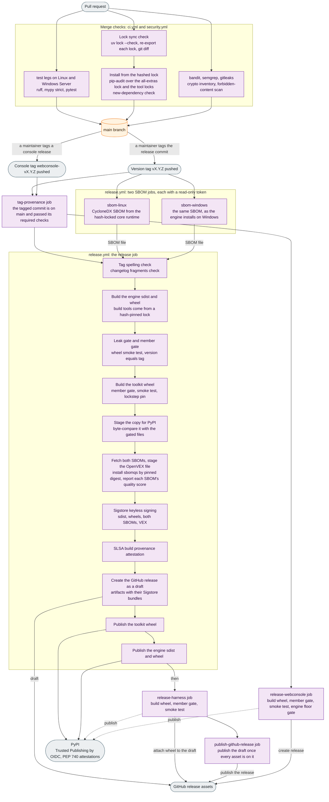

# Software Supply-Chain Transparency

MessageFoundry publishes a verifiable software supply chain so a hospital security team can answer
"what's in it, who built it, and is CVE-X actually exploitable?" from signed artifacts — not a
questionnaire. This page is the operator-facing guide to what we publish and how to verify it. The
decision record is [ADR 0149](adr/0149-multi-ecosystem-sbom-vex-and-sbom-quality-gate.md).

> MessageFoundry is **open-source integration middleware, not an FDA-regulated medical device**. This
> program is driven by procurement and customer trust, not a device-SBOM mandate.

## From a merged commit to a published package

This diagram answers one question: how does a commit become the package you install? It follows a
change through the merge checks, then through `release.yml`, which runs when a version tag is
pushed. Each square-cornered box names a job or a step in `ci.yml`, `security.yml` or `release.yml`. The sections
below say what a release publishes and how to verify it.



**Legend.** Rounded boxes are events and outside services. The cylinder is the `main` branch. Each
group's title names the workflow its boxes belong to. The job boxes outside a group are in
`release.yml` too. The merge checks group shows at least the checks that bear on the package. A
dotted arrow is a publish step that runs when its repository variable is set.

Four facts the labels leave out:

- **The locks.** `uv.lock` is the resolver's record of `pyproject.toml`. `requirements.lock` is its
  hashed export with every extra. The lock sync check fails when `uv.lock` is out of step with
  `pyproject.toml`, or when an exported lock is out of step with `uv.lock`.
- **The merge queue.** `ci.yml` and `security.yml` also trigger on the merge-queue commit. Branch
  protection reads the required checks there. The checked-in list of those checks is
  [`.github/required-contexts.txt`](../.github/required-contexts.txt).
- **One identity.** In the release job, signing, attestation and publishing all use that job's
  GitHub OIDC identity. Every PyPI publish in `release.yml` is Trusted Publishing, with no API
  token.
- **The order.** A PyPI upload cannot be replaced, so the two publish steps come last in the
  release job. A blocking step that fails before them stops the job. The SBOM quality score reports
  and does not block. The toolkit uploads before the engine
  ([ADR 0201](adr/0201-a-messagefoundry-toolkit-distribution-carries-the-authoring-and-development-tooling-out-of-the-engine-wheel.md)).
- **The draft.** The engine's GitHub release stays a draft until the harness wheel is on it
  too. A separate job publishes it last, so no job adds an asset to a published release.

## What we publish, per release

| Artifact | What it is | Where |
|---|---|---|
| `messagefoundry-*.whl` / `*.tar.gz` | The Python engine (wheel + sdist) | GitHub release + PyPI |
| `messagefoundry-sbom.cdx.json` | **CycloneDX SBOM** of the engine as it installs on **Linux** — license-complete, from the hash-locked core runtime, lifecycle = `build` | GitHub release |
| `messagefoundry-sbom-windows.cdx.json` | The same SBOM as the engine installs on **Windows** | GitHub release |
| `messagefoundry-vex.openvex.json` | **OpenVEX** — the document carrying our exploitability assessment for a CVE, once one has been made | GitHub release |
| `*.sigstore*` bundles | Sigstore signatures for the wheel, sdist, **both SBOMs, and VEX** | GitHub release |
| PEP 740 attestations | PyPI-side provenance (Trusted Publishing) | PyPI |
| SLSA build provenance | in-toto attestation binding each artifact (incl. both SBOMs + VEX) to the source commit | GitHub attestations / Sigstore bundle |

The toolkit wheel (`messagefoundry-toolkit`, ADR 0201) is built in the engine's release job. That
job also signs it and writes its SLSA provenance, and attaches the wheel and its `.sigstore.json`
bundle to the GitHub release (BACKLOG #1192). So both verification commands below work on it too. It
has no SBOM of its own.

Apart from that, every row but one covers the **engine** only. The exception is the PEP 740 row: every PyPI publish
job in `release.yml` sets `attestations: true`. So the web console wheel (`messagefoundry-webconsole`)
and the harness wheel get a PyPI-side attestation whenever their PyPI publish runs. Both of those
publishes are gated on a repository variable. That is all they get: their release jobs have no
Sigstore, SBOM or SLSA step.

Additional CycloneDX SBOMs — the **VS Code extension** (npm) and the **container image** (Debian base +
system libs + installed Python) — are produced by the daily/​on-demand `security.yml` workflow and
retained as CI artifacts (`sbom-cyclonedx`, `sbom-container-image`). The container and extension are not
released through the PyPI pipeline, so their SBOMs live with CI rather than as release assets.

### Why the engine has two SBOMs

Pick the SBOM for the platform you run. The engine's core lock installs a different set of packages on
Windows than on Linux:

| Package | Linux | Windows |
|---|---|---|
| `uvloop` | installed | not installed |
| `colorama` | not installed | installed |
| `sspilib` | not installed | installed |

That list is what the lock's `sys_platform` markers select today. Read the lock, not this table, for
the current set.

The SBOM generator lists what is actually installed, so one SBOM cannot be right for both. The engine
runs as a Windows service ([SERVICE.md](SERVICE.md)) and in a Linux container, so the release ships
both. The Windows SBOM is built on a Windows runner, because only a Windows interpreter picks packages
the way a Windows install does.

Neither SBOM is built by the job that signs. Each comes from its own job with read-only access, one on
Linux and one on Windows, so no package install runs beside the signing identity. The release job
downloads both files, then scores, signs, attests and attaches them.

Each file also records its platform inside the file. Look for the `metadata.properties` entry named
`messagefoundry:resolved-for:sys_platform`. Its value is `linux` or `win32`. This helps once the file
has been renamed or loaded into an inventory tool. The build reads the value from the Python that ran
on the same machine as the install, so it names that machine's platform. It is not a check on the
component list.

The container image SBOM above covers the Linux container as a whole. The engine's Linux SBOM covers
only the Python packages the engine needs.

## Verifying what you downloaded

### The PyPI packages (provenance)

PyPI exposes a public **Integrity API**. Fetch the PEP 740 provenance for a specific file:

```
GET https://pypi.org/integrity/messagefoundry/<version>/<filename>/provenance
GET https://pypi.org/integrity/messagefoundry-webconsole/<version>/<filename>/provenance
```

The response bundles the attestations with the publisher identity that produced them.

**Do not assume your installer checked them.** PEP 740 does not require an installer to verify
attestations, so verify each file yourself before you install it. Check both distributions the
engine runs: `messagefoundry` and the web console, `messagefoundry-webconsole`. The engine loads the
console in-process, so an unverified console is as much a risk as an unverified engine.

One tool that does this is `pypi-attestations`, maintained under the `pypi` GitHub organization. Its
`verify pypi` command downloads a file and its provenance from PyPI. It then checks the file against
the provenance and checks that the signer is the repository you name:

```bash
pypi-attestations verify pypi --repository https://github.com/MEFORORG/MessageFoundry \
  pypi:messagefoundry-<version>-py3-none-any.whl
pypi-attestations verify pypi --repository https://github.com/MEFORORG/MessageFoundry \
  pypi:messagefoundry_webconsole-<console-version>-py3-none-any.whl
```

The console has its own version, so `<console-version>` is the console wheel you installed, not the
engine version. Both commands should pass. A failure on either file means you should not install it.

### GitHub release artifacts (Sigstore + SLSA)

`gh attestation verify` checks the GitHub attestations the engine release job writes. They cover at
least the engine sdist, the engine wheel, the two SBOMs, the VEX and the toolkit wheel. For the
console, use the PyPI check above. Verify the SLSA build provenance of one of those files:

```bash
gh attestation verify messagefoundry-<version>.tar.gz --repo MEFORORG/MessageFoundry \
  --signer-workflow MEFORORG/MessageFoundry/.github/workflows/release.yml \
  --source-ref refs/tags/v<version>
```

`--source-ref` needs `gh` 2.68.0 or later. Use 2.102.0 or later: before it, `gh` matches
`--signer-workflow` against only the start of the signing identity, and compares `--source-ref`
ignoring case, so the two flags pin less than they say.

Keep the last two flags. With `--repo` alone, the command accepts an attestation from any workflow
in the repository, on any ref, and at least one attestation exists that no release wrote.

Write `<version>` in the TAG's spelling, in this command and in the Sigstore one below. A
pre-release tag is `v0.5.0-rc1`, while its wheel's filename says `0.5.0rc1`. The wheel's spelling
names a ref no release was built from, so the check fails on a genuine file.

Or verify a Sigstore bundle directly (both SBOMs and the VEX are signed too; for the Windows SBOM,
name `messagefoundry-sbom-windows.cdx.json` instead):

```bash
python -m sigstore verify identity \
  --cert-identity 'https://github.com/MEFORORG/MessageFoundry/.github/workflows/release.yml@refs/tags/v<version>' \
  --cert-oidc-issuer https://token.actions.githubusercontent.com \
  messagefoundry-sbom.cdx.json
```

A single `cosign` (v2.4.0+) also verifies the bundle format used across npm provenance, GitHub Artifact
Attestations, and our releases, if you standardize on one tool across ecosystems.

## Using the SBOM + VEX

The SBOM (CycloneDX 1.6) is a machine-readable inventory carrying at least a name, version, PackageURL and
**license** for every component. It does **not** carry per-component file hashes — the generator we run does
not emit them (see [How the SBOMs are generated](#how-the-sboms-are-generated-for-auditors)) — so use it as an
inventory, not as an integrity check on the components it lists. The one exception is a vendored package
(see [The one vendored Python source](#the-one-vendored-python-source-which-does-ship)): its component's
`pedigree` records the SHA-256 of upstream's sdist and of each upstream file. Those digests describe
upstream's bytes, not the vendored copy, which adds a header to each module, so they sit in the
pedigree and not on the component. "Hash-locked" elsewhere on this page refers
to the lock file the inventory is built from, not to a field inside the SBOM. Feed it to your own tooling:

```bash
# Scan the SBOM for known CVEs. --vex applies whatever assessments our VEX carries; --show-suppressed
# lists what was suppressed, so a run with nothing to apply is visibly a no-op:
trivy sbom messagefoundry-sbom.cdx.json --vex messagefoundry-vex.openvex.json --show-suppressed

# Or score the SBOM's completeness (0-10, NTIA minimum elements):
sbomqs score -b messagefoundry-sbom.cdx.json
```

**Do not demand a zero-CVE "clean scan."** Per CISA's *Minimum Requirements for VEX* and NTIA's
*Software Consumers Playbook*, the correct posture is to accept a valid VEX assessment. Our VEX is the
`messagefoundry-vex.openvex.json` release asset above. Where we have assessed a CVE, its statement records
whether the vulnerable code is reachable in MessageFoundry and carries an OpenVEX `justification`. Where we
have not, the document says nothing about that CVE and your scanner's finding stands unsuppressed — see
[`security/vex/README.md`](../security/vex/README.md) for the assessment process and when a statement is added.

## How the SBOMs are generated (for auditors)

- **Python engine** — `cyclonedx-py environment` over an install of the hash-locked
  `docker/locks/requirements-core.lock` (environment mode populates licenses from installed metadata),
  then `scripts/security/sbom_finalize.py` declares the lifecycle, backfills the dynamic version,
  records the platform, and adds a component for each package vendored under `messagefoundry/_vendor/`,
  which environment mode cannot see. This runs twice, once on a Linux runner and once on a Windows
  runner, each in its own read-only job (`sbom-linux` and `sbom-windows` in `release.yml`). Both runs
  build their scratch environment without pip, so pip is not listed: pip installs the engine but is
  not part of it. The broader all-extras dependency set is continuously audited by
  **pip-audit**.
- **VS Code extension** — `@cyclonedx/cyclonedx-npm --package-lock-only` over the committed
  `ide/package-lock.json` (install-free, full tree). The extension bundles its payload with esbuild and
  has no runtime npm dependencies, so the SBOM inventories the build toolchain. Continuously audited by
  **npm-audit**.
- **Container image** — `trivy image --format cyclonedx` over the built image (OS + Python layers).
  Continuously vuln-scanned by **Trivy** (with our VEX applied).

Every generated SBOM declares `metadata.lifecycles = [{phase: build}]` (CISA "Build" SBOM Type). Both
engine SBOMs and the npm extension SBOM are quality-scored by **sbomqs** on each scheduled or manual `security.yml` run,
and a release scores both engine SBOMs. `security.yml` scores the Windows engine SBOM on its Windows
runner with the Windows build of sbomqs; a release scores it with the Linux build. The container-image
SBOM is retained unscored (artifact `sbom-container-image`). Run `sbomqs score -b` against it on demand. Our format choice
is **CycloneDX** (native VEX support); an SPDX rendering can be produced on request.

## The one vendored third-party binary, and what its record does not claim

`.github/actions/cla-assistant-lite/` carries 1.18 MB of compiled JavaScript — the archived
`contributor-assistant/github-action`, vendored on 2026-08-29 because GitHub archived the upstream
repository and no maintained fork exists. It is **not a released artifact**: `.github/` is outside
the sdist's `only-include`, so no wheel, sdist or engine deployment carries it. It runs in CI, on
`pull_request_target` and on an `issue_comment` whose body is exactly `recheck` or the sign-off
sentence. `cla.yml` is also triggered by `merge_group`, where the step's `if:` skips the bundle
rather than running it.

Every audit lane above is ecosystem-scoped — `pip-audit` reads Python locks, `npm-audit` reads
`ide/package-lock.json` — so none of them could see a bundle sitting in `.github/`. Its provenance
is recorded instead, in the same format the release SBOMs use (BACKLOG #1578):

| File | What it is |
|---|---|
| [`provenance.cdx.json`](../.github/actions/cla-assistant-lite/provenance.cdx.json) | CycloneDX 1.6: the pinned upstream commit, the bundle's SHA-256 as vendored, the vendoring date and reason, and an inventory of the 403 distinct packages the upstream lockfile declares |
| [`upstream-package-lock.json`](../.github/actions/cla-assistant-lite/upstream-package-lock.json) | that lockfile, verbatim from the pinned commit |

`scripts/security/build_cla_action_provenance.py --check` verifies the record describes the tree,
and `tests/test_cla_action_provenance.py` is the gate. It sits in the repo-harness tier
(`tests/tooling_manifest.txt`), which runs on a pull request touching at least `.github/`,
`scripts/` or `docs/` — the live list is the path filter in `ci.yml`, not this sentence. Those cover
every input the gate reads, and nothing under `messagefoundry/` is one. So the bundle cannot move
without the record moving with it.

That gate detects **change**, not vulnerabilities. Advisories are a separate job. `security.yml`'s
`cla-action-audit` job audits the lockfile on the daily cron with `npm audit`, and a red scheduled
run opens an issue through `nightly-notice.yml`. The tree does not audit clean and cannot be fixed
here, so the job compares against a baseline of advisories already known,
[`scripts/security/cla-action-advisories.toml`](../scripts/security/cla-action-advisories.toml),
and fails on a new one. It also fails when a known one stops being reported. Either the advisory
was withdrawn, or the audit stopped seeing the package, and a person has to find out which. That
check is what shows, on each run, that the audit still sees the known-vulnerable packages. *This paragraph used to say nothing in CI scans this closure;
that was true until BACKLOG #1578's audit job landed.* The baseline's first entries were recorded as
found, not triaged for reachability. The exposure is bounded by where the bundle runs — CI only,
never in a wheel, sdist or deployment — and `.github/dependabot.yml` records why no automated
remediation lane exists for it.

Two things are worth stating precisely, because a supply-chain record that implies more than it
proves is worse than none:

1. **What is proven.** The vendored bundle is the upstream blob at the pinned commit with a
   176-byte two-line header prepended, and nothing else changed. An auditor strips the first two
   lines, takes the SHA-256, and compares it with the upstream digest in the record — no network,
   no Node. The lockfile is derived the same way: `git hash-object` on it reproduces the blob id
   the record names, so neither vendored artifact rests on a number somebody merely wrote down.
2. **What is not.** A clean audit of the lockfile proves the *declared* dependencies of that
   upstream commit are clean. It does **not** prove the bundle was built from them. Reproducing an
   ncc/webpack build needs a Node toolchain this repository does not carry, so nobody can check
   that here.

Like the SBOMs above, this record is an inventory rather than an integrity check on the components
it lists: it carries no per-component hashes. npm's `integrity` values digest the registry tarball,
not anything in this repository, and they stay available verbatim in the lockfile beside the record
where their scope is unambiguous. The bundle's *own* SHA-256 is a different thing and is recorded.

The lockfile is deliberately named `upstream-package-lock.json`. Under the stock name GitHub's
dependency graph would ingest it as this repository's own manifest and raise alerts against a
2021-era tree nobody here can move — remediating one means rebuilding the bundle, which needs the
absent toolchain. The record is audit-only by construction, and `.github/dependabot.yml` carries no
npm entry for this directory for the same reason.

## The one vendored Python source, which does ship

Unlike the bundle above, this one is inside the engine package, so every wheel and sdist carries it.
`messagefoundry/_vendor/defusedxml/` holds two modules of defusedxml 0.7.1, the library that refuses
DTDs and entities when the engine parses untrusted XML. The engine stopped installing defusedxml and
uses this copy instead. [Its README](../messagefoundry/_vendor/defusedxml/README.md) records why, the
upstream sdist URL and SHA-256, and each file's upstream SHA-256.

The same two statements apply, scoped to this copy:

1. **What is checked.** `tests/test_vendored_defusedxml.py` strips each module's two-line header
   and compares the rest with the SHA-256 in the README's table, on every engine test run, and the
   licence text the same way. That table sits beside the files, so an edit that updates both would
   pass it. Where upstream defusedxml is installed, which the CI test legs do through the `x12`
   extra, the same test also compares each module with the installed upstream file byte for byte,
   and it fails when the lock moves upstream off the vendored version.
2. **What is listed, and what is not.** The SBOM generator reads installed distributions, so it
   cannot see this copy. `sbom_finalize.py --vendored-from messagefoundry/_vendor` adds it to both
   engine SBOMs from the README's record, as `pkg:pypi/defusedxml@0.7.1`, so a scanner reading an
   SBOM can match an advisory against it. `tests/test_vendored_defusedxml.py` fails when anything
   under `_vendor/` is missing from the finalized SBOM. Nothing in this repository scans the SBOM
   for advisories, and pip-audit reads only the locks, so an advisory against this copy still needs
   someone here to check it by hand. The `x12` extra still installs upstream defusedxml for `pyx12`,
   so the all-extras lock and its audit do carry the upstream package, but that says nothing about
   the copy the engine runs.

## Related

- [`SECURITY.md`](SECURITY.md) — authn/RBAC, PHI handling, reporting.
- [`security/vex/README.md`](../security/vex/README.md) — how VEX statements are maintained.
- [ADR 0149](adr/0149-multi-ecosystem-sbom-vex-and-sbom-quality-gate.md) — the decision + acceptance criteria.
