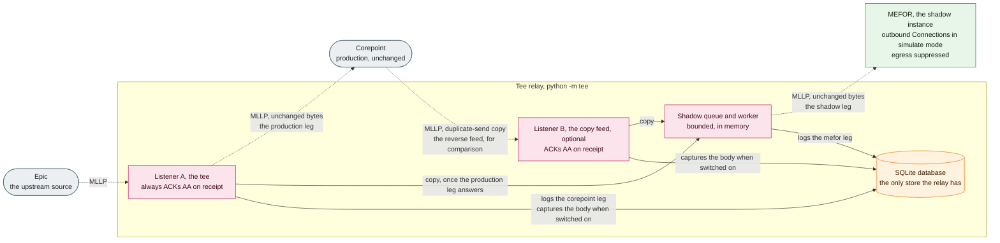

# Tee relay — parallel-run validation for a Corepoint → MessageFoundry cutover

> **For test data only.** The tee relay is a **validation** tool for de-risking a migration. It prints a
> warning at every start and is **not** hardened to carry production PHI. Point it only at **test /
> synthetic** feeds and endpoints. (Backlog #14.)

The tee relay (`python -m tee`) is a small, **standalone** application — no `messagefoundry` imports, just
a vendored MLLP codec and SQLite. It lets you run MessageFoundry **alongside** a live Corepoint instance on
real-shaped traffic and validate that MEFOR produces equivalent output **before** any feed is actually
cut over — with rollback being "just stop the relay."

> **Adopters:** "Epic" and "Corepoint" below are the common case (an Epic EHR feeding the Corepoint engine
> you're replacing). They generalize: the **`--listen-epic`** leg is whatever upstream source sends to your
> legacy engine, the **`--corepoint`** leg is whatever engine you're migrating *off*, and **`--mefor`** is
> the shadow MessageFoundry instance.

## What it does

### The relay forwards to production and copies to the shadow

This diagram shows where each copy of a message goes during a parallel run. The source sends MLLP to
the tee relay, which always ACKs on receipt and forwards the unchanged bytes to Corepoint, the
production path. Once Corepoint answers, the relay queues a copy for MEFOR, the shadow instance,
whose own outbound Connections are set to `simulate` mode so that its egress is suppressed. An
optional second listener takes the copies Corepoint sends of its own output, the reverse feed, for
comparison.

**Legend.** A dotted arrow is an MLLP hop between processes. A solid arrow stays inside the relay
process and its SQLite file: a queued copy, a log row, or a captured body. The tee relay is one
process and imports no engine code. Grey is a system outside MessageFoundry, pink is the tee relay,
green is the shadow MessageFoundry instance, and orange is a store.



* **Listener A — the tee (`--listen-epic`).** Repoint Epic's outbound at the relay. For every message it
  **always ACKs `AA` on receipt** (it is the ACK authority to Epic), then forwards the **unchanged** bytes
  to **both** Corepoint (the live production path) and MEFOR (shadow).
* **Listener B — the copy feed (`--listen-corepoint-copy`, optional).** MEFOR can't be inserted into the
  `Corepoint → Epic` path without changing it, so add a **duplicate outbound send in Corepoint's
  configuration** that mirrors those outbound messages to this listener; the relay ACKs and forwards them
  to MEFOR.

The point is **parity**: MEFOR sees the same inputs (and Corepoint's outputs) so you can compare MEFOR's
transformed/routed output against Corepoint's — without MEFOR delivering to real downstreams.

## Behaviour you must understand

* **Always-ACK trade-off.** Because the relay always `AA`s on receipt, a Corepoint *application-level* NAK
  (`AE`/`AR`) **does not propagate back to Epic** — Epic sees the relay, not Corepoint. That's why the
  relay **logs every NAK** (see below). Corepoint still NAKs internally; transport failures are surfaced
  via the fail-closed shutdown.
* **Fail-closed.** On a Corepoint **transport** failure (unreachable, after `--corepoint-attempts` quick
  retries), the relay **stops accepting on Listener A and drops live Epic connections** so Epic sees the
  outage and queues/retries on its side. It does **not** exit (so it can't crash-loop against a down
  Corepoint) — **restart it once Corepoint is healthy.** A message in flight at the instant of the failure
  may be `AA`'d-but-undelivered; the shutdown bounds further loss and Epic's resend/queue covers the rest.
  (This is a simple fail-closed relay, **not** durable store-and-forward — by design.)
* **Shadow leg is decoupled.** The MEFOR copy goes through a bounded in-memory queue drained by its own
  worker, so a slow/down MEFOR **never** back-pressures or trips the production (Corepoint) path. If the
  queue fills, the oldest copy is dropped with a log.

## Pairing with MEFOR's `simulate` mode

The shadow MEFOR must process the traffic **without delivering to live partners** (Corepoint is still
doing the real sending). Run its outbound connections in **`simulate`** mode (engine backlog #15) so MEFOR
exercises the full route/transform pipeline and captures what it *would* have sent, with egress suppressed.

## Usage

```bash
# Repoint Epic at :6661; fan out to Corepoint and a shadow MEFOR; log to ./tee.db
python -m tee run \
    --listen-epic :6661 \
    --corepoint corehost:5000 \
    --mefor meforhost:2575 \
    --db ./tee.db

# Also receive the Corepoint -> Epic copy feed
python -m tee run --listen-epic :6661 --corepoint corehost:5000 --mefor meforhost:2575 \
    --listen-corepoint-copy :6662 --db ./tee.db

# Read back the most recent NAKs / transport errors
python -m tee naks --db ./tee.db
```

Useful flags: `--corepoint-attempts` / `--corepoint-retry-delay` (quick retries before tripping
fail-closed), `--connect-timeout` / `--send-timeout`, `--max-frame-bytes` (frame-size DoS cap),
`--mefor-queue-max` (shadow buffer bound), `--capture-bodies` (persist full bodies — **test data only**),
`-y/--yes` (skip the test-data-only confirmation for an unattended/service start), `--log-level`.

## The SQLite log

The relay's only store is SQLite. It records **one row per forwarding leg** (`corepoint` / `mefor`) with
the outcome, the ACK code, the control id (MSH-10), the message type (MSH-9), the size, and a bounded,
control-char-scrubbed `detail` (the MSA-3 reason or an error string). **Message bodies are never logged**;
they are persisted only to a separate `relay_capture` table, and only when `--capture-bodies` is set.

`python -m tee naks` prints the recent NAKs (`AE`/`AR`/`CE`/`CR`) and transport errors — the otherwise-
invisible record of anything a downstream rejected for a message Epic was told `AA`.

### Export for review (incl. AI analysis)

`python -m tee export` writes the log as **JSON** — a `summary` (counts by leg / outcome / ACK code,
NAK count, distinct messages, time range) plus the matching `rows`. It is **metadata only — never the
captured message bodies** (so it's safe to hand to a reviewer or an AI session). Default is stdout; use
`--out FILE` to write a file. Narrow it with `--since` / `--before` (an age like `24h`/`7d` or a UTC date
`YYYY-MM-DD`), `--naks-only`, and `--limit N`.

```bash
python -m tee export --db ./tee.db --naks-only --since 24h --out ./tee-review.json
```

### Purge

`python -m tee purge` clears the log DB and reclaims disk (`VACUUM`). With no `--before` it purges
**everything**; `--before <age|date>` deletes only older rows (retention); `--captures-only` drops just
the captured bodies (the PHI-bearing table) and keeps the NAK/leg log. It **prompts for confirmation**
(or refuses, in a non-interactive shell) unless you pass `-y`.

```bash
python -m tee purge --db ./tee.db --before 7d -y          # retention sweep
python -m tee purge --db ./tee.db --captures-only -y      # drop only the captured bodies
```

## Limits (by design, for the test-only scope)

* **Test data only** — not hardened for production PHI (no at-rest encryption; the DB is `chmod 0600`
  best-effort only). Enable `--capture-bodies` only on a protected volume with test data.
* **Not store-and-forward** — no durable retry queue; recovery of post-trip traffic is delegated to Epic's
  resend/queue (see *Fail-closed* above).
* **One connection per forward** — the relay dials a fresh MLLP connection per forwarded message (simple
  and robust; not tuned for peak throughput).
* **No concurrent-connection cap** on the listeners (the engine caps at 256); fine behind a trusted,
  test-environment network, which is the only place this should run.
