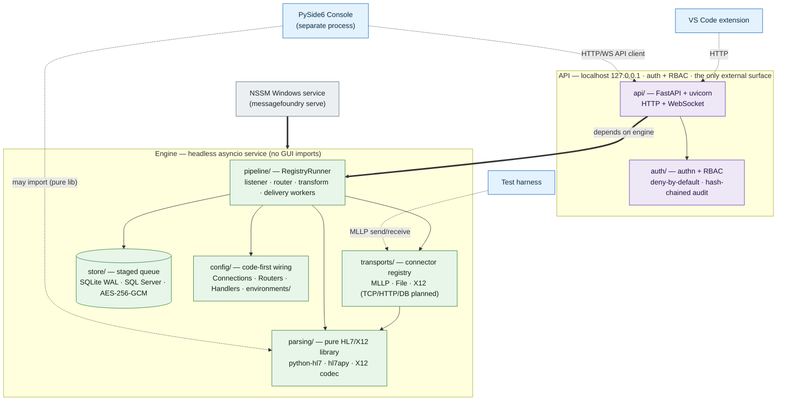
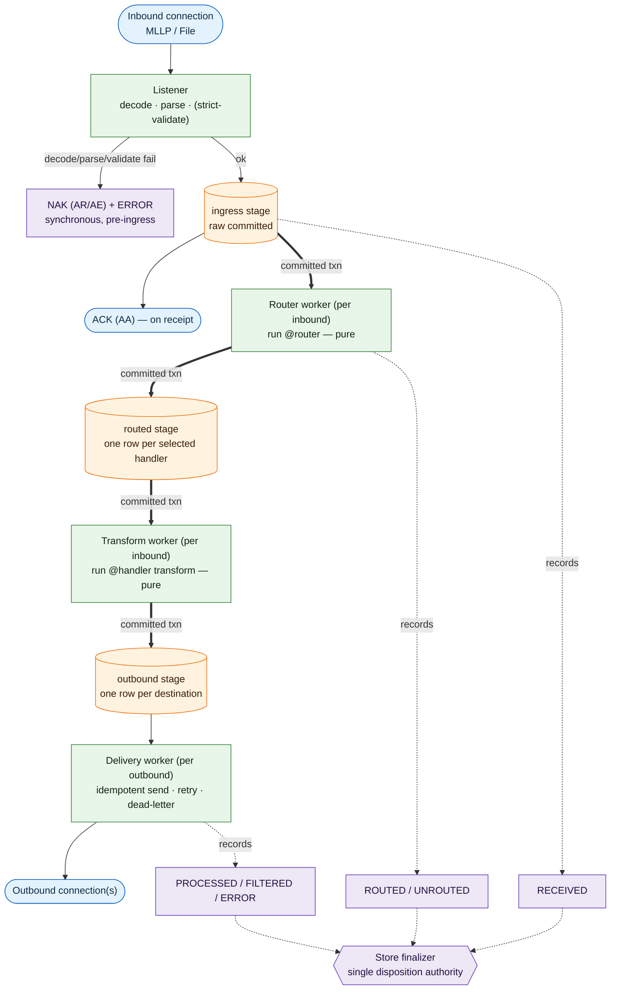
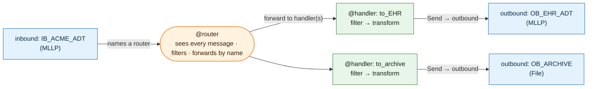

# MessageFoundry — Architecture Diagrams

Rendered architecture views for MessageFoundry (`MEFOR`). These are [Mermaid](https://mermaid.js.org)
diagrams — they render as graphics directly in the VS Code Markdown preview (`Ctrl+Shift+V`) and on
GitHub. The prose source of truth is [ARCHITECTURE.md](ARCHITECTURE.md); this file is the picture.

Three views, each answering a different question:

1. **System topology** — what the components are, the process boundaries, and which way dependencies point.
2. **Runtime message flow** — how a received message moves through the staged queue and earns a disposition.
3. **Config wiring graph** — how Connections, Routers, and Handlers wire together by name (no "channel" object).

**Legend.** Solid/thick arrows = *depends on / calls*. Dotted arrows = *talks to over the API or wire*
(separate process). Cylinders = persisted stage/store. Hexagon = the single disposition authority.

---

## 1. System topology — components & boundaries

The engine is a headless **asyncio** service; clients are **separate processes** that reach it
**only** through the localhost HTTP/WebSocket API. The dependency rule is one-way: `pipeline` /
`transports` / `parsing` / `store` / `config` never import `api` or `console` — the API depends on
the engine, and the console depends on the API.

---

## 2. Runtime message flow — the staged queue (ADR 0001, Step B)

The message store **is** the queue: a transactional staged queue on SQLite (WAL) with a `stage`
discriminator. The inbound is **ACKed on receipt** — once the raw message is durably committed to the
`ingress` stage, *before* routing/transform/delivery. Each handoff is a **single committed
transaction** (claim → produce next-stage rows → complete this stage), giving at-least-once delivery,
retries, and replay without a separate broker. Because a re-run must re-derive identical output,
**Routers and Transforms are pure**; **outbound connections are idempotent**.

**Disposition** flows with the message and is finalized by the store's single authority (count-and-log):
`RECEIVED` at ingress → `ROUTED`/`UNROUTED` after the Router → `PROCESSED` (all delivered) /
`FILTERED` (every handler ran, delivered nothing) / `ERROR` (dead-lettered at any stage) once nothing
is still in flight. Decode/parse/strict-validate failures **NAK synchronously** before any ingress row;
post-ACK failures are logged + dead-lettered (operators rely on disposition + AlertSink, never the ACK).

---

## 3. Config wiring graph — Connections, Routers, Handlers

The configuration is a **graph wired by name, authored as Python** — there is no enclosing "channel"
object. An inbound Connection names a Router; the Router forwards to Handler(s) by name; each Handler
sends to outbound Connection(s). A Connection's *transport config* may instead live in
`connections.toml` (GUI-editable, ADR 0007), but routing/handling **logic** stays code-first.

Connections/Routers/Handlers are authored against the `messagefoundry` surface
(`inbound` / `outbound` / `@router` / `@handler` / `Send` / `MLLP` / `File` / `Message`), registered
into a `Registry` by the loader ([config/wiring.py](../messagefoundry/config/wiring.py)) and run by the
`RegistryRunner` ([pipeline/wiring_runner.py](../messagefoundry/pipeline/wiring_runner.py)).

---

*Edit these diagrams as text; they re-render on save. To export a standalone `.svg`/`.png`, run the
blocks through `mermaid-cli` (`mmdc`) — not currently a project dependency.*
