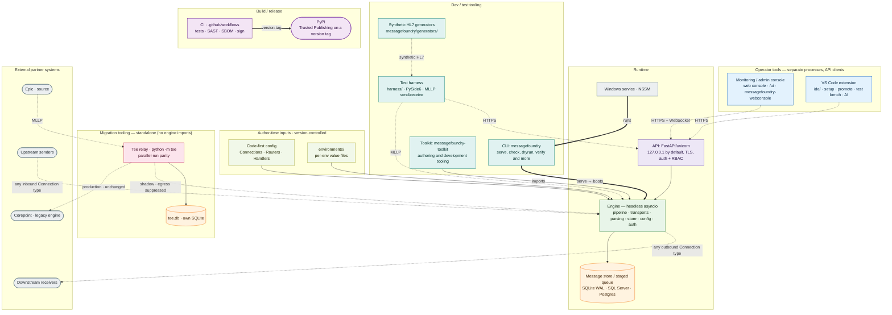
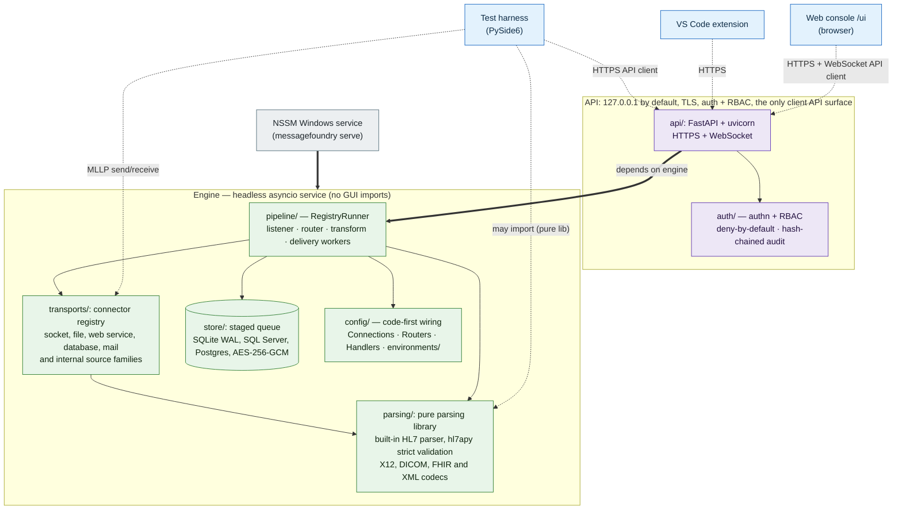
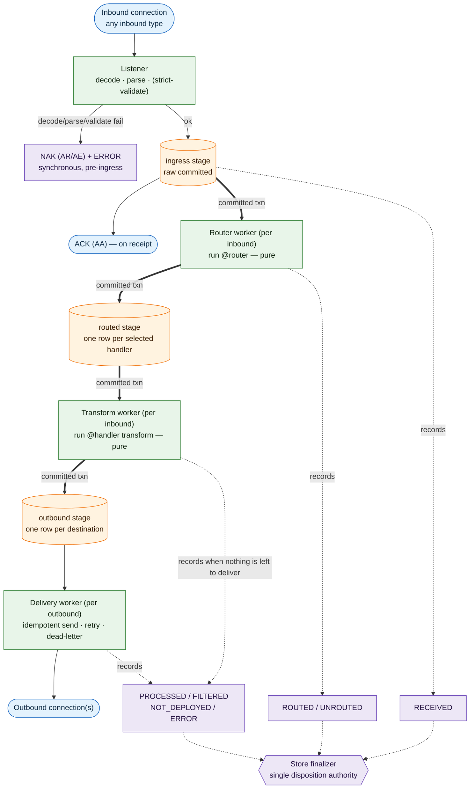
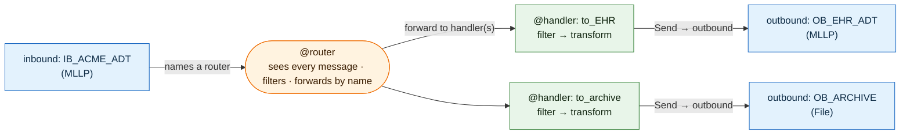

# MessageFoundry — Architecture Diagrams

Rendered architecture views for MessageFoundry (`MEFOR`). These are [Mermaid](https://mermaid.js.org)
diagrams — they render as graphics directly in the VS Code Markdown preview (`Ctrl+Shift+V`) and on
GitHub. The prose source of truth is [ARCHITECTURE.md](ARCHITECTURE.md); this file is the picture.

The views in this file each answer a different question. More diagrams live in other docs, and
[Every architecture diagram](#every-architecture-diagram) lists them all.

1. **Top-level components**: the main shipped components (engine, web console, IDE extension, Windows service, CLI, toolkit, test harness, tee relay) and how they relate.
2. **System topology** — the engine's internal packages, process boundaries, and the one-way dependency rule.
3. **Runtime message flow** — how a received message moves through the staged queue and earns a disposition.
4. **Config wiring graph** — how Connections, Routers, and Handlers wire together by name (no "channel" object).

**Legend.** Solid/thick arrows = *depends on / calls*. Dotted arrows = *talks to over the API or wire*
(separate process). Cylinders = persisted stage/store. Hexagon = the single disposition authority.

---

## Every architecture diagram

Each diagram has one home doc. To show a diagram in a second doc, link to its home. Do not copy
the block, because a copy drifts from its source.

| Diagram | Home doc |
|---|---|
| Top-level components | [architecture-diagram.md](architecture-diagram.md) (this file, section 1) |
| System topology | [architecture-diagram.md](architecture-diagram.md) (this file, section 2) |
| Runtime message flow | [architecture-diagram.md](architecture-diagram.md) (this file, section 3) |
| Config wiring graph | [architecture-diagram.md](architecture-diagram.md) (this file, section 4) |
| Trust boundaries and PHI data flow | [SECURITY.md](SECURITY.md) |
| Sign-in and permission check flow | [SECURITY.md](SECURITY.md) |
| Deployment topologies | [DEPLOYMENT.md](DEPLOYMENT.md) |
| High availability | [CLUSTERING.md](CLUSTERING.md) (availability group detail in [AOAG-DEPLOYMENT.md](AOAG-DEPLOYMENT.md)) |
| Engine shards | [MENTAL-MODEL.md](MENTAL-MODEL.md) |
| Cloud and edge relay topology | [CLOUD-DEPLOYMENT.md](CLOUD-DEPLOYMENT.md) |
| Tee relay parallel run | [TEE-RELAY.md](TEE-RELAY.md) |
| Build and release chain | [SUPPLY-CHAIN.md](SUPPLY-CHAIN.md) |
| Promotion flow, dev to staging to prod | [ADOPTER-CI.md](ADOPTER-CI.md) |
| Package map | [INSTALL-GUIDE.md](INSTALL-GUIDE.md) |

---

## 1. Top-level components — the whole system

MessageFoundry ships as a set of **independent, separately-buildable components**, not just the
engine. This is the system at a glance — operator tools, dev/test tooling, the standalone tee relay,
and the build/release path — and how each relates to the engine. Colour groups the *kind* of
component (operator tool · runtime · author-time input · dev/test · standalone · external · build).

```mermaid
flowchart TB
  classDef core fill:#e8f5e9,stroke:#2e7d32,color:#10240f;
  classDef api fill:#ede7f6,stroke:#5e35b1,color:#22103f;
  classDef store fill:#fff3e0,stroke:#ef6c00,color:#3a1d00;
  classDef opstool fill:#e3f2fd,stroke:#1565c0,color:#0d2b45;
  classDef devtool fill:#e0f2f1,stroke:#00796b,color:#06302b;
  classDef cfg fill:#f1f8e9,stroke:#9e9d24,color:#1f2400;
  classDef ext fill:#eceff1,stroke:#546e7a,color:#1c2429;
  classDef standalone fill:#fce4ec,stroke:#c2185b,color:#3d0a1f;
  classDef build fill:#f3e5f5,stroke:#6a1b9a,color:#2a0a3d;

  subgraph OPS["Operator tools — separate processes, API clients"]
    CONSOLE["Monitoring / admin console<br/>web console · /ui · messagefoundry-webconsole"]:::opstool
    IDEEXT["VS Code extension<br/>ide/ · setup · promote · test bench · AI"]:::opstool
  end

  subgraph RUNTIME["Runtime"]
    SERVICE["Windows service · NSSM"]:::ext
    API["API: FastAPI/uvicorn<br/>127.0.0.1 by default, TLS, auth + RBAC"]:::api
    ENGINE["Engine — headless asyncio<br/>pipeline · transports · parsing · store · config · auth"]:::core
    STORE[("Message store / staged queue<br/>SQLite WAL · SQL Server · Postgres")]:::store
  end

  subgraph AUTHOR["Author-time inputs · version-controlled"]
    CFG["Code-first config<br/>Connections · Routers · Handlers"]:::cfg
    ENVS["environments/<br/>per-env value files"]:::cfg
  end

  subgraph DEV["Dev / test tooling"]
    CLI["CLI: messagefoundry<br/>serve, check, dryrun, verify and more"]:::devtool
    TOOLKIT["Toolkit: messagefoundry-toolkit<br/>authoring and development tooling"]:::devtool
    GEN["Synthetic HL7 generators<br/>messagefoundry/generators/"]:::devtool
    HARNESS["Test harness<br/>harness/ · PySide6 · MLLP send/receive"]:::devtool
  end

  subgraph MIGRATE["Migration tooling — standalone (no engine imports)"]
    TEE["Tee relay · python -m tee<br/>parallel-run parity"]:::standalone
    TEEDB[("tee.db · own SQLite")]:::store
  end

  subgraph PARTNERS["External partner systems"]
    UP(["Upstream senders"]):::ext
    DOWN(["Downstream receivers"]):::ext
    EPIC(["Epic · source"]):::ext
    CORE(["Corepoint · legacy engine"]):::ext
  end

  subgraph BUILD["Build / release"]
    CI["CI · .github/workflows<br/>tests · SAST · SBOM · sign"]:::build
    PYPI(["PyPI<br/>Trusted Publishing on a version tag"]):::build
  end

  %% operator tools reach the engine only through the API
  CONSOLE -.->|"HTTPS + WebSocket"| API
  IDEEXT -.->|"HTTPS"| API
  API --> ENGINE
  ENGINE --> STORE

  %% how the engine is launched
  SERVICE ==>|"runs"| CLI
  CLI ==>|"serve → boots"| ENGINE

  %% author-time inputs are loaded by the engine
  CFG --> ENGINE
  ENVS --> ENGINE

  %% dev / test feeds
  GEN -.->|"synthetic HL7"| HARNESS
  HARNESS -.->|"MLLP"| ENGINE
  HARNESS -.->|"HTTPS"| API
  TOOLKIT -->|"imports"| ENGINE

  %% live message traffic
  UP -.->|"any inbound Connection type"| ENGINE
  ENGINE -.->|"any outbound Connection type"| DOWN

  %% migration parity (tee is standalone)
  EPIC -.->|"MLLP"| TEE
  TEE -.->|"production · unchanged"| CORE
  TEE -.->|"shadow · egress suppressed"| ENGINE
  TEE --> TEEDB

  %% release
  CI ==>|"version tag"| PYPI
```

The engine ([`messagefoundry`](../messagefoundry/)) is the core; everything else is a separate
component around it. **Operator tools** — the [web console](../packaging/messagefoundry-webconsole/)
(served at `/ui`) and the [VS Code extension](../ide/) — reach it **only** through the API. The **Windows service** (NSSM) runs
it in production; the **CLI**, **synthetic generators**, and **test harness** ([`harness/`](../harness/))
exercise it in dev/test. The **tee relay** ([`tee/`](../tee/)) is fully standalone — it imports no
engine code and keeps its own SQLite — used to run MEFOR in parallel with a legacy engine during a
migration ([TEE-RELAY.md](TEE-RELAY.md)).

The **toolkit** ([`messagefoundry_toolkit/`](../messagefoundry_toolkit/)) is a separate distribution
for authoring and development tooling. ADR 0201 moves those commands out of the engine command in
slices, so run either command with `--help` to see where a command lives. The toolkit imports the
engine. The engine never imports the toolkit. The harness reaches the engine two ways: over MLLP as a
sender and receiver, and over the API as a client.

Partner systems connect through any Connection type the connector registry holds, not only MLLP and
files. [CONNECTIONS.md](CONNECTIONS.md) lists every type. The release workflow in **CI** builds the
engine and the distributions under [`packaging/`](../packaging/), and publishes to PyPI by Trusted
Publishing on a version tag. [SUPPLY-CHAIN.md](SUPPLY-CHAIN.md) describes that chain, with its tags
and gates.

Three shipped pieces are not drawn: the Windows tray service-manager
([`messagefoundry/tray/`](../messagefoundry/tray/)), the `mefor-net-helper` network helper
([`net-helper/`](../net-helper/)) and the container image ([`docker/`](../docker/)).

---

## 2. System topology — components & boundaries

The engine is a headless **asyncio** service; clients are **separate processes** that reach it
**only** through the localhost HTTPS/WebSocket API. The dependency rule is one-way: `pipeline` /
`transports` / `parsing` / `store` / `config` never import `api` — the API depends on
the engine, and the clients (web console, harness) depend on the API.

```mermaid
flowchart TB
  classDef client fill:#e3f2fd,stroke:#1565c0,color:#0d2b45;
  classDef api fill:#ede7f6,stroke:#5e35b1,color:#22103f;
  classDef engine fill:#e8f5e9,stroke:#2e7d32,color:#10240f;
  classDef deploy fill:#eceff1,stroke:#546e7a,color:#1c2429;

  CON["Web console /ui<br/>(browser)"]:::client
  IDE["VS Code extension"]:::client
  HARNESS["Test harness<br/>(PySide6)"]:::client

  subgraph API_BND["API: 127.0.0.1 by default, TLS, auth + RBAC, the only client API surface"]
    API["api/: FastAPI + uvicorn<br/>HTTPS + WebSocket"]:::api
    AUTH["auth/ — authn + RBAC<br/>deny-by-default · hash-chained audit"]:::api
  end

  subgraph ENGINE["Engine — headless asyncio service (no GUI imports)"]
    PIPE["pipeline/ — RegistryRunner<br/>listener · router · transform · delivery workers"]:::engine
    TRANS["transports/: connector registry<br/>socket, file, web service, database, mail<br/>and internal source families"]:::engine
    PARSE["parsing/: pure parsing library<br/>built-in HL7 parser, hl7apy strict validation<br/>X12, DICOM, FHIR and XML codecs"]:::engine
    STORE[("store/: staged queue<br/>SQLite WAL, SQL Server, Postgres, AES-256-GCM")]:::engine
    CFG["config/ — code-first wiring<br/>Connections · Routers · Handlers · environments/"]:::engine
  end

  NSSM["NSSM Windows service<br/>(messagefoundry serve)"]:::deploy

  CON -.->|"HTTPS + WebSocket API client"| API
  IDE -.->|"HTTPS"| API
  HARNESS -.->|"HTTPS API client"| API
  HARNESS -.->|"MLLP send/receive"| TRANS
  HARNESS -.->|"may import (pure lib)"| PARSE

  API --> AUTH
  API ==>|"depends on engine"| PIPE

  PIPE --> TRANS
  PIPE --> PARSE
  PIPE --> STORE
  PIPE --> CFG
  TRANS --> PARSE

  NSSM ==> ENGINE
```

The `transports/` label names connector families, not single connector types.
[CONNECTIONS.md](CONNECTIONS.md) lists every connector, and is the one list to keep current.

The API binds `127.0.0.1` by default. The engine serves it over TLS, unless a declared reverse
proxy terminates TLS in front of the engine. Clients speak HTTPS in both cases.
[ADR 0172](adr/0172-the-engine-always-serves-tls-minting-a-self-signed-certificate-on-first-run.md)
holds the detail. The harness is a client in two ways: it calls the API through the shared
`apiclient` library, and it sends and receives MLLP as a test partner.

---

## 3. Runtime message flow — the staged queue (ADR 0001, Step B)

The message store **is** the queue: a transactional staged queue with a `stage` discriminator. The
default store is SQLite (WAL), and SQL Server and Postgres are the server backends. The inbound is
**ACKed on receipt** — once the raw message is durably committed to the `ingress` stage,
*before* routing/transform/delivery. Each handoff is a **single committed
transaction** (claim → produce next-stage rows → complete this stage), giving at-least-once delivery,
retries, and replay without a separate broker. Because a re-run must re-derive identical output,
**Routers and Transforms are pure**; **outbound connections are idempotent**.

```mermaid
flowchart TB
  classDef stage fill:#fff3e0,stroke:#ef6c00,color:#3a1d00;
  classDef worker fill:#e8f5e9,stroke:#2e7d32,color:#10240f;
  classDef disp fill:#ede7f6,stroke:#5e35b1,color:#22103f;
  classDef io fill:#e3f2fd,stroke:#1565c0,color:#0d2b45;

  SRC(["Inbound connection<br/>any inbound type"]):::io
  LISTEN["Listener<br/>decode · parse · (strict-validate)"]:::worker
  NAK["NAK (AR/AE) + ERROR<br/>synchronous, pre-ingress"]:::disp

  ING[("ingress stage<br/>raw committed")]:::stage
  ACK(["ACK (AA) — on receipt"]):::io
  RW["Router worker (per inbound)<br/>run @router — pure"]:::worker
  ROUTED[("routed stage<br/>one row per selected handler")]:::stage
  TW["Transform worker (per inbound)<br/>run @handler transform — pure"]:::worker
  OUT[("outbound stage<br/>one row per destination")]:::stage
  DW["Delivery worker (per outbound)<br/>idempotent send · retry · dead-letter"]:::worker
  DEST(["Outbound connection(s)"]):::io

  FIN{{"Store finalizer<br/>single disposition authority"}}:::disp
  D1["RECEIVED"]:::disp
  D2["ROUTED / UNROUTED"]:::disp
  D3["PROCESSED / FILTERED<br/>NOT_DEPLOYED / ERROR"]:::disp

  SRC --> LISTEN
  LISTEN -->|"decode/parse/validate fail"| NAK
  LISTEN -->|"ok"| ING
  ING --> ACK
  ING ==>|"committed txn"| RW
  RW ==>|"committed txn"| ROUTED
  ROUTED ==>|"committed txn"| TW
  TW ==>|"committed txn"| OUT
  OUT --> DW
  DW --> DEST

  ING -.->|"records"| D1
  RW -.->|"records"| D2
  TW -.->|"records when nothing is left to deliver"| D3
  DW -.->|"records"| D3
  D1 -.-> FIN
  D2 -.-> FIN
  D3 -.-> FIN
```

**Disposition** flows with the message and is finalized by the store's single authority (count-and-log):
`RECEIVED` at ingress → `ROUTED`/`UNROUTED` after the Router → `PROCESSED` (all delivered) /
`FILTERED` (every handler ran, delivered nothing) / `NOT_DEPLOYED` (every destination the handlers
addressed is in the graph but not deployed) / `ERROR` (dead-lettered at any stage) once nothing
is still in flight. Decode/parse/strict-validate failures **NAK synchronously** before any ingress row;
post-ACK failures are logged + dead-lettered (operators rely on disposition + AlertSink, never the ACK).

---

## 4. Config wiring graph — Connections, Routers, Handlers

The configuration is a **graph wired by name, authored as Python** — there is no enclosing "channel"
object. An inbound Connection names a Router; the Router forwards to Handler(s) by name; each Handler
sends to outbound Connection(s). A Connection's *transport config* may instead live in
`connections.toml` (GUI-editable, ADR 0007), but routing/handling **logic** stays code-first.

```mermaid
flowchart LR
  classDef conn fill:#e3f2fd,stroke:#1565c0,color:#0d2b45;
  classDef router fill:#fff3e0,stroke:#ef6c00,color:#3a1d00;
  classDef handler fill:#e8f5e9,stroke:#2e7d32,color:#10240f;

  IB["inbound: IB_ACME_ADT<br/>(MLLP)"]:::conn
  R(["@router<br/>sees every message · filters · forwards by name"]):::router
  H1["@handler: to_EHR<br/>filter → transform"]:::handler
  H2["@handler: to_archive<br/>filter → transform"]:::handler
  OB1["outbound: OB_EHR_ADT<br/>(MLLP)"]:::conn
  OB2["outbound: OB_ARCHIVE<br/>(File)"]:::conn

  IB -->|"names a router"| R
  R -->|"forward to handler(s)"| H1
  R --> H2
  H1 -->|"Send → outbound"| OB1
  H2 -->|"Send → outbound"| OB2
```

Connections/Routers/Handlers are authored against the `messagefoundry` surface
(`inbound` / `outbound` / `@router` / `@handler` / `Send` / `MLLP` / `File` / `Message`), registered
into a `Registry` by the loader ([config/wiring.py](../messagefoundry/config/wiring.py)) and run by the
`RegistryRunner` ([pipeline/wiring_runner.py](../messagefoundry/pipeline/wiring_runner.py)).

---

*Edit these diagrams as text. GitHub and the VS Code Markdown preview render them from the source.
The repository keeps no exported image of a diagram, so the Mermaid block is the only copy to keep
current. `mermaid-cli` (`mmdc`) can export a standalone image for a slide or a paper, but it is not a
project dependency and an export does not belong in the repository.*
